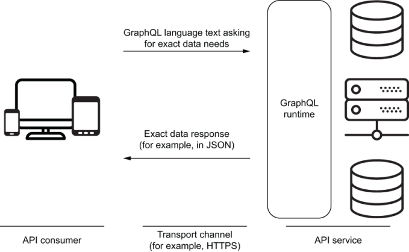
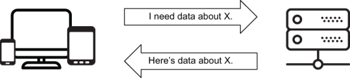

# GraphQL 简介
本章涵盖

- 理解 GraphQL 及其背后的设计理念
- GraphQL 与 REST API 等替代方案有何不同
- 了解 GraphQL 客户端和服务使用的语言
- 了解 GraphQL 的优点和缺点

需要是发明之母。 激发 GraphQL 创建灵感的产品是在 Facebook 发明的，因为该公司需要解决其移动应用程序的许多技术问题。 不过，我觉得GraphQL这么快火起来，不是因为它解决了技术问题，而是因为它解决了通信问题。

沟通很难。 提高我们的沟通技巧可以使我们的生活在许多方面变得更好。 同样，改善软件应用程序不同部分之间的通信可以使该应用程序更易于理解、开发、维护和扩展。

这就是为什么我认为 GraphQL 是游戏规则的改变者。 它改变了软件应用程序的不同“端”（前端和后端）相互通信的方式。 它赋予他们平等的权力，使他们彼此独立，将他们的沟通过程与其底层技术传输渠道分离，并在以前通用语言仅限于几个单词的地方引入了一种丰富的新语言。

GraphQL 现在为 Facebook 的许多应用程序提供支持，包括 facebook.com 上的主要 Web 应用程序、Facebook 移动应用程序和 Instagram。 开发人员对 GraphQL 的兴趣非常明显，并且 GraphQL 的采用率正在快速增长。 除了 Facebook，GraphQL 还用于许多其他主要的网络和移动应用程序，如 GitHub、Airbnb、Yelp、Pinterest、Twitter、纽约时报、Coursera 和 Shopify。 鉴于 GraphQL 是一项年轻的技术，这是一份令人印象深刻的清单。

在第一章中，让我们了解什么是 GraphQL，它解决了哪些问题，以及它引入了哪些问题。

## 1.1 什么是 GraphQL?

GraphQL 中的图这个词源于这样一个事实，即在现实世界中表示数据的最佳方式是使用类似图的数据结构。 如果你分析任何数据模型，无论大小，你总会发现它是一个对象图，它们之间有很多关系。

那是第一个“啊哈！” 我开始学习 GraphQL 的那一刻。 当你可以自然地将数据视为图形时，为什么还要根据资源（在 URL 中）或表格来考虑数据？

请注意，GraphQL 中的图形并不意味着 GraphQL 只能与“图形数据库”一起使用。 你可以拥有文档数据库（如 MongoDB）或关系数据库（如 PostgreSQL），并使用 GraphQL 以类似图形的结构表示你的 API 数据。

不过，GraphQL 中的 QL 可能有点令人困惑。 是的，GraphQL 是一种用于数据 API 的查询语言，但这只是从这些数据 API 的前端消费者的角度来看。 GraphQL 也是一个需要在后端实现的运行时层，该层使前端消费者能够使用新语言。

GraphQL 语言旨在声明式、灵活且高效。 数据 API 消费者（如移动和 Web 应用程序）的开发人员可以使用该语言以接近他们头脑中对数据的看法的语言来请求他们需要的数据，而不是与数据存储方式或数据关系相关的语言 被实施。

在后端，基于 GraphQL 栈需要运行时。 该运行时为服务器提供了一种结构来描述要在其 API 中公开的数据。 这种结构就是我们在 GraphQL 世界中所说的模式。 然后，API 使用者可以使用 GraphQL 语言来构建表示其确切数据需求的文本请求。 客户端通过传输通道（例如 HTTPS）将该文本请求发送到 API 服务。 GraphQL 运行时层接受文本请求，与后端堆栈中的其他服务通信以组合合适的数据响应，然后将该数据以 JSON 等格式发送回消费者。 图 1.1 总结了这种交流的动态。



图 1.1 GraphQL 是一种语言和运行时。

> **将 GraphQL 与其他库一起使用**
>
> GraphQL 不特定于任何后端或前端框架、技术堆栈或数据库。 它可以用于任何前端环境、任何后端平台以及任何数据库引擎。 你可以在任何传输通道上使用它并使其使用任何数据表示格式。
> 在前端 Web 或移动应用程序中，你可以通过直接 Ajax 调用 GraphQL 服务器或使用 Apollo 或 Relay 等客户端（将代表你发出 Ajax 请求）来使用 GraphQL。 你可以使用像 React（或 React Native）这样的库来管理你的视图如何使用来自 GraphQL 服务的数据，但你也可以使用其 UI 环境的原生 API（如 DOM API 或原生 iOS 组件）来做到这一点。
> 尽管你不需要 React、Apollo 或 Relay 来在你的应用程序中使用 GraphQL，但这些库为你如何使用 GraphQL API 而无需执行复杂的数据管理任务增加了更多价值。

### 1.1.1 大局
通常，API 是一种接口，可以在应用程序中的多个组件之间进行通信。 例如，API 可以启用 Web 客户端和数据库服务器之间需要发生的通信。 客户端告诉服务器它需要什么数据，服务器用代表客户端请求的数据的对象来满足客户端的要求（图 1.2）。



图 1.2 数据 API 的大图

有不同类型的 API，每个大型应用程序都需要它们。 对于 GraphQL，我们特指用来读取和修改数据的 API 类型，通常称为数据 API。

GraphQL 是众多选项中的一种，可用于为应用程序提供可编程接口，以读取和修改应用程序需要从数据服务中获取的数据。 其他选项包括 REST、SOAP、XML，甚至 SQL 本身。

SQL（结构化查询语言）可能会直接与 GraphQL 进行比较，因为毕竟 QL 在两个名称中都有。 SQL 和 GraphQL 都提供了一种查询数据模式的语言。 它们都可以用来读取和修改数据。 例如，如果我们有一个关于公司员工的数据表，下面是一个示例 SQL 语句，用于读取一个部门的员工数据。
清单1.1 查询的SQL语句

```sql
SELECT id, first_name, last_name, email, birth_date, hire_date
FROM employees
WHERE department = 'ENGINEERING'
```

下面是为新员工插入数据的另一个示例 SQL 语句。

清单 1.2 变异的 SQL 语句

```sql
INSERT INTO employees (first_name, last_name, email, birth_date, hire_date)
VALUES ('Jane', 'Doe', 'jane@doe.name', '01/01/1990', '01/01/2020')
```

你可以像清单 1.1 和 1.2 中那样使用 SQL 来传递数据操作。 将这些 SQL 语句发送到的数据库服务器可能支持不同的响应格式。 每种 SQL 操作类型都有不同的响应。 SELECT 操作可能返回单行或多行。 INSERT 操作可能只返回确认、插入的行或错误响应。

> 提示 尽管移动和 Web 应用程序可以直接使用 SQL 来传达数据需求，但它并不是用于此目的的好语言。 SQL 实在是太强大太灵活了，它会带来很多挑战。 例如，公开你的确切数据库结构将是一个重大的安全问题。 你可以将 SQL 放在另一个服务层之后，但这意味着你需要创建一个解析器和分析器来对用户的 SQL 查询执行操作，然后再将它们发送到数据库。 该解析器/分析器是你从任何 GraphQL 服务器实现中开箱即用的东西。

虽然大多数关系数据库直接支持 SQL，但 GraphQL 是它自己的东西。 GraphQL 需要运行时服务。 你不能只使用 GraphQL 查询语言开始查询数据库（至少现在还不能）。 你需要使用支持 GraphQL 的服务层或自己实现一个。

> 提示 某些数据库允许其客户端使用 GraphQL 直接查询它们。 一个例子是 [Dgraph](az.dev/dgraph)。

JSON 是一种可用于传输数据的语言。 这是一个可以表示 Jane 数据的 JSON 对象。

清单 1.3 表示数据的 JSON 对象

```json
{
  "data": {
    "employee":{
      "id": 42,
      "name": "Jane Doe",
      "email": "jane@doe.name",
      "birthDate": "01/01/1990",
      "hireDate": "01/01/2020"
    }
  }
}
```

> 注意 传递给 Jane 的数据不必使用数据库用来保存它的相同结构。 我使用驼峰式属性名称，并将 ```first_name``` 和 ```last_name``` 合并到一个名称字段中。

JSON 是一种流行的语言，用于将数据从 API 服务器传送到客户端应用程序。 大多数现代数据 API 服务器使用 JSON 来满足客户端应用程序的数据要求。 GraphQL 服务器也不例外； JSON 是满足 GraphQL 数据请求要求的流行选择。

客户端应用程序也可以使用 JSON 将其数据要求传达给 API 服务器。 例如，这里有一个可能的 JSON 对象，用于传达清单 1.3 中员工对象响应的数据要求。

清单 1.4 查询的 JSON 示例

```json
{
  "select": {
    "fields": ["name", "email", "birthDate", "hireDate"],
    "from": "employees",
    "where": {
      "id": {
        "equals": 42
      }
    }
  }
}
```

用于客户端应用程序的 GraphQL 是他们可以用来表达数据需求的另一种语言。 下面是如何用 GraphQL 查询来表达之前的数据需求。

清单 1.5 GraphQL 查询示例

```json
{
  employee(id: 42) {
    name
    email
    birthDate
    hireDate
  }
}
```

清单 1.5 中的 GraphQL 查询表示与清单 1.4 中的 JSON 对象相同的数据需求，但如你所见，它具有不同且更短的语法。 GraphQL 服务器可以理解这种语法并将其翻译成数据存储引擎可以理解的东西（例如，GraphQL 服务器可能会将查询翻译成关系数据库的 SQL 语句）。 然后，GraphQL 服务器可以获取存储引擎的响应，将其转换为 JSON 或 XML 之类的内容，并将其发送回客户端应用程序。

这很好，因为无论你必须处理什么存储引擎，使用 GraphQL，你都可以使 API 服务器和客户端应用程序都使用通用语言进行请求和通用语言进行响应。

简而言之，GraphQL 就是要优化客户端和服务器之间的数据通信。 这包括客户端请求所需的数据并将需要的数据传达给服务器，以及服务器为该需要准备实现并将实现传回给客户端。 GraphQL 允许客户端请求他们需要的确切数据，并使服务器更容易聚合来自多个数据存储资源的数据。

GraphQL 的核心是一个强类型系统，用于描述数据和组织 API。 这种类型系统为 GraphQL 在服务器端和客户端提供了许多优势。 类型确保客户只要求可能的，并提供清晰和有用的错误。 客户端可以使用类型来最大程度地减少对数据元素的任何手动解析。 GraphQL 类型系统允许提供丰富的功能，例如拥有内省 API 以及能够为客户端和服务器构建强大的工具。 依赖于此概念的流行 GraphQL 工具之一是 GraphiQL，这是一个功能丰富的基于浏览器的编辑器，用于探索和测试 GraphQL 请求。 你将在下一章中了解 GraphiQL。

### 1.1.2 GraphQL 是一种规范

尽管 Facebook 工程师在 2012 年就开始研究 GraphQL，但他们发布公开规范文档是在 2015 年。 你可以通过导航到 az.dev/graphql-spec 查看本文档的当前版本； 它由 GitHub 上的公司和个人社区维护。 GraphQL 是一种不断发展的语言，但规范文档是该项目的天才开端，因为它定义了所有 GraphQL 运行时的实施者必须遵守的标准规则和实践。 在许多不同的编程语言中已经有许多 GraphQL 库的实现，它们都严格遵循规范文档并在该文档更新时更新它们的实现。 如果你使用 Ruby 开发一个 GraphQL 项目，然后切换到使用 Scala 开发的另一个项目，语法会发生变化，但规则和实践将保持不变。

你最终可以在官方规范文档中找到有关 GraphQL 语言和运行时要求的所有信息。 它有点技术性，但通过阅读它的介绍部分和示例，你仍然可以从中学到很多东西。 本书不会涵盖文档中的所有内容，因此我建议你在阅读完本书后快速浏览一下。

规范文档首先描述了 GraphQL 语言的语法。 让我们先谈谈这个。

> GraphQL 服务器库
>
> 除了规范文档，Facebook 还发布了 JavaScript 中 GraphQL 运行时的参考实现库。 JavaScript 是最流行的编程语言，也是最接近移动和 Web 应用程序的语言，而移动和 Web 应用程序是使用 GraphQL 可以产生重大影响的两个流行渠道。 GraphQL 的参考 JavaScript 实现托管在 http://az.dev/graphql-js，也是我们在本书中使用的实现。 我将此实现称为 GraphQL.js。
> 要查看其他 GraphQL 服务器库的列表，请查看 http://az.dev/graphql-servers。

