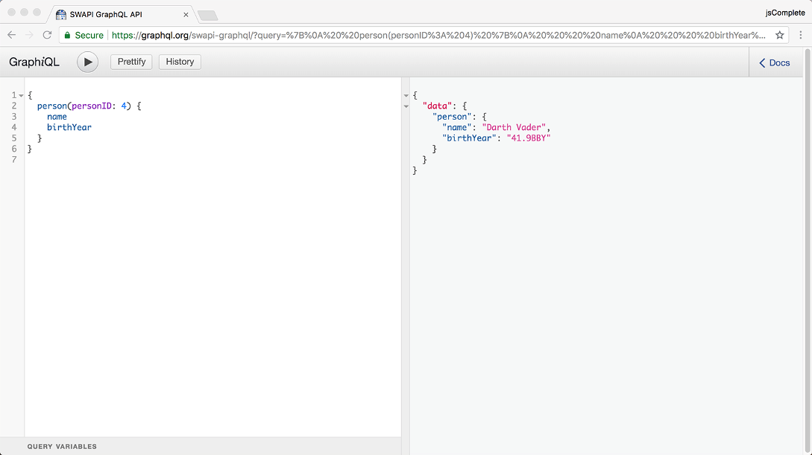

# 探索 GraphQL API
本章涵盖

- 使用 GraphQL 的浏览器内 IDE 测试 GraphQL 请求
- 探索发送 GraphQL 数据请求的基础知识
- 从 GitHub GraphQL API 探索读写示例操作
- 探索 GraphQL 的内省特性

开始学习 GraphQL 语言强大功能的最简单方法是使用其功能丰富的交互式浏览器内 IDE。 此 IDE 使用 GraphQL 的类型系统来提供功能，你可以使用这些功能来探索使用 GraphQL 可以做什么，以及在不离开浏览器的情况下编写和测试 GraphQL 请求。 使用此 IDE，我们将继续探索 GraphQL 查询和变更的示例。 我们将查看来自官方 GitHub GraphQL API 的 GraphQL 请求和测试示例的基本部分。

## 2.1 GraphiQL 编辑器

在考虑你的客户端应用程序需要向服务器发出的请求时，你可以从图形工具中受益，它首先帮助你提出这些请求，然后在应用程序代码中提交之前测试它们。 这样的工具还可以帮助你改进这些请求、验证你的改进以及调试任何遇到问题的请求。 在 GraphQL 世界中，这个工具被称为 GraphiQL（QL 前有一个 i，读作"graphical"）。 GraphiQL 是一个可以在浏览器中运行的开源 Web 应用程序（使用 React.js 和 GraphQL 编写）。

GraphiQL 是 GraphQL 流行的原因之一。 它简单易学，对你来说将是一个非常有用的工具。 我保证你会喜欢它。 它是我最喜欢的前端开发工具之一，如果没有它，我无法想象在基于 GraphQL 的项目上工作。

你可以下载 GraphiQL 并在本地运行它，但要了解这个工具必须提供的功能，更简单的方法是将它与现有的 GraphQL API 服务一起使用，例如我们在第 1 章中预览的星球大战服务。

在浏览器中前往 az.dev/swapi-graphql 找到 GraphiQL 编辑器，它可以处理星球大战数据并公开供你测试。 图 2.1 显示了它的外观。


图 2.1 GraphiQL 编辑器

这个编辑器是一个简单的双窗格应用程序：左窗格是编辑器，右窗格是显示执行 GraphQL 请求的结果的地方。

继续并在编辑器中键入以下简单的 GraphQL 查询。

清单 2.1 对 person 字段的查询

```json
{
  person(personID: 4) {
    name
    birthYear
  }
}
```

这个简单的 GraphQL 查询询问 ID 为 4 的人的姓名和出生年份。要执行查询，你可以按 Ctrl-Enter 或按运行按钮（带有黑色小三角形）。 当你这样做时，结果窗格会显示查询要求的数据，如图 2.2 所示。



图 2.2 使用 GraphiQL 执行查询

GraphiQL 编辑器最好的一点是它提供了智能预输入和自动完成功能，这些功能可以识别你当前正在探索的 GraphQL 类型模式。 对于前面的示例，编辑器完全知道有一个带有 name 和 birthYear 字段的 person 对象。 此外，编辑器为你键入的任何文本提供实时语法和验证错误突出显示。

> 注意 由于 GraphQL 架构，GraphiQL 中所有令人敬畏的功能都是可能的。 通过对服务器的一个大查询，该编辑器可以了解服务器提供的所有内容。

要探索这些功能，请清除编辑器窗格（你可以使用 Ctrl-A 选择编辑器中的所有文本）。 然后，只需键入一组空的大括号：{}。 将光标放在这个空集中，然后按 Ctrl-Space。 你会得到一个如图 2.3 所示的自动完成列表。


图 2.3 GraphiQL 的提前输入列表

好的！ 在考虑你的请求时，你可以在编辑器中快速开始探索此 GraphQL API 提供的字段。 我们之前使用的 person 字段是列表中的一项。

此列表还将用于在你键入字段时自动完成字段。 键入 p，并注意列表如何更改以突出显示以 p 开头的内容。 然后，键入 e 并查看列表如何仅突出显示人员字段。 按 Enter 以"选择"列表中当前突出显示的项目。

这个预先输入列表的伟大之处在于它的上下文感知。 它会向你显示在你键入的级别上可用的字段。 例如，现在你选择了 person 字段，在 person 之后键入另一组空的大括号，将光标放在这个新组中，然后按 Ctrl-Space 调出预输入列表。 你应该会看到一个新列表，这一次包含你可以在人员对象的上下文中请求的所有字段（图 2.4）。


图 2.4 GraphiQL 的提前输入列表是上下文感知的。

上下文意识非常有用，我说的不是"减少输入"方面，而是可发现性和验证方面，它们使你能够更快地工作并减少错误。 这是我在上一章中谈到的权力和控制的一个例子。 这就是 GraphQL 的不同之处。

在我们再次选择 name 和 birthYear 字段之前，请注意其中一个右大括号带有红色下划线。 这是实时错误的一部分，突出显示你也在此工具中遇到的错误。 按 Esc 键放弃预先输入列表，并将鼠标光标悬停在带下划线的大括号上。 你应该会看到一个错误，抱怨意外的语法。 这是因为编辑器中的文本还不是有效的 GraphQL 语法。 每次开始一个新的大括号级别（称为选择集）时，它都需要自己的字段。

继续并在 person 字段中选择 name 和 birthYear 字段。 查询语法现在有效（红色下划线消失了），但查询仍然缺少一个重要部分——这次，它不是语法问题。

你始终可以执行查询以查看服务器对此有何评论。 如果服务器拒绝查询，它很可能会给你一个很好的理由。 例如，执行我们现在的查询会返回以下内容。

```js
{
  "errors": [
    {
      "message": "must provide id or personID",
      "locations": [
        {
          "line": 2,
          "column": 3
        }
      ],
      "path": [
        "person"
      ]
    }
  ],
  "data": {
    "person": null
  }
}
```


请注意，清单 2.2 中的响应是一个普通的 JSON 响应（200-OK），它提供了两个顶级属性：一个错误属性，它是一个错误对象数组，一个数据属性代表一个空响应。 当服务器对响应的其他部分有错误时，GraphQL 服务器响应可以表示部分数据。 这使得响应更可预测，并使处理错误的任务更容易一些。

此处的错误消息很有帮助：路径"person"必须提供 id 或 personID。 由于我们向服务器询问一个人，因此它需要一种方法来识别要返回哪个人的数据。 再次注意，这不是语法问题，而是缺少必需值的问题。

为了让路径提供一个值，我们使用类似于调用函数的语法。 将光标紧跟在单词 person 之后，然后键入 ( 字符。GraphiQL 会自动完成它并向你显示一个新的预先输入列表，这次它知道可以为 person 字段提供哪些值作为参数（图 2.5）。


图 2.5 使用预输入列表探索字段参数

现在你可以选择 personID 参数，将其赋值为 4，然后返回到你开始时使用的相同查询。 但是这一次，你通过 GraphiQL 编辑器的强大功能发现了你需要的元素。

除了在键入元素时内联发现元素的结构和类型之外，你还可以浏览文档部分以查看完整列表和更多详细信息。 单击编辑器右上角的文档链接。 你应该会看到一个搜索框，你可以使用它来查找当前 GraphQL 模式中的任何类型。 我输入了人这个词并选择了第一个结果； 图 2.6 显示了模式类型 Person 及其描述和字段。


图 2.6 GraphiQL 显示了文档架构。

花点时间探索 GraphiQL 编辑器必须提供的更多功能。 尝试更多的查询，感受一下提出这些问题是多么容易。

## 2.2 GraphQL语言基础

要向任何 GraphQL 服务器请求数据，我们向它发送一个用 GraphQL 查询语言编写的请求。 GraphQL 请求包含一棵字段树。 让我们详细探讨这两个语言的基本概念。

### 2.2.1 请求

GraphQL 通信的核心是请求对象。 GraphQL 请求的源文本通常称为文档。 文档包含通过查询、变更和订阅等操作表示请求的文本。 除了主要操作之外，GraphQL 文档文本还可以包含可用于组合其他操作的片段，我们将在下一章中看到。


图 2.7 GraphQL 请求的结构

GraphQL 请求还可以包含一个对象，表示可以在请求文档文本中使用的变量值。 该请求还可能包括有关操作的元信息（图 2.7）。 例如，如果请求文档包含多个操作，则 GraphQL 请求必须包含有关执行哪个操作的信息。 如果请求文档只包含一个操作，GraphQL 服务器将只执行该操作。 在这种情况下，你甚至不需要用名称来标记操作，但命名操作是一个值得遵循的好习惯。

让我们看一下完整的 GraphQL 请求。 这是一个假设的例子（暂时不要担心新语法）。

清单 2.3 示例 GraphQL 请求：文档

```
query GetEmployees($active: Boolean!) {
  allEmployees(active: $active) {
    ...employeeInfo
  }
}
 
query FindEmployee {
  employee(id: $employeeId) {
    ...employeeInfo
  }
}
 
fragment employeeInfo on Employee {
  name
  email
  startDate
}
```

由于本文档使用通用变量（以 $ 符号开头的变量），我们需要一个 JSON 对象来表示特定于请求的值。

清单 2.4 示例 GraphQL 请求：变量

```json
{
  "active": true,
  "employeeId": 42
}
```

此外，由于文档包含多个操作（GetEmployees 和 FindEmployee），请求需要提供要执行的所需操作。

清单 2.5 示例 GraphQL 请求：元信息

```js
operationName="GetEmployees"
```

如果我们将此请求的所有三个元素发送到 GraphQL 服务器，它将解析整个文档，选择 GetEmployees 查询，填充变量值，并返回该查询的数据响应。

GraphQL 中可以使用三种类型的操作：

- 表示只读提取的查询操作
- 表示写入后跟提取的变异操作
- 表示实时数据更新请求的订阅操作

清单 2.3 中的示例表示一个查询操作。 这是变异操作的假设示例。

清单 2.6 示例 GraphQL 变异操作

```js
mutation RateStory {
  addRating(storyId: 123, rating: 5) {
    story {
      averageRating
    }
  }
}
```

清单 2.6 中的变异操作为一个故事添加了一个新的五星级评分记录，然后检索该故事的新平均评分。 请注意，这是先写入后读取。 所有 GraphQL 变异操作都遵循这个概念。

这是一个订阅操作的假设示例。

清单 2.7 示例 GraphQL 订阅操作

```js
subscription StoriesRating {
  allStories {
    id
    averageRating
  }
}
```

清单 2.7 中的订阅操作指示 GraphQL 服务器打开与客户端的套接字连接，发送故事 ID 及其平均评分，并在服务器上的信息发生变化时继续这样做。 与持续轮询数据以保持 UI 视图保持最新相比，此功能是一个更好的选择。

### 2.2.2 字段
GraphQL 操作文本中的核心元素之一是字段。 考虑 GraphQL 操作的最简单方法是选择对象上的字段。

字段总是出现在选择集中（在一对大括号内），它描述了你可以检索的有关对象的一条离散信息。 它可以描述标量值（如人名或出生年份）、对象（如星球大战角色的家乡星球）或对象列表（如星球大战角色所在的电影列表） 出现）。 对于后两种情况，字段包含另一个选择集以自定义有关字段描述的对象所需的信息。

下面是一个包含不同类型字段的 GraphQL 查询示例。

清单 2.8 GraphQL 字段

```js
{
  me {
    email
    birthday {
      month
      year
    }
    friends {
      name
    }
  }
}
```

字段 email、month、year 和 name 都是标量字段。 标量类型表示原始叶值。 GraphQL 模式通常支持四种主要的标量类型：Int、String、Float 和 Boolean。 内置的自定义标量值 ID 也可用于表示身份值。 我们将在第 4 章中看到一个示例。

> 提示 术语叶来自图论。 这意味着一个没有子节点的顶点。

你还可以自定义 GraphQL 模式以支持更多具有特定格式的标量值。 例如，可以将模式设计为具有时间标量值，该值表示标准和可解析格式 (ISO/UTC) 中的时间值。

me 和 birthday 字段描述对象，因此它们需要自己的嵌套选择集来表示它们的属性。 friends 字段描述了一个 friend 对象的列表，因此它也需要一个嵌套的选择集来表示该列表中对象的属性。

所有 GraphQL 操作都必须将它们的选择指定为返回标量值（叶值）的字段。 例如，如果不提供进一步的嵌套选择集来指定为这些对象获取哪些标量值，它们就不能拥有描述对象的字段。 最后嵌套的字段级别应始终仅包含描述标量值的字段。 对于清单 2.8 中的示例，如果你没有为 friends 字段（{ name } 部分）指定嵌套选择集，GraphQL 查询将无效，因为在这种情况下，并非所有最后嵌套级别的字段 将描述标量值。

操作中的根字段通常表示你的应用程序及其当前用户可以全局访问的信息。

注意我使用术语根字段来指代 GraphQL 操作中的第一级字段。

根字段的一些典型示例包括对当前登录用户的引用。 这些字段通常被命名为 viewer 或 me。 例如：

```json
{
  me {
    username
    fullName
  }
}
```

根字段通常还用于访问由唯一标识符引用的某些类型的数据。 例如：

```json
# Ask for the user whose ID equal to 42
{
  user(id: 42) {
    fullName
  }
}
```

在此查询中，用户字段表示数据图中的众多用户之一。 要指示服务器选择一个用户，我们为用户字段指定一个唯一的ID值。

请注意，在上一个示例中，＃字符用于编写有关查询的评论。 这是在GraphQL文档中评论单行（或行的其余部分）的官方字符。 没有支持的方法可以在GraphQL文档中使用多行论，但是你可以有很多行，每条线从＃字符开始。 服务器将忽略所有注释。 它还将忽略任何额外的空间，所有线路终止器以及字段之间所有微不足道的逗号。 这些字符可用于提高源文本的可读性，并强调令牌的分离。 它们对GraphQL文档的语义含义没有意义。

## 2.3 GitHub API的示例

现在，你了解了请求，文档，操作和字段，让我们将此知识用于使用和探索GitHub API的GraphQL请求的一些现实示例。 GitHub于2017年从REST API转移到GraphQL API。我们可以在Az.dev/github-api上使用其GraphQl API Explorer; 此嵌入式GraphIQL编辑器（图2.8）包括API的适当身份验证标头（你需要使用github.com帐户登录）。

提示你还可以使用独立的GraphiQL编辑器来探索GitHub API（请参阅Az.dev/graphiql-app）。 你必须在该应用程序中手动包含访问令牌。 你可以将此独立应用与任何GraphQL API服务一起使用。


图 2.8 GitHub API 的 GraphiQL 编辑器

让我们先看看这个 API 的一些常见查询。

警告 GitHub API 使用你在 GitHub.com 上的真实实时生产数据。

### 2.3.1 从GitHub读取数据

当你首次启动 GitHub GraphQL API 浏览器时，它有一个默认的简单查询来显示你的登录信息。 当前登录的用户由 viewer 字段表示。 在此字段下，你可以阅读 GitHub 上有关你的所有可用信息。

例如，这里有一个查询，用于查看有关你拥有或贡献的最近 10 个存储库的信息。

清单 2.9 你最近的回购 (az.dev/gia)

```js
{
  viewer {
    repositories(last: 10) {
      nodes {
        name
        description
      }
    }
  }
}
```

这是另一个查询，用于查看 GitHub 中所有受支持的许可证及其 URL。

清单 2.10 所有 GitHub 支持的许可证 (az.dev/gia)

```js
{
  licenses {
    name
    url
  }
}
```

接下来是一个更复杂的查询，用于查找 facebook/graphql 存储库的前 10 个问题。 它要求提供作者姓名和用于问题页面的标题，以及问题创建的日期。

清单 2.11 回购的前 10 期 (az.dev/gia)

```js
{
  repository(owner: "facebook", name: "graphql") {
    issues(first: 10) {
      nodes {
        title
        createdAt
        author {
          login
        }
      }
    }
  }
}
```

### 2.3.2 在GitHub上更新数据

现在让我们探索可以使用 GitHub GraphQL API 进行的一些更改。 最简单的更改是为存储库"加注星标"。 如果你在登录用户下执行以下更改，其操作相当于转到 github.com/jscomplete/graphql-in-action 并单击星号按钮。

清单 2.12 "星标"存储库 (az.dev/gia)

```js
mutation {
  addStar(input: { starrableId: "MDEwOlJlcG9zaXRvcnkxMjU2ODEwMDY=" }) {   ❶
    starrable {
      stargazers {
        totalCount
      }
    }
  }
}
```

❶ 使用清单 2.13 找到这个 starrableId 值
突变为存储库加星，然后在突变后读取新的观星者总数。 这个突变的输入是一个简单的对象，它有一个 starrableId 值，它是 graphql-in-action 存储库的节点标识符。 我能够使用此查询找到该值。

清单 2.13 查找存储库 ID (az.dev/gia)

```js
{
  repository(name: "graphql-in-action", owner: "jscomplete") {
    id
  }
}
```

让我们执行另一个突变。 这一次，让我们为存储库中的问题添加评论。 我在 github.com/jscomplete/graphql-in-action 的存储库下为你创建了一个问题来测试这个突变。 你可以使用以下查询查看此问题的详细信息。

清单 2.14 回购下的一个问题的详细信息 (az.dev/gia)

```js
query GetIssueInfo {
  repository(owner: "jscomplete", name: "graphql-in-action") {
    issue(number: 1) {
      id
      title
    }
  }
}
```

这为你提供了使用突变向问题添加评论所需的 id 字段的值。 现在执行以下突变，它使用该 id 值。

清单 2.15 向回购问题添加评论 (az.dev/gia)

```js
mutation AddCommentToIssue {
  addComment(input: {
    subjectId: "MDU6SXNzdWUzMDYyMDMwNzk=",
    body: "Hello from California!"             ❶
  }) {
    commentEdge {
      node {
        createdAt
      }
    }
  }
}
```

❶ 在测试评论中告诉我们你来自哪里。 :)
清单 2.15 中的mutation将你的评论保存到特定Issue后，它会报告该评论的创建日期。 你可以随意向本期特刊发送任意数量的评论，但只能通过 GitHub API 浏览器发送。

你可以在 github.com/jscomplete/graphql-in-action/issues/1 查看你添加的评论以及关于此问题的所有其他评论。

### 2.3.3 内省查询

GraphQL API 支持内省查询，可用于回答有关 API 架构的问题。 这种内省支持为 GraphQL 工具提供了强大的功能，并推动了我们一直在 GraphiQL 编辑器中使用的功能。 例如，GraphiQL 中令人敬畏的提前输入列表来自内省查询。

内省查询以 \_\_type 或 \_\_schema 的根字段开始，称为元字段。 还有另一个元字段 \_\_typename，可用于检索任何对象类型的名称。 名称以双下划线字符开头的字段保留用于内省支持。

注意元字段是隐含的。 它们不会出现在其类型的字段列表中。

\_\_schema 字段可用于读取有关 API 模式的信息，例如它支持的类型和指令。 我们将在下一章探讨指令。

让我们问问 GitHub API schema 它支持什么类型。 这是一个内省的查询来做到这一点。

清单 2.16 示例 GraphQL 内省查询 (az.dev/gia)

```js
{
  __schema {
    types {
      name
      description
    }
  }
}
```

此查询返回此架构支持的所有类型，并且还包括这些类型的描述。 这是一个有助于探索 GitHub GraphQL 架构中定义的自定义类型的列表。 例如，你应该看到 GitHub API 架构定义了 Repository、Commit、Project、Issue、PullRequest 等类型（图 2.9）。


图 2.9 列出 GitHub API schema 下所有支持的类型

如果需要检索有关单个类型的信息，可以使用 \_\_type 元字段。 例如，这里是一个查询，用于查找 Commit 类型下所有受支持的字段以及它们接受的任何参数。

清单 2.17 Commit 对象下支持的字段 (az.dev/gia)

```js
{
  __type(name: "Commit") {
    fields {
      name
      args {
        name
      }
    }
  }
}
```

使用 GraphiQL 提前输入功能来发现你可以在这些内省元字段下检索哪些其他信息。

## 概括

- GraphiQL 是一个用于编写和测试 GraphQL 请求的浏览器内 IDE。 它提供了许多强大的功能来编写、验证和检查 GraphQL 查询和变更。 由于 GraphQL 的内省特性及其强制模式，这些功能才得以实现。
- GraphQL 请求由一组操作、一个变量对象和其他需要的元信息元素组成。
- GraphQL 操作使用字段树。 字段代表一个信息单元。 GraphQL 语言主要是关于选择对象上的字段。
- GitHub 有一个强大的 GraphQL API，你可以使用它来读取有关存储库和用户的数据，并进行更改，例如向存储库添加星号或对存储库中的问题发表评论。
- GraphQL 自省查询为客户端提供了一种获取有关 GraphQL API 的元信息的方法。