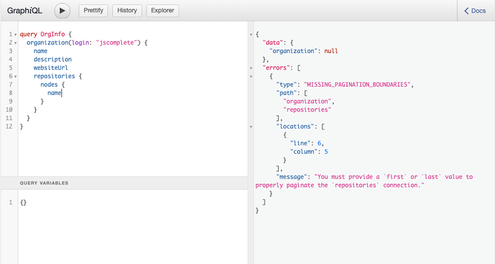
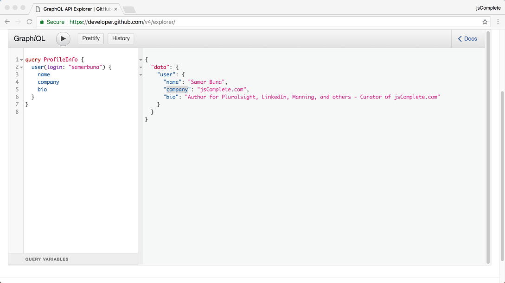
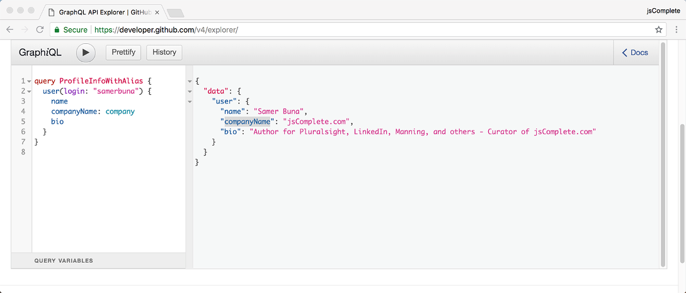
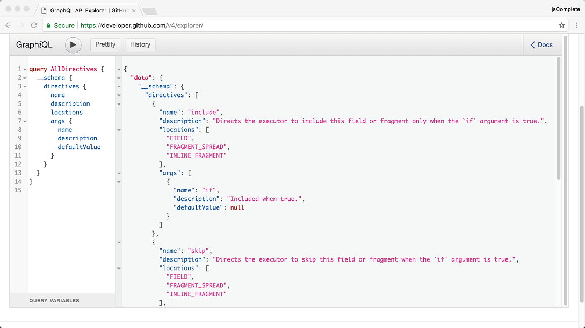
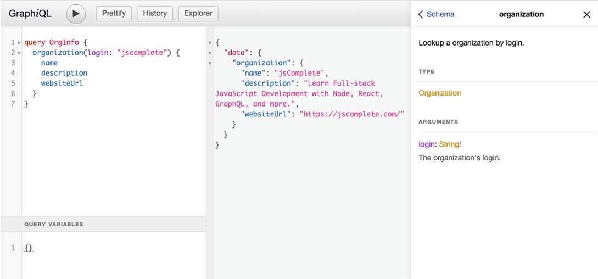
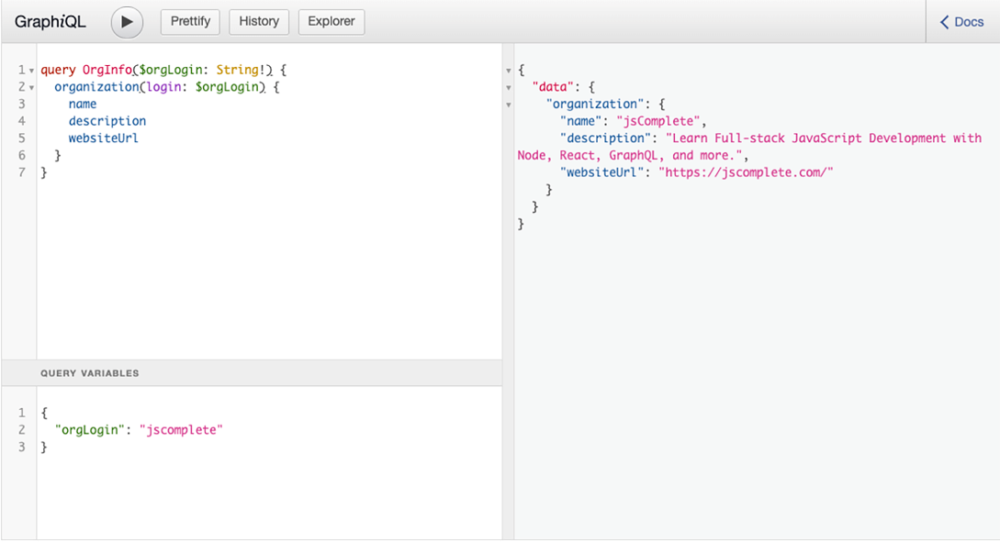
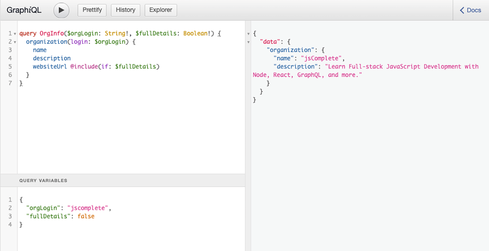

# 自定义和组织 GraphQL 操作
本章涵盖

- 使用参数自定义请求字段返回的内容
- 使用别名自定义响应属性名称
- 使用指令描述运行时执行
- 使用片段减少重复文本
- 组合查询和分离数据需求职责

在任何重要的应用程序中，除了向服务器询问直接、简单、单值的问题之外，你还必须做很多事情。 数据获取通常与有关响应结构的变量和元问题相结合。 你经常需要修改服务器返回的数据以使其适合你的应用程序。 有时你必须删除部分数据或返回服务器并根据你的应用程序的条件要求其他部分。 有时你需要一种方法来组织大请求并将它们分类，以了解你的应用程序的哪个部分负责你的请求的每个部分。 幸运的是，GraphQL 语言提供了许多内置功能，你可以使用它们来完成所有这些以及更多。 这些自定义和组织功能是本章的全部内容。

## 3.1 使用参数自定义字段

GraphQL 操作中的字段类似于函数。 他们将输入映射到输出。 函数输入作为参数值列表接收。 就像函数一样，我们可以向任何 GraphQL 字段传递一个参数值列表。 后端的 GraphQL 模式可以访问这些值并使用它们来自定义它为该字段返回的响应。

让我们看看这些字段参数的用例以及 GitHub GraphQL API (az.dev/github-api) 使用的一些示例。

### 3.1.1 识别要返回的单个记录

每个从集合中请求单个记录的 API 请求都需要为该记录指定一个标识符。 此标识符通常与服务器数据库中该记录的唯一标识符相关联，但它也可以是可以唯一标识该记录的任何其他内容。

例如，如果你向 API 请求有关单个用户的信息，你通常会随请求发送你感兴趣的用户的 ID。你还可以发送他们的电子邮件地址、用户名或 Facebook ID 连接，例如 ，你正在通过 Facebook 按钮登录他们。

下面是一个示例查询，它询问有关电子邮件地址为 jane@doe.name 的用户的信息。

清单 3.1 使用字段参数

```js
query UserInfo {
  user(email: "jane@doe.name") {
    firstName
    lastName
    username
  }
}
```

用户字段中的电子邮件部分称为字段参数。

请注意，对于表示单个记录的 API 字段，你传递的用于标识该记录的参数值必须是数据库中该字段记录的唯一值。 例如，你不能通过此人的全名来识别他们的用户记录，因为数据库可能会列出许多同名的人。

但是，你可以传递多个参数来标识用户。 例如，你可以传递全名和地址来唯一标识一个人。

单记录字段的例子很受欢迎。 一些 GraphQL API 甚至对系统中的每个对象都有一个单记录字段。 这在 GraphQL 世界中通常被称为 Node 接口：一个由 Relay 框架（也起源于 Facebook）推广的概念。 使用 Node 接口，你可以通过其唯一的全局系统范围 ID 在数据图中查找任何节点。 然后，根据该节点是什么，你可以使用内联片段来指定你有兴趣在响应中看到的该节点的属性。

清单 3.2 识别单个全局节点

```js
query NodeInfo {
  node(id: "A-GLOBALLY-UNIQUE-ID-HERE") {
    ...on USER {
      firstName
      lastName
      username
      email
    }
  }
}
```

有关清单 3.2 中内联片段的更多详细信息，请参阅本章后面的 3.4.5 节。

在 GitHub API 中，单记录字段的一些示例是用户、存储库、项目和组织。 下面是一个例子，可以读取有关jsComplete组织的信息，该组织托管了jsComplete.com的所有开源资源。

清单 3.3 一个组织的信息 (az.dev/gia)

```js
query OrgInfo {
  organization(login: "jscomplete") {
    name
    description
    websiteUrl
  }
}
```

### 3.1.2 限制列表字段返回的记录数
当你请求集合中的记录列表时，一个好的 API 总是会要求你提供一个限制。 你对多少条记录感兴趣？

保留通用 API 功能以无限制地列出集合中的记录通常不是一个好主意。 你不希望客户端一次能够获取超过几百条记录，因为这会使你的 API 服务器面临资源耗尽的风险并且无法很好地扩展。 这正是 GitHub API 要求在请求记录列表时使用 first（或 last）等参数的原因。 继续尝试请求 jsComplete 组织下的所有存储库。 你可以在清单 3.3 中的 OrgInfo 查询中的组织字段中使用存储库字段。 你应该看到 GitHub 要求提供第一个或最后一个值，如图 3.1 所示。



图 3.1 存储库字段需要第一个或最后一个参数。

由于数据库中的任何记录列表都有一定的顺序，你可以使用该顺序的任一端来限制你的请求结果。 如果你对 10 条记录感兴趣，你可以使用这些参数获取前 10 条记录或最后 10 条记录。

以下查询可用于检索 jsComplete 组织下的前 10 个存储库。

清单 3.4 组织 (az.dev/gia) 下的前 10 个存储库

```js
query First10Repos {
  organization(login: "jscomplete") {
    name
    description
    websiteUrl
    repositories(first: 10) {
      nodes {
        name
      }
    }
  }
}
```


默认情况下，GitHub API 按创建日期升序排列存储库。 你可以使用另一个字段参数自定义该排序逻辑。

### 3.1.3 列表字段返回的排序记录

在前面的示例中，GitHub API 通过 CREATED_AT 存储库字段对 jsComplete 组织下的存储库列表进行排序，这是默认的排序字段。 该 API 支持许多其他订单字段，包括 UPDATED_AT、PUSHED_AT、NAME 和 STARGAZERS。

这是一个查询，用于检索按名称字母顺序排列的前 10 个存储库。

清单 3.5 组织下的前 10 个存储库 (az.dev/gia)

```js
query orgReposByName {
  organization(login: "jscomplete") {
    repositories(first: 10, orderBy: { field: NAME, direction: ASC }) {
      nodes {
        name
      }
    }
  }
}
```

你能用你学到的 GitHub 字段参数找到 jsComplete 组织下最受欢迎的前 10 个存储库吗？ 将存储库的受欢迎程度基于其拥有的星数。

这是你可以用来执行此操作的一个查询。

清单 3.6 组织下 10 个最受欢迎的回购协议 (az.dev/gia)

```js
query OrgPopularRepos {
  organization(login: "jscomplete") {
    repositories(first: 10, orderBy: { field: STARGAZERS, direction: DESC }) {
      nodes {
        name
      }
    }
  }
}
```

### 3.1.4 通过记录列表分页

当你需要检索一页记录时，除了指定一个限制外，你还需要指定一个偏移量。 在 GitHub API 中，你可以使用字段参数 after 和 before 分别抵消参数 first 和 last 返回的结果。

要使用这些参数，你需要使用与数据库记录标识符不同的节点标识符。 GitHub API 使用的分页接口称为 Connection 接口（也起源于 Relay 框架）。 在该接口中，每条记录都由使用游标字段的节点字段（类似于 Node 接口）标识。 游标基本上是每个节点的 ID 字段，它是我们与前后参数一起使用的字段。

为了在每个节点的数据旁边使用该节点的光标，Connection 接口向称为边缘的节点概念添加了一个新的父节点。 edges 字段表示分页记录列表。

这是一个包含通过边缘字段的游标值的查询。

清单 3.7 在边缘下使用光标 (az.dev/gia)

```js
query OrgRepoConnectionExample {
  organization(login: "jscomplete") {
    repositories(first: 10, orderBy: { field: CREATED_AT, direction: ASC }) {
      edges {
        cursor
        node {
          name
        }
      }
    }
  }
}
```

请注意，在边缘字段中，我们现在询问单个节点字段，因为该列表不再是节点列表，而是边缘列表，其中每个边缘都是一个节点加一个游标。

现在你可以看到这些游标的字符串值，你可以将它们用作前后参数来获取额外的数据页。 例如，要获取 jsComplete 组织下的存储库的第二页，你需要在第一页上识别最后一个存储库的游标，并将该游标值用作后值。

清单 3.8 获取存储库的第二页 (az.dev/gia)

```js
query OrgRepoConnectionExample2 {
  organization(login: "jscomplete") {
    repositories(
      first: 10,
      after: "Y3Vyc29yOnYyOpK5MjAxNy0wMS0yMVQwODo1NTo0My0wODowMM4Ev4A3",
      orderBy: { field: CREATED_AT, direction: ASC }
    ) {
      edges {
        cursor
        node {
          name
        }
      }
    }
  }
}
```

边缘字段的引入还允许添加关于列表的元数据。 例如，在我们请求边列表的同一级别上，我们还可以询问该关系总共有多少条记录以及当前页面之后是否还有更多记录要获取。 这是修改为显示有关关系的一些元数据的先前查询。

清单 3.9 元分页信息 (az.dev/gia)

```js
query OrgReposMetaInfoExample {
  organization(login: "jscomplete") {
    repositories(
      first: 10,
      after: "Y3Vyc29yOnYyOpK5MjAxNy0wMS0yMVQwODo1NTo0My0wODowMM4Ev4A3",
      orderBy: { field: STARGAZERS, direction: DESC }
    ) {
      totalCount
      pageInfo {
        hasNextPage
      }
      edges {
        cursor
        node {
          name
        }
      }
    }
  }
}
```

由于 jsComplete 组织有超过 20 个存储库（在本例中为两页），因此 hasNextPage 字段为真。 当你获取最后一页时，hasNextPage 将返回 false，表示没有更多数据可获取。 这比必须执行额外的空页面提取以得出已到达分页数据末尾的结论要好得多。

### 3.1.5 搜索和过滤

GraphQL 中的字段参数可用于提供过滤条件或搜索词以限制列表返回的结果。 让我们看看这两个功能的示例。

在 GitHub 中，存储库可以有一个项目列表来管理与该存储库相关的任何工作。 例如，GitHub 上的 Twitter Bootstrap 存储库使用每个版本一个项目来管理与单个版本相关的所有问题。 下面是一个查询，它使用项目关系中的搜索词来返回以 v4.1 开头的 Twitter Bootstrap 项目。

清单 3.10 使用字段参数进行搜索 (az.dev/gia)

```js
query SearchExample {
  repository(owner: "twbs", name: "bootstrap") {
    projects(search: "v4.1", first: 10) {
      nodes {
        name
      }
    }
  }
}
```

请注意，projects 字段还实现了 Connection 接口。

某些字段允许你按该字段的某些属性过滤返回的列表。 例如，默认情况下，查看器字段下的存储库列表包括你拥有或可以贡献的所有存储库。 要仅列出你拥有的存储库，你可以使用 affiliations 字段参数。

清单 3.11 使用字段参数进行过滤 (az.dev/gia)

```js
query FilterExample {
  viewer {
    repositories(first: 10, affiliations: OWNER) {
      totalCount
      nodes {
        name
      }
    }
  }
}
```

### 3.1.6 为突变提供输入

字段参数概念是 GraphQL 突变用来接受突变操作输入的概念。 在上一章中，我们使用了以下变异示例来为jsComplete组织下的graphql-in-action仓库加星。

清单 3.12 提供突变输入的参数 (az.dev/gia)

```js
mutation StarARepo {
  addStar(input: { starrableId: "MDEwOlJlcG9zaXRvcnkxMjU2ODEwMDY=" }) {
    starrable {
      stargazers {
        totalCount
      }
    }
  }
}
```

该突变中的输入值也是一个字段参数。 这是一个必需的参数。 如果没有输入对象，你将无法执行 GitHub 变更操作。 所有 GitHub API 变更都使用这个表示对象的必需输入字段参数。 要执行突变，你需要将各种输入值作为键/值对传递给该输入对象。

注意 并非所有参数都是必需的。 GraphQL API 可以控制哪些参数是必需的，哪些是可选的。

在更多情况下，字段参数可能很有用。 探索 GitHub API 和其他公开可用的 GraphQL API，以获得更有用的字段参数模式。

## 3.2 用别名重命名字段

GraphQL 操作中的别名功能非常简单但功能强大，因为它允许你通过请求本身自定义来自服务器的响应。 通过使用别名，你可以最大限度地减少对数据的任何响应后处理。

让我用一个例子来解释这一点。 假设你正在 GitHub 中开发个人资料页面。 下面是检索 GitHub 用户的部分个人资料信息的查询。

清单 3.13 配置文件信息查询 (az.dev/gia)

```js
query ProfileInfo {
  user(login: "samerbuna") {
    name
    company
    bio
  }
}
```

你在响应中得到一个简单的用户对象（见图 3.2）。



图 3.2 请求公司字段的 ProfileInfo 查询

现在，应用程序 UI 可以在查询响应中使用此用户对象来替换 UI 模板中的值。 但是，假设你刚刚发现响应的结构与应用程序 UI 用于用户对象的结构不匹配。 开发应用程序 UI 时期望用户使用 companyName 字段而不是公司字段（如在 API 响应中找到的那样）。 你做什么工作？ 假设更改应用程序 UI 代码本身不是一个选项。

如果你没有使用别名的选项（稍后我将向你展示如何操作），你可以在每次需要使用响应对象时处理响应。 你必须将用户对象从响应转换为具有正确结构的新对象。 如果你正在使用的结构很深并且有多个级别，这可能会很昂贵。

幸运的是，在 GraphQL 中，令人敬畏的别名功能让我们能够以声明的方式指示 API 服务器使用不同的名称返回字段。 你需要做的就是为该字段指定一个别名，你可以使用以下语法来完成：

```js
aliasName: fieldName
```

只需在任何字段名称前加上一个别名，服务器就会返回使用你的别名重命名的字段。 无需处理响应对象。 对于清单 3.13 中的示例，你需要做的就是指定一个 companyName 别名。

清单 3.14 使用别名查询个人资料信息 (az.dev/gia)

```js
query ProfileInfoWithAlias {
  user(login: "samerbuna") {
    name
    companyName: company
    bio
  }
}
```

这会给出一个响应，你可以将其插入应用程序 UI（参见图 3.3）。



图 3.3 使用 GraphQL 别名功能从服务器获取 companyName 字段

## 3.3 使用指令自定义响应

有时，你需要对服务器响应进行自定义，而不仅仅是简单地重命名字段。 你可能需要在响应中有条件地包含（或排除）数据分支。 这就是 GraphQL 的指令特性可以提供帮助的地方。

GraphQL 请求中的指令是一种向 GraphQL 服务器提供有关 GraphQL 文档的执行和类型验证行为的附加信息的方法。 它本质上是字段参数的更强大版本：你可以使用指令有条件地包含或排除整个字段。 除了字段之外，指令还可以与片段和顶级操作一起使用。

指令是 GraphQL 文档中以 @ 字符开头的任何字符串。 每个 GraphQL 模式都有三个内置指令：@include、@skip 和@deprecated。 一些模式有更多的指令。 你可以使用此内省查询来查看模式支持的指令列表。

清单 3.15 模式中所有支持的指令 (az.dev/gia)

```js
query AllDirectives {
  __schema {
    directives {
      name
      description
      locations
      args {
        name
        description
        defaultValue
      }
    }
  }
}
```

该查询显示每个指令的名称和描述，并包括一个数组，其中包含可以使用该指令的所有可能位置（图 3.4）。 此外，它还列出了该指令支持的所有参数。 每个指令都可以选择接收一个参数列表，就像字段参数一样，API 服务器可能需要一些参数值。 对先前查询的响应应该表明在任何 GraphQL 模式中，@include 和 @skip 指令都有参数 if。 @deprecated 指令有参数原因。

先前查询响应中的位置列表也很重要。 指令只能在它们声明所属的位置使用。 例如，@include 和@skip 指令只能在字段或片段之后使用。 你不能在操作的顶层使用它们。 同样，在定义 GraphQL 服务模式时，@deprecated 指令只能在字段定义或 ENUM 值之后使用。

注意 ENUM（枚举）类型表示一组可能的唯一值。 我们将在下一章中看到一个例子。



图 3.4 模式支持的所有指令列表

由于指令通常与参数一起使用，因此它们通常与查询变量配对以让它们与动态值一起发送。 我们在前一章看到了一些变量的例子，但让我提醒你一下。

### 3.3.1 变量和输入值

变量只是 GraphQL 文档中以 \$ 符号开头的任何名称：例如，\$login 或 \$showRepositories。 \$ 符号后的名称可以是任何内容。 我们使用变量使 GraphQL 操作一般可重用，并避免必须对值进行硬编码和连接字符串。

要在 GraphQL 操作中使用变量，首先需要定义它的类型。 你可以通过为任何命名操作提供参数来做到这一点。 比如我们在GitHub上读取jsComplete组织信息的查询例子。 现在让我们使用一个变量，而不是对登录值进行硬编码（就像我们之前所做的那样）。 该操作必须有一个名称，然后我们可以使用该名称的参数来定义任何变量。 让我们调用变量 \$orgLogin。 它应该是必需的字符串。 你可以使用文档资源管理器查看参数的类型。 查找组织字段以查看其登录参数的类型。 你还可以在按住 Command 键（Windows 中为 Ctrl）的同时单击查询中的组织字段。

如图 3.5 所示，登录参数的类型为 String!。 该类型的结尾感叹号是 GraphQL 根据需要标记参数值的方式。 必须指定此登录参数的值 - 它不能为空。



图 3.5 在模式中查找一个字段的文档

现在我们可以使用相同的语法来定义新变量。 \$orgLogin 的类型应该与将要使用它的参数的类型相匹配。 这是使用这个新的 \$orgLogin 变量编写的 OrgInfo 查询。

清单 3.16 使用变量作为参数值 (az.dev/gia)

```js
query OrgInfo($orgLogin: String!) {
  organization(login: $orgLogin) {
    name
    description
    websiteUrl
  }
}
```

请注意，在第一行，查询指定 \$orgLogin 是一个字符串！。

你不能按原样执行清单 3.16 中的查询。 如果你尝试，GraphQL 服务器将返回错误。 由于我们使用了一个变量，我们必须为服务器上的执行程序提供我们希望用于该变量的值。 在 GraphiQL 中，我们使用位于左下角的变量编辑器来执行此操作。 在该编辑器中，你编写一个 JSON 对象，该对象表示你想要连同操作一起发送给执行程序的所有变量。

因为我们只使用了一个变量，所以它的 JSON 对象是

```js
{
  "orgLogin": "jscomplete"
}
```

现在你可以使用不同的 JSON 对象执行查询，使其可用于不同的组织（见图 3.6）。



图 3.6 变量使 GraphQL 查询可重用。

像 \$orgLogin 这样的变量也可以有一个默认值，在这种情况下它不需要结尾的感叹号。 你可以在变量类型后使用等号指定默认值。 例如，使用此语法，先前的查询可以将值"jscomplete"作为 \$orgLogin 的默认值。

清单 3.17 使用变量的默认值 (az.dev/gia)

```js
query OrgInfoWithDefault($orgLogin: String = "jscomplete") {
  organization(login: $orgLogin) {
    name
    description
    websiteUrl
  }
}
```

你可以在不为变量传递 JSON 对象的情况下执行此 OrgInfoWithDefault 查询。 在这种情况下，查询将使用默认值。 如果你传递具有 orgLogin 值的 JSON 对象，该值将覆盖默认值。

可以在字段和指令中使用变量，使它们接受各种文字基元的输入值。 输入值可以是标量，例如 Int、Float、String、Boolean 或 Null。 它也可以是一个 ENUM 值、一个列表或一个对象。 \$orgLogin 变量表示组织字段中登录参数的标量字符串输入值。 阅读我们迄今为止看到的各种 GraphQL 操作示例，并尝试识别更多的输入值。 例如，尝试找到我们在哪里使用对象作为输入值。

现在我们知道如何定义和使用变量和值，让我们将它们与指令一起使用。

### 3.3.2 @include 指令

@include 指令可以在字段（或片段）之后使用以提供条件（使用其 if 参数）。 该条件控制字段（或片段）是否应包含在响应中。 @include 指令的使用如下所示：

```js
fieldName @include(if: $someTest)
```

这表示在 \$someTest 设置为 true 时执行查询时包括该字段，而当 \$someTest 设置为 false 时不包括该字段。 让我们看一个来自 GitHub API 的例子。

基于前面的 OrgInfo 查询示例，假设我们要根据我们是在 UI 中显示全部还是部分详细信息，有条件地包含组织的 websiteUrl。 让我们设计一个布尔变量来表示这个标志，并将其命名为 \$fullDetails。

这个新的 \$fullDetails 变量将是必需的，因为我们将要将它与指令一起使用。 需要更改 OrgInfo 查询的第一行以添加 \$fullDetails 的类型：

```js
query OrgInfo($orgLogin: String!, $fullDetails: Boolean!) {
```

现在我们只想在执行 \$fullDetails 设置为 true 的 OrgInfo 查询时包含 websiteUrl。 简单地使用 @include 指令就可以做到这一点。 在这种情况下，if 参数值将是 \$fullDetails 变量。 这是完整的查询。
清单 3.18 @include 指令 (az.dev/gia)

```js
query OrgInfo($orgLogin: String!, $fullDetails: Boolean!) {
  organization(login: $orgLogin) {
    name
    description
    websiteUrl @include(if: $fullDetails)
  }
}
```

继续并通过将 \$fullDetails 设置为 true 然后再设置为 false 执行它来测试该查询。 你将看到响应遵循该布尔值并使用它在响应对象中包含或排除 websiteUrl（见图 3.7）。



图 3.7 对变量使用 @include 指令

### 3.3.3 @skip 指令

该指令只是@include 指令的反转。 就像 @include 指令一样，它可以在字段（或片段）之后使用以提供条件（使用其 if 参数）。 条件控制是否应在响应中排除字段（或片段）。 @skip 指令的使用如下所示：

```js
fieldName @skip(if: $someTest)
```

这意味着在 \$someTest 设置为 true 的情况下执行查询时排除该字段，并在 \$someTest 设置为 false 时包括该字段。 该指令可用于避免对变量值取反，尤其是在该变量已经具有负名称的情况下。

假设不将布尔变量设计为 \$fullDetails，而是决定将其命名为 \$partialDetails。 我们可以使用 @skip 指令直接使用 \$partialDetails 值，而不是在 JSON 值对象中反转该变量值。 OrgInfo 查询如下所示。

清单 3.19 @skip 指令 (az.dev/gia)

```js
query OrgInfo($orgLogin: String!, $partialDetails: Boolean!) {
  organization(login: $orgLogin) {
    name
    description
    websiteUrl @skip(if: $partialDetails)
  }
}
```

请注意，一个字段（或片段）后面可以跟多个指令。 你可以多次重复@include 或什至同时使用@include 和@skip。 要包含或排除的字段（或片段）必须满足所有指令条件。

@include 和@skip 都没有优先级。 一起使用时，只有包含条件为真，跳过条件为假时才包含一个字段； 当包含条件为假或跳过条件为真时，它被排除在外。 无论你为 \$partialDetails 使用什么值，以下查询都不会包含 websiteUrl。

清单 3.20 同时使用 @include 和 @skip (az.dev/gia)

```js
query OrgInfo($orgLogin: String!, $partialDetails: Boolean!) {
  organization(login: $orgLogin) {
    name
    description
    websiteUrl @skip(if: $partialDetails) @include(if: false)
  }
}
```

### 3.3.4 @deprecated 指令

这个特殊指令可以在 GraphQL 服务器中使用，以指示 GraphQL 服务模式中已弃用的部分，例如类型上已弃用的字段或已弃用的 ENUM 值。

当弃用 GraphQL 模式中的字段时，@deprecated 指令支持一个 reason 参数来提供弃用背后的原因。 以下是具有弃用字段的类型的 GraphQL 模式语言表示。

清单 3.21 @deprecated 指令

```js
type User {
  emailAddress: String
  email: String @deprecated(reason: "Use 'emailAddress'.")
}
```

## 3.4 GraphQL 片段
当我们探索指令时，每当我提到指令的使用时，我都会不断添加"（或片段）"。 现在是讨论我最喜欢的 GraphQL 语言特性的时候了：片段！

### 3.4.1 为什么要分片？

要构建任何复杂的东西，真正有用的策略是将需要构建的东西分成更小的部分，然后一次专注于一个部分。 理想情况下，较小的部件应该以不相互耦合的方式设计。 它们应该可以自行测试，也应该可以重复使用。 一个大系统应该是将这些部分放在一起并让它们相互通信以形成功能的结果。 例如，在 UI 领域，React.js（和其他库）推广了使用小组件构建完整 UI 的想法。

在 GraphQL 中，片段是语言的组成单元。 它们提供了一种将大型 GraphQL 操作拆分为较小部分的方法。 GraphQL 中的片段只是任何 GraphQL 操作的可重用部分。

我喜欢将 GraphQL 片段与 UI 组件进行比较。 如果你愿意，片段是 GraphQL 操作的组件。

将一个大的 GraphQL 文档拆分成更小的部分是 GraphQL 片段的主要优势。 但是，片段也可用于避免在 GraphQL 操作中重复一组字段。 我们将探索这两个好处，但让我们首先了解定义和使用片段的语法。

### 3.4.2 定义和使用片段

要定义 GraphQL 片段，你可以在任何 GraphQL 文档中使用片段顶级关键字。 你为片段命名并指定可以使用该片段的类型。 然后，你编写一个部分查询来表示该片段。

例如，我们以简单的GitHub组织信息查询为例：

```js
query OrgInfo {
  organization(login: "jscomplete") {
    name
    description
    websiteUrl
  }
}
```

要使此查询使用片段，你首先需要定义片段。

清单 3.22 在 GraphQL 中定义片段

```js
fragment orgFields on Organization {
  name
  description
  websiteUrl
}
```

这定义了一个 orgFields 片段，可以在扩展组织字段的选择集中使用。 定义的 on Organization 部分称为片段的类型条件。 由于片段本质上是一个选择集，因此你只能在对象类型上定义片段。 你不能在标量值上定义片段。

要使用该片段，你将其名称"散布"在查询中最初使用字段的位置。

清单 3.23 在 GraphQL 中使用片段

```js
query OrgInfoWithFragment {
  organization(login: "jscomplete") {
    ...orgFields
  }
}
```

orgFields 之前的三个点是你用来传播该片段的内容。 散布片段的概念类似于 JavaScript 中散布对象的概念。 相同的三点运算符可用于 JavaScript 中，将一个对象散布在另一个对象中，从而有效地克隆该对象。

三点片段名称 (...orgFields) 称为片段传播。 你可以在任何 GraphQL 操作中使用常规字段的任何地方使用片段传播。

只有当该片段的类型条件与你要在其下使用该片段的对象的类型相匹配时，才能使用片段展开。 GraphQL 中没有通用片段。 此外，当在 GraphQL 文档中定义片段时，必须在某处使用该片段。 你不能向 GraphQL 服务器发送定义片段但不使用它们的文档。

### 3.4.3 碎片与DRY

片段可用于减少 GraphQL 文档中的任何重复文本。 考虑来自 GitHub API 的这个示例查询。

清单 3.24 具有重复部分的示例查询 (az.dev/gia)

```js
query MyRepos {
  viewer {
    ownedRepos: repositories(affiliations: OWNER, first: 10) {
      nodes {
        nameWithOwner
        description
        forkCount
      }
    }
    orgsRepos: repositories(affiliations: ORGANIZATION_MEMBER, first: 10) {
      nodes {
        nameWithOwner
        description
        forkCount
      }
    }
  }
}
```

此查询使用带有字段参数的简单别名来获得两个具有相同结构的列表：一个列表是当前经过身份验证的用户拥有的存储库列表，第二个列表是当前经过身份验证的用户所属组织下的存储库列表。

这是一个简单的查询，但还有改进的余地。 重复存储库连接下的字段。 我们可以使用片段只定义这些字段一次，然后在节点字段重复的两个地方使用该片段。 节点字段在 GitHub 中的特殊 RepositoryConnection 上定义（它是用户和存储库列表之间的连接）。

这是相同的 GraphQL 操作修改为使用片段删除重复的部分。

清单 3.25 使用片段来减少重复 (az.dev/gia)

```js
query MyRepos {
  viewer {
    ownedRepos: repositories(affiliations: OWNER, first: 10) {
      ...repoInfo
     }
    orgsRepos: repositories(affiliations: ORGANIZATION_MEMBER, first: 10) {
      ...repoInfo
    }
  }
}
fragment repoInfo on RepositoryConnection {
  nodes {
    nameWithOwner
    description
    forkCount
  }
}
```

很整洁，对吧？ 但正如我所提到的，片段的 DRY 好处并不那么重要。 片段的一大优点是它们可以与其他组合单元（如 UI 组件）相匹配。 让我们谈谈吧！

### 3.4.4 Fragments 和 UI 组件

组件这个词对不同的人可能有不同的含义。 在 UI 域中，组件可以是抽象的输入文本框或 Twitter 的完整 280 个字符的推文表单及其按钮和计数器显示。 你可以选择应用程序的任何部分并将其称为组件。 组件可小可大。 它们可以单独发挥作用，也可以是必须组合在一起才能发挥作用的部件。

较大的组件可以由较小的组件组成。 例如，Twitter 的 TweetForm 组件可能包含一个带有 TweetButton 组件的 TextArea 组件和一些其他组件，用于附加图像、添加位置以及计算在文本区域中键入的字符数。

所有的 HTML 元素都可以被认为是简单的组件。 它们具有属性和行为，但由于不能表示动态数据而受到限制。 当我们让组件代表数据时，UI 组件的故事就变得有趣了。 我们可以使用 React.js、Angular.js 和 Polymer.js 等现代库和框架来做到这一点。 然后可以将这些数据组件重复用于与它们设计使用的形状相匹配的任何数据。 数据组件不关心数据是什么； 他们只关心数据的形状。

提示 数据组件正在通过通常称为 Web 组件的方式进入浏览器。 许多浏览器支持定义和使用 Web 组件所需的大部分功能。 Polymer.js 项目旨在提供 polyfill 以支持在任何浏览器中使用 Web 组件，然后增强这些组件提供的功能。

假设我们正在使用丰富的数据组件构建一个像 Twitter 这样的应用程序，让我们从该应用程序中获取一个示例页面，并根据组件及其数据需求对其进行分析。 我为这个例子选择了用户的个人资料页面。

用户的个人资料页面很简单：它显示有关用户的公共信息、一些统计信息以及他们的推文列表。 例如，如果你导航到 twitter.com/ManningBooks，你将看到类似图 3.8 的内容。


图 3.8 Twitter 上的@ManningBooks 个人资料页面

我可以在此页面上看到至少 12 个组件：

- Header 组件，可以包括以下组件：TweetCount、ProfileImage、UserInfo、FollowingCount 和 FollowersCount
- Sidebar 组件，可以包括以下组件：UserMedia、MediaItem 和 SuggestedFollowing
- TweetList 组件，它只是 Tweet 组件的列表

这只是组件的一种选择。 页面可以用更多的组件构建，也可以只用两个组件构建。 无论你设计的组件有多大或多小，它们都有一个简单的特征：它们都依赖于具有特定形状的数据。

例如，此 UI 中的 Header 组件需要一个数据对象来表示配置文件。 该数据对象的形状可能如下所示。

清单 3.26 Twitter 个人资料页面的数据对象的可能形状

```js
const profileData = {
  tweetsCount: ·-·-·,
  profileImageUrl: ·-·-·,
  backgroundImageUrl: ·-·-·,
  name: ·-·-·,
  handle: ·-·-·,
  bio: ·-·-·,
  location: ·-·-·,
  url: ·-·-·,
  createdAt: ·-·-·,
  followingCount: ·-·-·,
  followersCount: ·-·-·,
};
```

TweetList 组件需要一个可能如下所示的数据对象。

清单 3.27 表示推文列表的数据对象的可能形状

```js
const tweetList = [
  { id: ·-·-·,
    name: ·-·-·,
    handle: ·-·-·,
    date: ·-·-·,
    body: ·-·-·,
    repliesCount: ·-·-·,
    tweetsCount: ·-·-·,
    likes: ·-·-·,
  },
  { id: ·-·-·,
    name: ·-·-·,
    handle: ·-·-·,
    date: ·-·-·,
    body: ·-·-·,
    repliesCount: ·-·-·,
    tweetsCount: ·-·-·,
    likesCount: ·-·-·,
  },
  ·-·-·,
];
```

这些组件可用于呈现有关任何个人资料和任何推文列表的信息。 相同的 TweetList 组件可以用在 Twitter 的主页、用户列表页面或搜索页面上。

只要我们向这些组件提供它们需要的数据的确切形状，它们就会工作。 这就是 GraphQL 发挥作用的地方：我们可以用它来描述应用程序所需的数据形状。

GraphQL 查询可用于描述应用程序数据需求。 应用程序所需的数据是该应用程序各个组件所需数据的总和，而 GraphQL 片段提供了一种将大查询拆分为较小查询的方法。 这使得 GraphQL 片段与组件完美匹配！ 我们可以用一个 GraphQL 片段来表示单个组件的数据需求，然后将这些片段组合起来组成整个应用程序的数据需求。

为了简化 Twitter 示例，我们将仅使用以下四个主要组件构建个人资料页面：Header、Sidebar、TweetList 和 Tweet。 让我们为每个组件使用单个 GraphQL 查询来得出 Twitter 个人资料页面示例所需的数据。 可以使用此 GraphQL 片段声明 Header 组件所需的数据。

清单 3.28 Header UI 组件的片段

```js
fragment headerData on User {
  tweetsCount
  profileImageUrl
  backgroundImageUrl
  name
  handle
  bio
  location
  url
  createdAt
  followingCount
  followersCount
}
```

Sidebar 组件所需的数据可以使用此片段声明。

清单 3.29 侧边栏 UI 组件的片段

```js
fragment sidebarData on User {
  SuggestedFollowing {
    profileImageUrl
  }
  media {
    mediaUrl
  }
}
```

请注意，suggestedFollowing 部分和媒体部分也可以来自我们之前在 Sidebar 组件中确定的子组件。

单个 Tweet 组件所需的数据可以声明如下。

清单 3.30 Tweet UI 组件的片段

```js
fragment tweetData on Tweet {
  user {
    name
    handle
  }
  createdAt
  body
  repliesCount
  retweetsCount
  likesCount
}
```

最后，TweetList 组件所需的数据是单个 Tweet 组件所需的确切数据的数组。 所以，我们可以在这里使用 tweetData 片段。

清单 3.31 TweetList UI 组件的片段

```js
fragment tweetListData on TweetList {
  tweets: {
    ...tweetData
  }
}
```

要得出整个页面所需的数据，我们需要做的就是将这些片段放在一起，并使用片段展开形成一个 GraphQL 查询。

清单 3.32 组合片段以形成对 UI 视图的一个查询

```js
query ProfilePageData {
  user(handle: "ManningBooks") {
    ...headerData
    ...sidebarData
    ...tweetListData
  }
}
```

现在我们可以将这个 ProfilePageData 查询发送到 GraphQL 服务器，并取回个人资料页面上所有组件所需的所有数据。

当数据返回时，我们可以确定哪个组件请求了响应的哪些部分，并使这些部分仅对请求它们的组件可用。 这有助于将组件与不需要的任何数据隔离开来。

但这并不是这种方法最酷的地方。 通过让每个组件负责声明它需要的数据，这些组件有能力在必要时更改它们的数据需求，而不必依赖于它们在树中的任何父组件。

例如，假设 Twitter 决定在 likesCount 旁边显示每条推文收到的浏览量。 为了满足此 UI 更改的新数据要求，我们需要做的就是修改 tweetData 片段。

清单 3.33 修改一个片段以匹配其 UI 组件的需要

```js
fragment tweetData on Tweet {
  user {
    name
    handle
  }
  createdAt
  body
  repliesCount
  retweetsCount
  likesCount
  viewsCount
}
```

其他应用程序组件都不需要担心这个变化，甚至不需要知道它。 例如，Tweet 组件的直接父级 TweetList 组件不必进行修改即可实现此更改。 该组件始终通过使用 Tweet 组件的数据需求来构建自己的数据需求，无论 Tweet 组件要求什么。 这很棒。 它使维护和扩展此应用程序变得更加容易。

片段用于查询 UI 组件对于完整应用程序的意义。 通过将应用程序中的每个 UI 组件与 GraphQL 片段相匹配，我们赋予这些组件独立的能力。 每个组件都可以使用 GraphQL 片段声明自己的数据需求，我们可以通过将这些 GraphQL 片段组合在一起来组成完整应用程序所需的数据。

### 3.4.5 接口和联合的内联片段

在本章的前面，当我们谈到 Node 接口时，我们看到了一个内联片段的例子。 在某种程度上，内联片段类似于你可以在没有名称的情况下使用的匿名函数。 它们只是没有名称的片段，你可以在定义它们的地方内联传播它们。

这是来自 GitHub API 的内联片段用例。

清单 3.34 内联片段示例 (az.dev/gia)

```js
query InlineFragmentExample {
  repository(owner: "facebook", name: "graphql") {
    ref(qualifiedName: "master") {
      target {
        ... on Commit {
          message
        }
      }
    }
  }
}
```

查询接口或联合时，内联片段可用作类型条件。 清单 3.34 中查询中的粗体部分是目标对象接口中 Commit 类型的内联片段； 因此，要了解内联片段的价值，你首先需要了解 GraphQL 中联合和接口的概念。

接口和联合是 GraphQL 中的抽象类型。 一个接口定义了一个"共享"字段的列表，一个联合定义了一个可能的对象类型的列表。 GraphQL 模式中的对象类型可以实现一个接口，该接口保证实现的对象类型将具有由实现的接口定义的字段列表。 定义为联合的对象类型保证它们返回的是该联合的可能类型之一。

在前面的示例查询中，目标字段是一个表示 Git 对象的接口。 由于 Git 对象可以是提交、标记、blob 或树，因此 GitHub API 中的所有这些对象类型都实现了 GitObject 接口； 正因为如此，他们都得到保证，他们实现了 GitObject 实现的所有字段（比如存储库，因为 Git 对象属于单个存储库）。

在存储库中，GitHub API 可以选择使用 ref 字段读取有关 Git 引用的信息。 每个 Git 引用都指向一个对象，GitHub API 将其命名为 target。 现在，由于该目标可以是实现 GitObject 接口的四种不同对象类型之一，因此在目标字段中，你可以使用接口字段扩展选择集； 但你也可以根据该对象的类型有条件地扩展其选择集。 如果这个 ref 指向的对象恰好是一个 Commit，那么你对那个 commit 中的哪些信息感兴趣？ 如果该对象是标签怎么办？

这是内联片段有用的地方，因为它们基本上表示类型条件。 前面查询中的内联片段本质上意味着这个确切的条件：如果引用指向的对象是一个提交，则返回该提交的消息。 否则，目标将不返回任何内容。 你可以使用另一个内联片段为条件添加更多案例。

union 的概念可能更容易理解一些。 它基本上是或逻辑。 类型可以是这个或那个。 事实上，一些联合类型被命名为 xOrY。 在 GitHub API 中，你可以在存储库字段下看到一个示例，你可以在其中请求 issueOrPullRequest。 在这个联合类型中，你唯一可以请求的字段是特殊的 __typename 元字段，它可以用来回答这个问题，"这是一个问题还是一个拉取请求？"

这是来自 facebook/graphql 存储库的示例。

清单 3.35 示例 GraphQL 联合类型 (az.dev/gia)

```js
query RepoUnionExample {
  repository(owner: "facebook", name: "graphql") {
    issueOrPullRequest(number: 3) {
      __typename
    }
  }
}
```

此存储库中编号为 3 的 issueOrPullRequest 恰好是一个问题。 如果你尝试使用数字 5 而不是 3 进行查询，你应该会看到一个拉取请求。 内联片段在这里很有用，可以根据类型有条件地选择 issueOrPullRequest 中的字段。 例如，我们可能对拉取请求的合并信息和问题的关闭信息感兴趣。 这是一个查询，根据编号为 5 的 issueOrPullRequest 的类型来选择这些不同的字段。

清单 3.36 使用联合类型的内联片段 (az.dev/gia)

```js
query RepoUnionExampleFull {
  repository(owner: "facebook", name: "graphql") {
    issueOrPullRequest(number: 5) {
      ... on PullRequest {
        merged
        mergedAt
      }
      ... on Issue {
        closed
        closedAt
      }
    }
  }
}
```

由于编号 5（在此存储库中）是一个拉取请求，因此 merged 和 mergedAt 字段将用于此查询。

联合类型的另一个常见用途是实现搜索字段以在多个类型之间进行搜索。 例如，GitHub 用户搜索可能返回用户对象或组织对象。 这是一个查询，用于在 GitHub 用户中搜索术语"graphql"。

清单 3.37 联合类型的搜索字段 (az.dev/gia)

```js
query TestSearch {
  search(first: 100, query: "graphql", type: USER) {
    nodes {
      ... on User {
        name
        bio
      }
      ... on Organization {
        login
        description
      }
    }
  }
}
```

你应该会看到在其个人资料中某处包含术语"graphql"的用户，以及在其名称或描述中包含该术语的组织。 当匹配返回项为User对象时，返回name和bio字段； 当项目是组织对象时，返回字段登录和描述。

## 概括

- 你可以在发送请求时将参数传递给 GraphQL 字段。 GraphQL 服务器可以使用这些参数来支持诸如识别单个记录、限制列表字段返回的记录数量、对记录进行排序和分页、搜索和过滤以及为突变提供输入值等功能。
- 你可以给任何 GraphQL 字段一个别名。 这使你能够使用客户端的请求文本自定义服务器响应。
- 你可以使用 GraphQL 指令根据应用程序中的条件自定义 GraphQL 服务器响应的结构。
- 指令和字段参数通常与请求变量一起使用。 这些变量使你的 GraphQL 请求可与动态值一起重用，而无需求助于字符串连接。
- 你可以使用作为 GraphQL 组合单元的片段来重用 GraphQL 查询的公共部分，并通过将多个片段组合在一起来构成完整的查询。 当与 UI 组件及其数据需求配对时，这是一个成功的策略。 GraphQL 还支持内联片段，可用于有条件地从联合对象类型或实现接口的对象类型中挑选信息。