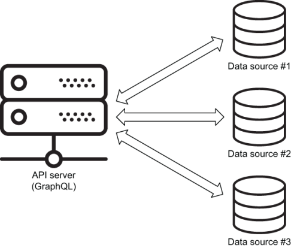

# 设计 GraphQL 模式
本章涵盖

- 规划 UI 功能并将其映射到 API 操作
- 根据计划的操作提出模式语言文本
- 将 API 功能映射到数据源

在本章中，我们将为真实的 Web 应用程序构建真实的数据 API。 我为它取了一个名字 AZdev，它是开发者资源"A 到 Z"的缩写。 AZdev 将是一个可搜索的实用微型文档库、错误和解决方案以及软件开发人员的一般提示。

我不喜欢脱离现实的无用抽象示例。 让我们构建一些真实的（有用的）东西。

## 4.1 为什么选择 AZdev？

当软件开发人员执行他们的日常任务时，他们经常需要查找一个特定的东西，例如如何在 JavaScript 中计算一组数字的总和。 他们对扫描文档页面以查找所需的简单代码示例并不真正感兴趣。 这就是为什么在 AZdev，他们会找到关于"计算 JavaScript 数组中数字的总和"的条目，其中包含针对特定代码开发需求的多种方法。

AZdev 不是问答网站。 它是开发人员通常查找内容的库。 对于他们来说，这是一种快速找到简明方法来准确处理他们当前需要的方法的方法。

以下是我想在 AZdev 上找到的一些条目示例：

- 仅删除自上次 Git 提交以来未暂存的更改
- 在 Node 中为文本值（如密码）创建安全的单向哈希
- 将目录中所有文件的名称小写的 Linux 命令

你当然可以通过阅读文档和 Stack Overflow 问题找到满足这些需求的方法，但是如果有一个网站可以提供像这样的特定任务以及他们的方法就在那里，没有所有噪音，这不是很好吗？

AZdev 是我从记事起就希望存在的东西。 让我们迈出实现它的第一步。 让我们为它构建一个 API！

## 4.2 AZdev 的 API 要求

开始考虑 GraphQL 模式的一个好方法是从你将要构建的 UI 的角度以及它们将需要哪些数据操作的角度来看待它。 然而，在我们这样做之前，让我们先弄清楚 API 服务将要使用的数据源。 GraphQL 不是数据存储服务； 它是一个或多个的接口（图 4.1）。



图 4.1 API 服务器接口数据存储服务。

为了使 AZdev GraphQL API 变得有趣，我们将让它与两种不同的数据服务一起使用。 我们将使用关系数据库服务来存储事务数据，并使用文档数据库服务来存储动态数据。 GraphQL 模式可以解析来自许多服务的数据，即使是在同一个查询中！

在同一个项目中拥有多个数据源并不少见。 它们不一定都是数据库服务。 项目可以使用键值缓存服务，从其他 API 获取一些数据，甚至直接从文件系统中的文件读取数据。 GraphQL 模式可以根据需要连接任意数量的服务。

对于 API 词汇表，让我们使用单词 Task 来表示 AZdev 中的单个微文档条目，使用单词 Approach 来表示执行该任务的单一方式或方法。 一个任务可以有多个方法。 一个方法属于一个任务。

> 注意 从现在开始，我将使用大写版本的单词任务和方法来指代数据库/API 实体：例如，"我们的第一个任务是创建一个任务表，我们将在一些约束条件下处理方法表 心里。"

> GraphQL 模式中的命名实体
>
> 我为这个小型 API 的实体使用了简单的名称，但是当你设计一个包含与多个其他实体相关的实体的大型 GraphQL API 时，你应该在命名方面花点时间。
> 这是一般的编程建议； 但对于 GraphQL 模式，请尽可能为你的类型使用特定的名称。 例如，如果你有属于课程的课程，请将其命名为 CourseLesson，而不仅仅是 Lesson，即使数据库模型名为 lessons。 如果你的 GraphQL 服务是公开的，这一点尤其重要。 你的数据库架构会发展，你用来描述其实体的类型也需要发展。 你需要弃用类型并引入新类型。 特异性使一切变得更容易。
> 任何人都可以浏览 AZdev 并找到任务和方法。 登录用户可以添加新的任务和方法，他们还可以对方法投赞成票或投反对票。

AZdev 的任务和方法的主要条目将存储在关系数据库中。 我为此选择了 PostgreSQL。 我们还将在 PostgreSQL 中存储用户记录。 像 PostgreSQL 这样的关系数据库非常适合关系！ 一个任务有很多方法，由用户定义。

> 注意 为什么选择 PostgreSQL？ PostgreSQL 是一种可扩展的开源对象关系数据库，可免费使用且易于设置。 它提供了一组令人印象深刻的高级功能，在你需要时可以派上用场。 它是开源关系数据库中最受欢迎的选择之一。

解释、警告或一般注释等方法的额外数据元素将存储在文档数据库中。 我为此选择了 MongoDB。 像 MongoDB 这样的文档数据库是"无模式"的，这使得它非常适合这种类型的动态数据。 一个方法可能有一个警告或与之相关的解释，它可能有我们目前不知道的其他数据元素。 也许在某个时候我们会决定在方法上添加一些性能指标或包含相关链接列表。 我们不需要为此修改数据库模式； 我们可以只指示 MongoDB 存储这些新的数据元素。

> 注意 为什么选择 MongoDB？ MongoDB 是最流行的开源文档 (NoSQL) 数据库。 它背后的公司 (MongoDB, Inc.) 提供了一个社区版，可以免费使用并在三大操作系统上可用。

> 提示 本书不是你学习这些数据库服务的合适来源。 但是，我们将简要说明我们在这些服务中使用的概念，并在我们通过 API 进行时提供与它们相关的所有命令和查询。 我还将提供一些示例数据来帮助测试我们添加的 API 功能。

### 4.2.1 核心类型
我为 AZdev 设想的 API 中的主要实体是用户、任务和方法。 这些将由 PostgreSQL 中的数据库表表示。 让我们让每个表都有一个唯一的标识列和一个自动创建的日期时间列。

在 GraphQL 模式中，表通常映射到对象类型，表列映射到这些对象类型下的字段。 我将使用术语模型来表示 API 中的实体（由 GraphQL 类型表示的表），我将使用术语字段来表示该模型下对象的属性。 模型通常使用大驼峰命名法（Pascal 命名法）定义，而字段则使用小驼峰命名法（Dromedary 命名法）定义。

用户模型将具有表示用户信息的字段。 让我们从名称和用户名开始。

Task 和 Approach 模型都有一个内容字段来保存它们的主要文本内容。 这是一个模式语言定义 (SDL)，到目前为止，它可用于定义此 API 中的三个核心模型及其字段。

清单 4.1 三种核心输出对象类型的 SDL

```js
type User {
  id: ID!
  createdAt: String!
  username: String!
  name: String
 
  # More fields for a User object
 }
 
type Task {
  id: ID!
  createdAt: String!
  content: String!
 
  # More fields for a Task object
}
 
type Approach {
  id: ID!
  createdAt: String!
  content: String!
 
  # More fields for an Approach object
}
```

提示 打开你的代码编辑器，输入清单 4.1 中的初始模式文本，并随着我们对 AZdev API 的分析进行修改。 为了清楚起见，本章中其余的 SDL 清单将省略模式的一些现有部分。

> 注意 我使用 ID 类型定义了 id 字段。 ID类型比较特殊，表示唯一标识； 它被序列化为一个字符串（即使它的解析值是整数）。 在 JavaScript 应用程序中，使用字符串作为 ID（而不是整数）通常是一种很好的做法。 JavaScript 中的整数表示是有限的。

另请注意，我将 createdAt"日期"字段定义为字符串。 GraphQL 没有日期时间字段的内置格式。 使用这些字段的最简单方法是将它们序列化为标准格式（如 ISO/UTC）的字符串。

请记住，ID 和 String 类型后面的感叹号表示这些字段不能有空值。 数据库中的每条记录总是有一个 id 值和一个 createdAt 值。

> **GraphQL 类型修饰符**
>
> 结尾的感叹号被称为类型修饰符，因为它将类型修饰为非空。 另一种类型修饰符是类型周围的一对方括号（例如，[String]），表示一种类型是另一种类型的项目列表。 这些修饰符也可以结合使用。 例如，[字符串！]！ 表示由非空字符串项组成的非空列表。 我们很快就会看到一个例子。
> 请注意，如果字段定义为 [String!]! 类型，这并不意味着该字段的响应不能为空数组。 这意味着它不能为空。
> 如果你希望某个字段始终具有非空数组，你可以在其解析器的逻辑中添加该验证或为其定义自定义 GraphQL 类型。
> id 和 createdAt 字段是 GraphQL 模式类型不必与数据库中的列类型完全匹配的示例。 GraphQL 使你可以灵活地将数据库中的一种类型转换为对客户端更有用的类型。 当我们通过 API 取得进展时，试着找出其他例子。

注意清单 4.1 中的对象类型被称为输出类型，因为它们被用作操作的输出，并且也将它们与输入类型区分开来，输入类型通常用作变异操作的输入。 我们将在本章后面看到输入类型的例子。

> 密码字段在哪里？
>
> 为什么用户类型中没有密码字段？
> 重要的是要记住，我们还没有设计数据库模式； 我们正在设计一个 API 模式。 一些 GraphQL 工具允许你从 GraphQL API 模式生成数据库模式，但这限制了这两者之间的重要区别。
> 密码字段不应是 API 模式的可读部分。 但是，它将成为数据库模式（我们将在下一章构建）的一部分。
> 请注意，密码字段将成为创建或验证用户的变更的一部分，我们将在本章后面看到。

这是三个核心对象类型的良好开端。 在讨论它们与 UI 功能的关系时，我们将向它们添加更多字段。 让我们接下来这样做。

## 4.3 查询

我喜欢提出基于设想的 UI 上下文的伪代码式操作（查询、变更和订阅），然后设计架构类型和字段以支持这些操作。

让我们从查询开始。

### 4.3.1 列出最新的Task记录

在 AZdev 的主页上，我想列出最新的任务记录。 GraphQL API 必须提供查询根字段来执行此操作。 此列表仅限于最后 100 条记录，并且始终按创建时间戳排序（较新的在前）。 我们将此字段命名为 taskMainList。

清单 4.2 伪查询 #1：taskMainList

```js
query {
  taskMainList {
    id
    content
 
    # Fields on a Task object
  }
}
```

请注意，我将根字段命名为 taskMainList，而不是像 mainTaskList 这样更自然的名称。 这只是一种风格偏好，但它有一个优势：通过将操作的主题（在本例中为任务）放在首位，所有关于该主题的操作将自然地按字母顺序分组在文件树和 API 浏览器中。 这在很多地方都有用，但你可以将 GraphiQL 中的自动完成列表作为示例。 如果你正在寻找可以在任务模型上执行的操作，只需键入任务，所有相关操作将按顺序显示在自动完成列表中。 对于此 API 的每个实体的所有查询、变更和订阅，我都会遵循这种做法。

查询根字段是直接在查询类型下定义的字段。 每个 GraphQL 模式都以其根字段开始。 它们是 API 消费者将始终启动其数据查询的入口点。

为了支持简单的 taskMainList 查询根字段，这里有一个可能的模式设计。

清单 4.3 增量式 UI 驱动模式设计

```js
type Query {
  taskMainList: [Task!]
 
  # More query root fields
}
```

新 taskMainList 的类型是 [Task!]。 方括号修改类型以指示该字段是任务模型中的对象列表。 该字段的解析器必须使用数组来解析它。 方括号内任务类型后的感叹号表示此数组中的所有项目都应该有一个值，并且它们不能为空。

> **根字段可空性**
>
> GraphQL 模式中的一般良好做法是使字段类型为非空，除非你有理由区分空和空。 非空类型仍然可以包含空值。 例如，非空字符串可以是空的，非空列表可以是空数组，非空对象可以是没有属性的对象。
> 如果你想将实际语义与值的缺失相关联，则仅使用可空字段。 但是，根字段是特殊的，因为使它们可为空具有重要的后果。 在 GraphQL.js 实现中，当任何字段的解析器抛出错误时，内置执行器将该字段解析为 null。 当在定义为非空的字段的解析器中抛出错误时，执行器会将可空性传播到该字段的父级。 如果该父字段也是非空的，则执行程序继续在树中向上移动，直到找到一个可为空的字段。
> 这意味着如果要将根 taskMainList 字段设置为非空，那么当在其解析器中抛出错误时，可空性将传播到 Query 类型（其父级）。 因此，即使查询具有其他根字段，请求该字段的查询的整个数据响应也将为空。
> 这并不理想。 一个坏的根字段不应阻塞其他根字段的数据响应。 当我们在下一章开始实现这个 GraphQL API 时，我们将看到一个示例。
> 这就是为什么我让 taskMainList 可以为空，这就是为什么我要让所有根字段都可以为空。 这种可空性的语义含义是，在这种情况下，"这个根字段的解析器出了点问题，我们允许它以便响应仍然可以包含其他根字段的部分数据。"

实现主任务列表的另一种方法是拥有一个通用的 taskList 根字段，并使该字段支持参数以指示任何所需的排序和使用的限制。 这实际上是一个更灵活的选项，因为它可以支持许多特定列表。 然而，灵活性是有代价的。 在设计公共 API 时，更安全的做法是实现当前设想的 UI 的确切功能，然后根据 UI 不断变化的需求优化和扩展 API。 特异性有助于做出更好的改变。

### 4.3.2 搜索和联合/接口类型

AZdev 用户界面的主要特征是它的搜索表单（图 4.2）。 用户将使用它来查找 Task 和 Approach 对象。


图 4.2 AZdev 主登陆页面的模型

为了支持搜索表单，GraphQL API 应该为其提供一个查询根字段。 让我们将该字段命名为搜索。

这个搜索根字段的 GraphQL 类型很有趣。 它必须执行全文 SQL 查询以查找记录并按相关性对它们进行排序。 此外，该 SQL 查询必须使用两个模型并返回匹配的 Task 和 Approach 对象的混合列表，它们可能具有不同的字段！

比如在UI中，当搜索结果项是一条Task记录时，让它显示它有多少条Approach记录； 当搜索结果项是一条方法记录时，让它显示该方法记录的任务信息。

为了支持这一点，我们可以简单地将这些新字段添加到任务和方法类型中。

清单 4.4 approachCount 和 task 字段

```js
type Task {
  # ·-·-·
  approachCount: Int!
}
 
type Approach {
  # ·-·-·
  task: Task!
}
```

但是，搜索根字段不能是任务记录列表或方法记录列表。 它必须将这两个模型归为一个新类型。 在 GraphQL 中，你可以使用联合类型或接口类型对这种分组进行建模。 我将告诉你如何实现这两种类型； 但首先，让我们了解为什么我们需要将两个模型分组在一个列表中。 为什么不设计 API 来支持这样的查询呢？

清单 4.5 搜索字段的简单查询

```js
query {
  search(term: "something") {
    taskList {
      id
      content
      approachCount
    }
    approachList {
      id
      content
      task {
        id
        content
      }
    }
  }
}
```

这种设计工作正常，但它有一个主要问题：它返回两个不同的搜索结果列表。 这意味着我们无法根据相关性对搜索结果进行准确排名。 我们只能按组对它们进行排名。

为了改进这种设计，我们必须返回与搜索词匹配的所有对象的列表，以便我们可以根据相关性对它们进行排名。 然而，由于这些对象可以有不同的字段，我们需要想出一个新的类型来组合它们。

一种方法是让搜索根字段表示一个对象数组，这些对象可以根据它们所属的模型具有可为空的字段：例如，如下所示。

清单 4.6 搜索字段的更好查询

```js
search(term: "something") {
  id
  content
 
  approachCount // when result is a Task
 
  task {        // when result is an Approach
    id
    content
  }
}
```

这样更好，它解决了排名问题。 然而，它有点混乱，因为 API 使用者将不得不依赖于了解哪些字段为空来确定如何呈现搜索结果。

GraphQL 为这一挑战提供了更好的解决方案。 我们可以在联合类型或接口类型下对搜索结果项进行分组。

#### 使用联合类型

请记住，联合类型表示 OR 逻辑（如第 3 章所述）。 搜索结果可以是任务或方法。 我们可以使用内省的 __typename 来询问服务器搜索结果项的类型，我们可以使用内联片段根据返回项的类型有条件地选择我们的 UI 所需的确切字段（就像我们为 GitHub 的 issueOrPullRequest 示例所做的一样 在第 3 章）。

使用联合实现，这是消费者可以用来实现搜索功能的查询。

清单 4.7 联合类型的搜索字段

```js
query {
  search(term: "something") {
    type: __typename
    ... on Task {
      id
      content
      approachCount
    }
    ... on Approach {
      id
      content
      task {
        id
        content
      }
    }
  }
}
```

请注意，这个查询只是清单 4.6 中查询的一个更结构化的版本。 由于内联片段，我们在那里的"when x is y"评论现在是查询的正式部分，并且由于 __typename 内省字段，消费者确切地知道项目是什么类型。

在 GraphQL schema 语言中，为了实现搜索根字段的这种联合类型，我们使用 union 关键字和竖线符（|）组成一个新的对象类型。

清单 4.8 使用联合类型实现搜索

```js
union TaskOrApproach = Task | Approach
 
type Query {
  # ·-·-·
  search(term: String!): [TaskOrApproach!]
}
```

请注意，我在搜索字段后添加了括号，以指示该字段将接收一个参数（搜索词）。 另请注意，搜索结果将始终是一个数组，并且该数组中的任何项目都不能为空。 但是，数组可以为空（当没有匹配项时）。

### 4.3.3 使用接口类型
清单 4.7 中的查询有一些重复。 id 和 content 字段在 Task 和 Approach 模型之间共享。 在第 3 章中，我们看到了如何使用接口类型来实现共享字段。

基本上，我们可以将搜索项视为具有三个主要属性（类型、ID 和内容）的对象。 这是它的主界面。 它也可以有一个 approachCount 或一个任务字段（取决于它的类型）。

这意味着我们可以编写一个查询来使用搜索根字段，如下所示。

清单 4.9 接口类型的搜索字段

```js
query {
  search(term: "something") {
    type: __typename
    id
    content
    ... on Task {
      approachCount
    }
    ... on Approach {
      task {
        id
        content
      }
    }
  }
}
```

这个版本没有重复的字段，这当然好一点。 但是，我们如何决定何时选择接口而不是联合，或者相反？

我问这个问题："（要分组的）模型是否相似但有几个不同的字段，或者它们是否完全不同没有共享字段？"

如果他们有共享字段，那么接口更合适。 仅当分组模型没有共享字段时才使用联合。

在 GraphQL schema 语言中，为了实现搜索根字段的接口类型，我们使用 interface 关键字来定义一个新的对象类型来定义共享字段。 然后我们让所有模型（要分组）实现新的接口类型（使用 implements 关键字）。

清单 4.10 使用接口类型实现搜索

```js
interface SearchResultItem {  ❶
  id: ID!                     ❶
  content: String!            ❶
}                             ❶
 
type Task implements SearchResultItem {
  # ·-·-·
  approachCount: Int!
}
 
type Approach implements SearchResultItem {
  # ·-·-·
  task: Task!
}
 
type Query {
  # ·-·-·
  search(term: String!): [SearchResultItem!]
}
```

❶ 替换 union TaskOrApproach 类型
除了使用接口的消费者查询更简单这一事实之外，我更喜欢这里的接口类型还有一个微妙的原因。 使用接口类型，查看 Task/Approach 类型的实现，你可以轻松地分辨出它们是另一种类型的一部分。 对于工会，你不能； 你必须通过查看其他地方的代码来找到其他类型使用它们。

提示 GraphQL 类型还可以实现多种接口类型。 在 SDL 中，你可以只使用逗号分隔的接口类型列表来实现。

### 4.3.4 一条Task记录的页面

AZdev UI 的用户可以在主页上（或从搜索结果中）选择一个任务条目，以导航到代表单个任务记录的页面。 该页面将包含记录的完整信息，包括其方法列表。

GraphQL API 必须提供一个查询根字段，使消费者能够获取有关一个任务对象的数据。 我们将此根字段命名为 taskInfo。

清单 4.11 伪查询 #2：taskInfo

```js
query {
  taskInfo (
    # Arguments to identify a Task record
  ) {
    # Fields under a Task record
  }
}
```

要识别单个任务记录，我们可以使该字段接受一个 id 参数。 这是我们需要在模式文本中添加的内容以支持这个新的根字段。

清单 4.12 增量式 UI 驱动模式设计

```js
type Query {
  # ·-·-·
  taskInfo(id: ID!): Task
}
```

非常好。 这使 API 用户能够获取有关 Task 对象的完整信息，但是在该 Task 对象下定义的 Approach 对象的信息又如何呢？ 我们如何让用户获取这些？

此外，因为 AZdev 应用程序的用户将能够对 Approaches 进行投票，我们可能应该让 API 返回按投票数排序的 Approaches 列表。 计算 Approaches 投票数的最简单方法是添加一个字段来跟踪每个 Approaches 对象当前有多少票。 让我们这样做吧。

清单 4.13 voteCount 字段

```js
type Approach implements SearchResultItem {
  # ·-·-·
  voteCount: Int!
}
```

现在，要返回与任务对象相关的方法列表，我们需要讨论实体关系。

提示 请记住，始终根据将要使用该类型的 UI 需要什么来考虑 GraphQL 类型。 在需要时添加功能很容易。 当你不这样做时，要删除它们要困难得多。

### 4.3.5 实体关系
Task 对象下的 Approaches 列表表示一种关系。 一个 Task 对象可以有多个 Approach 对象。

我们还必须支持其他一些关系：

在 UI 中显示任务记录时，我们应该显示创建它的用户的名称。 这同样适用于 Approach 对象。
对于每个方法，应用程序将显示其额外详细数据元素的列表。 使用新的方法详细信息对象类型来表示该关系可能是个好主意。
我们需要在此 API 中表示四种关系：

- 一个任务有很多方法。
- 任务属于用户。
- 方法属于用户。
- 一个 Approach 有很多 Approach Detail 记录。

在数据库中，这些关系通常用标识列（主键和外键）中的整数表示。 此 API 的客户端真正对这些 ID 表示的数据感兴趣：例如，编写任务记录的人员的姓名或在其上定义的方法的内容。 这就是为什么客户端在 GraphQL 查询中包含这些关系字段时需要提供叶字段列表的原因。

清单 4.14 taskInfo 下的关系字段

```js
query {
  taskInfo (
    # Arguments to identify a Task record
  ) {
    # Fields under a Task record
 
    author {
      # Fields under a User record
    }
 
    approachList {
      # Fields under an Approach record
 
      author {
        # Fields under a User record
      }
 
      detailList {
        # Fields under an Approach Detail record
      }
    }
  }
}
```

注意我将表示用户关系作者的字段命名为。 我还将详细记录列表命名为 detailList 而不是 approachDetailList。 字段的名称不必与其类型或数据库源的名称相匹配。

为了在模式中支持这些关系，我们添加了对其核心类型的引用。

清单 4.15 增量式 UI 驱动模式设计

```js
type ApproachDetail {                            ❶
  content: String!                               ❶
                                                 ❶
  # More fields for an Approach Detail record    ❶
}                                                ❶
 
type Approach implements SearchResultItem {
  # ·-·-·
  author: User!
  detailList: [ApproachDetail!]!
}
 
type Task implements SearchResultItem {
  # ·-·-·
  author: User!
  approachList: [Approach!]!
}
```

❶ 新的核心类型来表示方法细节对象
请注意，我为作者字段使用了用户类型。 我们还计划在 me 字段范围内使用相同的用户类型。 这引入了一个问题，因为我们需要在 User 类型下定义 taskList 字段（参见 4.3.8 节）。 当用户请求他们自己的任务记录时，这会很好地工作。 但是，当 API 报告公共 Task 记录的作者详细信息时，这些详细信息不应包括该作者的 taskList。 我们将在实现 me 字段范围（第 7 章）时找到解决这个问题的方法。

### 4.3.6 枚举类型

Approach Detail 记录只是一个文本字段（我将其命名为内容），但它很特殊，因为它将属于特定类别。 我们希望 API 支持初始类别集注意、解释和警告。 由于这三个类别将是方法详细信息类别中唯一可接受的值，因此我们可以使用 GraphQL 的特殊 ENUM 类型来表示它们。 以下是如何做到这一点（在 SDL 中）。

清单 4.16 ApproachDetailCategory ENUM 类型

```jd
enum ApproachDetailCategory {
  NOTE
  EXPLANATION
  WARNING
}
```

特殊的 ENUM 类型允许我们枚举一个字段的所有可能值。 这样做会在该字段周围添加一层验证，使枚举值成为唯一可能的值。 如果你接受用户对枚举字段的输入，这将特别有用，但它也是通过类型系统传达字段始终是一组固定值之一的好方法。

现在我们可以修改 ApproachDetail GraphQL 类型以使用这个新的 ENUM 类型。

清单 4.17 方法详细信息的 GraphQL 类型

```jd
type ApproachDetail {
  content: String!
  category: ApproachDetailCategory!
}
```

对于支持我们为 UI 规划的查询所需的 GraphQL 类型，这是一个良好的开端。 然而，这只是一个开始。 对于核心类型，有更多的领域需要考虑，随着我们在 API 上取得进展，我们可能需要引入更多的类型。

注意你应该让 API 使用者通过列表类型字段分页，例如 taskMainList、search、approachList 和 detailList（在 taskInfo 下）和 taskList（在 me 下）。 永远不要让 API 返回列表下的所有记录。 查看官方 AZdev API 源代码以获取示例。

### 4.3.7 标量值列表

为了使 Task 对象更容易被发现，让 API 用户在创建 Task 对象时提供标签列表。 标签可以是 git、javascript、命令、代码等。 我们还让这些标签成为返回 Task 对象的每个字段的数据响应的一部分。 它可以只是一个字符串数组。

清单 4.18 标签字段

```js
type Task implements SearchResultItem {
  # ·-·-·
  tags: [String!]!
}
```

### 4.3.8 用户任务记录页面

让我们为登录用户提供查看其任务记录列表的能力。 我们将命名该字段以支持该任务列表。

但是，使 taskList 成为根字段可能会造成混淆。 它可以被解释为一个返回数据库中所有任务记录列表的字段！

我们可以用不同的名称来消除这种混淆，但另一种有用的做法也可以解决这个问题。 我们可以引入一个代表当前登录用户范围的查询根字段，将taskList字段放在它下面。

此字段在 GraphQL API 中通常命名为 me，但该名称不是必需的。 你可以给它起任何名字。

清单 4.19 伪查询 #3：经过身份验证的用户的任务记录列表

```js
query {
  me (
    # Arguments to validate user access
  ) {
    taskList {
      # Fields under a Task record
    }
  }
}
```

me 字段下的任何字段都将针对当前登录的用户进行过滤。 将来，我们可能会在该范围下添加更多字段。 me 字段是组织与当前用户相关的多个字段的好方法。

为了支持 me { taskList } 特性，我们必须在模式中引入两个字段：一个返回 User 类型的根 me 字段和一个 User 类型的 taskList 字段。

清单 4.20 增量式 UI 驱动模式设计

```js
type User {
  # ·-·-·
  taskList: [Task!]!
}
 
type Query {
  # ·-·-·
  me: User
}
```

注意 再一次，我让 me 字段可以为空。 会话可能会在后端超时，但我们可以为超时的 me 字段返回 null，并且仍然在查询的其他部分包含部分数据，而不是为具有 me 字段的查询返回完全空的响应。

非常好！ 登录用户现在可以请求他们自己的任务记录。 但是用户将如何登录 API，我们如何确定查询请求是否来自登录用户？ 这是讨论 GraphQL 中身份验证（和授权）概念的好地方。

### 4.3.9 认证授权
me 字段将需要访问令牌。 在这个项目中，我们将使用一个简单的字符串访问令牌进行身份验证。 从现在开始，我将该令牌称为 authToken。 这个字符串值将与用户记录一起存储在数据库中，我们可以将它用于个人查询字段，例如我和搜索以及一些突变。

提示一个简单的字符串值令牌被称为不记名令牌。 该标签通常用于请求标头中以标识身份验证令牌。

当 authToken 包含在请求中时，API 服务器将使用它来识别发出该请求的用户。 此令牌在概念上类似于会话 cookie。 它将在每个用户会话中被记住，并与该会话发出的 GraphQL 请求一起发送。 它应该在用户登录到 AZdev 应用程序时更新。

> **授权呢？**
>
> 授权是确定用户是否有权读取某条数据或执行某项操作的业务逻辑。 例如，AZdev API 中的授权规则可以是"只有任务记录的所有者才能删除该记录"。
> AZdev authToken 值将使服务器确定 API 使用者的身份，然后该身份可用于执行授权规则。
> 我们可以在 GraphQL 请求文本中包含 authToken 值。 例如，它可以是一个简单的字段参数。 但是，将访问令牌分开是一种常见的做法。 对于 Web API，请求标头可用于包含此类令牌。

不直接在 GraphQL API 服务的字段解析器中执行任何身份验证或授权逻辑，而是将这些任务委托给更高层也是一种常见的做法，这应该是这些问题的唯一真实来源。 对于 AZdev API，唯一的真实来源可以是数据库。 我将提供 SQL 语句并指出其中为身份验证或授权而设计的任何逻辑。

authToken 值就像一个临时密码：它必须在传输和存储过程中保密。 Web 应用程序应该只通过 HTTPS 连接发送它，它不应该以纯文本形式存储在数据库中。

> 提示字符串值令牌概念是我们可以为身份验证做的最简单的事情。 如果你有兴趣了解更深入的身份验证和授权方法，请查看 JSON Web Tokens (JWT)。 JWT 使用 JSON 携带一些公共字段，如主题、发行者、过期时间等。 连同 JSON Web 签名 (JWS) 和 JSON Web 加密 (JWE) 等相关规范，JWT 可用于保护和验证令牌值。 你可以在 az.dev/jwt 上阅读有关 JWT 的更多信息。

## 4.4 突变
要向 AZdev 添加内容（任务、方法、详细信息、投票），来宾必须创建一个帐户并登录到该应用程序。 这将需要 API 托管一个用户数据库表来存储用户的凭据。 GraphQL API 需要提供变更来创建用户并允许他们获得授权令牌。

清单 4.21 伪突变 #1：userCreate

```js
mutation {
  userCreate (
    # Input for a new User record
  ) {
    # Fail/Success response
  }
}
```

清单 4.22 伪突变 #2：userLogin

```js
mutation {
  userLogin (
    # Input to identify a User record
  ) {
    # Fail/Success response
  }
}
```

userCreate 突变将使用户能够为 AZdev 应用程序创建一个帐户，而 userLogin 突变将使他们能够执行特定于他们的未来查询和突变。

请注意，对于每个突变，我计划处理失败响应以及正常的成功响应。 突变通常依赖于有效的用户输入才能成功。 以不同于 GraphQL API 消费者可能导致的其他根错误的方式来表示由无效使用突变引起的错误是个好主意。 例如，尝试请求一个不存在的字段是一个根本错误。 但是，尝试使用系统中已有的用户名创建用户是一个用户错误，我们应该以不同的方式处理。

> **负载错误**
>
> 根错误字段用于服务器问题（如 5xx HTTP 代码），但它也用于一些客户端问题：例如，达到限速 API 的限制或未经适当授权访问某些内容。 如果客户端发送未通过架构验证的错误请求，GraphQL 也会使用该字段。 有效负载错误概念适用于用户提供错误输入时的用户友好消息。
> 在有效负载中使用用户友好的错误作为操作的错误边界。 一些开发人员甚至在查询字段中使用带有错误的有效负载。 你可以使用它们来隐藏实现细节，而不会将服务器错误暴露给 API 使用者。

我们可以为系统中的每个实体使用联合类型或特殊输出负载类型来实现此失败/成功响应。 我将为 AZdev API 变更使用有效负载概念。

突变输出有效负载可以包括用户错误、突变操作的实体以及可能对该突变的消费者有用的任何其他值。 例如，userLogin 突变可以包括生成的 authToken 值作为其输出负载的一部分。 这是一个如何做到这一点的例子。

清单 4.23 增量式 UI 驱动模式设计

```js
type UserError {
  message: String!
}
 
type UserPayload {
  errors: [UserError!]!
  user: User
  authToken: String
}
# More entity payloads
 
type Mutation {
  userCreate(
    # Mutation Input
  ): UserPayload!
 
  userLogin(
    # Mutation Input
  ): UserPayload!
 
  # More mutations
}
```

请注意，我将 authToken 字段与 UserPayload 类型中的用户字段分开。 我认为这可以使用 API 清洁器。 authToken 值实际上并不是用户记录的一部分； 这只是用户为将来的操作验证自己的临时值。 他们需要在某个时候更新它。

这会处理这两个变异操作的输出。 我们仍然需要弄清楚他们输入的结构。

提示 我使 UserError 类型保持简单，只有一个必需的消息字段。 这与 GraphQL 根错误数组的结构相匹配。 我认为在这种类型中也支持可选的路径和位置字段是个好主意，以便为 API 消费者提供更多权力来弄清楚如何处理这些错误。

### 4.4.1 突变输入

突变总是有某种通常具有多个元素的输入。 为了更好地表示和验证多字段输入的结构，GraphQL 支持一种特殊的输入类型，可用于将标量输入值分组到一个对象中。

例如，对于 userCreate 突变，我们允许突变使用者指定名字、姓氏、用户名和密码。 所有这些字段都是字符串。

我们可以将这些输入值分组为一个输入对象参数，而不是为 userCreate 突变定义四个标量参数。 我们使用 input 关键字来做到这一点。

清单 4.24 增量式 UI 驱动模式设计

```js
# Define an input type:
input UserInput {
  username: String!
  password: String!
  firstName: String
  lastName: String
}
 
# Then use it as the only argument to the mutation:
type Mutation {
  userCreate(input: UserInput!): UserPayload!
 
  # More mutations
}
```

关于这种新类型需要注意的几点：

- 你可以为输入对象类型和变异参数使用任何名称。 但是，名称 \<Model\>Input 和 input 是通用约定。 我将在 AZdev 架构中使用这些约定。
- 使 firstName 和 lastName 可选允许用户仅使用他们的用户名（和密码）注册一个帐户。

UserInput 类型类似于我们为该 API 的查询设计的核心用户类型。 那么，当我们已经有了用户的核心对象类型时，为什么还要引入新的输入对象类型呢？

输入对象类型基本上是输出对象类型的简化版本。 它们的字段不能引用输出对象类型（或接口/联合类型）。 它们只能使用标量输入类型或其他输入对象类型。

输入对象类型通常更小且更接近数据库模式，而对象类型可能会引入更多字段来表示关系或其他自定义逻辑。 例如，id 字段是 User 类型的必需部分，但我们在 UserInput 类型中不需要它，因为它是一个将由数据库生成的值。 某些字段将出现在输入对象类型中，但不应出现在其对应的输出对象类型中。 一个例子是密码字段。 我们需要它来创建用户帐户（或登录），但我们不应该以任何可读的方式公开它。

虽然你可以将用户名、名字和姓氏值直接传递给突变，但输入对象类型结构更可取，因为它允许将对象传递给突变。 这通常会降低使用该突变的代码的复杂性，并总体上增强代码的可读性。 拥有输入对象还可以为你的代码增加可重用性优势。

> 提示 尽管使用输入对象类型的好处与具有多个标量输入值的情况有关，但最好在所有突变中使用相同的模式，即使是具有单个标量输入值的突变也是如此。

对于 userLogin 突变，我们需要消费者发送他们的用户名和密码。 让我们为此创建一个 AuthInput 类型。

清单 4.25 增量式 UI 驱动模式设计

```js
input AuthInput {
  username: String!
  password: String!
}
 
type Mutation {
  # ·-·-·
  userLogin(input: AuthInput!): UserPayload!
}
```

### 4.4.2 删除用户记录

我们还为 AZdev API 消费者提供一种删除其用户配置文件的方法。 我们将计划一个 userDelete 突变来做到这一点。

清单 4.26 伪突变 #3：userDelete

```js
mutation {
  userDelete {
    # Fail/Success payload
  }
}
```

请注意，此突变没有输入。 用户将通过他们的 authToken 值来识别，该值需要成为该请求标头的一部分。

对于有效负载，如果操作成功，我们可以只返回已删除用户的 ID。 以下是代表该计划的 SDL 文本：

```js
type UserDeletePayload {
  errors: [UserError!]!
  deletedUserId: ID
}
 
type Mutation {
  # ·-·-·
  userDelete: UserDeletePayload!
}
```

### 4.4.3 创建任务对象

要在 AZdev 应用程序中创建新的任务记录，让我们让 API 支持 taskCreate 突变。 这是变异操作的样子。

清单 4.27 伪突变 #4：taskCreate

```js
mutation {
  taskCreate (
    # Input for a new Task record
  ) {
    # Fail/Success Task payload
  }
}
```

为了支持这种突变，我们需要定义任务输入和有效载荷类型，并创建一个使用它们的新突变字段。

输入对象的主字段是任务记录上内容字段的简单文本字段。 还有 tags 字段，它是一个字符串值数组。 让我们还允许用户创建不包含在搜索中的私人任务（除非正在搜索的用户拥有它们）。

TIP 私人任务条目将方便用户在他们的私人项目中保留他们需要的东西的参考。 请记住，这些条目会使事情变得更具挑战性，因为我们需要将它们排除在外，除非 API 使用者是拥有它们的用户。

这是 SDL 文本，代表我们为任务实体变更计划的内容。

清单 4.28 增量式 UI 驱动模式设计

```js
input TaskInput {
  content: String!
  tags: [String!]!
  isPrivate: Boolean!
}
 
type TaskPayload {
  errors: [UserError!]!
  task: Task
}
 
type Mutation {
  # ·-·-·
  taskCreate(input: TaskInput!): TaskPayload!
}
```

### 4.4.4 方法条目的创建和投票

要在现有任务记录上创建新的方法记录，让我们让 API 支持 approachCreate 突变。

清单 4.29 伪突变 #4：approachCreate

```js
mutation {
  approachCreate (
    # Input to identify a Task record
    # Input for a new Approach record (with ApproachDetail)
  ) {
    # Fail/Success Approach payload
  }
}
```

查看任务记录页面及其变更列表的登录用户可以对单个方法记录投赞成票或反对票。 让我们让 API 支持 approachVote 突变。 此突变需要返回投票方法的新票数。 我们将把那部分作为方法有效负载。

清单 4.30 伪突变 #5：approachVote

```js
mutation  {
  approachVote (
    # Input to identify an Approach record
    # Input for "Vote"
  ) {
    # Fail/Success Approach payload
  }
}
```

以下是支持这两个新突变所需的模式文本更改。

清单 4.31 增量式 UI 驱动模式设计

```js
input ApproachDetailInput {
  content: String!
  category: ApproachDetailCategory!     ❶
}
 
input ApproachInput {
  content: String!
  detailList: [ApproachDetailInput!]!
}
 
input ApproachVoteInput {
  up: Boolean!
}
 
type ApproachPayload {
  errors: [UserError!]!
  approach: Approach
}
 
type Mutation {
  # ·-·-·
 
  approachCreate(
    taskId: ID!
    input: ApproachInput!
  ): ApproachPayload!
 
  approachVote(
    approachId: ID!
    input: ApproachVoteInput!
  ): ApproachPayload!
}
```

❶ 此处的 ENUM 类型将验证接受的类别。
请注意，我选择用一个简单的布尔字段而不是两个值的 ENUM 来表示赞成票和反对票。 当恰好有两个可接受的值时，这是一个选项。 为此使用 ENUM 可能更好，但让我们将其保留为布尔值并添加注释以阐明它。 我们只是将注释文本放在需要它的字段之前的行中，并用三重引号 (""") 将该文本括起来。

清单 4.32 添加描述文本

```js
input ApproachVoteInput {
  """true for up-vote and false for down-vote"""
  up: Boolean!
}
```

澄清文本在 GraphQL 模式中称为描述，它是该模式结构的一部分。 它不是真正的评论，而是这种类型的属性。 像 GraphiQL 这样的工具期望它并将其显示在自动完成列表和文档浏览器中。 你应该考虑向任何可以使用解释的字段添加描述属性。

提示我们可能还应该支持 userUpdate 和 approachUpdate 突变。 我将把它作为多章练习留给你。 在本章中，你需要计划如何调用这些变更并为它们提出 SDL 文本。

再次注意，我使用 \<model\>Action（例如，taskCreate）的形式命名所有的突变，而不是更自然的 action\<Model\>（例如，createTask）。 现在，任务记录上的所有操作都按字母顺序组合在一起。 我们会发现 taskMainList、taskInfo、taskCreate 和 taskUpdate 操作彼此相邻。

提示 ApproachDetailInput 类型（清单 4.31）与 ApproachDetail 类型（清单 4.17）相同。 但是，不要试图将输出对象类型重用为输入对象类型。 将来，我们可能会升级 Approach Detail 概念，使其也具有唯一 ID 和创建时间戳。 保持一切一致也很有价值。

## 4.5 订阅
在 Twitter 和其他社交媒体应用程序上，当你查看帖子时，其回复、分享和喜欢的计数器会自动更新。 让我们为投票计数计划一个类似的功能。 在任务页面上查看方法列表时，让我们自动更新投票！

我们可以使用订阅操作来做到这一点。 此操作必须接受 taskId 输入，以便用户可以订阅单个任务对象（而不是系统中的所有方法）下方法的投票更改。 我们将此订阅操作命名为 voteChanged。

清单 4.33 伪订阅 #1：voteChanged

```js
subscription {
  voteChanged (
    # Input to identify a Task record
  ) {
    # Fields under an Approach record
  }
}
```

在显示所有最新任务列表的 AZdev 主页上，另一个基于订阅的增值功能是显示一个指示器，告诉用户有新的任务记录可用。 他们可以单击该指示器来显示新任务。 我们将此订阅操作命名为 taskMainListChanged。

清单 4.34 伪订阅 #2：taskMainListChanged

```js
subscription {
  taskMainListChanged {
    # Fields under a Task record
  }
}
```

为了支持这些订阅，我们定义了一个新的订阅类型，它下面有新的字段，如下所示：

```js
type Subscription {
  voteChanged(taskId: ID!): Approach!
  taskMainListChanged: [Task!]
}
```

你觉得这一切怎么样？ 一起让它成为现实！

> 注意 我将在本书之外向 AZdev API 添加更多功能，但我们需要在这里保持简单和可管理。 你可以在 az.dev/api 探索 AZdev 当前生产的 GraphQL API，并查看我添加的其他查询、变更和订阅。

## 4.6 完整模式文本

你是否注意到，到目前为止，我只是从 UI 的角度来思考整个模式描述？ 多么酷啊？ 你可以将这个简单的模式语言文本提供给你团队中的前端开发人员，他们可以立即开始构建前端应用程序！ 他们不需要等待你的服务器实施。 他们甚至可以使用一些很棒的工具来制作模拟 GraphQL 服务器，用随机测试数据解析这些类型。

> 提示 架构通常被比作合同。 你总是从合同开始。

可以在 az.dev/gia-schema 找到表示本书 AZdev GraphQL API 版本的完整模式文本。

> 提示 当我们完成实施它们的任务时，我将重复此模式文本的相关部分。

准备好 GraphQL 模式后，让我们设计一个数据库模式来支持它。

## 4.7 设计数据库模型
到目前为止，我们在这个项目中有四个数据库模型：

- PostgreSQL 中的用户、任务和方法
- MongoDB 中的方法细节

让我们从 PostgreSQL 中的用户模型开始。 但在我们这样做之前，最好在 PostgreSQL 数据库中创建一个模式来托管应用程序的表，而不是将它们放在默认的公共模式中。 这样，你就可以选择使用同一个 PostgreSQL 数据库来托管多个应用程序的数据。

注意 PostgreSQL 模式与 GraphQL 模式无关。 它只是一种在 PostgreSQL 数据库中组织表和视图（以及其他对象）的方法。

要创建 PostgreSQL 模式，你可以使用以下命令：

```sql
CREATE SCHEMA azdev;
```

> 注意你不必执行本节中的任何代码清单。 在第 5 章中，我们将从一个项目模板开始，该模板包含整个 AZdev 项目所需的所有 SQL 和 NoSQL 语句。 我还准备了数据库服务容器，这些容器已准备好我们要在这里设计的模型。 你可以只下载并运行它们来为你的环境准备所有与数据库相关的实体。 但是，我强烈建议你仔细阅读本节，以确保你了解我们将要做出的所有数据库设计决策。

### 4.7.1 用户模型

用户数据库表将有每个注册用户的记录。 除了我们在每个模型下添加的唯一 ID 和创建时间字段外，用户记录将有一个唯一的用户名字段和一个散列密码字段。 这些字段是必需的。

我们将 GraphQL 用户类型设计为具有名称字段。 但是，让我们将数据库表设计为具有单独的名字和姓氏字段。

我们需要一种机制来在用户登录后验证对 GraphQL API 的请求，而无需他们每次都发送密码。 我们将使用一个列来管理它来存储临时 authToken 值（也应该被散列）。

下面是一条为 User 模型创建表的 SQL 语句。

清单 4.35 azdev.users 表

```sql
CREATE TABLE azdev.users (
  id serial PRIMARY KEY,
  username text NOT NULL UNIQUE,
  hashed_password text NOT NULL,
  first_name text,
  last_name text,
  hashed_auth_token text,
  created_at timestamp without time zone NOT NULL
    DEFAULT (now() at time zone 'utc'),
 
  CHECK (lower(username) = username)
);
```

我为 id 字段指定了序列类型和 PRIMARY KEY 约束。 serial 类型将使用整数序列（为该表自动创建和管理）自动填充该字段。 PRIMARY KEY 约束将确保此列中的值是唯一的且不为空。 我们需要在所有表中使用相同的 id 列定义，因为该列将用于参照完整性约束（确保记录引用现有记录）。

提示 username 字段也是唯一的且不为空，使其实际上成为另一个主键。 如果你想使用用户名作为主键（这不是一个坏主意），你只需要确保在用户决定更改其用户名时正确更新任何参照完整性约束。 PostgreSQL 有一些高级功能可以帮助解决这个问题。

created_at 字段将由 PostgreSQL 通过 DEFAULT 关键字自动填充。 它将在 UTC 时区中存储每条记录的创建时间。 GraphQL API 不会更改 id 和 created_at 字段； 消费者可以根据需要阅读它们。

提示 保持简单！ 我发现在没有时区信息的情况下存储日期时间值并始终存储 UTC 值要容易得多。 生命太短暂，无法处理时区日期时间值及其转换。

用户名字段上的 CHECK 约束验证用户名始终以小写形式存储。 对于无论大小写都是唯一的字段，这是一个很好的做法。 我从惨痛的教训中学到了这一点。

用户登录后需要 hashed_auth_token 字段来验证对 GraphQL API 的请求。因为 HTTP API 是无状态的，而不是让用户在每次 GraphQL 操作时发送他们的密码，一旦他们成功登录，我们会给他们一个临时的 在后续 GraphQL 请求中使用的随机字符串值，服务器将使用该值来识别它们。 hashed_auth_token 值应该在每个会话中更新，我们可以想出一种方法让它在一段时间后失效。

提示 总是有更多的事情可以使 API 更安全，但是为了本书的目的，我们将在尽可能少的情况下保持简单。 例如，永远不要在数据库中存储纯文本密码或访问令牌！ 即使对它们进行加密也不够安全。 你应该单向散列它们。 这就是我使用 hashed_ 前缀命名这些字段的原因。

请注意，我对 PostgreSQL 列名称使用蛇形大小写（下划线分隔符），而不是像 GraphQL 字段那样使用驼峰大小写。 PostgreSQL 列名称不区分大小写（除非你使用引号）。 因此，如果我们将列命名为 createdAt，它将被转换为 createdat。 snake-case 样式是 PostgreSQL 中的常见约定，当我们需要将这些列映射到 GraphQL 驼峰式字段时，它会给我们带来一些挑战。

### 4.7.2 任务/方法模型

任务表将为提交给 AZdev 应用程序的每个任务对象都有一条记录。 我们设计了一个 Task 对象，使其具有一个内容文本字段、一个标签列表和一个 approachCount 整数字段。 我们还需要添加一个字段来支持 isPrivate 属性，我们计划在变更中创建一个新的 Task 对象。

一个任务对象可以有很多标签。 我们可以想出一个新的标签数据库表并引入一个新的多对多关系，但我们只是将这些标签存储为每个任务记录的逗号分隔值。 请记住，GraphQL 类型不需要匹配其数据源，因此我们仍然可以将 GraphQL 标签字段解析为字符串数组。

提示 PostgreSQL 有一项高级功能，可以管理单行的项目列表。 一个 PostgreSQL 列可以有一个数组数据类型！ 我使用逗号分隔值来使事情简单化，但请随意试验该数组数据类型，看看一旦我们开始将 PostgreSQL 列映射到 GraphQL 字段后如何处理它。

任务（或方法）记录必须属于用户记录，因为只有登录用户才能提交新条目。 为此，我们可以使用 FOREIGN KEY 约束来验证任务和用户之间的映射。 我们需要对方法做同样的事情。

这是为任务模型创建表的 SQL 语句。

清单 4.36 任务表

```sql
CREATE TABLE azdev.tasks (
  id serial PRIMARY KEY,
  content text NOT NULL,
  tags text,
  user_id integer NOT NULL,
  is_private boolean NOT NULL DEFAULT FALSE,
  approach_count integer NOT NULL DEFAULT 0,
  created_at timestamp without time zone NOT NULL
    DEFAULT (now() at time zone 'utc'),
 
  FOREIGN KEY (user_id) REFERENCES azdev.users
);
```

方法表将记录在任务条目上提交的每个方法对象。 我们设计了一个 Approach 对象，使其具有一个内容文本字段和一个 voteCount 整数字段。 每个方法对象必须存储在有效的用户记录下并映射到任务记录。 该表将有两个 FOREIGN KEY 约束列：user_id 和 task_id。

下面是为 Approach 模型创建表的 SQL 语句。

清单 4.37 方法表

```sql
CREATE TABLE azdev.approaches (
  id serial PRIMARY KEY,
  content text NOT NULL,
  user_id integer NOT NULL,
  task_id integer NOT NULL,
  vote_count integer NOT NULL DEFAULT 0,
  created_at timestamp without time zone NOT NULL
    DEFAULT (now() at time zone 'utc'),
 
  FOREIGN KEY (user_id) REFERENCES azdev.users,
  FOREIGN KEY (task_id) REFERENCES azdev.tasks
);
```

图 4.3 总结了这三个表以及它们之间的关系。


图 4.3 PostgreSQL 中三张表的关系图

你是否注意到我使用了许多数据库约束，例如 PRIMARY KEY、NOT NULL、UNIQUE、CHECK 和 FOREIGN KEY？ 这些数据库约束将帮助未来的开发人员理解我们今天所做的设计决策，如果客户端试图将无效数据插入数据库，它们将成为最后的守卫。 当涉及到数据完整性时，不遗余力！ 你至少可以做的是让数据库对其进行验证。 不要跳过那个。 你还应该添加更多层，以便在你的 API 用户尝试插入无效数据时向他们提供更有意义的错误消息。 我们还将在 GraphQL 层中进行一些数据验证。

### 4.7.3 方法细节模型

由于这是我们在 MongoDB 中拥有的第一个（也是唯一一个）数据模型，我们首先需要为 AZdev 创建一个新的 MongoDB 数据库。

在 MongoDB 中，没有模式概念来对相关的数据库实体进行分组。 你只需为此目的创建一个数据库。 你实际上不需要"创建数据库"； 你只需使用它，MongoDB 会在你第一次向其中插入任何数据时自动创建当前使用的数据库。

你可以运行以下命令在 MongoDB 客户端中使用新数据库：

```
use azdev
```

MongoDB 中的模型由一个集合对象表示，并且——就像数据库本身一样——你不需要创建一个集合。 MongoDB 将接受以任何形式或形状存储任何数据的请求，而不管它的集合之前是否存在。 对于新类型的文档，MongoDB 会自动创建新的集合。

> 提示 文档数据库的灵活性很大，但它也可能是大问题的根源。 一个简单的拼写错误可能会导致数据库中出现一个全新的（错误的）集合。 小心：灵活性伴随着巨大的责任！

如果需要，你可以在 MongoDB 中创建空集合，还可以限制数据库用户的权限，使其只能对特定数据库中的特定集合执行特定操作！ 我认为这是验证数据将存储在其预期位置的好方法。 我将在这里跳过权限部分，但让我们为我们希望在方法上支持的额外动态数据元素计划集合。

MongoDB 支持在集合中插入（或更新）文档时执行一些数据验证。 当文档中的某些字段不能为空或必须具有特定类型或结构时，这很有用。 对于在 MongoDB 中具有额外数据元素的方法条目，我们需要将其 MongoDB 记录与其 PostgreSQL ID 相关联，以便能够在两个源之间进行映射（图 4.4）。


图 4.4 Approaches 集合的关系图

让我们使用 MongoDB 模式验证来确保我们对每个方法文档都有该映射。 这是 MongoDB 命令，你可以使用它来创建 approachDetails 集合并定义其验证器以检查是否存在数字 pgId 字段。

清单 4.38 approachDetails 集合

```sql
db.createCollection("approachDetails", {
  validator: {
    $jsonSchema: {
      bsonType: "object",
      required: ["pgId"],
      properties: {
        pgId: {
          bsonType: "int",
          description: "must be an integer and is required"
        },
      }
    }
  }
});
```

此命令创建一个 approachDetails 集合。 因为这是我们在当前使用的 azdev 数据库中创建的第一件事，所以该命令也会创建数据库。 你可以使用 show dbs 命令验证这一点。 show collections 命令应该报告 approachDetails。

每个 Approach 记录在 approachDetails 集合中都有一个记录。 Approach Detail 记录将来会有解释、警告、注释等字段。 这些字段中的每一个都有一个文本项数组。 在解析要求方法详细信息的 GraphQL API 请求时，我们必须转换这种特殊的存储模式。

提示考虑向 azdev 数据库添加更多表和集合。 例如，也许可以存储投票记录并跟踪谁在什么时候投票了。 如果你想扩展此 API 的范围并使其更具挑战性，我会将其留作你的练习。

## 概括

- API 服务器是一个或多个数据源的接口。 GraphQL 不是存储引擎； 它只是一个可以为 API 服务器提供动力的运行时。
- API 服务器可以与多种类型的数据服务对话。 可以从数据库、缓存服务、其他 API、文件等查询数据。
- 设计 GraphQL API 的第一步是起草一份理论上能满足你正在设计的应用程序需求的操作列表。 操作包括查询、变更和订阅。
- 关系数据库（如 PostgreSQL）非常适合存储关系和定义明确的受限数据。 文档数据库（如 MongoDB）非常适合动态数据结构。
- Draft GraphQL 操作可用于设计数据库中的表和集合，并得出初始 GraphQL 模式语言文本。
- 你应该利用数据库服务本机提供的强大的数据完整性约束和模式验证器。