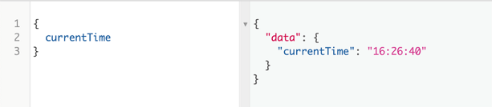
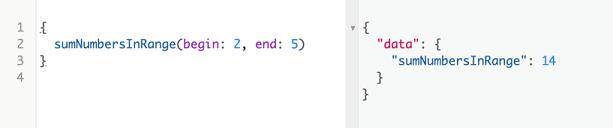
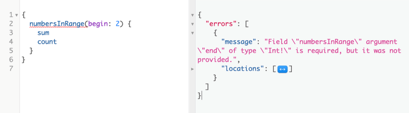
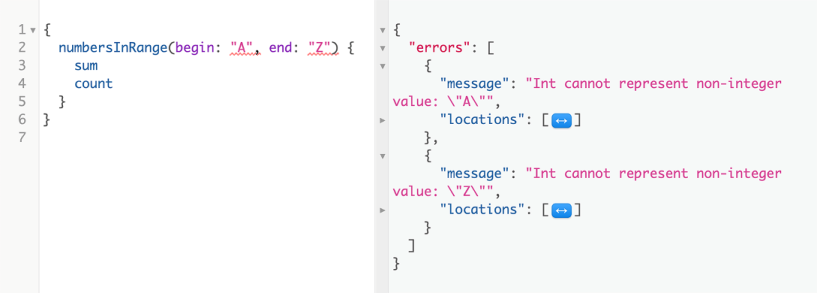
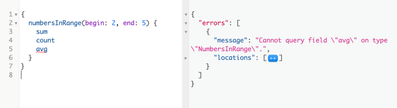
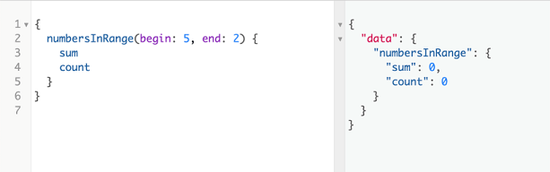
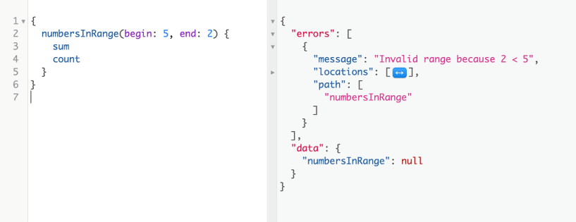
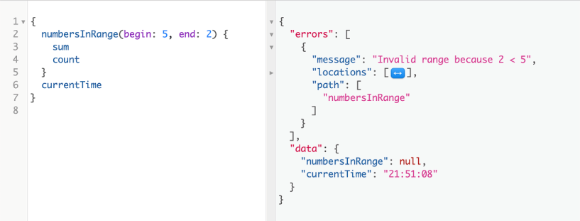
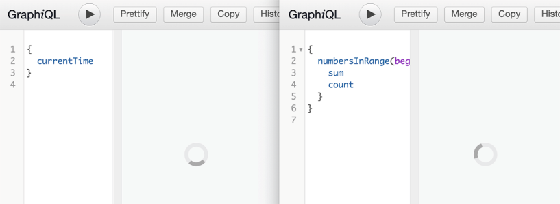
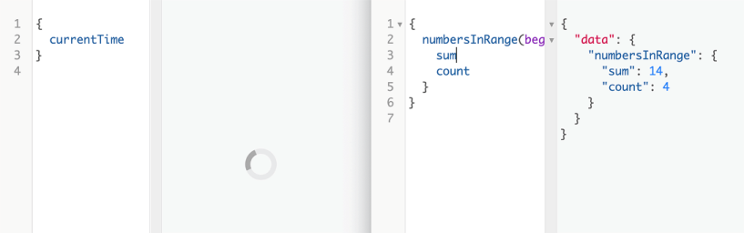

# 实施模式解析器
本章涵盖

- 将 Node.js 驱动程序用于 PostgreSQL 和 MongoDB
- 使用接口与 GraphQL 服务通信
- 使 GraphQL 模式可执行
  创建自定义对象类型和处理错误
- 在上一章中，我们设计了 GraphQL API 模式的结构并得出了其完整的 SDL 文本。 在第 5-8 章中，我们将使该模式可执行。 我们将使用 Node.js 数据库驱动程序和 GraphQL.js 实现，通过使用解析器函数来公开数据库中的实体。

## 5.1 运行开发环境

为了让你专注于本书项目中的 GraphQL 技能，我准备了一个 Git 存储库，其中包含你需要跟进项目的所有非 GraphQL 内容。 我们将在第 5-10 章中使用这个存储库。 它具有 API 服务器（我们将在第 5-8 章中构建）和 Web 服务器（我们将在第 9 和 10 章中构建）的框架。 克隆那个回购协议。

清单 5.1 克隆本书仓库的命令

```sh
git clone https://az.dev/gia-repo graphql-in-action
```

> **Node.js 和 Linux**
>
> 你需要在你的操作系统中安装现代版本的 Node.js 才能从这一点开始。 如果你没有 Node，或者如果你有旧版本（低于 12），请从 nodejs.org 下载最新版本并使用它。
> 需要对 Node.js 运行时有一定的了解。 你不需要成为 Node 的专家，但如果你以前从未使用过它，那么在继续本章之前学习它的基础知识会有所帮助。 我写了一本关于 Node 的简短介绍书，你可以在 az.dev/node-intro 上找到它。
> 本书中的所有命令都是针对 Linux 的。 它们也可以在 Mac 机器上工作，因为 macOS 是基于 Linux 的。 在 Microsoft Windows 上，你必须找到这些命令的本机等效项，或者你可以省去很多麻烦并使用适用于 Linux 的 Windows 子系统（请参阅 az.dev/wsl）。 如果那不是一个选项，你还可以在 VirtualBox 等虚拟硬件环境中运行 Linux 机器。
> 如果在 Microsoft Windows 上进行本机开发是你唯一的选择，我建议使用 PowerShell 而不是 CMD 命令。 大多数 Linux Bash shell 命令都适用于 PowerShell。
> 在使用基于节点的应用程序时，Microsoft Windows 并不是最佳选择。 Node 最初是为 Linux 设计的，它的许多内部优化都依赖于 Linux 原生 API。 Windows 对 Node 的支持在 Node 首次发布几年后开始，并且正在积极努力使其"更好"，但它永远不会像 Linux 的 Node 那样好。 在 Windows 上本地运行 Node 是一种选择，但它会给你带来麻烦。 如果你计划在 Windows 服务器上托管生产节点应用程序，则仅在 Windows 上进行本地开发。

克隆存储库会在你当前的工作目录下创建 graphql-in-action 目录。 在那里，第一步是安装 repo 使用的初始包。

清单 5.2 命令：安装 repo 依赖项

```sh
$ cd graphql-in-action
$ npm install
```

查看 package.json 文件以查看我添加的初始包。 这些包由 API 服务器（以及稍后的 Web 服务器）使用。 请注意，我提供了运行这两个服务器所需的脚本。

清单 5.3 在 package.json 中运行脚本

```json
{
  "name": "az.dev",
  "version": "0.0.1",
  "private": true,
  "scripts": {
  "scripts": {
    "start-dbs": "docker-compose -f dev-dbs/docker.yml up",                 ❶
    "api-server": "(cd api && nodemon -r esm src/server.js)",               ❷
    "web-server": "(cd web/src && rimraf .cache dist && parcel index.html)",❸
    "start-blank-dbs": "docker-compose -f dev-dbs/docker-blank.yml up"
  },
  },
  ·-·-·
 }
```

❶ 运行提供的 Docker 镜像的命令（在第 6 章中使用）
❷ 运行API服务器的命令（本章需要）
❸ 运行 web 服务器的命令（在第 9 章中使用）
提示你可以根据需要添加任意数量的 npm run 脚本，并且你应该将它们用于你希望引入项目的任何任务。 使用 npm run scripts，团队中的所有开发人员都可以以标准、一致的方式运行这些任务。

探索 repo，并注意它的三个目录：

- api 目录是第 5-8 章的重点。 这是我们放置 API 服务器实现逻辑的地方。 它有一个简单的 Express.js 服务器，配置了一个示例端点。 我还提供了整本书中使用的所有数据库配置和 SQL 语句。 四处看看。
- Web 目录是第 9-10 章的重点。 这是我们将在 Web 应用程序中使用 API 服务器的逻辑。 它有一个简单的 React 应用程序，配置了一些模拟数据。
- dev-dbs 目录包含与运行开发数据库服务器进行开发相关的所有内容。 你可以使用那里的文件来创建自己的数据库服务并使用示例数据加载它们，或者运行提供的现成 Docker 映像。 我们将在下一章中这样做。

> 提示鉴于 GraphQL 和本书中使用的其他库的快速变化的生态系统，配置和代码示例可能不适合你。 查看 az.dev/gia-updates 以查看你可能需要完成本书代码示例的任何更新。

### 5.1.1 Node.js 包

为了让 GraphQL 运行时服务与 PostgreSQL 和 MongoDB 等数据库进行通信，它需要一个驱动程序。 为此，我们将使用 Node 的 pg 和 mongodb 包。 这些不是唯一可以用作驱动程序的包，但它们是 Node 生态系统中最受欢迎的。 这些包公开 JavaScript API 来执行 PostgreSQL 和 MongoDB 的操作。 我们需要配置它们以连接到这些数据库服务。

对于托管项目 API 端点的 Web 服务器，我们将使用 Express.js。 我们还需要其他一些与 Express 相关的包。 所有这些包都已经安装在 repo 的起点。

要实现 GraphQL API 服务器，我们需要两个新包。

清单 5.4 命令：安装新的依赖项

```sh
$ npm install graphql express-graphql
```

graphql 包用于 GraphQL.js，即 GraphQL 的 JavaScript 实现。 它负责诸如验证和执行 GraphQL 操作之类的事情。

要使用 GraphQL 运行时，我们需要一个接口。 这就是 express-graphql 包派上用场的地方。 它有一个 HTTP(S) 侦听器功能，旨在与基于中间件的 Web 框架（如 Express）一起使用，并充当 GraphQL 模式的接口。

提示 尽管它名为 express-graphql，但这个包可以与任何支持连接式中间件（Hapi、Fastify 等）的 HTTP Web 框架一起使用。

### 5.1.2 环境变量

api目录下是一个.env文件，里面包含了我们在这个项目中需要的默认环境变量。 如果你不打算使用项目的任何默认值，则需要更改这些变量。 该文件是自动加载的，其变量在 api/src/config.js 中导出。

提示 .env 等环境文件通常不是源代码的一部分，因为它们需要在不同的机器和环境中有所不同。 为了简单起见，我在 repo 中包含了一个 .env 文件。

## 5.2 设置 GraphQL 运行时

我们现在可以开始实施项目的 GraphQL 运行时层。 让我们首先完成一个非常简单的示例，以便我们可以专注于测试运行时层设置并了解其核心动态。

假设我们正在创建一个 Web 应用程序，它需要知道服务器正在使用的确切当前时间（而不是依赖于客户端的时间）。 我们希望能够向 API 服务器发送查询请求，如下所示。

清单 5.5 查询服务器的当前时间

```js
{
  currentTime
}
```

为了响应这个查询，让我们让服务器使用 HH:MM:SS 格式的 ISO UTC 时间字符串。

清单 5.6 currentTime 响应的格式

```js
{
  currentTime: "20:32:55"
}
```

这是一个带有单个操作（查询操作）的简单 GraphQL 请求。 GraphQL 请求也可以有多个操作，并包含与这些操作相关的其他信息（例如，变量）。

为了让服务器完成这个当前时间通信，它需要

1. 为请求者提供一个接口来提供 GraphQL 请求。
2. 根据 GraphQL 语言规则解析提供的请求并确保它具有有效语法。
3. 使用模式验证请求。 你不能只在 GraphQL 服务器上运行任何请求：你只能运行其模式允许的请求。 服务器还需要验证是否提供了请求的所有必需部分。 例如，如果查询使用变量，则服务器需要验证它们的存在并确保它们具有正确的类型。 如果一个请求有多个操作，服务器需要验证该请求还包括应该为响应执行的操作的名称。
4. 将请求中的所有字段解析为标量数据元素。 如果请求是针对突变操作的，则服务器必须执行该突变的副作用。 如果请求是针对订阅操作的，则服务器必须打开一个通道以在数据更改发生时进行通信。
5. 收集响应的所有数据，并将其序列化为类似 JSON 的格式。 序列化响应需要包括请求结构及其解析数据（以及服务器遇到的任何错误）。
6. 为请求者提供一个接口来接收为其请求文本生成的响应文本。

所有这些任务都在服务器必须处理的所有 GraphQL 请求之间共享。 事实上，除了我使用斜体字的任务（模式和解析），所有其他任务都在所有 GraphQL 服务之间共享。 这意味着它们可以被抽象和重用。 我们不必为每项服务都做。

幸运的是，这已经完成了！ 除了处理模式和解析器之外，我们不必重新实现之前的任何步骤。 剩下的就是 GraphQL 实现（比如 GraphQL.js）出现的地方。

GraphQL 实现到底是什么？ 它基本上是用某种语言编写的代码来完成前六个步骤中描述的大部分工作。 它公开了自己的代码 API，你的代码可以使用这些 API 来执行 GraphQL 服务器所期望的通用行为。 在 JavaScript 中实现 GraphQL 的另一个例子是 Apollo Server，它包装了 GraphQL.js 并通过许多功能对其进行了增强，例如 SDL 优先实现和订阅就绪的传输通道。 我们将在第 10 章看到一个使用 Apollo Server 的例子。

作为 GraphQL 服务开发人员，你可以使用你选择的 GraphQL 实现来完成大部分繁重的工作，例如解析、验证和执行 GraphQL 请求。 这使你能够专注于应用程序逻辑细节。 你需要编写一个模式并想出应该如何解决该模式中的部分（作为数据和副作用）。 我们在前一章设计了 AZdev 模式，我们将在本章开始实现它的解析器。 然而，在我们这样做之前，让我们先完成简单的 currentTime 字段示例。

### 5.2.1 创建模式对象

对于第一个 GraphQL.js 示例，我们需要使用 graphql 包导出的两个函数：

- 从模式语言文本构建模式的 buildSchema 函数。
- graphql 函数，用于针对生成的模式执行 GraphQL 查询。 为避免混淆，我将其称为 graphql 执行器函数。

让我们创建两个文件：一个用于托管架构和解析器定义，另一个用于使用用户提供的查询文本执行架构。 为了使这个示例简单，我将使用命令行界面来读取用户的查询文本，而不是引入更具特色的用户界面（如 HTTP 服务器）。

在api/src下创建schema目录，将如下index.js文件放入其中。

清单 5.7 新文件：api/src/schema/index.js

```js
import { buildSchema } from 'graphql';
```

buildSchema 函数接受一个用 GraphQL 模式语言编写的字符串，它表示一组类型。 GraphQL 模式中的每个对象都必须具有显式类型。 这从模式提供的内容的根开始。 例如，要使模式接受一般查询，你需要定义特殊的查询类型。 要使架构在查询操作中接受 currentTime 字段，你需要将其添加到查询类型中并将其标记为字符串。

这是我们正在构建的简单示例模式的模式文本。

清单 5.8 api/src/schema/index.js 中的变化

```js
export const schema = buildSchema(`
  type Query {
    currentTime: String!
  }
`);
```

清单 5.8 中的字符串是模式语言文本。 请注意使用反引号允许在多行上显示文本。

执行 buildSchema 的结果是一个 JavaScript 对象，旨在与 graphql 执行器函数一起使用。

### 5.2.2 创建解析器函数

我们有一个模式，如果需要，我们可以根据它验证任何请求，但我们没有告诉 GraphQL 服务哪些数据与该模式中的 currentTime 字段相关联。 如果客户端请求该字段，服务器响应应该是什么？

这是解析器函数的工作。 模式中定义的每个字段都需要与解析器函数相关联。 当服务器返回该字段的数据时，它只会执行该字段的解析器函数，并使用该函数的返回值作为该字段的数据响应。

让我们创建一个对象来保存我们最终将拥有的许多解析器函数。 这是实现 currentTime 解析器逻辑的一种方法。

清单 5.9 api/src/schema/index.js 中的变化

```js
export const rootValue = {
  currentTime: () => {
    const isoString = new Date().toISOString();
    return isoString.slice(11, 19);              ❶
  },
};
```

❶ ISO 格式是固定的。 11-19 片是时间部分。
随着我们向 API 添加更多功能，此 rootValue 对象将具有更多功能。 它被命名为 rootValue 是因为 GraphQL.js 将它用作图的根。 rootValue 对象中的函数是图中顶级节点的解析器。

你可以在解析器函数中做任何你想做的事！ 例如，你可以查询数据库中的数据（这是我们需要为 AZdev API 做的）。

注意我导出了架构和 rootValue 对象。 服务器中的其他模块将需要导入和使用这些对象。

### 5.2.3 执行请求

schema 和 rootValue 对象是任何 GraphQL 服务中的核心元素。 你可以将它们与查询或突变的文本一起传递给 graphql 执行器函数，执行器将能够根据它们解析、验证、执行和返回数据。 这是我们下一步需要做的来测试 currentTime 字段。

graphql 执行器函数可用于此目的。 我们可以在 api/src/server.js 中测试它。 添加以下导入行。

注意 api/src/server.js 文件有一些注释掉的代码来启动一个简单的 express web 服务器。 你现在可以忽略这些评论。

清单 5.10 api/src/server.js 中的变化

```js
import { graphql } from 'graphql';
```

这个 graphql 执行器函数接受一个参数列表：第一个是模式对象，第二个是源请求（操作文本），第三个是解析器的 rootValue 对象。 这是你如何称呼它的示例。

清单 5.11 示例：graphql 执行器函数的签名

```js
graphql(schema, request, rootValue);
```

提示 graphql 执行器函数有更多可用于高级案例的位置参数。 但是，我们很快将使用 HTTP(S) 包装器来运行此函数而不是直接调用它，并且我们将在执行时使用命名参数。

graphql 执行器函数返回一个承诺。 在 JavaScript 中，我们可以通过在其前面放置关键字 await 并使用标有 async 关键字的函数包装代码来访问此承诺的已解析值。

清单 5.12 示例：async/await 模式

```js
async () => {
  const resp = await graphql(schema, request, rootValue);
};
```

> 注意 你不需要在任何地方添加标题以"Example:"为前缀的列表。

promise 解析为 JSON 中的 GraphQL 响应。 每个 GraphQL 响应都有一个数据属性，用于保存任何成功解析的数据元素（如果遇到错误，还有一个错误属性）。 让我们打印 resp.data 属性。

对于 graphql 执行器函数的三个参数，我们可以从之前处理的文件中导入 schema 和 rootValue 对象，但是我们从哪里得到请求文本呢？

请求文本是此 API 服务器的客户端将提供的内容。 他们最终会通过 HTTP(S) 通道执行此操作，但现在，我们可以直接从命令行将其作为参数读取。 我们将以这种方式测试 server.js 文件。

清单 5.13 命令：从命令行测试查询操作

```sh
$ node -r esm api/src/server.js "{ currentTime }"     ❶
```

❶ 此命令将在你实施下一个代码更改后生效。 -r esm 部分允许在旧版本的 Node.js 上使用 ECMAScript 模块。
对于此测试，请求文本是命令行中的第三个参数（对于 npm run 脚本）。 你可以使用 process.argv[2] 在任何 Node 脚本中捕获它。

> process.argv 数组
>
> 在 Node 中，process.argv 是一个简单的数组，其中包含命令行（运行进程）中每个位置标记的项目，从命令本身开始。 对于清单 5.13 中的命令，process.argv 是
> ["path/to/node/command", "api/src/server.js", "{ currentTime }"]

这是 api/src/server.js 中的完整代码片段，我们可以使用它来执行此测试。

清单 5.14 api/src/server.js 中的变化

```js
import { graphql } from 'graphql';
import { schema, rootValue } from './schema';
 
const executeGraphQLRequest = async request => {
  const resp = await graphql(schema, request, rootValue);
  console.log(resp.data);
};
 
executeGraphQLRequest(process.argv[2]);
// ·-·-·
```

我们只需导入准备好的模式和 rootValue，将 graphql 执行程序函数包装在异步函数中，然后使用 process.argv[2] 读取来自用户的 GraphQL 请求文本。

这个例子就完成了！ 你可以使用清单 5.13 中的命令对其进行测试，你应该会看到服务器以 UTC 格式报告时间：

```sh
$ node -r esm api/src/server.js "{ currentTime }"
[Object: null prototype] { currentTime: '18:35:10' }
```

> 提示 GraphQL.js 实现使用空原型对象进行数据响应。 这就是 [Object: null prototype] 是响应的一部分的原因。 Node 中的 console.log 函数会报告它何时看到它。 空原型对象通常更适合映射/列表，因为它们开始时是空的并且不继承任何默认属性。 例如，你可以执行 ({}).toString()，但你不能执行 Object.create(null).toString()。

> **当前代码**
>
> 你可以使用命令 git checkout 5.1 将你的本地仓库与代码中的当前进度同步（在 currentTime 测试之后）。
> 该命令的 5.1 部分是 Git 分支的名称。 克隆存储库时开始的分支名为 main。 你始终可以使用 checkout 命令返回到任何分支。 在我们检查下一个分支之前，你也可以在一个分支上进行自己的提交。 如果你愿意，这将使你能够使用 git diff 命令将你的工作与我的工作进行比较。
> 如果到目前为止你已经进行了任何本地更改，则需要在签出新分支之前提交或删除它们。 你还可以使用命令git add . && git stash.。

## 5.3 通过 HTTP 通信
在向该 API 添加更多字段之前，让我们使用一个比简单命令行更好的界面。 让我们通过 HTTP 与 GraphQL 服务通信。 为此，我们需要一个 HTTP 服务器。

提示 你应该在 HTTPS 服务后面托管你的 GraphQL 服务。 你可以使用 Node 创建 HTTPS 服务器，但更好的选择是使用 NGINX 等 Web 服务器（或 Cloudflare 等 Web 服务）来保护你的 HTTP 服务并使其仅可通过 HTTPS 使用。

我们将使用 express 包创建一个 HTTP 服务器，并使用 express-graphql 包将该服务器连接到我们目前拥有的 GraphQL 服务。

提示 作为参考，运行基本 Express 服务器的代码在 api/src/server.js 中被注释掉了。

删除 executeGraphQLRequest 函数和 graphql 执行器函数（在 api/src/server.js 中）。 相反，从 express-graphql 包中导入名为 export 的 graphqlHTTP。

清单 5.15 api/src/server.js 中的变化

```js
import { graphqlHTTP } from 'express-graphql';
import { schema, rootValue } from './schema';
 
// Uncomment the code to run a bare-bone Express server
 
import express from 'express';
import bodyParser from 'body-parser';
import cors from 'cors';
import morgan from 'morgan';
 
import * as config from './config';
 
async function main() {
  // ·-·-·
}
 
main();
```

快递包里默认export是一个函数。 要创建一个 Express 服务器，你只需调用该函数。 然后你可以在创建的服务器上使用 listen 方法让服务器监听某个端口上的传入连接。 该部分已经在主要功能中完成。

当你运行这段代码时，HTTP 服务器将侦听端口 4321。为了使服务器接受特定 HTTP URL/VERB 组合（如 GET /）的传入连接，我们需要添加一个 server.get 方法（或 .post， .put 或 .delete) 或使服务器接受特定 URL 的所有 HTTP 动词的通用 server.use 方法。

提供的主要功能有一个 server.get 调用的例子。 这是 server.VERB 方法的签名以及你可以在其中执行的操作的示例。

清单 5.16 示例：用于定义路由及其处理程序的 Express.js API

```js
server.use('/', (req, res, next) => {
  // Read something from req
  // Write something to res
  // Either end things here or call the next function
});
```

.use 方法的第一个参数是服务器将开始接受连接的 URL。 第二个参数是每次服务器接受该 URL 上的连接时将调用的函数。 这个函数通常被称为监听函数。

listener 函数将两个重要对象公开为参数，req 和 res（下一个对象通常不用于响应处理程序）：

- req 对象是服务如何从 HTTP 请求中读取信息。 例如，我们需要从使用此 API 的客户端读取查询/变更（和其他相关对象）的文本。 我们可以使用 req 来做到这一点。
- res 对象是服务如何用数据回复请求它的客户端。 这就是 API 服务器如何响应它为传入的 GraphQL 请求生成的数据。

在读取请求和写入响应之间，我们需要执行 graphql 执行器函数，就像我们在命令行测试中所做的那样。 每个 GraphQL 请求都会发生这种情况，这是另一个可以抽象和重用的通用过程。

我们从 express-graphql 导入的 graphqlHTTP 函数是一个侦听器函数，正是这样做的。 它将解析 HTTP 请求，运行 graphql 执行器函数，等待其响应，并将其解析的数据发送回请求者。 我们只需要告诉它使用什么模式和 rootValue 对象。

这是连接到 graphqlHTTP 函数的 .use 方法。 将它放在 api/src/server.js 中，替换提供的示例 server.use('/') 调用。

清单 5.17 api/src/server.js 中的变化

```js
// ·-·-·
 
async function main() {
  // ·-·-·
 
  // Replace the example server.use call with:
  server.use(
    '/',
    graphqlHTTP({
      schema,
      rootValue,
      graphiql: true,
    })
  );
 
  server.listen(config.port, () => {
    console.log(`Server URL: http://localhost:${config.port}/`);
  });
}
 
main();
```

这将允许我们通过 HTTP 与模式通信。 不仅如此，通过在配置对象中使用 graphiql: true，我们还将获得安装在该 URL 上的强大的 GraphiQL 编辑器，它将与我们的模式一起工作！

提示 graphqlHTTP 函数调用返回一个需要 req/res 参数的处理函数。 这与 use 方法的处理函数（它的第二个参数）所需的签名相匹配。

让我们测试一下。 使用以下命令启动 API 服务器。

清单 5.18 命令：运行 API 服务器

```sh
$ npm run api-server
```

你应该会看到此消息：

```sh
Server URL: http://localhost:4321/
```

然后前往 http://localhost:4321/。 你应该会看到 GraphiQL 编辑器，并且你应该能够在其中测试 currentTime 字段查询，如图 5.1 所示。



图 5.1 express-graphql 内置了 GraphiQL 编辑器。

注意 API 服务器配置为使用 nodemon 命令而不是 node 命令运行。 nodemon 在监视文件更改的同时运行节点进程，并在检测到文件更改时自动重新启动该节点进程。 每当你在 api 目录中保存任何文件时，这都会使 API 服务器自动重启。

请注意，与服务器通信的整个 HTTP 通道与 GraphQL 服务无关。 它只是另一个服务层，提供了一种与 GraphQL 服务层通信的便捷方式。 Web 应用程序现在可以使用 Ajax 请求从 GraphQL 服务检索数据。 在大规模 GraphQL API 服务中，这个 HTTP 通信层将是一个单独的实体，可以独立管理和扩展。

提示你可以在生产环境中关闭 GraphiQL 编辑器（如果你愿意）并使用 .post 而不是 .use 作为 graphqlHTTP 处理程序。 这样，该服务将只适用于 Ajax post 请求。

> 当前代码
>
> 使用 git checkout 5.2 将你的本地存储库重置为代码中的当前进度。

## 5.4 使用构造函数对象构建模式
GraphQL 模式语言是描述 GraphQL 模式的一种与编程语言无关的好方法。 它是一种易于使用的人类可读格式，也是描述 GraphQL 模式的流行、首选格式。 但是，它有一些限制。

GraphQL.js 有另一种格式，可用于创建 GraphQL 模式及其各种类型。 你可以使用通过调用各种构造函数实例化的 JavaScript 对象，而不是使用模式语言编写的文本。 例如，你可以使用 GraphQLSchema 构造函数创建模式对象，使用 GraphQLObjectType 构造函数创建对象类型，使用 GraphQLUnionType 创建联合类型，以及更多类似的类。

如果你需要以编程方式构建模式，则此格式很有用。 它更灵活，更易于测试、管理和扩展。

注意 使用对象创建 GraphQL 模式的方法没有一个普遍认可的名称。 我听说过"代码优先"和"解析器优先"，但我认为这些名称并不能完全代表该方法。 我将在本书中将其称为基于对象的方法。

让我们通过转换我们目前拥有的架构（仅支持 currentTime 字段）来开始探索这种基于对象的方法。

### 5.4.1 查询类型

由于我们现在要使用基于对象的方法来构建模式，因此你可以删除 api/src/schema/index.js 中的所有内容。

要使用此方法创建 GraphQL 模式，我们需要从 graphql 包中导入一些对象，如下所示。

清单 5.19 替换 api/src/schema/index.js 中内容的新代码

```js
import {
  GraphQLSchema,
  GraphQLObjectType,
  GraphQLString,
  GraphQLInt,
  GraphQLNonNull,
} from 'graphql';
```

这些基于类型的对象旨在协同工作以帮助我们创建模式。 例如，要实例化一个模式对象，你只需执行类似这样的操作。

清单 5.20 示例：创建模式对象

```js
const schema = new GraphQLSchema({
  query: new GraphQLObjectType({
    name: 'Query',
    fields: {
      // Root query fields are defined here
    }
  }),
});
```

这些对 GraphQLSchema 和 GraphQLObjectType 的调用返回设计用于与 graphql 执行器函数一起工作的特殊对象。

让我们将其提取到自己的变量中，而不是内联对 GraphQLObjectType 的调用。 我将其命名为 QueryType。 在这个类型的 fields 属性中，我们需要添加 currentTime 字段，指定它的类型，并包含它的解析器函数。 这是代码。

清单 5.21 api/src/schema/index.js 的变化

```js
const QueryType = new GraphQLObjectType({
  name: 'Query',
  fields: {
    currentTime: {
      type: GraphQLString,
      resolve: () => {
        const isoString = new Date().toISOString();
        return isoString.slice(11, 19);
      },
    },
  },
});
 
export const schema = new GraphQLSchema({
  query: QueryType,
});
```

提示 不要死记硬背这些构造函数和类型助手的使用方法。 只需了解并保留他们的能力以及他们使你能够做的事情。

对象类型具有名称和字段列表（用对象表示）。 每个字段都有一个类型属性和一个解析函数。

此代码映射到我们之前的模式语言版本。 我们只是用对象而不是字符串来做这件事。 与 currentTime:String 不同，此方法需要定义一个属性 currentTime 并为其提供一个类型为 GraphQLString 的配置对象。 我们定义了一个 resolve 函数，而不是 rootValue 对象。

resolve 函数与我们在 rootValue 对象下的函数相同，但现在它是 schema 对象的一部分。 使用基于对象的方法，我们不需要 rootValue 对象，因为所有解析器都包含在需要它们的地方以及它们的字段中。 使用 GraphQLSchema 创建的模式对象本身是可执行的。

我为 currentTime 使用了 GraphQLString 标量类型。 GraphQL.js 实现提供了一些类似的标量类型，包括 GraphQLInt、GraphQLBoolean 和 GraphQLFloat。

要测试此代码，我们需要从 api/src/server.js 中删除 rootValue 概念。

清单 5.22 api/src/server.js 中的变化

```js
// ·-·-·
import { schema } from './schema';
// ·-·-·
 
async function main() {
  // ·-·-·
  server.use(
    '/',
    graphqlHTTP({
      schema,
      graphiql: true,    ❶
    }),
  );
  server.listen(config.port, () => {
    console.log(`Server URL: http://localhost:${config.port}/`);
  });
}
 
main();
```

❶ 移除 rootValue 对象
而已。 你可以在 GraphiQL 中测试该服务是否支持 currentTime 字段，但现在使用基于对象的方法。

> **当前代码**
>
> 使用 git checkout 5.3 将你的本地存储库重置为代码中的当前进度。

### 5.4.2 字段参数

为了进一步探索 GraphQL.js API，让我们看一个范围更大的示例。 让我们让 API 支持一个 sumNumbersInRange 字段，该字段接受表示数字范围的两个参数（开始和结束）并返回该范围内所有整数的总和（包括其边缘）。 图 5.2 显示了所需的最终结果。



图 5.2 sumNumbersInRange 字段

下面是 sumNumbersInRange 字段的简单实现。 将此添加到 QueryType 的字段属性。

清单 5.23 api/src/schema/index.js 的变化

```js
fields: {
    // ·-·-·
 
    sumNumbersInRange: {
      type: new GraphQLNonNull(GraphQLInt),
      args: {
        begin: { type: new GraphQLNonNull(GraphQLInt) },
        end: { type: new GraphQLNonNull(GraphQLInt) },
      },
      resolve: function (source, { begin, end }) {
        let sum = 0;
        for (let i = begin; i <= end; i++) {
          sum += i;
        }
        return sum;
      },
    },
  },
```

sumNumbersInRange 字段具有新的 GraphQLNonNull(GraphQLInt) 类型。 围绕此整数类型的 GraphQLNonNull 包装器指示此字段将始终有一个值。 查询中 sumNumbersInRange 字段的响应永远不会为空。

sumNumbersInRange 的定义包括一个 args 属性来定义它接受的参数的结构及其类型（我也使用 new GraphQLNonNull(GraphQLInt) 定义）。 这两个参数都是必需的。 客户端不能在不指定该范围的开始和结束数字的情况下请求 sumNumbersInRange 字段。 如果发生这种情况，GraphQL 服务将抛出错误。

sumNumbersInRange 的解析器函数使用它的参数。 第一个参数始终是该解析级别的源父对象。 对于 sumNumbersInRange，没有父对象，因为它是根字段。 resolve 函数的第二个参数公开了 API 使用者定义的字段参数值。 我从该论点解构了开始和结束，因为这两个值都是必需的。

解析器函数简单地遍历范围，计算总和，然后返回它。 使用以下查询来测试此 API 现在支持的新字段。

清单 5.24 sumNumbersInRange 叶字段

```js
{
  sumNumbersInRange(begin: 2, end: 5)
}
```

请注意，sumNumbersInRange 字段没有子选择集，因为它是一个解析为标量值的叶字段。 但是，要了解自定义对象类型，接下来我们将其更改为需要子选择集的非叶字段。

注意 GraphQLNonNull helper 是 GraphQL.js 指定类型修饰符的方式，相当于模式语言中的感叹号。 添加方括号以构成列表的等效项是 GraphQLList 类型修饰符。 例如，要定义一个表示字符串数组的字段，类型将为 new GraphQLList(GraphQLString)。

### 5.4.3 自定义对象类型

到目前为止，我们已经创建了一个对象类型来表示查询类型下的根字段。 要探索使用自定义对象类型，让我们将 sumNumbersInRange 叶字段替换为支持相同开始和结束参数的 numbersInRange 对象字段，并让它支持两个叶字段来计算范围内所有数字的总和和计数。

以下是查询新 numbersInRange 字段的方式。

清单 5.25 numbersInRange 字段

```js
{
  numbersInRange(begin: 2, end: 5) {
    sum
    count
  }
}
```

为了实现这一点，我们需要定义一个自定义对象类型来表示新的"范围内的数字"结构，它看起来像一个具有 sum 和 count 属性的对象。 我们将其命名为 NumbersInRange。

为了组织 GraphQL 对象类型的代码，让我们为每个对象创建一个文件，从 numbersInRange 字段的这个新类型开始。

创建一个新目录 api/src/schema/types，并在那里创建一个 numbers-in-range.js 文件来实现 NumbersInRange 类型。

清单 5.26 新文件：api/src/schema/types/numbers-in-range.js

```js
import {
  GraphQLObjectType,
  GraphQLInt,
  GraphQLNonNull,
} from 'graphql';
 
const NumbersInRange = new GraphQLObjectType({
  name: 'NumbersInRange',
  description: 'Aggregate info on a range of numbers',
  fields: {
    sum: {
      type: new GraphQLNonNull(GraphQLInt),
    },
    count: {
      type: new GraphQLNonNull(GraphQLInt),
    },
  },
});
 
export default NumbersInRange;
```

除了 name 属性之外，我们还可以为每个类型提供一个可选的 description 属性来描述该类型。 当在主模式中使用新的 NumbersInRange 类型时，这两个都将显示在 GraphiQL 的文档资源管理器中。

提示你可以在这些描述属性中使用 Markdown 等富文本格式，然后让客户端工具以更易读的方式呈现它们。 GraphiQL 支持在开箱即用的描述中呈现 Markdown！

请注意，NumbersInRange 类型中的总和和计数字段没有解析器函数。 尽管此设计对叶字段求和和计数，但为它们提供解析器函数是可选的。 这是因为这些叶字段可以根据在其父源对象上定义的属性使用默认的简单解析器。 为此，解析为父对象的对象（属于 NumbersInRange 类型）必须响应 sum 和 count 方法。

让我们创建一个以 begin 和 end 作为参数的函数，计算 sum/count，并返回一个具有 sum 和 count 属性的对象。 这是实现它的一种方法（你可以将此代码放在 api/src/utils.js 文件中）。

清单 5.27 api/src/utils.js 中的变化

```js
// ·-·-·
 
export const numbersInRangeObject = (begin, end) => {
  let sum = 0;
  let count = 0;
  for (let i = begin; i <= end; i++) {
    sum += i;
    count++;
  }
  return { sum, count };
};
```

提示 有一种更好的方法可以在不使用循环的情况下计算一个范围内连续数字的个数和总和：你可以使用等差级数公式。 为了简单起见，我使用了一个循环。

现在我们需要更改 QueryType 对象。 它有一个名为 numbersInRange 的非叶字段，该字段需要通过调用 numbersInRangeObject 辅助函数返回的对象来解析。

清单 5.28 api/src/schema/index.js 中的变化

```js
// ·-·-·
import NumbersInRange from './types/numbers-in-range';
import { numbersInRangeObject } from '../utils';
 
const QueryType = new GraphQLObjectType({
  name: 'Query',
  fields: {
    // ·-·-·
 
    // Remove the sumNumbersInRange field
 
    numbersInRange: {
      type: NumbersInRange,
      args: {
        begin: { type: new GraphQLNonNull(GraphQLInt) },
        end: { type: new GraphQLNonNull(GraphQLInt) },
      },
      resolve: function (source, { begin, end }) {
        return numbersInRangeObject(begin, end);
      },
    },
  },
});
// ·-·-·
```

而已。 如果你现在测试 API，你应该能够执行如下查询：

```js
{
  numbersInRange(begin: 2, end: 5) {
    sum
    count
  }
}
```

你会得到这样的回应：

```js
{
  "data": {
    "numbersInRange": {
      "sum": 14,
      "count": 4
    }
  }
}
```

> **挑战**
>
> 向 NumbersInRange 类型添加一个 avg 字段，并使其返回总和除以计数。

### 5.4.4 自定义错误

GraphQL 执行器自动处理任何无效查询或用于查询参数的类型。 例如，如果你省略了一个必需的参数，你将得到如图 5.3 所示的错误。 如果你使用字符串而不是整数作为开始和结束，你会得到如图 5.4 所示的错误。 如果你试图查询一个不存在的叶子字段，你会得到如图 5.5 所示的错误。



图 5.3 所有必需的参数都必须出现在请求中。



图 5.4 只接受正确的数据类型。




图 5.5 只能使用模式发布的字段。

这就是强类型模式的强大之处。 你开箱即用地获得了许多很好的验证，但是自定义案例呢？ 如果请求者为 numbersInRange 字段指定了无效范围（例如，使用小于开始值的结束值），会发生什么情况？ API 目前忽略这种情况，只返回零，如图 5.6 所示。




图 5.6 出错还是不出错？

让我们解决这个问题。 让我们更改 API 以拒绝此输入，而不是返回零，而是将自定义错误消息返回给请求者。 如果范围无效，则应让请求者知道这一事实，否则，错误可能会潜入代码中。

我们在 numbersInRange 字段的解析器函数中进行检查，并使用我们的自定义消息抛出错误。

清单 5.29 api/src/utils.js 中的变化

```js
export const numbersInRangeObject = (begin, end) => {
  if (end < begin) {
    throw Error(`Invalid range because ${end} < ${begin}`);
  }
  // ·-·-·
};
```

现在，如果你尝试进行无效的范围查询，你会得到如图 5.7 所示的消息。



图 5.7 响应中的自定义错误消息

请注意，错误再次作为 JSON 响应的一部分传递（而不是通过 HTTP 错误代码，例如）。 在某些情况下，JSON 响应可能既有错误又有未受错误影响的部分数据。 你可以通过将 currentTime 字段包含在 numbersInRange 范围错误的查询中来测试它； 见图 5.8。



图 5.8 响应既有错误又有数据。

你是否注意到我如何在清单 5.28 中使 numbersInRange 字段可为空？ 对于这种特殊情况，当它使用的范围无效时，响应中可能会缺少 numbersInRange 字段。 这是另一个可以为空性的例子，因为我给它附加了语义。 此外，由于 numbersInRange 是一个根字段，使其不可为 null 将防止在范围内出现错误时在其他根字段（如 currentTime）中产生部分响应。

## 5.5 从基于对象的模式生成 SDL 文本
我们使用基于对象的方法创建的可执行模式对象可以使用 printSchema 函数转换为模式语言格式，这是我们可以从 graphql 包导入的另一个函数。 我们调用它并传入可执行模式对象（由 api/src/schema/index.js 导出的对象）作为参数。

清单 5.30 api/src/schema/index.js 中的变化

```js
import {
  // ·-·-·
  printSchema,
} from 'graphql';
// ·-·-·
 
export const schema = new GraphQLSchema({
  query: QueryType,
});
console.log(printSchema(schema));
```

这就是你会看到的。

清单 5.31 printSchema 的输出

```js
type Query {
  currentTime: String
  numbersInRange(begin: Int!, end: Int!): NumbersInRange
}
"""Aggregate info on a range of numbers"""
type NumbersInRange {
  sum: Int!
  count: Int!
}
```

这是没有解析器函数的模式表示，但它更加简洁和可读。 关于此转换，我最喜欢的部分是如何以模式语言格式定义 numbersInRange 字段的参数：

```js
(begin: Int!, end: Int!)
```

将其与：

```js
args: {
  begin: { type: new GraphQLNonNull(GraphQLInt) },
  end: { type: new GraphQLNonNull(GraphQLInt) },
},
```

请注意，NumbersInRange 的描述就包含在它的前面，用一组三个双引号括起来。 这是我们目前拥有的 API 的一个描述良好的版本示例。

清单 5.32 示例：使用 SDL 中的描述

```js
"""The root query entry point for the API"""
type Query {
  "The current time in ISO UTC"
  currentTime: String
 
  """
  An object representing a range of whole numbers
  from "begin" to "end" inclusive to the edges
  """
  numbersInRange(
    "The number to begin the range"
    begin: Int!,
    "The number to end the range"
    end: Int!
  ): NumbersInRange!
}
"""Aggregate info on a range of numbers"""
 type NumbersInRange {
  "Sum of all whole numbers in the range"
  sum: Int!
  "Count of all whole numbers in the range"
  count: Int!
}
```

> **当前代码**
>
> 使用 git checkout 5.4 将你的本地存储库重置为代码中的当前进度。

### 5.5.1 模式语言与基于对象的方法
模式语言使前端开发人员能够参与 API 的设计，更重要的是，可以立即开始使用它的模拟版本。 你团队中的前端人员绝对会喜欢它。 它使他们能够参与 API 的设计，更重要的是，他们可以立即开始使用它的模拟版本。 模式语言文本可以作为 API 文档的早期版本。

然而，完全依赖全模式文本来创建 GraphQL 模式有一些缺点。 你需要付出一些努力来使代码模块化和清晰，并且你必须依靠编码模式和工具来保持模式语言文本与解析器树（又名解析器映射）一致。 这些都是可以解决的问题。

我看到的全模式方法的最大问题是你在代码中失去了一些灵活性。 你的所有类型都必须以依赖于模式语言文本的特定方式编写。 你不能在需要时使用构造函数来创建某些类型。 你被锁定在这种基于字符串的方法中。 尽管模式语言文本使你的类型更具可读性，但在许多情况下，你需要灵活性而不是可读性。

基于对象的方法灵活且易于扩展和管理。 它不会遇到我刚才提到的任何问题。 你的代码将与它一起模块化，因为你的架构将是一堆对象。 你也不需要合并模块，因为这些对象被设计为像树一样工作。

我看到的基于对象的方法的唯一问题是，你必须处理更多代码，围绕模块中需要管理的重要内容（类型和解析器）。 许多开发人员将其视为噪音，我不怪他们。

如果你正在创建一个小型的、定义良好的 GraphQL 服务，那么使用 full-schema-string 方法可能没问题。 然而，在更大、更敏捷的项目中，我认为更灵活、更强大的基于对象的方法是可行的方法。

提示 即使你使用基于对象的方法，你仍然应该使用模式语言文本。 例如，在 jsComplete.com，我们使用基于对象的方法，但每次构建模式时，我们都使用 printSchema 函数将完整的模式写入文件。 我们在项目的 Git 存储库中提交并跟踪该文件，这已被证明是一种非常有用的做法！

## 5.6 使用异步函数

到目前为止，我们在这个例子中的两个字段都映射到一个普通的同步解析器。 但是，如果一个字段需要做很多工作来解析它的数据，它应该使用异步解析器，否则整个 API 服务将被阻塞，无法为其他请求提供服务。

为了演示这个问题，让我们假装延迟处理 currentTime 字段。 JavaScript 没有休眠函数，但是很容易通过比较日期来完成类似的事情。 这是使 currentTime 解析器函数同步完成需要 5 秒的一种方法。

清单 5.33 延迟从 currentTime 返回 5 秒

```js
currentTime: {
  type: GraphQLString,
  resolve: () => {
    const sleepToDate = new Date(new Date().getTime() + 5000);
    while (sleepToDate > new Date()) {
      // sleep 
    }
    const isoString = new Date().toISOString();
    return isoString.slice(11, 19);
  },
},
```

现在，每次你请求 currentTime 字段时，服务器都会花 5 秒钟什么都不做，然后返回答案。 问题是在这 5 秒内，服务器的整个节点进程完全阻塞。 在第一个请求中的 while 循环完成之前，第二个请求者无法从 API 获取任何数据（见图 5.9）。



图 5.9 第二个请求（右侧）正在等待第一个请求。

你永远不应该那样做。 相反，所有长时间运行的进程都应该使用 Node 及其许多包提供的本机 API 异步完成，或者通过将工作分叉到工作线程/进程来完成。

例如，要使 currentTime 字段假延迟其响应 5 秒但异步执行，我们可以使用 setTimeout 方法并将其包装在 promise 对象中。

清单 5.34 替换现有代码

```js
currentTime: {
  type: GraphQLString,
  resolve: () => {
    return new Promise(resolve => {      ❶
      setTimeout(() => {
        const isoString = new Date().toISOString();
        resolve(isoString.slice(11, 19));
      }, 5000);
    });
  },
};
```

❶ Resolver 函数支持返回一个 promise 对象。
注意我们不需要等待这个承诺。 解析器函数可以返回一个承诺，执行者将等待该承诺并使用其数据。 此行为内置于 GraphQL.js 实现中。

这样一改，每次向API服务询问currentTime字段，5秒后依然会回复，但不会阻塞服务进程！ 其他请求者可以请求 API 的其他部分，并在请求者等待 currentTime 时立即得到响应（见图 5.10）。



图 5.10 第二个请求者（右侧）可以在第一个请求者等待时得到响应。

当我们处理来自数据库的对象时，这将非常方便，因为我们绝对应该使用异步 API 来与所有数据库进行所有通信。

我想我们已经准备好这样做了！

> **当前代码**
>
> 为了你的参考，我将当前时间同步与异步示例的代码放在它自己的 Git 分支中。 你可以使用命令 git checkout 5.T1 查看该代码。
> 我没有将此示例包含在当前的 5.4 分支中（你可以使用命令 git checkout 5.4 返回到该分支）。

## 概括

- GraphQL 服务以模式概念为中心，模式可通过解析器函数执行。
- 像 GraphQL.js 这样的 GraphQL 实现负责处理与可执行模式相关的一般任务。
- 你可以使用任何通信接口与 GraphQL 服务进行交互。 HTTP(S) 是为 Web 和移动应用程序设计的 GraphQL 服务的流行选择。
- 你可以使用 GraphQL.js 辅助函数（如 buildSchema 和 printSchema）从一种模式表示转换为另一种模式表示。
- 你不应该同步执行长时间运行的进程，因为这样做会阻止所有客户端的 GraphQL 服务进程。 GraphQL.js 实现中的解析器函数可以开箱即用地处理基于承诺的异步操作。