# 使用关系型数据库模型
本章涵盖

- 为数据库模型创建对象类型
- 定义所有解析器共享的全局上下文
- 从数据库模型解析字段并转换它们的名称和值
- 解决一对一和一对多关系
- 使用数据库视图和连接语句

现在你已经了解了构建简单"静态"模式的核心概念以及如何解析其字段，是时候开始学习如何解析数据库中的字段了。 是时候执行 AZdev API 的查询了。 我们将在第 4 章中设计它们时一一介绍它们，并在使用它们时学习我们需要的概念。

> 当前代码
>
> 使用 git checkout 6.0 将你的本地存储库重置为代码中的当前进度。 如果你需要存储任何本地更改，请使用 git add 。 && git 存储。 请记住运行 npm install 以安装任何缺少的依赖项。

## 6.1 运行并连接到数据库

使用示例数据启动和运行该项目的数据库的最简单方法是使用 Docker。 Docker 使用你的操作系统虚拟化来提供打包容器中的软件。 它在所有三个主要操作系统上都可用。

我为这个项目准备了两个 Docker 容器：一个用于 PostgreSQL，一个用于 MongoDB。 他们都创建了数据库结构并导入了示例数据。 如果你是 Docker 的新手，不用担心。 这真的很简单。 你所需要做的就是在你的操作系统上安装 Docker Desktop (az.dev/docker) 并让它在后台运行。

注意 如果你想为项目使用自己的数据库服务，你可以执行 dev-dbs/schema.* 文件来创建数据库实体并加载示例数据。

Docker 运行后，你可以运行此命令来启动这两个数据库。

清单 6.1 命令：启动数据库服务器

```sh
$ npm run start-dbs
```

第一次运行此命令会花费一些时间，因为它会将两个容器下载到你的计算机上。 它还将启动这些容器并在其默认端口上公开数据库。 PostgreSQL 将在端口 5432 上运行，而 MongoDB 将在端口 27017 上运行。

注意我还提供了一个 Docker 文件来下载和运行干净的空白数据库，如果你想完成创建数据库模式并使用示例数据加载它的步骤。

在所有表和集合中都有样本数据是开始的好方法，使我们能够在处理 GraphQL 突变之前测试 GraphQL 查询！ 确保以某种方式在所有数据库表中获得一些真实的数据。

查看 ```dev-dbs/schema.*``` 文件，并验证我们在第 4 章中设计的表和集合的结构。注意我为示例数据准备的插入语句。

> 提示 ```dev-dbs/schema.sql``` 文件使用 pgcrypto 扩展来管理用户表中密码和令牌的散列。 你可以在 ```az.dev/pgcrypto``` 阅读此扩展的文档。

如果数据库服务器成功运行，你应该有六个任务及其方法，并在 MongoDB 中为每个方法提供一些额外的动态数据元素。 使用以下 SQL 查询查看 PostgreSQL 中的数据。

清单 6.2 在 psql 中：读取数据的查询

```sql
SELECT * FROM azdev.users;
 
SELECT * FROM azdev.tasks;
 
SELECT * FROM azdev.approaches;
```

对于MongoDB中的数据，可以使用这个find命令。

清单 6.3 在 mongo 中：读取方法数据的命令

```sql
db.approachDetails.find({});
```

提示你可以使用数据库 GUI 检查数据库并确保它们加载了示例数据。 在我的 Mac 上，我使用 Postico for PostgreSQL (az.dev/postico) 和 Robo 3T for MongoDB (az.dev/robo)。

在客户端可以在数据库上执行命令并从中检索数据之前，它需要连接到数据库。 有许多方法可以从节点驱动程序连接到 PostgreSQL 和 MongoDB。 我们可以在 pg 驱动程序中为每个 SQL 语句执行一次性连接，但更好的方法是让驱动程序管理一个打开的连接池并根据需要重用它们（图 6.1）。 两个驱动程序都支持这种模式。

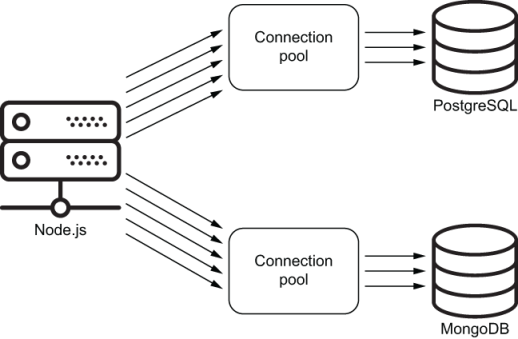

图 6.1 保持数据库的开放连接池

连接这些数据库的代码已经在 api/src/db/ 下准备好了。 查看 pg-client.js 和 mongo-client.js，看看是否需要做一些不同的事情。 如果项目的本地副本无法连接到数据库，这两个文件是你需要开始进行故障排除的地方。

请注意，我通过计算表/集合的数量来测试与两个数据库的连接。 此步骤是可选的，但它会在服务器启动时验证连接是否成功。

提示 请注意，我让两个数据库客户端模块（在 api/src/db 下）返回一个具有相似目的的对象。 我发现这种规范化对项目中打算做类似事情的实体很有帮助。

## 6.2 taskMainList查询

为了能够在 GraphQL 模式中使用任务记录，我们需要为这些记录定义一个新的自定义类型，就像我们在将 numbersInRange 从叶字段转换为非叶字段时所做的那样。 我们需要为 AZdev API 中的每个实体创建自定义类型：任务类型、方法类型和用户类型。

让我们从实现主要任务类型开始。 这是我们为它准备的 SDL 文本。

清单 6.4 任务类型

```js
type Task implements SearchResultItem {
  id: ID!
  createdAt: String!
  content: String!
  tags: [String!]!
  approachCount: Int!
 
  # author: User!
  # approachList: [Approach!]!
}
```

将使用此任务类型的第一个查询字段是将显示在 AZdev 应用程序主页上的最新任务列表。 我们将该字段命名为 taskMainList。

清单 6.5 在 Query 的 taskMainList 字段中使用 Task 类型

```js
type Query {
  taskMainList: [Task!]
}
```

为了按正确的顺序学习这些概念，让我们从该类型下的五个简单标量叶字段开始：id、content、tags、approachCount 和 createdAt。

这是一个 GraphQL 查询，我们可以使用它来开始测试此功能。

清单 6.6 taskMainList 查询

```js
query {
  taskMainList {
    id
    content
    tags
    approachCount
    createdAt
  }
}
```

此查询应返回一组任务记录。 该数组中的每一项都是一个具有五个属性的对象，其值将来自 PostgreSQL azdev.tasks 表（其列与五个字段名称匹配）。 让我们用尽可能简单的代码来实现这个特性，并在我们天真地让它工作后改进它。 正如肯特贝克所说，"让它发挥作用。 改正它。 快一点。"

要实现此功能，我们需要遵循以下三个步骤：

定义一个名为 Task 的新对象类型，它具有五个标量字段。
为任务类型编写任何非默认解析器。 我们必须对 created_at 数据库列进行日期到字符串的转换。 我们还决定将 tags GraphQL 字段公开为字符串数组，而不是数据库中以逗号分隔的字符串值。
修改 Query 类型以包含一个名为 taskMainList 的字段，该字段是非空任务项的列表，并使用 azdev.tasks 表中的记录数组解析它。
让我们从定义任务类型开始。

### 6.2.1 定义对象类型

这是新任务类型的可能实现（没有任何解析器）。 把它放在 api/src/schema/types/task.js 下。

清单 6.7 新文件：api/src/schema/types/task.js

```js
import {
  GraphQLID,
  GraphQLObjectType,
  GraphQLString,
  GraphQLInt,
  GraphQLNonNull,
  GraphQLList,
} from 'graphql';
 
const Task = new GraphQLObjectType({
  name: 'Task',
  fields: {
    id: { type: new GraphQLNonNull(GraphQLID) },
    content: { type: new GraphQLNonNull(GraphQLString) },
    tags: {
      type: new GraphQLNonNull(
        new GraphQLList(new GraphQLNonNull(GraphQLString))
      ),
    },
    approachCount: { type: new GraphQLNonNull(GraphQLInt) },
    createdAt: { type: new GraphQLNonNull(GraphQLString) },
  },
});
 
export default Task;
```

这里的 Task 对象只是清单 6.4 中 SDL 文本的直接翻译。 SDL 版本中的六行代码是所有基于对象的方法样板代码的三倍多。 最糟糕的部分可能是标签字段的类型。 简单的 [String!]! 必须用三个函数的嵌套调用来编写：

```js
new GraphQLNonNull(
  new GraphQLList(
    new GraphQLNonNull(
      GraphQLString
    )
  )
)
```

毫无疑问，SDL 文本是呈现这种类型的更好方式。 这就是为什么创建了许多工具来支持基于类型和其他元素的 SDL 文本构建 GraphQL 模式的原因。 GraphQL.js 的 buildSchema 函数本身因这些工具而普及。 一些工具扩展了 SDL 语法，可以将基于 SDL 的模式模块化为许多部分。 引入了其他工具来合并多个基于 SDL 的模式并解决它们之间的任何冲突。 这些工具很有用并且有实际用途，但我希望本书只专注于 GraphQL.js 实现并使用本机支持的基于对象的方法。

> 将 SDL 与基于对象的方法结合使用
>
> 将来，GraphQL.js 实现可能会支持一个 API，允许你使用基于对象的方法使用 SDL 文本（所以这不是一种方式）。
> 我编写了一个包，它使用当前的 GraphQL.js 实现实现了类似的方法。 我将其命名为 graphql-makers，你可以在 jscomplete .com/graphql-makers 上阅读相关信息。

### 6.2.2 上下文对象

下一步是修改查询类型以包含 taskMainList 字段。 该字段是一个非空项目列表，其中每个项目都具有清单 6.4 中介绍的任务类型。 这意味着 taskMainList 字段的类型应该是 new GraphQLList(new GraphQLNonNull(Task))。 要解析这个字段，我们需要在PostgreSQL数据库上执行这条SQL语句。

清单 6.8 taskMainList 字段的 SQL 语句

```sql
SELECT *
FROM azdev.tasks
WHERE is_private = FALSE     ❶
ORDER BY created_at DESC     ❷
LIMIT 100                    ❸
```

❶ 不要包含私有任务对象。
❷ 按创建日期排序任务，最新的在前
❸ 将结果限制为 100 个 Task 对象

在执行此 SQL 查询之前，我们需要打开 PostgreSQL 的连接池。 为此，我们需要导入 api/src/db/pg-client.js 模块并调用其默认导出（pgClient 函数）。 但是我们到底应该在哪里做呢？

数据库连接池应该在服务器启动时启动，然后可供所有将要使用它的解析器函数使用。 这比从解析器函数中连接到数据库要高效得多。

GraphQL.js 实现有一个功能可以帮助我们使所有解析器全局可用的连接池。 它称为上下文对象。

特殊的上下文对象使解析器函数能够交流和共享信息，因为它被传递给所有这些函数（作为它们的第三个参数）。 如果需要，他们可以读取和写入。 我们只需要一个可读的上下文来共享数据库连接池。

你可以将任何对象作为上下文对象传递给 graphql 执行器函数或 graphqlHTTP 侦听器函数。 我们需要在此处成为全局上下文一部分的对象是 pgClient 函数返回的 pgPool 对象。

以下是我们需要在 api/src/server.js 中进行的更改，以便使用 GraphQL 上下文概念使 pgPool 对象可用。

清单 6.9 api/src/server.js 中的变化

```js
// ·-·-·
import pgClient from './db/pg-client';
 
async function main() {
  const { pgPool } = await pgClient();
  const server = express();
  // ·-·-·
 
  server.use(
    '/',
    graphqlHTTP({
      schema,
      context: { pgPool },
      graphiql: true,
    }),
  );
// ·-·-·
}
 
main();
```

现在所有解析器函数都可以访问上下文对象，我们可以使用 pgPool 对象在其中执行数据库查询！

pgPool 对象有一个查询方法，我们可以用它来执行 SQL 语句。 我们可以这样使用它来执行清单 6.8 中的 SELECT 语句。

清单 6.10 示例：使用 pgPool 执行 SQL 语句

```js
const pgResp = await pgPool.query(`
  SELECT *
  FROM azdev.tasks
  WHERE is_private = FALSE
  ORDER BY created_at DESC
  LIMIT 100
`);
```

查询方法的结果是一个将解析为一个对象的承诺，我将其命名为 pgResp。 这个 pgResp 对象将有一个 rows 属性，它包含一个对象数组，代表数据库返回的行。

清单 6.11 示例：pgResp.rows 属性的形状

```js
[
  { id: 1, content: 'Task #1', approach_count: 1,  ·-·-·},
  { id: 2, content: 'Task #2', approach_count: 1,  ·-·-·},
  ·-·-·
]
```

请注意，pg 包将每个数据库行转换为一个 JavaScript 对象，其中数据库字段名称作为键，行值作为这些键的值。 另请注意，键名使用 snake-case 格式（例如，approach_count）。

上下文对象作为第三个参数（在 source 和 args 之后）暴露给每个解析器函数。

清单 6.12 示例：每个解析器函数的四个参数

```js
resolve: (source, args, context, info) => {}
```

注意第四个信息参数将包含有关执行上下文的信息，例如与此解析器关联的字段/类型。 这个参数很少使用，但在一些高级情况下很方便。

taskMainList 字段应该用一个 Task 记录数组来解析（清单 6.10 中 pgPool.query 响应的 rows 属性就是那个确切的数组）。 记得在上一章中，你可以从解析器函数返回一个承诺，GraphQL.js 会为它做正确的事情。 我们可以使用 pgPool.query 函数返回的 promise 来解析 taskMainList。

清单 6.13 api/src/schema/index.js 的变化

```js
import {
  // ·-·-·
  GraphQLList,
} from 'graphql';
// ·-·-·
import Task from './types/task';
 
const QueryType = new GraphQLObjectType({
  name: 'Query',
  fields: {
    // ·-·-·
 
    taskMainList: {
      type: new GraphQLList(new GraphQLNonNull(Task)),
      resolve: async (source, args, { pgPool }) => {
        const pgResp = await pgPool.query(`
          SELECT *
          FROM azdev.tasks
          WHERE is_private = FALSE
          ORDER BY created_at DESC
          LIMIT 100
        `);
        return pgResp.rows;
      },
    },
  },
});
// ·-·-·
```

现在就开始测试吧。 API 应该能够回答这个查询（见图 6.2）：

```js
{
  taskMainList {
    id
    content
  }
}
```

注意任务 #5 不会出现在 taskMainList 查询的响应中，因为它是示例数据中的私有任务。

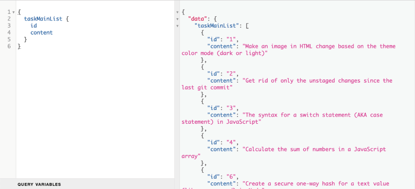

图 6.2 服务器对 taskMainList 查询的响应

如果你尝试请求 tags 或 createdAt 字段，你将收到以下错误：

- 对于标签字段，你将收到此错误消息："预期可迭代，但未找到字段 Task.tags。"
- 对于 createdAt 字段，你将收到此错误消息："无法为非空字段 Task.createdAt 返回 null。" approachCount 字段也会出现同样的错误。

花点时间尝试找出这些错误消息。 我将在下一节中解释它们。

> 在 SQL 中使用字段子集
>
> 由于我们执行了 SELECT * 操作，因此 azdev.tasks 表中可用的所有字段都将在任务类型的父源对象上可用。 但是，只有定义的字段所代表的属性在 API 中可用。 你可以优化 SQL 语句以仅包含 API 感兴趣的字段。
> 例如：
>
> ```sql
> SELECT id, content, tags, approach_count, created_at
> FROM azdev.tasks
> WHERE ·-·-·
> ```

### 6.2.3 转换字段名称
在某些情况下，我们需要 API 以不同的结构表示数据库中的列和行。 也许数据库有一个令人困惑的列名； 或者我们可能希望 API 始终对所有字段名称使用驼峰式大小写，而数据库对其列使用蛇形大小写。 后一种情况正是我们接下来要处理的。 azdev.tasks 表中的列在数据库中采用蛇形命名法（例如，created_at），我们计划在 API 中将所有字段表示为驼峰命名法 (createdAt)。 这意味着我们不能像对 id 和 content 字段所做的那样依赖默认解析器。

对于驼峰式字段，默认解析器会尝试在数据库返回的行上查找属性 createdAt。 该属性不存在。 这就是我们在尝试请求 createdAt 时出错的原因。

有三种主要的方法来处理这个问题。

#### 方法#1
当我们从数据库中取回数据时，我们可以简单地对每一行的所有属性执行一个案例映射。 这样，任务类型的父源对象将具有正确的属性名称，并且可以使用默认解析器保留所有字段。 例如，如果我们有一个函数 caseMapper，它接受一个对象并将其所有属性设为驼峰式大小写，我们可以按如下方式修改 taskMainList 的解析器。

清单 6.14 示例：更改从数据库接收到的对象的结构

```js
resolve: async (source, args, { pgPool }) => {
  const pgResp = await pgPool.query(
    // ·-·-·
  );
  return pgResp.rows.map(caseMapper);
},
```

提示 这里省略了 caseMapper 函数的实现，但你可以使用 humps Node 包中的 camelizeKeys 等函数。 该函数甚至支持转换一个对象数组，并且它将驼峰式大小写该数组中所有对象的所有属性。

你能发现这个方法有问题吗？ 实际上，你能发现它的两个问题吗？ 我们不仅循环遍历返回集合中的每一行（使用 map 方法），而且 caseMapper 函数循环遍历行对象的所有属性。

如果你处理的是小型数据集，这可能不是什么大问题。 然而，GraphQL 树/解析器结构已经在字段和级别上循环。 我们可以在需要时使用字段解析器手动进行转换。 这是方法#2。

#### 方法#2
我们可以为需要转换的字段创建自定义解析器。 例如，我们可以更改清单 6.7 中的 createdAt 字段以包含此 resolve 函数。

清单 6.15 示例：使用自定义解析器

```js
const Task = new GraphQLObjectType({
  name: 'Task',
  fields: {
    // ·-·-·
    createdAt: {
      type: new GraphQLNonNull(GraphQLString),
      resolve: (source) => source.created_at,
    },
  },
});
```

这解决了大小写问题，因为我们正在使用父源对象（来自数据库的行对象）上可用的 created_at 属性来解析 createdAt 字段。 你需要为每个多词字段执行此操作。

如果你进行了此更改，你可以通过在 taskMainList 字段上请求一个 createdAt 字段来测试 API，它会起作用（图 6.3）。

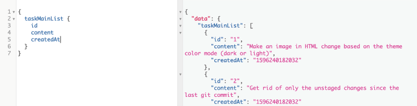

图 6.3 createdAt 字段服务器响应

注意 createdAt 回复是一个 13 位数字。 这是自 1970 年 1 月 1 日午夜 UTC 以来的毫秒数。 我们将在下一节中更改该值。

我喜欢这种方法的可读性，当你需要对值执行其他自定义逻辑时，它也很有用，而不仅仅是按原样映射。 但是，我不喜欢将 snake-case 变量名与 camel-case 混合使用。 如果 API 服务器逻辑不必处理 snake-case 变量，那将是理想的。 PostgreSQL 有它的袖子可以让我们免于首先进行转换！ 这是方法#3。

注意 在继续之前，撤消清单 6.15 中 resolve 函数的更改（如果你进行了更改）。

#### 方法#3
我们可以使用 PostgreSQL 中的列别名功能，使其以驼峰式大小写方式原生返回行。 但是，此解决方案需要在 SELECT 语句中列出所有叶字段。 例如，这是实现此方法的 taskMainList 解析器函数的一个版本。

清单 6.16 api/src/schema/index.js 的变化

```js
resolve: async (source, args, { pgPool }) => {
  const pgResp = await pgPool.query(`
    SELECT id, content, tags,
           approach_count AS "approachCount", created_at AS "createdAt"
    FROM azdev.tasks
    WHERE // ·-·-·
  `);
  return pgResp.rows;
},
```

请注意，我使用 AS "approachCount" 和 AS "createdAt" 语法重命名返回的列。 别名周围的引号是必需的，因为 PostgreSQL 不区分大小写。 要强制它以其他方式运行，你需要使用引号。

我认为这是更好的方法，因为它使来自 PostgreSQL 的数据以我们需要的形式出现，而且在我看来，必须列出语句所需的列名是一件好事。 特异性总是更安全的方法。

注意 除了第一个示例之外，你不需要编写任何 SQL 语句或别名。 api/src/db/sqls.js 中提供了所有带有别名列名的 SQL 语句。

### 6.2.4 转换字段值
GraphQL 对 JavaScript 中日期对象的默认序列化是调用它们的 valueOf 方法，该方法等同于调用 getTime（返回 13 位毫秒数）。 如果我们想以不同方式序列化字段（包括日期字段），我们可以在自定义解析器函数中进行。 例如，让我们使用 UTC ISO 格式序列化 AZdev API 的所有日期时间字段。 为此，我们可以使用 JavaScript toISOString 方法。 我们需要使用以下代码实现 createdAt 字段的解析器函数。

清单 6.17 api/src/schema/types/task.js 中的变化

```js
createdAt: {
  type: new GraphQLNonNull(GraphQLString),
  resolve: (source) => source.createdAt.toISOString(),
},
```

注意 请注意，我使用了 source.createdAt（而不是 source.created_at），因为 PostgreSQL 现在以驼峰式对象属性返回数据。

现在 API 使用 ISO 格式显示 createdAt 的值（图 6.4）。

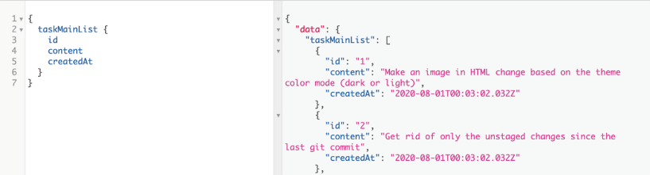

图 6.4 作为 ISO 字符串的 createdAt 字段

标签字段呢？ 目前，API 正在为其显示此错误："预期可迭代，但未找到字段 Task.tags。"

这是因为我们将 tags 字段定义为 GraphQLList 类型。 GraphQL 执行器期望它的解析值是一个可迭代的，就像一个数组。 tags 字段的默认解析器当前正在解析 tags 数据库列中的内容：一串以逗号分隔的值（例如，"node,git"）。 我们需要将此值转换为字符串数组（因此，["node", "git"]）。 我们使用自定义解析器函数来做到这一点。

清单 6.18 api/src/schema/types/task.js 中的变化

```js
tags: {
  type: new GraphQLNonNull(
    new GraphQLList(new GraphQLNonNull(GraphQLString))
  ),
  resolve: (source) => source.tags.split(','),
},
```

这样，解析器将在请求 tags 属性时返回一个数组（图 6.5）。

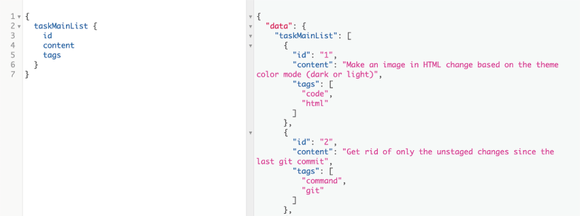

图 6.5 标记逗号分隔值在 API 中公开为数组

如你所见，控制 GraphQL 模式的形状并对数据库返回的原始数据使用强大的转换非常容易。

> 当前代码
>
> 使用 git checkout 6.1 将你的本地存储库重置为代码中的当前进度。

### 6.2.5 分离与 PostgreSQL 的交互
在我们继续在 Task 类型上实现作者/方法关系之前，让我们做一个小的重构。 让我们引入一个负责与 PostgreSQL 通信的模块，并在解析器函数中使用该模块的 API，而不是直接在解析器函数中使用 SQL 语句。

这种职责分离通常会提高 API 代码的可读性。 从 PostgreSQL 获取内容的逻辑不会与将原始数据转换为公共 API 的逻辑混合。 这个新模块也将提高代码的可维护性！ 如果数据库驱动程序更改了它的 API 或者如果决定使用不同的数据库驱动程序，你可以在一个地方而不是多个地方进行这些更改。 你还将有一个地方可以添加日志记录或任何其他关于数据库调用的诊断。 单独测试这个新模块，与解析器函数中的其他逻辑隔离，并通过模拟这个新模块来测试解析器中的逻辑也会容易得多。

我将这个新模块命名为 pgApi。 我们将在上下文对象而不是驱动程序的本机 pgPool 对象中公开它，并通过它与 PostgreSQL 进行所有读写交互。

让我们也移动 api/src/server.js 中我们调用 pgClient 函数以获取 pgPool 到这个新的 pgApi 模块中的行。 这是一个异步操作，这意味着我们需要将 pgApi 模块包装在一个异步函数中。 我将此函数命名为 pgApiWrapper 并使其成为新模块中的默认导出。

这是我想出的实现。 把它放在 api/src/db/pg-api.js 中。

清单 6.19 新文件：api/src/db/pg-api.js

```js
import pgClient from './pg-client';
import sqls from './sqls';
 
const pgApiWrapper = async () => {
  const { pgPool } = await pgClient();
  const pgQuery = (text, params = {}) =>
    pgPool.query(text, Object.values(params));
 
  return {
    taskMainList: async () => {
      const pgResp = await pgQuery(sqls.tasksLatest);     ❶
      return pgResp.rows;
    },
  };
};
 
export default pgApiWrapper;
```

❶ tasksLatest SQL语句已经在api/src/db/sqls.js中。

请注意，我从提供的 ./sqls.js 文件中导入了 sqls 对象并使用了 sqls .tasksLatest。 这是与清单 6.16 中相同的 SQL 查询。 将所有 SQL 语句放在一个地方是组织此模块的一种简单方法。 另一种方法是为每个数据库 API 函数创建一个文件，并让该文件定义它需要的 SQL 语句。 后者更适合大型项目，但我将在此处保留简单的双文件结构。 pg-api.js 文件将定义函数，而 sqls.js 文件将定义 SQL 语句。

另请注意，我引入了一个新函数 pgQuery，它是 pgPool.query 的包装器。 pgPool.query 函数是当前驱动程序的方法，它需要查询变量作为数组。 pgQuery 函数是我们可以在需要时随时控制的东西，我让它接收查询变量作为对象（在我看来，这将使代码更具可读性）。

提示包装第三方 API 通常是一种很好的做法，但不要过度！ 例如，我还没有包装 GraphQL.js API，因为项目的整个结构都依赖于它。 AZdev API 代码不只是使用 GraphQL.js； 它是围绕它建造的。 当 GraphQL.js 对其 API 进行非向后兼容更改时，可能是时候进行全面的项目检修了。 但是，包装第三方 API 的其他好处仍然适用。 例如，如果我们想更改创建类型对象的语法以减少样板文件并使用类似于 SDL 方法的东西，我们可以引入一个包装器。

现在我们需要更改 api/src/server.js 中的上下文对象以使用新的 pgApiWrapper 函数而不是驱动程序原生的 pgClient 函数。

清单 6.20 api/src/server.js 中的变化

```js
// ·-·-·
import pgApiWrapper from './db/pg-api';    ❶
 
async function main() {
  const pgApi = await pgApiWrapper();      ❷
 
  // ·-·-·
 
  server.use(
    '/',
    graphqlHTTP({
      schema,
      context: { pgApi },
      graphiql: true,
    })
  );
 
  // ·-·-·
}
```

❶ 这一行取代了 pg-client 导入行。
❷ 这一行替换了 pgClient() 调用行。

最后，我们需要更改 taskMainList 的解析函数以使用新的 pgApi 而不是直接发出 SQL 语句。

清单 6.21 api/src/schema/index.js 的变化

```js
taskMainList: {
  type: new GraphQLList(new GraphQLNonNull(Task)),
  resolve: async (source, args, { pgApi }) => {
    return pgApi.taskMainList();
  },
},
```

而已。 你可以使用我们迄今为止一直使用的相同查询来测试所有这些更改。 公共 API 服务没有任何变化，但代码库发生了很多变化。 该代码是一个更好的开始。

## 6.3 报错
我想在这里介绍一个小修改。 默认情况下，GraphQL.js 实现不会在日志中报告错误，这可能会导致失败。 它仍然会用这些错误响应 API 消费者，但作为后端开发人员，你看不到它们。

让我们看一个例子。 在解析 taskMainList 字段数据的代码中的任何位置伪造错误，如下所示。

清单 6.22 api/src/db/pg-api.js 中的临时变化

```js
const QueryType = new GraphQLObjectType({
  name: 'Query',
  fields: {
    // ·-·-·
    taskMainList: {
      type: new GraphQLList(new GraphQLNonNull(Task)),
      resolve: async (source, args, { pgApi }) => {
        return pgApi.taksMainList();                 ❶
      },
    },
  },
});
```

❶ 错别字！
现在观察当你在 GraphiQL 中请求 taskMainList 字段时会发生什么（图 6.6）。

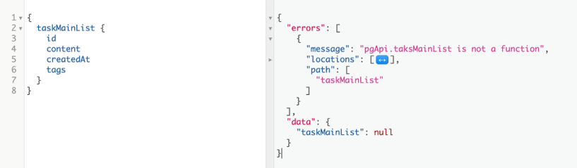

图 6.6 前端应用程序的后端错误

你将错误视为消费者（这很糟糕）。 你也根本看不到后端中的错误（这也很糟糕）。

为了解决这个问题，express-graphql 包支持 customFormatErrorFn 选项，这是一个可选函数，可用于格式化服务器执行 GraphQL 操作时产生的错误。 我们可以使用此函数来报告错误并向消费者返回一般错误（例如，在生产中）。

清单 6.23 api/src/server.js 中的变化

```js
async function main() {
  // ·-·-·
 
  server.use(
    '/',
    graphqlHTTP({
      schema,
      context: { pgApi },
      graphiql: true,
      customFormatErrorFn: (err) => {
        const errorReport = {
          message: err.message,
          locations: err.locations,
          stack: err.stack ? err.stack.split('\n') : [],    ❶
          path: err.path,
        };
        console.error('GraphQL Error', errorReport);        ❷
        return config.isDev
          ? errorReport
          : { message: 'Oops! Something went wrong! :(' };  ❸
      },
    }),
  );
 
  // ·-·-·
}
```

❶ 让错误堆栈显示在开发中，非常好用
❷ 在服务器日志中记录错误
❸ 返回生产中的一般错误

这样，如果你现在执行错误的 taskMainList 查询，前端消费者将看到一般错误消息，而后端开发人员将在 API 服务器日志中看到有用的错误消息。

提示 在生产环境中，不向 API 消费者暴露抛出的错误是一种常见的做法。 这些通常会揭示实现细节，通常对用户没有帮助。 只向你的 API 使用者公开有用的错误消息。 当我们处理突变时，我们会看到例子。

不要忘记撤消我们在清单 6.22 中故意输入的错误。

> 当前代码
>
> 使用 git checkout 6.2 将你的本地存储库重置为代码中的当前进度。

现在是讨论解决关系的时候了。 这将突出显示创建 GraphQL API 时面临的最大挑战之一：臭名昭著的 N+1 查询问题。

## 6.4 解析关系
Task 类型的其余字段是 author 和 approachList。 我们需要为它们实现两种新的 GraphQL 类型。 我将它们命名为 Author 和 Approach。

这些字段不会是查询中的叶字段。 它们代表关系。 一个任务有一个作者和许多方法。 为了解析这些字段，GraphQL 服务器必须对许多表执行 SQL 语句并从这些表中返回对象。

当我们完成 author 和 approachList 字段的实现时，API 服务器应该接受并回复这个查询。

清单 6.24 taskMainList 完整查询

```js
{
  taskMainList {
    id
    content
    tags
    approachCount
    createdAt
 
    author {
      id
      username
      name
    }
 
    approachList {
      id
      content
      voteCount
      createdAt
 
      author {
        id
        username
        name
      }
    }
  }
}
```

这是 API 服务应支持的完整查询。 注意嵌套字段 Task -> Author 和 Task -> Approach -> Author。

注意一个方法也有一个作者。 要完成 taskMainList 字段，我们还必须实现该关系。

通过此查询，我们希望获得有关所有最新任务的所有信息、它们的创作者、对它们定义的方法以及这些方法的创作者。

注意最新任务 UI 视图将不包括方法。 方法将仅显示在单一任务 UI 视图中。 为简单起见，我在这里使用了一种任务类型，但可以使用类型特异性来匹配预期的用法并强制执行可接受的 API 使用方式。 我们将在 me 根字段下看到一个示例。

### 6.4.1 解析一对一关系

作者字段必须从 azdev.users 表中解析。 将任务对象连接到用户对象的外键是 azdev.tasks 表上的 user_id 字段。 当我们使用 Task 对象列表解析 taskMainList 字段时，这些对象中的每一个在其 userId 属性中都有一个值。 对于每一个，我们都必须执行另一个 SQL 语句来获取有关创建它的用户的信息。 你可以在 sqls.usersFromIds 下找到该 SQL 语句（在 api/src/db/sqls.js 中）。

清单 6.25 api/src/db/sqls.js 中的第二条 SQL 语句

```js
// $1: userIds
usersFromIds: `
  SELECT id, username,
         first_name AS "firstName", last_name AS "lastName",
         created_at AS "createdAt"
  FROM azdev.users
  WHERE id = ANY ($1)
`,
```

请注意，此 SQL 语句中有一个 \$1。 这是新的。 这是我们可以与 pg 驱动程序一起使用的语法，无需求助于字符串连接即可将变量插入 SQL 语句。 该语句预计将使用一个变量执行，并且该变量将用于替换 \$1 部分。

注意 ANY 比较结构可用于使用 ID 数组从数据库中获取多条记录。 这将帮助我们减少 API 服务器需要执行的 SQL 查询的数量。 我们将在第 7 章中看到示例。

接下来我们需要在pgApi模块中设计一个函数来执行sqls.usersFromIds语句。 让我们设计该函数以接受 userId 值作为参数。

清单 6.26 api/src/db/pg-api.sql 中的变化

```js
const pgApiWrapper = async () => {
  // ·-·-·
  return {
    // ·-·-·
    userInfo: async (userId) => {
      const pgResp = await pgQuery(sqls.usersFromIds, { $1: [userId] });   ❶
      return pgResp.rows[0];
    },
  };
};
```

❶ 将 \$1 作为 [userId] 传递给 SQL 语句

sqls.usersFromIds 语句旨在处理多个用户 ID 并返回多个用户记录。 这就是 \$1 值为 [userId] 的原因。 但是，由于我们只传递一个 userId 值，SQL 语句将获取一行或什么都不获取（因为 ID 列是唯一的）。 pg 驱动程序总是在其响应中以数组形式返回 rows 属性，即使它只是一行。 这就是返回值是语句响应 (pgResp.rows[0]) 的第一行的原因。

请注意，我首先设计与 PostgreSQL 的交互，而不是从 GraphQL 类型和解析器函数开始，然后逐步深入到 PostgreSQL 交互（这是我们为 taskMainList 字段所做的）。 重要的是我们可以在完全独立于另一方的情况下完成这项任务的每一方！

为了让 GraphQL 服务器知道新的作者字段，我们需要定义用户类型。 GraphQL 模式中的所有内容都必须有一个类型。 在 SDL 文本中，我们为用户类型采用了这种结构。

清单 6.27 用户类型

```js
type User {
  id: ID!
  username: String!
  name: String
  taskList: [Task!]!    ❶
}
```

❶ 我们将在 me 根字段下实现 taskList 字段。

还记得我们为任务类型经历的三个步骤吗？ 我们需要为 User 类型做一些类似的事情：

- 定义一个名为 User 的新对象类型，它具有三个标量字段。
- 为用户类型编写任何非默认解析器。 让我们将表 azdev.users 上的数据库 first_name 和 last_name 列合并到 API 的单个名称字段中。
- 修改 Task 类型，使其具有一个名为 author 的字段，该字段是 User 类型（新类型）的非空对象，并使用清单 6.26 中的新 userInfo 函数将此字段解析为 azdev.users 表中的记录。

这是新用户类型的可能实现及其名称字段的非默认解析器。

清单 6.28 新文件：api/src/schema/types/user.js

```js
import {
  GraphQLID,
  GraphQLObjectType,
  GraphQLString,
  GraphQLNonNull,
} from 'graphql';
 
const User = new GraphQLObjectType({
  name: 'User',
  fields: {
    id: { type: new GraphQLNonNull(GraphQLID) },
    username: { type: GraphQLString },
    name: {
      type: GraphQLString,
      resolve: ({ firstName, lastName }) =>
        `${firstName} ${lastName}`,
    },
  },
});
 
export default User;
```

请注意，对于名称字段的解析函数，我从第一个源参数中解构了要在解析器中使用的属性。

注意我没有在这个新类型下包含 createdAt 字段。 我会在实现 me 根字段时添加它。 创建用户时的时间戳不应出现在作者关系下。 它在 me 根字段下很有用。 例如，UI 可以使用它来显示当前登录用户的个人资料信息。

要使用这个新的 User 类型，我们需要在 Task 类型中导入它，并让新的 author 字段使用它。 要解析作者字段，我们只需调用添加到 pgApi 的 userInfo 函数。

清单 6.29 api/src/schema/types/task.js 中的变化

```js
import User from './user';
 
const Task = new GraphQLObjectType({
  name: 'Task',
  fields: {
    // ·-·-·
 
    author: {
      type: new GraphQLNonNull(User),
      resolve: (source, args, { pgApi }) =>
        pgApi.userInfo(source.userId),
    },
  },
});
```

这样就可以了。 你可以使用此查询测试新关系。

清单 6.30 测试任务/作者关系的查询

```js
{
  taskMainList {
    content
    author {
      id
      username
      name
    }
  }
}
```

API 显示有关每个任务作者的信息，这与我们正在使用的示例数据中的测试帐户相同（图 6.7）。

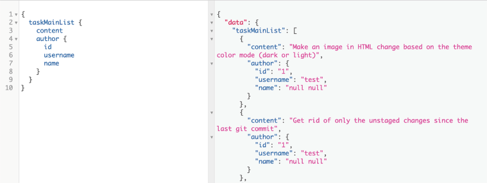

图 6.7 获取每个任务对象的作者信息

#### 处理空值

图 6.7 中的数据响应有一个小问题：Author name 被返回为 null null。 这是为什么？

空概念令人困惑。 不同的编码器将不同的含义与它联系起来。 你需要小心，始终考虑处理 null 的可能性。 你应该问，"如果这是空的怎么办？" 关于你在代码中使用的每个变量。 这就是 TypeScript 和 Flow 等语言流行的原因之一：它们可以帮助检测这些问题。

当我们使用模板字符串 \${firstName} \${lastName} 时，我们应该问自己这个问题！ 如果这些属性为空怎么办？ JavaScript 只会将"null"作为字符串插入。 我们如何解决这个问题？

首先，我们是否需要将 first_name 和 last_name 作为数据库中的可空列？ 这些列中的 null 和空字符串之间是否存在语义差异？ 如果不是（这是最有可能的答案），那么让这些字段在数据库中不为空并且可能使它们默认为空字符串将是一个更好的设计决策。

举个例子，假设我们无法控制数据库表的结构和/或我们无法修复已经存在的数据。 这并不意味着我们应该将这些问题泄露给该 API 的使用者。 我们可以使 API 的名称字段不为空，并使服务器始终返回名称或空字符串而不是空值，或者更糟的是，将空值强制转换为字符串。

有很多方法可以实现它。 这是一个。

清单 6.31 api/src/schema/types/user.js 中名称字段的更改

```js
name: {
  type: new GraphQLNonNull(GraphQLString),
  resolve: ({ firstName, lastName }) =>
    [firstName, lastName].filter(Boolean).join(' '),
},
```

这样，API 将始终返回一个字符串，该字符串将忽略 firstName、lastName 或两者中的空值（图 6.8）。

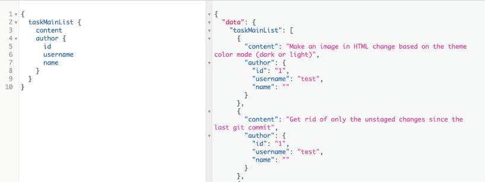

图 6.8 使名称字段始终返回一个值（可以是空字符串）

> 当前代码
>
> 使用 git checkout 6.3 将你的本地存储库重置为代码中的当前进度。

#### N+1 查询问题

现在我们已经实现了一个关系并让 GraphQL 服务器为它执行多条 SQL 语句，我们可以谈谈 N+1 查询问题。 这是实现 GraphQL 服务时的第一个大挑战。 要实际查看此问题，你需要为 PostgreSQL 服务启用日志记录并在执行 GraphQL 查询时跟踪日志。

注意 如何为 PostgreSQL 启用日志记录取决于你的平台、操作系统、版本和许多其他因素，因此你需要自己弄清楚。 确保每次在 PostgreSQL 服务上执行时，服务器日志都会报告一个 SQL 查询。 为 PostgreSQL 提供的 Docker 镜像应该开箱即用。

跟踪日志后，执行清单 6.25 中的查询，并在日志中找到与执行 SQL 语句相关的每个实例。 这是我测试时在我的 PostgreSQL 服务器上执行的 SQL 查询。

清单 6.32 显示 N+1 问题的 PostgreSQL 日志摘录

```sql
LOG: statement:
SELECT ·-·-·
FROM azdev.tasks WHERE ·-·-·
LOG: execute <unnamed>:
SELECT ·-·-·
FROM azdev.users WHERE id = ANY ($1)
DETAIL:  parameters: $1 = '1'             ❶
LOG: execute <unnamed>:
SELECT ·-·-·
FROM azdev.users WHERE id = ANY ($1)
DETAIL:  parameters: $1 = '1'
LOG: execute <unnamed>:
SELECT ·-·-·
FROM azdev.users WHERE id = ANY ($1)
DETAIL:  parameters: $1 = '1'
LOG: execute <unnamed>:
SELECT ·-·-·
FROM azdev.users WHERE id = ANY ($1)
DETAIL:  parameters: $1 = '1'
LOG: execute <unnamed>:
SELECT ·-·-·
FROM azdev.users WHERE id = ANY ($1)
DETAIL:  parameters: $1 = '1'
```

❶ "1"是我在示例数据中使用的用户的 ID 值。

如果你正在使用 Docker Desktop 和提供的 Docker 镜像，你可以通过打开仪表板并导航到正在运行的 gia_pg 容器的日志视图来查看 PostgreSQL 日志（见图 6.9）。 你还可以在 npm run start-dbs 命令的输出中看到它们。

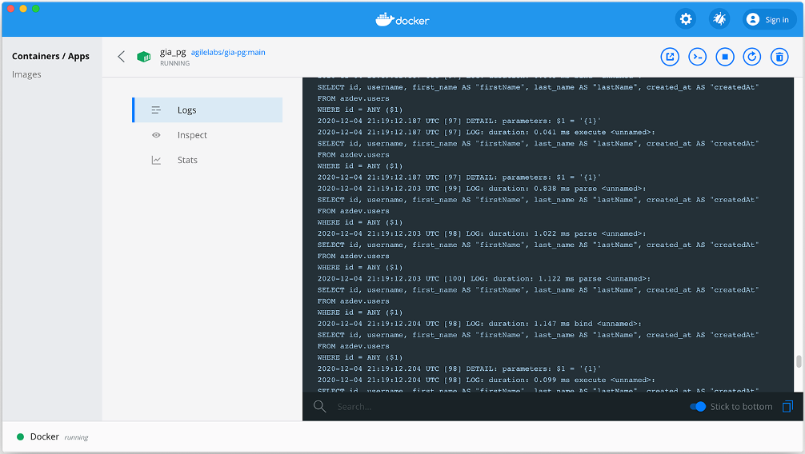

图 6.9 Docker 容器日志

> 提示 PostgreSQL 可能会围绕这些执行记录更多行。 例如，你可能还会看到解析/绑定行。 查找具有语句或执行标签的条目。

为什么我们要执行六个 SQL 查询？ 因为我们有一个主查询（针对 Tasks），并且样本数据中有 5 个公共 Task 记录。 对于每个任务记录，我们向数据库询问其关联的用户记录。 这是 Users 的五个查询加上主查询。 这个5+1就是N+1的问题。 如果我们在 azdev.tasks 表中有 41 个公共任务对象，我们将在这里执行 42 个 SQL 查询。

显然这是一个问题。 我们不应该那样做。 有很多方法可以解决此问题。 我将在这里向你展示其中一个，我们将在下一章中看到一个更好的。

解决此问题的一种简单方法是直接使用数据库连接（或基于连接的数据库视图）。 数据库连接很强大。 你可以形成一次从两个或多个表中获取信息的单个 SQL 查询。 例如，如果我们要查找任务记录并在同一 SQL 响应中获取其关联用户的信息，我们可以像这样进行连接（你可以将其放在 api/src/db/sqls.js 中）。

清单 6.33 api/src/db/sqls.js 中的变化

```js
const views = {
  tasksAndUsers: `
    SELECT t.*,
        u.id AS "author_id",
        u.username AS "author_username",
        u.first_name AS "author_firstName",
        u.last_name AS "author_lastName",
        u.created_at AS "author_createdAt"
    FROM azdev.tasks t
    JOIN azdev.users u ON (t.user_id = u.id)
  `,
};
// ·-·-·
```

tasksAndUsers 字符串可以充当视图，如果需要，我们可以使用它来创建实际的数据库视图对象。 但是，让我们在这个例子中直接使用它。

你可以在 PostgreSQL 客户端（如 psql）中测试 SELECT 语句。 Docker Desktop 提供了一个 CLI 按钮，使你可以通过命令行访问正在运行的容器（见图 6.10）。

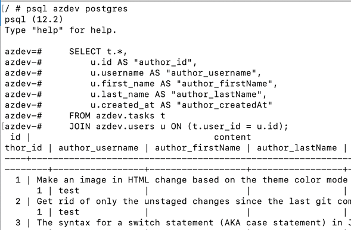

图 6.10 同时包含任务和作者信息的 SQL 视图

请注意，我使用列别名为用户表列添加前缀"author_"。 如果我们不这样做，列名可能会发生冲突（例如，两个表都有一个 id 字段）。 这个前缀也将使我们更容易为这个关系实现 GraphQL 解析器。

要使用 tasksAndUsers 视图，我们可以从新的 tasksAndUsers 视图中选择，而不是从 azdev.tasks 表中选择 sqls.tasksLatest SQL 查询。

清单 6.34 api/src/db/sqls.js 中的变化

```js
taskMainList: `
  SELECT id, content, tags, ·-·-·
    "author_id", "author_username", "author_firstName",
    "author_lastName", "author_createdAt"
  FROM (${views.tasksAndUsers})
  WHERE is_private = FALSE
  ORDER BY created_at DESC
  LIMIT 100
`,
```

这样，用于解析 Task 类型的父源对象也将具有以 author_ 为前缀的列，这些列将作者信息内联保存在同一对象中。 不需要进一步的 SQL 查询。 但是，我们需要将带前缀的列提取到适合作为用户类型解析器的父源对象的对象中。 让我们创建一个效用函数来做到这一点。 我将其命名为 extractPrefixedColumns。 以下是我们将如何在任务类型中使用它。

清单 6.35 api/src/schema/types/task.js 中的变化

```js
// ·-·-·
import { extractPrefixedColumns } from '../../utils';
 
const Task = new GraphQLObjectType({
  name: 'Task',
  fields: {
    // ·-·-·
 
    author: {
      type: new GraphQLNonNull(User),
      resolve: prefixedObject =>
        extractPrefixedColumns({ prefixedObject, prefix: 'author' }),
    },
  },
});
```

extractPrefixedColumns 的实现可以是一个简单的 reduce 调用来过滤列并且只包括带前缀的列，但不包括它们的前缀。

清单 6.36 api/src/utils.js 中的新函数

```js
export const extractPrefixedColumns = ({
  prefixedObject,
  prefix,
}) => {
  const prefixRexp = new RegExp(`^${prefix}_(.*)`);
  return Object.entries(prefixedObject).reduce(
    (acc, [key, value]) => {
      const match = key.match(prefixRexp);
      if (match) {
        acc[match[1]] = value;       ❶
      }
      return acc;
    },
    {},
  );
};
```

❶ match[1] 将是没有前缀部分的带前缀的列名。

而已！ 你可以测试代码清单 6.30 中的查询，它的工作原理完全一样——除了日志中执行的语句不是 N+1，而是只有一个语句。

清单 6.37 从我的 PostgreSQL 日志中摘录，显示只执行了一个查询

```js
LOG: statement:
SELECT ·-·-·
   FROM (
   SELECT ·-·-·
   FROM azdev.tasks t
   JOIN azdev.users u ON (t.user_id = u.id)
) tau WHERE ·-·-·
```

这个方法很简单。 它在与 PostgreSQL 通信方面非常高效。 但是，这确实意味着对于每个返回的行，我们需要对其对象执行循环以提取前缀键。 可以通过更改作者类型以直接使用前缀值解析来改善此问题。 然而，这意味着增加更多的复杂性，我认为这会降低代码的可读性。 有更好的方法，我们将在下一章中讨论。

我将撤消为解决 N+1 问题所做的所有基于视图的更改，以便为其他解决方案做准备。 然而，在我们谈论它之前，让我们解决 taskMainList 下最后剩下的关系：方法列表（及其作者）。

> 当前代码
>
> 为了你的参考，我将基于视图的示例的代码放在它自己的 Git 分支中。 你可以使用命令 git checkout 6.T1 查看该代码。
>
> 我没有将此示例包含在当前的 6.3 分支中（你可以使用命令 git checkout 6.3 返回到该分支）。

### 6.4.2 解析一对多关系
我们将从类型和解析器开始实现 approachList 字段。 我们需要修改 Task 类型以添加新的 approachList 字段。 该字段是非空方法对象的非空列表（这是我们需要引入的新 GraphQL 类型）。 要解析 approachList 字段，我们需要 pgApi 中的一个新函数，它接受一个 taskId 并返回与其关联的 Approach 对象数组。 让我们将该函数命名为 approachList。

清单 6.38 api/src/schema/types/task.js 中的变化

```js
// ·-·-·
import Approach from './approach';
 
const Task = new GraphQLObjectType({
  name: 'Task',
  fields: {
    // ·-·-·
    approachList: {
      type: new GraphQLNonNull(
        new GraphQLList(new GraphQLNonNull(Approach))    ❶
      ),
      resolve: (source, args, { pgApi }) =>
        pgApi.approachList(source.id),                   ❷
    },
  },
});
```

❶ Approach 是我们需要引入的新的 GraphQL 类型。
❷ pgApi.approachList 接收一个Task对象的ID（source.id），应该返回一个Approach对象的列表。

注意这段代码使用了两个我们还没有的东西：Approach 类型和 pgApi.approachList 函数。

接下来让我们实现 Approach 类型。 这是我们为它准备的模式语言文本。

清单 6.39 模式语言文本中的方法类型

```js
type Approach implement SearchResultItem {
  id: ID!
  createdAt: String!
  content: String!
  voteCount: Int!
  author: User!
  task: Task!                     ❶
  detailList: [ApproachDetail!]!  ❶
}
```

❶ 我们将在下一章实现 task 和 detailList 字段。

这种类型的实现大部分类似于任务类型。 我们可以对 id 和内容使用默认的解析器，voteCount，对 createdAt 使用相同的 ISO 转换，以及对 author 字段使用的相同代码。

清单 6.40 新文件：api/src/schema/types/approach.js

```js
import {
  GraphQLID,
  GraphQLObjectType,
  GraphQLString,
  GraphQLInt,
  GraphQLNonNull,
} from 'graphql';
 
import User from './user';
 
const Approach = new GraphQLObjectType({
  name: 'Approach',
  fields: {
    id: { type: new GraphQLNonNull(GraphQLID) },
    content: { type: new GraphQLNonNull(GraphQLString) },
    voteCount: { type: new GraphQLNonNull(GraphQLInt) },
    createdAt: {
      type: new GraphQLNonNull(GraphQLString),
      resolve: ({ createdAt }) => createdAt.toISOString(),
    },
    author: {
      type: new GraphQLNonNull(User),
      resolve: (source, args, { pgApi }) =>
        pgApi.userInfo(source.userId),
    },
  },
});
 
export default Approach;
```

必须从 azdev.approaches 表解析 approachList 字段。 将任务对象连接到方法对象列表的外键是 azdev.approaches 表中的 task_id 字段。 对于每个已解析的 Task 对象，我们需要发出此 SQL 语句（已在 sqls.js 文件中）以获取有关其下可用的 Approach 对象列表的信息。

清单 6.41 sqls.tasksApproachLists 语句

```js
tasksApproachLists: `
  SELECT id, content, user_id AS "userId", task_id AS "taskId",
         vote_count AS "voteCount", created_at AS "createdAt"    ❶
  FROM azdev.approaches
  WHERE task_id = ANY ($1)                                       ❷
  ORDER BY vote_count DESC, created_at DESC                      ❸
`,
```

❶ 列的别名为驼峰式。
❷ 此语句需要一个任务 ID 值作为 $1 传递。
❸ 按票数对方法进行排序（然后是时间戳，如果许多记录具有相同的票数）

提示 命名很难，而且我并不总是擅长。 在 AZdev API 的官方开源存储库中，你可能会看到我在本书中使用的名称以外的名称。 事实上，如果你能想到比目前 AZdev API GitHub 存储库中的名称更好的名称，请提出问题或拉取请求！ 你可以在 az.dev/contribute 找到 AZdev 项目的 GitHub 存储库。

我们接下来要实现的 pgApi.approachList 函数将使用 sqls.approachesForTaskIds 语句。

清单 6.42 api/src/db/pg-api.js 中的变化

```js
const pgApiWrapper = async () => {
  // ·-·-·
 
  return {
    // ·-·-·
    approachList: async (taskId) => {
      const pgResp = await pgQuery(sqls.approachesForTaskIds, {
        $1: [taskId],                                           ❶
      });
      return pgResp.rows;
    },
  };
};
```

❶ 将 \$1 作为 [taskId] 传递给 SQL 语句
我希望这对你来说越来越容易。 我们还有很多例子要完成，但 taskMainList 例子终于完成了（图 6.11）！ 继续测试清单 6.24 中的完整查询。

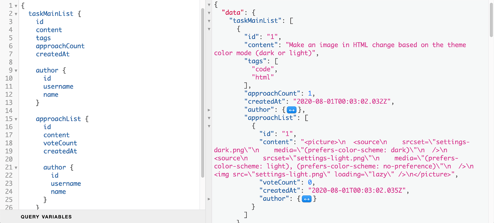

图 6.11 完整的 taskMainList 查询的响应

猜猜我们向 PostgreSQL 发送了多少 SQL 语句来满足这个 GraphQL 查询？

- 一个用于主要任务列表。
- 每个任务的作者信息一个（总共五个）。
- 每个任务的方法列表一个（总共五个）。
- 每个任务的每个方法一个，以获取该方法的作者信息。 我们在样本数据中共有六个方法。

总共有 17 条 SQL 语句！ 我们仍然可以使用数据库视图来解决这个问题，但是这样做会增加代码的复杂性。 让我们探索更好的选择，即使用数据加载器概念。 我们将在下一章中讨论。

> 当前代码
> 使用 git checkout 6.4 将你的本地存储库重置为代码中的当前进度。

## 概括

- 在开发中使用真实的、类似于生产的数据，使你的手动测试具有相关性和实用性。
- 从你能想到的最简单的实现开始。 让事情发挥作用，然后改进你的实施。
- 你可以使用 GraphQL 上下文对象使数据库连接池可用于所有解析器函数。
- 你可以使用字段的解析器来转换数据元素的名称和值。 GraphQL API 不必与数据库中的数据结构相匹配。
- 尝试将数据库交互的逻辑与解析器中的其他逻辑分开。
- 用你自己的调用包装第三方 API 是一种很好的做法。 这使你可以在一定程度上控制它们的行为，并使代码更易于维护。
- 解决数据库关系涉及对许多表发出 SQL 语句。 由于 GraphQL 的图形解析特性，这默认会导致 N+1 查询问题。 我们可以使用数据库视图来解决这个问题，但这会使 GraphQL 服务中的代码复杂化。 在下一章中，我们将了解 DataLoader 库，它提供了一种更好的方法来处理 N+1 问题并使你的 GraphQL 服务总体上更高效。