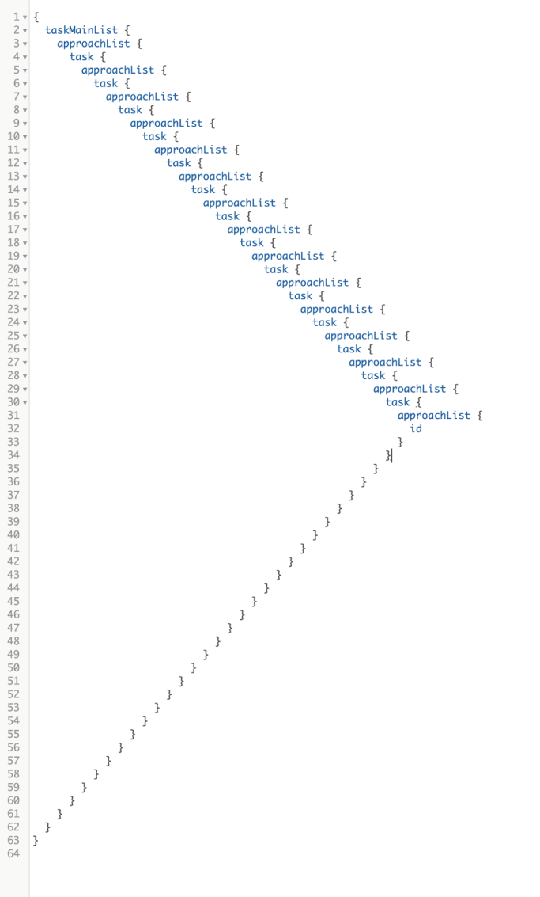

# 优化数据获取
本章涵盖

- 缓存和批处理数据获取操作
- 使用具有主键和自定义 ID 的 DataLoader 库
- 使用 GraphQL 的联合类型和字段参数
- 从 MongoDB 读取数据

现在我们有了一个带有多模型模式的 GraphQL 服务，我们可以看看 GraphQL 最著名的问题之一，N+1 查询问题。 我们以从三个数据库表中获取数据的 GraphQL 查询结束了上一章。

清单 7.1 N+1 查询示例

```js
{
  taskMainList {
    // ·-·-·
    author {
      // ·-·-·
    }
    approachList {
      // ·-·-·
      author {
        // ·-·-·
      }
    }
  }
}
```

因为 GraphQL 运行时逐个字段遍历树并自行解析每个字段，所以这个简单的 GraphQL 查询导致了比必要的多得多的 SQL 语句。

> 当前代码
>
> 使用 git checkout 7.0 将你的本地存储库重置为代码中的当前进度。 如果你需要存储任何本地更改，请使用 git add 。 && git 存储。 请记住运行 npm install 以安装任何缺少的依赖项。

## 7.1 缓存和批处理

为了分析这个问题的解决方案，让我们回到清单 6.30 中更简单的查询。

清单 7.2 taskMainList 查询

```js
{
  taskMainList {
    content
    author {
      id
      username
      name
    }
  }
}
```

如果你还记得，这个查询向数据库发出了六个 SQL SELECT 语句，这是 N+1 问题的一个例子（N 是五个任务记录）。 我们已经了解了如何使用数据库连接视图使其只执行一条 SQL 语句，但该解决方案并不理想。 维护或扩展并不容易。

另一种解决方案是在单个 GraphQL 操作中对所有必要的 SQL 语句使用缓存和批处理的概念：

- 缓存——我们至少可以做的是缓存发出的任何 SQL 语句的响应，然后在下次我们需要完全相同的 SQL 语句时使用缓存。 如果我们向数据库询问有关用户 x 的信息，请不要再次询问有关用户 x 的信息； 只需使用以前的响应。 在单个 API 请求（来自一个消费者）中执行此操作是显而易见的，但如果你需要进一步优化，你也可以使用长期的多会话缓存。 但是，缓存本身是不够的。 我们还需要对请求来自相同表的数据的查询进行分组。
- 批处理——我们可以延迟向数据库询问某个资源，直到我们弄清楚所有需要解析的记录的 ID。 一旦识别出这些 ID，我们就可以使用单个查询来接收 ID 列表并返回它们的记录列表。 这使我们能够为每个表发出一个 SQL 语句，这样做会将清单 7.2 中的简单查询所需的 SQL 语句数量减少到两个：一个用于 azdev.tasks 表，一个用于 azdev.users 表。

手动管理这些缓存和批处理操作仍然需要大量工作。 但是，这是可以抽象到单独库中的工作类型。 在发布 GraphQL.js 参考实现后，Facebook 团队也发布了此类库的参考实现。 他们将其命名为 DataLoader (az.dev/data-loader)。

提示虽然 DataLoader JavaScript 项目起源于 Facebook，作为另一个参考实现，反映了 Facebook 自己的内部数据加载库，但它已经转移到 GraphQL 基金会，现在由 GraphQL 社区维护。 这是一个稳定的、久经考验的项目； 尽管还很年轻，但它已经成为数千个开源项目的一部分，并且每个月的下载量达数百万次。

DataLoader 是一个通用的 JavaScript 实用程序库，可以将其注入应用程序的数据获取层，以代表你管理缓存和批处理操作。

要在 AZdev API 项目中使用 DataLoader，我们需要先安装它。

清单 7.3 命令：安装数据加载程序包

```sh
$ npm install dataloader
```

这个 npm 包有一个默认导出，我们通常将其导入为 DataLoader。 这个默认导出是一个 JavaScript 类，我们可以使用它来实例化 DataLoader 实例。 DataLoader 类构造函数需要一个函数作为其参数，并且该函数需要执行数据获取。 此函数称为批加载函数，因为它需要一个键 ID 数组，并且应该在一个批处理操作中获取与这些 ID 关联的所有记录，然后将记录作为数组返回，该数组与输入 ID 数组具有相同的顺序 .

例如，这是创建负责加载用户记录的加载程序的一种方法。

清单 7.4 示例：DataLoader 语法

```js
import DataLoader from 'dataloader';
 
const userLoader = new DataLoader(
  userIds => getUsersByIds(userIds)    ❶
);
```

❶ userIds 参数是一个数组，getUsersByIds 是批量加载函数，它接受一个 ID 数组并返回一个表示这些 ID 的用户记录数组（按顺序）。

一旦你有了根据 ID 值列表获取用户记录列表的逻辑，你就可以开始使用 userLoader 对象来获取多个用户。 例如，假设你的 API 应用程序中的请求需要按以下顺序加载有关用户的信息。

清单 7.5 示例：使用 DataLoader 对象

```js
```

DataLoader 负责将前两个语句批处理为单个 SQL 语句，因为它们发生在同一执行框架中，这在 Node.js 中称为事件循环的单个滴答 (az.dev/event-loop)。

对于第三条语句，Dataloader 使用其 .load() 调用的记忆缓存。 用户 1 已经从数据库中获取（在前一帧执行中，但仍在同一个请求中）。 再次获取它是多余的。

这种 SQL 语句的最小化和冗余负载的消除减轻了数据存储服务的压力。 它还总体上创建了更少的对象，这也可以减轻 API 应用程序的内存压力。

> 为什么选择数据加载器？
>
> 虽然你可以手动执行批处理和缓存，但 DataLoader 使你能够在不牺牲缓存和批处理优化性能的情况下解耦应用程序中的数据加载逻辑。 DataLoader 实例在你的各种数据源（PostgreSQL、MongoDB 和任何其他数据源）上提供一致的 API。 这使你可以专注于应用程序的逻辑并安全地分发其数据获取需求，而不必担心维护对数据库和其他数据源的最小请求。

请注意，DataLoader 使用简单的单资源批处理和短期缓存。 还有其他 GraphQL 到数据库的执行层使用多资源批处理（没有缓存及其许多问题）来实现类似（通常更好）的性能改进。 但是，我认为 DataLoader 方法更简单、更灵活且更易于维护。

### 7.1.1 批量加载功能

清单 7.4 中的 getUsersByIds 之类的批加载函数接受一个 ID 数组（或通用键），并且应该返回一个解析为记录数组的承诺对象。 为了与 DataLoader 兼容，结果数组的长度必须与输入 ID 数组的长度完全相同，并且结果记录数组中的每个索引必须对应于输入 ID 数组中的相同索引。

例如，如果 getUsersByIds 批处理函数的输入 ID 数组 ```[ 2, 5, 3, 1 ]```，该函数需要发出一个 SQL 语句来获取这些 ID 的所有用户记录。 这是在 PostgreSQL 中执行此操作的一种方法。

清单 7.6 示例：使用 SQL IN 运算符

```sql
SELECT *
FROM azdev.users
WHERE id IN (2, 5, 3, 1);
```

提示如果在 SELECT 语句中未指定 ORDER BY 子句，数据库将选择最有效的方式来满足该语句。 不保证返回行的顺序。

为了这个例子，我们假设对于这个 SQL 语句，数据库按以下顺序返回三个用户记录（而不是四个）：

```js
{ id: 5, name: 'Luke' }    ❶
{ id: 1, name: 'Jane' }
{ id: 2, name: 'Mary' }    ❷
```

❶ 结果顺序与输入数组中ID的顺序不同。
❷ 数据库中没有输入id 3对应的用户。

getUsersByIds 批加载函数不能按原样使用该 SQL 语句的结果。 它需要重新排序记录并确保每个项目与 ID 的原始顺序对齐：[ 2, 5, 3, 1 ]。 如果一个ID在结果中没有对应的记录，应该用null值表示：

```js
[
  { id: 2, name: 'Mary' },
  { id: 5, name: 'Luke' },
  null,
  { id: 1, name: 'Jane' }
]
```

在第 6 章中，我们在 api/src/db/pg-api.js 中编写了 pgApi.userInfo 函数。 让我们把它转换成一个批量加载函数，看看我们需要做些什么来让它与 DataLoader 兼容。

首先，我们应该将其重命名为 usersInfo，因为它将用于返回用户记录数组。 我们还应该将其参数重命名为 userIds 以指示它需要一个用户 ID 列表。

```sqls.usersFromIds``` 语句已设计为使用用户 ID 数组（使用 ANY 构造）。

我们需要将传递的 \$1 值更改为新的 userIds 参数，它本身应该是一个数组。

> ANY 比较结构
>
> 有许多方法可以使用 ID 数组从数据库中获取多条记录。 最简单的方法是使用 ANY PostgreSQL 比较结构，因为我们可以直接为它提供一个数组（因此不需要数组操作）。
> 清单 7.6 中的 SQL 语句可以用 ANY 编写如下：
>
> ```sql
> SELECT *
> FROM azdev.users
> WHERE id = ANY ('{2, 5, 3, 1}');
> ```
>
> 请注意，PostgreSQL 中的数组语法使用大括号而不是方括号。 这可能看起来有点奇怪，但我们不必自己处理这个问题，因为我们使用的驱动程序会为我们处理转换。

最后，我们需要重新排序来自数据库的用户记录列表，以匹配 userIds 输入数组中的顺序。 我们可以使用一个简单的 .map/.find 组合来做到这一点。

以下是使 pgApi.usersInfo 成为与 DataLoader 兼容的批加载函数所需的所有更改。

清单 7.7 api/src/db/pg-api.js 中的变化

```js
const pgApiWrapper = async () => {
  // ·-·-·
  return {
    // ·-·-·
    usersInfo: async (userIds) => {                                       ❶
      const pgResp = await pgQuery(sqls.usersFromIds, { $1: userIds });   ❷
      return userIds.map((userId) =>
        pgResp.rows.find((row) => userId === row.id)                      ❸
      );
     },
    // ·-·-·
  };
};
```

❶ 复数名称
❷ 将 \$1 作为 userIds 传递，现在是一个用户 ID 数组
❸ 在输入数组上使用 .map 调用以确保输出数组具有完全相同的长度和顺序。 如果不这样做，DataLoader 将无法正常工作。

提示 .map/.find 方法不是完成清单 7.7 中任务的最有效方法，但它很简单。 你应该考虑将 pgReps.rows 数组转换为一个对象，并在 .map 循环中进行恒定时间查找。 我会把它留给你作为练习。 查看项目的最终代码库 (az.dev/contribute)，了解我们为此部分所做的优化。

这个批量加载功能就做好了。 让我们使用它。

### 7.1.2 定义和使用 DataLoader 实例

DataLoader 缓存并不意味着成为在请求之间共享的应用程序级缓存的一部分。 它意味着一个简单的记忆，以避免在你的应用程序的单个请求的上下文中重复加载相同的数据。 为此，你应该为应用程序中的每个请求初始化一个加载程序对象，并仅将其用于该请求。

由于我们使用 Express.js 框架来管理对 AZdev API 的请求，为了使"用户加载器"的范围限定为单个请求，我们可以在服务器的侦听器函数中定义它。在 api/src/ 中调用 服务器.js。

但是，代码目前将整个侦听器函数参数委托给 graphqlHTTP 高阶函数。 我们需要改变它。 这是这样做的一种方法。

清单 7.8 api/src/server.js 中 server.use 调用的变化

```js
// ·-·-·
import DataLoader from 'dataloader';
 
async function main() {
  // ·-·-·
 
  server.use('/', (req, res) => {
    const loaders = {
      users: new DataLoader((userIds) => pgApi.usersInfo(userIds)),
    };
    graphqlHTTP({
      schema,
      context: { pgApi, loaders },
      // ·-·-· 
    })(req, res);
  }
);
```

此更改引入了一个新函数作为 server.use 的侦听器函数，在这个新的请求范围上下文中定义了用户加载器，然后将其余工作委托给 graphqlHTTP 函数。 这样，我们现在就可以使新的加载器对象成为 GraphQL 上下文对象的一部分。

请注意，我将加载器制作成一个对象，该对象具有 usersDataLoader 实例作为属性，因为我们将为更多数据库模型引入更多加载器。

另请注意，graphqlHTTP 是返回另一个函数的高阶函数。 它的返回函数需要 req 和 res 参数（来自 Express 监听器函数）。 我们基本上和以前一样做同样的事情； 但是现在我们已经引入了一个包装器监听函数，我们需要手动传递这些 req 和 res 对象。

提示我为 POST 和 GET 请求定义了加载程序对象。 理想情况下，在生产环境中，它应该只为 POST 请求定义。 我会把那部分留给你优化。

这就是初始化加载程序。 每次有请求时，我们都会为 Users 模型创建一个 DataLoader 实例，该实例使用我们准备好的 pgApi.usersInfo 批量加载功能。 现在让我们用这个新的 DataLoader 实例替换代码库中用户的手动直接获取。 我们需要修改之前使用 pgApi.userInfo 的两个 GraphQL 类型。 查一下：我们在 Task 和 Approach 类型中使用了它。

下面介绍如何更改这两个地方以使用新的 usersDataLoader 实例。 首先，这是任务类型。

清单 7.9 api/src/schema/types/task.js 中任务类型的变化

```js
const Task = new GraphQLObjectType({
  name: 'Task',
  fields: {
    // ·-·-·
 
    author: {
      type: new GraphQLNonNull(User),
      resolve: (source, args, { loaders }) =>
        loaders.users.load(source.userId),
    },
 
    // ·-·-·
  },
});
```

这是方法类型。

清单 7.10 api/src/schema/types/approach.js 中 Approach 类型的变化

```js
const Approach = new GraphQLObjectType({
  name: 'Approach',
  fields: {
    // ·-·-·
 
    author: {
      type: new GraphQLNonNull(User),
      resolve: (source, args, { loaders }) =>
        loaders.users.load(source.userId),
    },
 
    // ·-·-·
  },
});
```

这些类型的更改是相同的。 我们在解析器的上下文对象中使用新的加载器对象（而不是以前的 pgApi 对象），然后在 usersDataLoader 实例上使用 .load 调用。

DataLoader 负责剩下的工作！ 当解析 GraphQL 查询时在同一个执行上下文中进行多个 .load 调用时，DataLoader 会批处理这些调用。 它从所有加载的 ID 中准备一个数组，并只执行一次批量加载功能。 然后它使用该单个调用的响应来满足查询中提出的所有用户数据要求。

如果我们现在在跟踪 PostgreSQL 日志的同时尝试清单 7.2 中的相同 GraphQL 查询，我们将从我的 PostgreSQL 日志中看到类似以下摘录的内容：

```js
LOG:  statement: SELECT ... FROM azdev.tasks WHERE ...
LOG:  execute <unnamed>: SELECT ... FROM azdev.users WHERE id = ANY ($1)
DETAIL:  parameters: $1 = '{1}'                                           ❶
```

❶ "1"是样本数据中测试用户的ID值。

注意参数值为{1}，在PostgreSQL中代表一个数组。 更重要的是，请注意只为用户表发出了一个 SQL 语句（而不是以前的五个）。

我们仅用几行代码就增加了很多价值。 但为了更好地理解它，让我们通过 DataLoader 实例专门加载其他基于 ID 的数据获取。 还记得第 6 章末尾使用 17 条 SQL 语句的 GraphQL 查询吗？ 让我们看看将所有数据获取逻辑转换为通过 DataLoader 实例后，它会生成多少条 SQL 语句。

> 当前代码
>
> 使用 git checkout 7.1 将你的本地存储库重置为代码中的当前进度。

### 7.1.3 approachList 字段的加载器

到目前为止我们完成的其他基于 ID 的获取是在 api/src/db/pg-api.js 中的 pgApi.approachList 函数中。 这个函数与 pgApi .usersInfo 函数有点不同，因为它接受一个 taskId 并返回一个 Approach 记录数组。 这意味着当我们将它切换为使用一组键而不是单个值时，它将采用一组 taskIds，并且它应该返回一组数组（每个数组代表一个任务的方法列表）。

在这种情况下，```DataLoader``` 将关注顶级数组的顺序。 内层数组中项目的顺序是应用程序级别的问题。

```sqls.approachesForTaskIds``` 接受一组任务 ID，但它将返回所有输入任务 ID 下所有方法记录的单个列表。 我们需要拆分此列表并按任务 ID 对方法记录进行分组，同时保持顶级数组的顺序与输入数组的顺序相匹配。

我们可以使用 .map/.filter 组合来做到这一点。 以下是我对此功能所做的所有更改。

清单 7.11 api/src/db/pg-api.js 中的变化

```js
const pgApiWrapper = async () => {
  // ·-·-·
 
  return {
    // ·-·-·
    approachLists: async (taskIds) => {                         ❶
      const pgResp = await pgQuery(sqls.approachesForTaskIds, {
        $1: taskIds,                                            ❷
      });
      return taskIds.map((taskId) =>
        pgResp.rows.filter((row) => taskId === row.taskId),     ❸
      );
    },
  };
};
```

❶ 复数名称
❷ 传入 $1 作为 taskIds 数组
❸ 拆分行并将它们分组在相应的 taskId 值下。 过滤器调用将按 taskId 值对响应中的项目进行分组。 返回的结果是一组方法数组。

pgApi.approachLists 批量加载功能现在与 DataLoader 兼容。 要使用它，我们在 api/src/server.js 中实例化一个新的加载器实例。

清单 7.12 api/src/server.js 中的变化

```js
const loaders = {
  users: new DataLoader((userIds) => pgApi.usersInfo(userIds)),
  approachLists: new DataLoader((taskIds) =>
    pgApi.approachLists(taskIds),
  ),
};
```

然后我们在 GraphQL 类型中使用这个新实例，之前使用直接数据库获取来列出方法。 唯一这样做的类型是 Task 类型。

清单 7.13 api/src/schema/types/task.js 中的变化

```js
const Task = new GraphQLObjectType({
  name: 'Task',
  fields: {
    // ·-·-·
 
    approachList: {
      type: new GraphQLNonNull(
        new GraphQLList(new GraphQLNonNull(Approach))
      ),
      resolve: (source, args, { loaders }) =>
        loaders.approachLists.load(source.id),
    },
  },
});
```

应该这样做。 继续测试我们在第 6 章末尾测试的相同查询（清单 6.24），同时跟踪 PostgreSQL 日志。 你应该从我的 PostgreSQL 日志中看到类似下面的摘录：

```js
LOG:  statement: SELECT ... FROM azdev.tasks WHERE ...;
LOG:  execute <unnamed>: SELECT ... FROM azdev.users WHERE id = ANY ($1)
DETAIL:  parameters: $1 = '{1}'
LOG:  execute <unnamed>: SELECT ... FROM azdev.approaches WHERE task_id = ANY
➥ ($1) ...
DETAIL:  parameters: $1 = '{1,2,3,4,6}'
```

这里要注意的关键是我们使用单个 SQL 查询来获取所有任务的方法。 无论我们有 100 个还是 1,000 个任务，都将使用相同的查询。

有了新的 DataLoader 实例，之前使用 17 个 SQL 语句的查询现在只使用了 3 个语句（每个数据库表一个语句）。 我们不需要执行任何连接语句或字段重命名。 这是一场胜利！

这种胜利还有助于使服务器对使用故意复杂查询的拒绝服务攻击更具弹性：例如，如果我们使用 GraphQL 的别名概念多次请求 Approach 数据，如下所示。

清单 7.14 一个故意复杂的查询示例

```js
{
  taskMainList {
    id
    author {
      id
    }
    a1: approachList {
      id
      author {
        id
      }
    }
    a2: approachList {
      id
      author {
        id
      }
    }
    a3: approachList {
      id
      author {
        id
      }
    }
  }
}
```

DataLoader 实例会注意不要为每个别名多次访问数据库。 这个故意复杂的查询仍然只会在线上执行三个语句。 我们当然应该在公共查询和后端模式之间放置更多的保护层，但很高兴知道如果有什么东西从裂缝中溜走，我们有一定程度的优化可以依靠。

> 当前代码
>
> 使用 git checkout 7.2 将你的本地存储库重置为代码中的当前进度。

请注意，我们不需要优化 sqls.tasksLatest 语句，因为它不依赖于 ID（因此不需要批处理）。 但是，我们仍然可以使用 DataLoader 来利用任何请求 taskMainList 字段的查询的缓存。 我们很快就会这样做，但首先让我们在 Approach 对象下实现任务字段，并了解 GraphQL 类型的循环依赖。

## 7.2 单一资源字段
在我们的架构计划中，taskInfo 根查询根字段应该获取由 API 使用者可以作为字段参数发送的 ID 标识的单个任务记录的信息。

清单 7.15 taskInfo 根字段及其 id 参数

```js
type Query {
  taskInfo(id: ID!): Task
  // ·-·-·
}
```

这是一个我们可以用来处理这个字段的查询。

清单 7.16 taskInfo 字段的示例查询

```js
query taskInfoTest {
  taskInfo(id: 3) {
    id
    content
    author {
      id
    }
    approachList {
      content
    }
  }
}
```

请注意，此字段必须支持嵌套的作者和方法列表信息。 但猜猜怎么了？ 我们不需要做任何新的事情。 我们已经在 taskMainList 下实现了这些关系。 taskInfo 字段使用相同的输出类型（任务）。

你可能会想，由于此 taskInfo 字段适用于单个记录，因此无需为其使用 DataLoader。 但是，出于多种原因，最好使用 DataLoader。 一方面，让所有数据库获取请求都通过 DataLoader 只是一种很好的代码抽象实践，但复合查询仍然具有性能价值。 例如，看看这个查询。

清单 7.17 taskInfo 字段的示例查询

```js
query manyTaskInfoTest {
  task1: taskInfo(id: 1) {
    id
    content
    author {
      id
    }
  }
  task2: taskInfo(id: 2) {
    id
    content
    author {
      id
    }
  }
}
```

如果我们不为 taskInfo 字段使用 DataLoader 实例，则此查询将使用两个 SQL 语句向数据库询问有关两个 Task 记录的信息。 使用 DataLoader 实例，这两个语句被合为一个。

在我们实现 taskInfo 字段之前，让我们做一些重构。 api/src/schema/index.js 文件目前正在做两件逻辑上独立的事情：它定义主要的查询类型并使用它来创建模式。 让我们将这两个任务分成两个文件而不是一个。

清单 7.18 api/src/schema/index.js 中的新内容

```js
import { GraphQLSchema, printSchema } from 'graphql';
 
import QueryType from './queries';
 
export const schema = new GraphQLSchema({
  query: QueryType,
});
 
console.log(printSchema(schema));
```

将文件中的所有其他内容移动到 api/src/schema/queries.js，并从该文件中导出主要的 QueryType。

清单 7.19 新文件：api/src/schema/queries.js

```js
import {
  GraphQLObjectType,
  GraphQLString,
  GraphQLInt,
  GraphQLNonNull,
  GraphQLList,
} from 'graphql';
 
import NumbersInRange from './types/numbers-in-range';
import { numbersInRangeObject } from '../utils';
 
import Task from './types/task';
 
const QueryType = new GraphQLObjectType({
  name: 'Query',
  fields: {
    currentTime: {
      type: GraphQLString,
      resolve: () => {
        const isoString = new Date().toISOString();
        return isoString.slice(11, 19);
      },
    },
    numbersInRange: {
      type: NumbersInRange,
      args: {
        begin: { type: new GraphQLNonNull(GraphQLInt) },
        end: { type: new GraphQLNonNull(GraphQLInt) },
      },
      resolve: function (source, { begin, end }) {
        return numbersInRangeObject(begin, end);
      },
    },
    taskMainList: {
      type: new GraphQLList(new GraphQLNonNull(Task)),
      resolve: async (source, args, { pgApi }) => {
        return pgApi.taskMainList();
      },
    },
  },
});
 
export default QueryType
```

> 当前代码
>
> 使用 git checkout 7.3 将你的本地存储库重置为代码中的当前进度。

提示 请注意，我在单独的 Git 提交中进行了重构更改。 这是保持 Git 存储库中的更改历史干净且易于理解的好习惯。

这次让我们使用自上而下的方法进行更改（到目前为止，我们一直使用自下而上的方法）。 我们将首先定义 taskInfo 根查询（在新的 api/src/schema/queries.js 文件中）。 请注意，到目前为止，我们将第一次使用字段参数（taskInfo 的 id 参数）。 在 taskInfo 字段的定义中，我们必须包含该 id 参数的类型。 我们可以为它使用 GraphQLID 类型。

清单 7.20 api/src/schema/queries.js 中的变化

```js
import {
  GraphQLID,
  GraphQLObjectType,
  GraphQLString,
  GraphQLInt,
  GraphQLNonNull,
  GraphQLList,
} from 'graphql';
// ·-·-·
 
const QueryType = new GraphQLObjectType({
  name: 'Query',
  fields: {
    // ·-·-·
    taskInfo: {
      type: Task,
      args: {
        id: { type: new GraphQLNonNull(GraphQLID) },        ❶
      },
      resolve: async (source, args, { loaders }) => {       ❷
        return loaders.tasks.load(args.id);                 ❸
      },
    },
  },
});
```

❶ 定义字段参数的名称/类型
❷ 当消费者为字段的参数传递值时，这些值被捕获为一个对象，作为每个解析方法的第二个参数（通常称为 args）传递。
❸ 从 resolve 方法的 args 对象中读取消费者用于 id 参数的值

loaders.tasks 函数尚不存在。 我经常像这样开始计划更改代码库。 我发现在编写它们之前考虑我需要的新对象和函数并使用它们很有帮助。 这种方法帮助我想出更好、更实用的设计。 新的加载器函数位于 api/src/server.js 中。

清单 7.21 api/src/server.js 中的更改

```js
const loaders = {
  // ·-·-·
  tasks: new DataLoader((taskIds) => pgApi.tasksInfo(taskIds)),
};
```

按照自上而下的分析，我们现在需要定义 pgApi.tasksInfo 函数。 我已经在 api/src/db/sqls.js 中为它准备了一个 sqls.tasksFromIds 语句。

清单 7.22 sqls.tasksFromIds 语句

```js
// $1: taskIds
// $2: userId (can be null)
tasksFromIds: `
  SELECT ...
  FROM azdev.tasks
  WHERE id = ANY ($1)
  AND (is_private = FALSE OR user_id = $2)
`,
```

本声明中引入了一些新的和重要的内容。 它需要两个变量：一个是要加载的任务的 ID，另一个是 userId 参数。 然后查询将确保查找的任务是公共的或由 userId 值标识的用户所有。 如果没有该条件，可以使用 taskInfo 字段（将使用此 SQL 语句）查找私有任务。

这条SQL语句可以不带userId值使用（这是我们首先需要做的）； 对于这种情况，它只会获取有关公共任务记录的信息。

这是执行 SQL 语句的 pgApi DataLoader 兼容函数。

清单 7.23 api/src/db/pg-api.js 中的变化

```js
const pgApiWrapper = async () => {
  // ·-·-·
 
  return {
    // ·-·-·
    tasksInfo: async (taskIds) => {
      const pgResp = await pgQuery(sqls.tasksFromIds, {
        $1: taskIds,
        $2: null, // TODO: pass logged-in userId here. 
      });
      return taskIds.map((taskId) =>
        pgResp.rows.find((row) => taskId == row.id),    ❶
      );
    },
  };
};
 
export default pgApiWrapper;
```

❶ 注意这里的松散相等运算符 (==)。

> 挑战
>
> 你能想到我在清单 7.23 中使用抽象（或松散的）相等运算符的原因吗？
> 答：taskInfo 根字段中的 id 参数是用 GraphQLID 类型定义的。 GraphQL 将你传递给 GraphQLID 字段的任何值转换为字符串。 来自 PostgreSQL 的实际 id 值是整数（因为所有主键字段都是使用 serial 类型定义的）。 将整数与字符串进行比较是松散相等运算符有用的罕见情况之一。
> 或者，你可以在进行比较之前自己进行数字到字符串的转换。

而已！ 继续测试清单 7.16 中的 taskInfoTest 查询。

提示 $1/$2 变量必须按顺序定义。 pgQuery 包装器旨在按顺序将它们的值作为数组中的位置项传递。

> 当前代码
>
> 使用 git checkout 7.4 将你的本地存储库重置为代码中的当前进度。

## 7.3 GraphQL 类型中的循环依赖

我们将Approach类型设计为有一个task字段，这样当搜索结果项为Approach记录时，我们可以显示父Task信息。 为了实现这种关系，我们可以重用我们为 taskInfo 根字段编写的加载器和 pgApi 函数。

但是，此关系与我们为 approachList 字段实现的 Task -> Approach 关系相反。 这意味着它将在图中引入循环依赖：Task -> Approach -> Task -> Approach -> ...

要实际查看此问题，让我们尝试实现新关系。 我们需要做的唯一改变是 Approach 类型。

由于 Approach 类型现在需要使用 Task 类型，并且由于该 Task 类型已经使用了 Approach 类型，所以 Approach 类型将遇到循环依赖问题。 检查一下：这是必要的更改。

清单 7.24 api/src/schema/types/approach.js 中的变化

```js
// ·-·-·
import Task from './task';
 
const Approach = new GraphQLObjectType({
  name: 'Approach',
  fields: {
    // ·-·-·
    task: {
      type: new GraphQLNonNull(Task),           ❶
      resolve: (source, args, { loaders }) =>
        loaders.tasks.load(source.taskId)
    },
  },
});
 
export default Approach;
```

❶ 这条线就是问题所在。 Task 使用的是 Approach，现在使用的是 Task。
服务器日志将报告此问题：

```js
ReferenceError: Task is not defined
```

幸运的是，有一个简单的解决方案。 该属性可以是一个函数，其返回值是表示字段的对象，而不是直接在 fields 属性下使用类型。 GraphQL.js 开箱即用地支持这一点，在这种情况下它很方便。

清单 7.25 api/src/schema/types/approach.js 中的变化

```js
const Approach = new GraphQLObjectType({
  name: 'Approach',
  fields: () => ({         ❶
    // ·-·-·
    task: {
      type: new GraphQLNonNull(Task),
      resolve: (source, args, { pgApi }) =>
        pgApi.tasks.load(source.taskId),
    },
  }),
});
```

❶ 注意这里的新函数语法！

将字段配置属性更改为函数会延迟此依赖关系并动态使用它而不是静态使用它。 该功能基本上是在 Node.js 加载所有模块后执行的。 这个函数通常被称为 thunk，这是一个函数的奇特名称，用于延迟计算直到需要结果（在其他一些应用程序中）。

ReferenceError 现在应该消失了。 验证这一点，并测试 approachList 字段下的任务字段。

最好始终对字段配置属性使用函数签名而不是对象形式。 继续进行更改，并重新测试我们已经完成的查询。

> 当前代码
>
> 使用 git checkout 7.5 将你的本地存储库重置为代码中的当前进度。

### 7.3.1 深度嵌套字段攻击

当你实现双向关系时，你应该想办法防止第 1 章中讨论的深度嵌套字段攻击。例如，新的方法 -> 任务关系将为这样的查询打开大门（图 7.1）。



图 7.1 示例：查询中深度嵌套的字段

你可以通过多种方式保护你的 API 服务器免受此类攻击。 最简单的解决方案就是计算嵌套级别并在一定阈值后阻止查询。 每个解析器的第四个参数都有一个路径属性，如果你想在某些字段中有选择地进行此检查（例如 Approach 类型上的任务），可用于此目的。 但是，这里更好的方法是针对每个操作而不是每个解析器执行此验证。

你还可以设计架构，使嵌套攻击甚至不可能发生。 例如，我们可以为"search-result-approach-object"想出一个不同的类型，并只在该类型而不是主要的 Approach 类型上定义任务字段。 同样，approachList 字段只能在 taskInfo 根字段下可用，而不能在 taskMainList 字段下使用（在 UI 中实际上不需要）。 查看 AZdev GitHub 存储库 (az.dev/contribute) 以查看使用更具体的类型来防止深度嵌套字段攻击的示例。 我们还将在下一章的 root me 字段下看到这个概念的示例。

提示 深度嵌套字段攻击只是通过故意复杂操作攻击 API 服务器的多种方式之一。 为了保护你的服务器免受所有这些攻击，你可以分析每个要执行的操作，估计它将使用多少时间和数据，并阻止超过特定阈值的操作。 有图书馆可以帮助你做到这一点。 你也可以只让所有查询运行，但实施超时以取消需要很长时间的操作。 或者，你可以根据你为特定操作定义的自定义成本因素实施超时，并在总成本超过特定阈值时阻止操作。

## 7.4 使用带有自定义 ID 的 DataLoader 进行缓存

虽然 DataLoader 批加载函数通常与输入 ID 列表相关联，但你不需要来自数据库中主要字段的实际 ID。 你可以想出自己的 ID 到结果关联，并将 DataLoader 与你设计的自定义地图一起使用。 当你使用 DataLoader 的缓存方面时，这通常很有帮助。 例如，你可以提出 SQL 语句并为每个语句赋予一个唯一的标签。 该标签成为你可以与 DataLoader 实例一起使用的 ID 之一。

我们设计的 GraphQL 模式中的许多示例都可以从该方法中受益。 其中之一是 taskMainList 字段。

### 7.4.1 taskMainList 字段

让我们测试以下 GraphQL 查询当前将发出多少条 SQL 语句。 猜一下？

清单 7.26 使用多个别名的查询示例

```js
{
  a1: taskMainList {
    id
  }
  a2: taskMainList {
    id
  }
  a3: taskMainList {
    id
  }
  a4: taskMainList {
    id
  }
}
```

由于我们没有为 taskMainList 使用 DataLoader，因此此 GraphQL 查询将发出四次相同的 SELECT 语句。

这是我的 PostgreSQL 日志中的相关摘录：

```js
LOG: statement: SELECT ... FROM azdev.tasks WHERE ....;
LOG: statement: SELECT ... FROM azdev.tasks WHERE ....;
LOG: statement: SELECT ... FROM azdev.tasks WHERE ....;
LOG: statement: SELECT ... FROM azdev.tasks WHERE ....;
```

我们可以使用 DataLoader 来缓存它第一次加载此列表时获得的数据响应，然后不再返回数据库以获取相同的请求。 但是，DataLoader 被连接以获取键的值。 你可以将此处的"值"视为最新的任务记录列表，但在这种情况下没有键。 为了使这个数据库语句与 DataLoader 一起工作，我们需要为这个 SELECT 语句提供一个自定义键。 这里的键只是它的任何唯一标签。 我会为这个使用最新的标签。

让我们用自上而下的方法来做这个改变。 需要用最新的 Tasks 解析的类型是根 Query 类型。 不是发出 pgApi.taskMainList()，而是假设我们有一个 tasksByTypes 加载器，它可以按特定类型获取任何任务记录列表，让我们获取最新的类型。

清单 7.27 api/src/schema/queries.js 中的变化

```js
const QueryType = new GraphQLObjectType({
  name: 'Query',
  fields: () => ({
    // ·-·-·
    taskMainList: {
      type: new GraphQLList(new GraphQLNonNull(Task)),
      resolve: async (source, args, { loaders }) => {
        return loaders.tasksByTypes.load('latest');
      },
    },
  }),
});
```

请注意，我在这里也使用自上而下的方法。 现在让我们编写 tasksByTypes 加载器。 我们需要将它添加到侦听器函数（在 api/src/server.js 中）。

清单 7.28 api/src/server.js 中的变化

```js
const loaders = {
  // ·-·-·
  tasksByTypes: new DataLoader((types) =>
    pgApi.tasksByTypes(types),
  ),
};
graphqlHTTP({
  schema,
  context: { loaders },       ❶
  graphiql: true,
  // ·-·-·
})(req, res);
```

❶ 请注意，pgApi 对象已从上下文对象中移除。 我们不再需要直接查询数据库。 所有数据库通信都应该通过加载程序对象进行。

同样，我使用了 pgApi 上尚不存在的 tasksByTypes 属性。 这是我对新的批量加载功能的计划。 我们接下来会写。

新的 pgApi.tasksByTypes 批加载函数在这种情况下是特殊的。 它目前只支持加载最新的类型，但我们仍然必须以一种方式编写它，使其接受一个类型数组并返回与这些类型相关联的结果数组。

清单 7.29 api/src/db/pg-api.js 中的变化

```js
const pgApiWrapper = async () => {
  // ·-·-·
 
  return {
    tasksByTypes: async (types) => {                 ❶
      const results = types.map(async (type) => {
        if (type === 'latest') {
          const pgResp = await pgQuery(sqls.tasksLatest);
          return pgResp.rows;
        }
        throw Error('Unsupported type');
      });
      return Promise.all(results);
    },
    // ·-·-·
  };
};
```

❶ 替换 taskMainList 函数

请注意，SQL 查询是在 .map 调用中调用的，使 map 回调函数返回一个未决承诺，这使结果对象成为一个未决承诺数组。 这就是为什么我用 Promise.all 调用包装返回的结果。 根据我们最终添加（或不添加）的其他类型，可以优化这种在 map 调用中获取的特定方式。 现在没关系，因为我们真的只是在伪造这个列表的批处理性质。

而已。 无论你添加多少别名来获取 taskMainList 根字段，DataLoader 都只会向数据库询问一次关于该列表的信息。 验证。

通过堆栈中的 DataLoader，我们现在可以继续实现其他字段并使用现有的加载器或根据需要定义新的加载器。

> 当前代码
>
> 使用 git checkout 7.6 将你的本地存储库重置为代码中的当前进度。

### 7.4.2 搜索字段

搜索字段采用一个参数（搜索词）并通过它们实现的接口类型从 Task 和 Approach 模型返回匹配记录列表：SearchResultItem。

清单 7.30 搜索字段

```js
type Query {
  # ...
  search(term: String!): [SearchResultItem!]
}
```

在这种情况下，搜索词是可以与 DataLoader 批加载功能一起使用的唯一键。

搜索功能有一个我们将首次实现的新概念：GraphQL 接口类型。 以下是与之相关的架构部分。

```js
interface SearchResultItem {
  id: ID!
  content: String!
}
 
type Task implements SearchResultItem {
  # ...
}
 
type Approach implements SearchResultItem {
  # ...
}
```

对于搜索结果中的每条记录，新的接口类型需要一种方法来确定它是什么类型。 它需要告诉 API 消费者搜索结果是一个 Task 对象还是一个 Approach 对象。 我们可以使用 resolveType 配置属性来做到这一点，它是一个函数，其参数是实现 Search-ResultItem 类型的对象； 它需要返回表示该对象的 GraphQL 类型。 让我们将搜索结果对象设计为具有一个包含任务或方法字符串值的类型属性。 我们可以使用它来实现 resolveType 函数逻辑。

下面是基于此计划的 SearchResultItem 类型的一种实现。 把它放在 api/src/schema/types/search-result-item.js 中。

清单 7.31 新文件：api/src/schema/types/search-result-item.js

```js
import {
  GraphQLID,
  GraphQLInterfaceType,
  GraphQLNonNull,
  GraphQLString,
} from 'graphql';
 
import Task from './task';
import Approach from './approach';
 
const SearchResultItem = new GraphQLInterfaceType({
  name: 'SearchResultItem',
  fields: () => ({
    id: { type: new GraphQLNonNull(GraphQLID) },
    content: { type: new GraphQLNonNull(GraphQLString) },
  }),
  resolveType(obj) {
    if (obj.type === 'task') {
      return Task;
    }
    if (obj.type === 'approach') {
      return Approach;
    }
  },
});
 
export default SearchResultItem;
```


我们现在可以使用这种新类型来定义根搜索字段。 我们还需要定义该字段期望的参数。 我们将其设计为期望一个术语值，它是一个字符串。 为了解析搜索字段，假设我们有一个名为 searchResults 的加载器，它的键是搜索词。

这是该字段的一种可能实现。

清单 7.32 api/src/schema/queries.js 中的变化

```js
// ·-·-·
import SearchResultItem from './types/search-result-item';
 
const QueryType = new GraphQLObjectType({
  name: 'Query',
  fields: () => ({
    // ·-·-·
 
    search: {
      type: new GraphQLNonNull(
        new GraphQLList(new GraphQLNonNull(SearchResultItem)),
      ),
      args: {
        term: { type: new GraphQLNonNull(GraphQLString) },    ❶
      },
      resolve: async (source, args, { loaders }) => {   
        return loaders.searchResults.load(args.term);         ❷
      },
    },
  }),
});
```

❶ 定义字段参数的名称/类型
❷ 从 resolve 方法的 args 对象中读取消费者用于 term 字段参数的值

现在，为了让 Task 和 Approach 类型实现这个新的接口类型，我们使用了 GraphQLObjectType 配置对象的 interfaces 属性。 该属性的值是一个对象类型实现的所有接口类型的数组。

清单 7.33 api/src/schema/types/task.js 中的变化

```js
// ·-·-·
import SearchResultItem from './search-result-item';
 
const Task = new GraphQLObjectType({
  name: 'Task',
  interfaces: () => [SearchResultItem],
  fields: () => ({
    // ·-·-·
  }),
});
```


清单 7.34 api/src/schema/types/approach.js 的变化

```js
// ·-·-·
import SearchResultItem from './search-result-item';
 
const Approach = new GraphQLObjectType({
  name: 'Approach',
  interfaces: () => [SearchResultItem],
  fields: () => ({
    // ·-·-·
  }),
});
```

请注意，我将 interfaces 数组包装为一个 thunk，就像我们现在对 fields 属性所做的那样。

按照自上而下的分析，我们现在需要定义一个名为 searchResults 的 DataLoader 实例。 让我在这里停下来问这个问题：我们真的需要一个缓存/批处理加载器来进行搜索查询吗？

可能不是。 API 使用者不太可能在一次查询中进行多次搜索。 除非他们有意尝试使 API 服务过载，否则他们不太可能多次搜索相同的术语！

然而，正如我们在 taskMainList 中看到的那样，使用加载器可以提供一些保护来防止错误的查询（无论它们是否是恶意的）。 想象一个 UI 应用程序有一个错误，导致搜索查询在 GraphQL 请求中重复 100 次。 在这种情况下，你不希望 API 服务器向数据库发出 100 条全文搜索 SQL 语句。

在这种情况下使用加载程序的另一个原因是为了保持一致性。 DataLoader 现在是我们堆栈中的一个抽象层，所有数据库通信都应该通过它进行。 在这里混合一些直接的数据库通信会产生代码味道。

searchResults 批量加载函数接受一个搜索查询词列表，它应该对每个词进行全文搜索操作。

假设 pgApi 模块有一个 searchResults 方法来进行 SQL 通信。 这是我为加载程序定义提出的。

清单 7.35 api/src/server.js 中的更改

```js
async function main() {
  // ·-·-·
 
  server.use('/', (req, res) => {
    const loaders = {
      // ·-·-·
      searchResults: new DataLoader((searchTerms) =>
        pgApi.searchResults(searchTerms),
      ),
    };
    // ·-·-·
  });
 
  // ·-·-·
};
```

这个难题的最后一块是 pgApi.searchResults 方法和它执行的全文搜索逻辑。 幸运的是，PostgreSQL 内置了对全文搜索的支持。 我准备了一条 SQL 语句，用于从 azdev.tasks 和 azdev.approaches 表中检索搜索结果； 在 sqls.searchResults 上查看。

清单 7.36 sqls.searchResults 全文搜索语句

```js
// $1: searchTerm
// $2: userId (can be null)
searchResults: `
  WITH viewable_tasks AS (
    SELECT *
    FROM azdev.tasks n
    WHERE (is_private = FALSE OR user_id = $2)
  )
  SELECT id, "taskId", content, tags, "approachCount", "voteCount",
         "userId", "createdAt", type,
         ts_rank(to_tsvector(content), websearch_to_tsquery($1)) AS rank
  FROM (
    SELECT id, id AS "taskId", content, tags,
           approach_count AS "approachCount", null AS "voteCount",
           user_id AS "userId", created_at AS "createdAt",
           'task' AS type
    FROM viewable_tasks
    UNION ALL
    SELECT a.id, t.id AS "taskId", a.content, null AS tags,
           null AS "approachCount", a.vote_count AS "voteCount",
           a.user_id AS "userId", a.created_at AS "createdAt",
           'approach' AS type
    FROM azdev.approaches a JOIN viewable_tasks t ON (t.id = a.task_id)
  ) search_view
  WHERE to_tsvector(content) @@ websearch_to_tsquery($1)
  ORDER BY rank DESC, type DESC
`,
```

这个 SQL 语句使用了一些很酷的 PostgreSQL 技巧。 例如，它使用内联视图 (viewable_tasks) 来确保操作仅适用于可查看的任务记录，这些记录是公共的或由 userId 值拥有。 userId 值可以为 null，在这种情况下，该语句将仅适用于公共任务记录。

该语句使用 UNION ALL 运算符将来自多个数据库表的结果集组合成一个集合。 然后它使用这个组合集作为全文搜索的源，它使用 to_tsvector、websearch_to_tsquery 和 ts_rank PostgreSQL 函数执行。 这只是一组可用于执行和优化此搜索的函数和运算符，但这些超出了本书的范围。 你可以在 az.dev/pg-fts 阅读有关 PostgreSQL 全文搜索功能的更多信息。

以下是我们如何在 pgApi 模块中使用此 SQL 语句。

清单 7.37 api/src/db/pg-api.js 中的变化

```js
const pgApiWrapper = async () => {
  // ·-·-·
 
  return {
    // ·-·-·
     searchResults: async (searchTerms) => {
      const results = searchTerms.map(async (searchTerm) => {
        const pgResp = await pgQuery(sqls.searchResults, {
          $1: searchTerm,
          $2: null, // TODO: pass logged-in userId here. 
        });
        return pgResp.rows;
      });
      return Promise.all(results);
    },
  };
};
```

请注意，此函数使用与我们用于 taskByTypes 的相同"promise-map"方法以与 DataLoader 兼容。 另请注意，我现在将 $2 值作为 null 传递。 一旦我们允许 API 使用者登录，我们需要弄清楚如何使当前 userId 值可用于此功能。 我们将在下一章中这样做。

我们现在可以测试了！ 下面是一个如何在 GraphQL 中查询新搜索字段的示例。

清单 7.38 测试搜索字段的示例查询

```js
{
  search(term: "git OR sum") {
    content
    ... on Task {
      approachCount
    }
    ... on Approach {
      task {
        id
        content
      }
    }
  }
}
```

此搜索应返回示例数据中的三个记录：两个任务记录和一个方法记录（图 7.2）。


图 7.2 在 GraphiQL 中执行搜索查询

请注意 PostgreSQL 文本搜索功能的强大功能。 该示例使用 OR，搜索结果根据相关性进行排名。 尝试其他几个搜索词，并探索我们启用的许多其他功能。

提示 如果一个接口类型由许多类型实现，则 resolveType 属性会变得难以维护。 每次添加实现接口的另一种类型时都需要对其进行编辑，这并不理想。 GraphQL.js 支持另一种方法来确定实现对象的类型。 你可以在每个实现接口的对象类型上定义一个 isTypeOf 函数，GraphQL.js 将选择第一个 isTypeOf 返回 true 的对象类型。 如果在所有实现接口的对象上定义 isTypeOf，则不需要 resolveType 属性。

> 当前代码
>
> 使用 git checkout 7.7 将你的本地存储库重置为代码中的当前进度。

现在让我们在 Approach 记录下实现 detailList 字段。 由于它的复杂性以及我们确实应该通过 DataLoader 来实现它，我已经推迟实现它。 我想我们已经准备好了。

## 7.5 将 DataLoader 与 MongoDB 结合使用
由于我们决定在 MongoDB 中存储方法记录的动态详细信息，因此我们需要创建一个从那里获取数据的 DataLoader 实例。 这是我们第一次从 MongoDB 读取数据，所以我们需要为 MongoDB 创建一个 API 模块，在主服务器上实例化它，并用它来定义一个 DataLoader 实例。

让我们也用自上而下的方法来做这个。 类似于我们为 PostgreSQL 命名对象的方式以及我们存储其模块的位置，让我们提出一个 mongoApi 模块，并假设它有一个名为 detailLists 的批加载函数，用于在给定方法 ID 列表的情况下加载详细信息对象列表。

以下是我为 api/src/server.js 所做的更改（反映了 PostgreSQL 的内容）。

清单 7.39 api/src/server.js 中的变化

```js
// ·-·-·
import mongoApiWrapper from './db/mongo-api';
 
async function main() {
  const pgApi = await pgApiWrapper();
  const mongoApi = await mongoApiWrapper();
 
  // ·-·-·
 
  server.use('/', (req, res) => {
    const loaders = {
      // ·-·-·
      detailLists: new DataLoader((approachIds) =>
        mongoApi.detailLists(approachIds)
      ),
    };
    // ·-·-·
  });
 
  // ·-·-·
};
```

新的 mongoApi 模块将托管与 MongoDB 的所有交互。 这是我为它想出的实现（也反映了我们目前对 api/src/db/pg-api.js 的实现）。 把它放在 api/src/db/mongo-api 中。

清单 7.40 新文件：api/src/db/mongo-api

```js
import mongoClient from './mongo-client';
 
const mongoApiWrapper = async () => {
  const { mdb } = await mongoClient();
 
  const mdbFindDocumentsByField = ({
    collectionName,
    fieldName,
    fieldValues,
  }) =>
    mdb
      .collection(collectionName)
      .find({ [fieldName]: { $in: fieldValues } })
      .toArray();
 
  return {
    detailLists: async (approachIds) => {
      // TODO: Use mdbFindDocumentsByField to
      // implement the batch-loading logic here
    },
  };
};
 
export default mongoApiWrapper;
```

请注意，我将当前 mongo-client 驱动程序的逻辑放置在它自己的名为 mdbFindDocumentsByField 的函数中，以查找 MongoDB 集合中的文档列表（就像我对 pgQuery 所做的那样）。 最终，将会有更多这种性质的功能，并且可以将它们从将要使用它们的应用程序级逻辑中分离出来进行抽象、维护和测试。 事实上，我已经在考虑将这些函数移至客户端文件中，但为了简单起见，我会将它们放在用法旁边。

提示我为 mdbFindDocumentsByField 做的抽象比我为 pgQuery 做的更详细一些，因为 mongo 驱动程序 API 使用 JavaScript 对象（相对于 pg 驱动程序中的 SQL 文本语句）。 抽象级别是一个偏好问题，但我在这里试图实现的是将与 mongo 驱动程序相关的所有内容与应用程序级逻辑分开（例如，使代码 DataLoader 兼容）。 可以说这是一个过早的抽象，但我已经多次沿着这条路走下去，而且我发现随着项目的发展，这些抽象非常有帮助。

因为 mongoApi.detailLists 函数用作 DataLoader 实例的批量加载函数，所以它需要维护 approachIds 输入数组的大小和顺序。 让我们弄清楚我们在这里需要什么，一次一个。

首先，请记住 approachIds 值来自 PostgreSQL，这意味着我们需要使用文档上的 pgId 字段来过滤从 MongoDB 获得的 approachDetails 集合的响应，以查找与每个 Approach 关联的每个文档。 如果在 MongoDB 中没有匹配项，则表示方法记录没有详细记录。

使用我们在 pgApi.usersInfo 中使用的相同的 .map/.find 技巧，这是我们在 mongoApi.detailLists 中需要的框架。

清单 7.41 api/src/db/mongo-api 中的变化

```js
const mongoApiWrapper = async () => {
  // ·-·-·
 
  return {
    detailLists: async (approachIds) => {
      const mongoDocuments = await mdbFindDocumentsByField({
        collectionName: 'approachDetails',
        fieldName: 'pgId',
        fieldValues: approachIds,
      });
 
      return approachIds.map((approachId) => {
        const approachDoc = mongoDocuments.find(
          (doc) => approachId === doc.pgId
        );
 
        if (!approachDoc) {
          return [];
        }
 
        const { explanations, notes, warnings } = approachDoc;    ❶
 
        // ·-·-·   
      });                                                         ❷
    },
  };
};
```

❶ 这些解构变量将各自保存一个值数组。 它们也可以是未定义的。
❷ 我们需要在此处重组原始 MongoDB 数据以匹配我们的 GraphQL 架构设计。

ID 到文档映射完成后，MongoDB 中的每个 approachDetails 文档都是一个对象，其属性代表我们为 ApproachDetail ENUM 类型设计的三个内容类别。

清单 7.42 ApproachDetail ENUM 类型

```js
enum ApproachDetailCategory {
  NOTE
  EXPLANATION
  WARNING
}
```

这些属性中的每一个都包含一个文本值数组。 但是，请记住，我们将 ApproachDetail 类型设计为具有类别字段和内容字段。

清单 7.43 SDL 文本中的 ApproachDetail 类型

```js
type ApproachDetail {
  category: ApproachDetailCategory!
  content: String!
}
```

这意味着我们需要一些逻辑来获取一个对象：

```js
{
  explanations: [explanationsValue1, ·-·-·],
  notes: [notesValue1, ·-·-·],
  warnings: [warningsValue1, ·-·-·],
}
```

我们将对象转换为以下内容：

```js
[
  {
    content: explanationsValue1,
    category: "EXPLANATION"
  },
  {
    content: notesValue1,
    category: "NOTE"
  },
  {
    content: warningsValue1,
    category: "WARNING"
  },
  ·-·-·
]
```

此外，内容类别在 approachDetail 文档中是可选的。 一个类别可能有 10 个值，而另一个类别可能不存在（并且在清单 7.41 中未定义）。

考虑到所有这些要点，这是对模式进行必要转换的一种方法。

清单 7.44 api/src/db/mongo-api.js 中的变化

```js
const mongoApiWrapper = async () => {
  // ·-·-·
 
  return {
    detailLists: async (approachIds) => {
      // ·-·-·
 
      return approachIds.map((approachId) => {
        // ·-·-·
 
        const approachDetails = [];
        if (explanations) {
          approachDetails.push(
            ...explanations.map((explanationText) => ({
              content: explanationText,
              category: 'EXPLANATION',
            }))
          );
        }
        if (notes) {
          approachDetails.push(
            ...notes.map((noteText) => ({
              content: noteText,
              category: 'NOTE',
            }))
          );
        }
        if (warnings) {
          approachDetails.push(
            ...warnings.map((warningText) => ({
              content: warningText,
              category: 'WARNING',
            }))
          );
        }
        return approachDetails;
      });
    },
  };
};
```

我们从一个空的对象数组 (approachDetails) 开始。 然后，对于 approachDetail 文档上的每个数组值属性，如果该数组值存在，我们将该数组值中的所有项目映射到 { content: '·-·-·', category: ' ·-·-·' } 结构体。

提示 当然有机会用一个循环动态地执行清单 7.44 中的三个 if 语句，并允许在方法详细信息类别中使用未来的值。 我会把它留给你作为练习。

接下来，我们需要在这个 GraphQL 模式中定义两个新类型：ApproachDetail 和 ApproachDetailCategory。 让我们从后者开始。 它是一个具有三个固定值的枚举。 为了定义 ENUM 类型，GraphQL.js API 提供了一个 GraphQLEnumType 构造函数，它采用表示 ENUM 值的配置对象。 这是我为定义 ApproachDetailCategory 类型所做的工作。 将其放在 api/src/schema/types/approach-detail-category.js 的新文件中。

清单 7.45 新文件：api/src/schema/types/approach-detail-category.js

```js
import { GraphQLEnumType } from 'graphql';
 
const ApproachDetailCategory = new GraphQLEnumType({
  name: 'ApproachDetailCategory',
  values: {
    NOTE: {},         ❶
    EXPLANATION: {},  ❶
    WARNING: {},      ❶
  },
});
 
export default ApproachDetailCategory;
```

❶ 这些对象可用于指定每个值的描述或弃用值。 此外，如果数据库中的值以不同方式存储，例如数字，你可以在每个值的配置对象中进行字符串到数字的映射。

现在我们可以定义 ApproachDetail 类型，它使用 ApproachDetailCategory 类型。 ApproachDetail 类型是 GraphQLObjectType 的一个简单实例。 在 api/src/schema/types/approach-detail.js 为它创建一个新文件。

清单 7.46 新文件：api/src/schema/types/approach-detail.js

```js
import {
  GraphQLObjectType,
  GraphQLString,
  GraphQLNonNull,
} from 'graphql';
 
import ApproachDetailCategory from './approach-detail-category';
 
const ApproachDetail = new GraphQLObjectType({
  name: 'ApproachDetail',
  fields: () => ({
    content: {
      type: new GraphQLNonNull(GraphQLString),
    },
    category: {
      type: new GraphQLNonNull(ApproachDetailCategory),
    },
  }),
});
 
export default ApproachDetail;
```

最后，我们需要在 Approach 类型上定义 detailList 字段本身。 这是我们使用新的 DataLoader 实例的地方，它与我们为以前的类型所做的完全相同。 希望这现在变得更容易了！

清单 7.47 api/src/schema/types/approach.js 中的变化

```js
import {
  // ·-·-·
  GraphQLList,
} from 'graphql';
// ·-·-·
import ApproachDetail from './approach-detail';
 
const Approach = new GraphQLObjectType({
  name: 'Approach',
  fields: () => ({
    // ·-·-·
 
    detailList: {
      type: new GraphQLNonNull(
        new GraphQLList(new GraphQLNonNull(ApproachDetail))
      ),
      resolve: (source, args, { loaders }) =>
        loaders.detailLists.load(source.id),
    },
  },
});
```

你可以使用以下查询来测试这个新功能（见图 7.3）。

清单 7.48 测试 detailList 字段的示例查询

```js
{
  taskMainList {
    content
    approachList {
      content
      detailList {
        content
        category
      }
    }
  }
}
```


图 7.3 taskMainList 查询的输出

对于示例数据中的五个公共任务中的每一个，此查询从 PostgreSQL 获取所有方法，然后从 MongoDB 获取每个方法的所有详细信息。 猜猜它访问了 MongoDB 多少次？

一次。

多亏了 DataLoader 实例，所有 MongoDB 操作都被批处理到一个中。

> 当前代码
>
> 使用 git checkout 7.7 将你的本地存储库重置为代码中的当前进度。

唯一剩下的根查询字段是 me 字段，但要正确测试它，我们需要一个有效的身份验证令牌。 让我们首先实现我们为模式设计的突变。 然后，一旦我们可以发出突变以获得有效的 authToken 值，我们将实现 me 字段并执行我们留在代码中的 TODO，这些 TODO 需要传递当前用户的 ID（由 authToken 标识）。

## 概括
- 要以通用的、可扩展的方式优化数据获取操作，你可以使用缓存和批处理的概念。 你可以根据 ID 等唯一值或你在 API 服务中设计的任何其他自定义唯一值来缓存 SQL 响应。 你还可以延迟向数据库询问有关特定资源的信息，直到你找出该资源所需的所有记录的所有唯一 ID，然后向数据库发送一个请求以包含基于所有 ID 的所有记录。
- DataLoader 是一个通用的 JavaScript 库，可用作应用程序数据获取层的一部分，为各种数据源提供简化、一致的 API，并抽象批处理和缓存的使用。 这使你能够专注于应用程序的逻辑并安全地分发其数据获取需求，而不必担心维护对数据库和其他数据源的最小请求。
- DataLoader 实例旨在限定单个请求的范围。 它们可用于基于 ID 的 SQL 语句和更复杂的语句，如获取列表甚至全文搜索请求。
- 如果你在堆栈中使用 DataLoader，最好通过它进行所有数据库通信。 然后，你的 GraphQL 解析器会将解析数据的任务委托给 DataLoader 实例。 这使得代码更清晰，更易于维护。