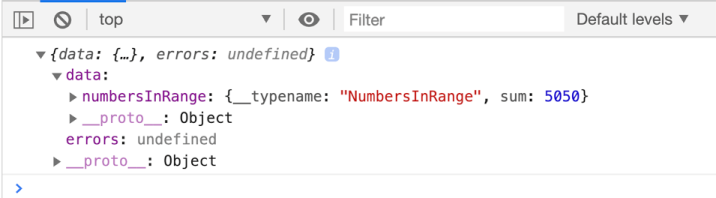
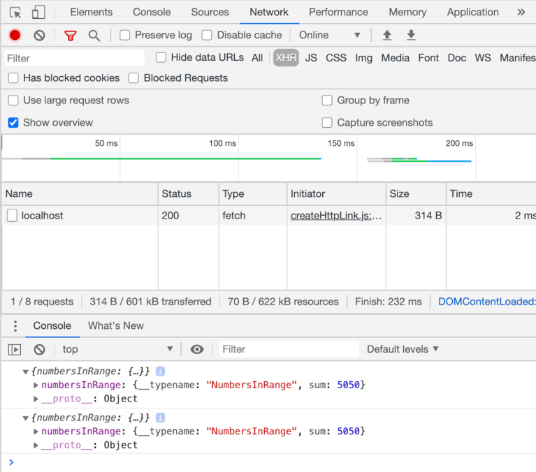
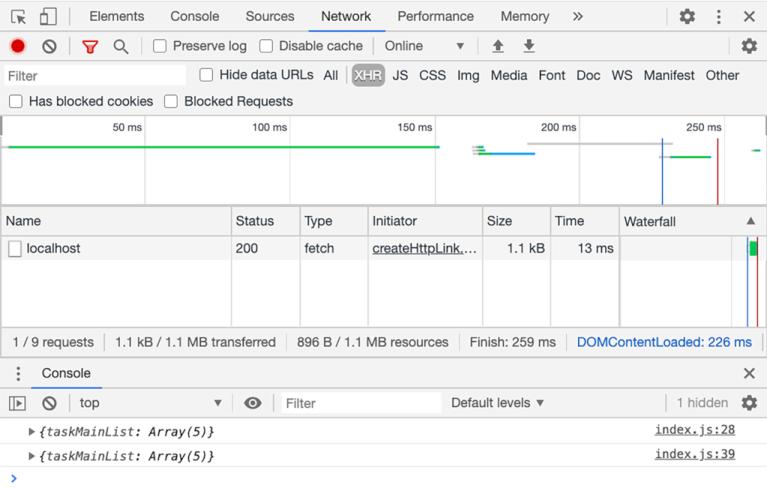
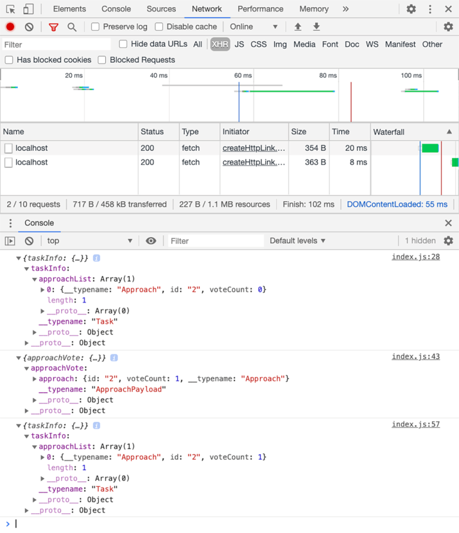
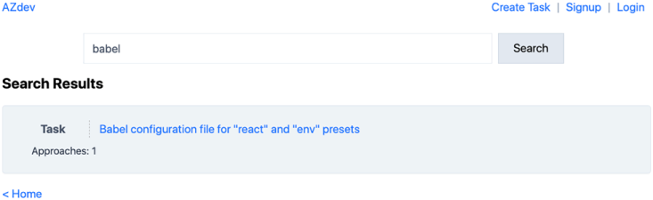
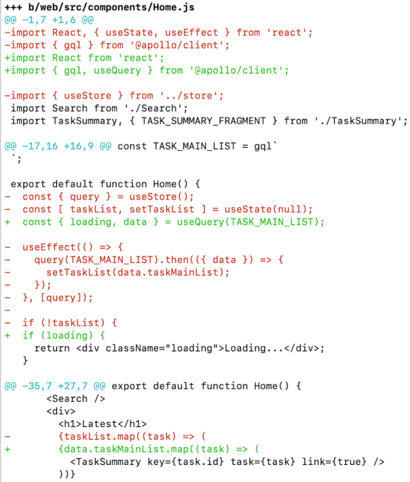
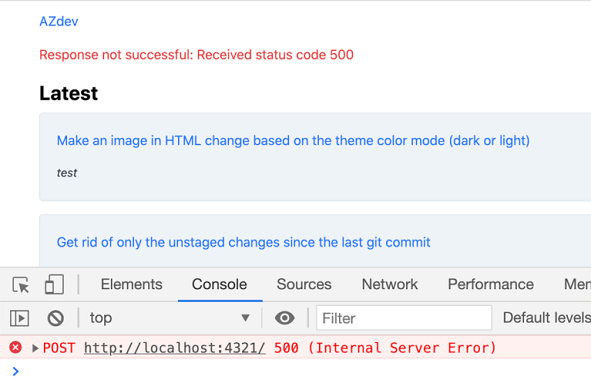
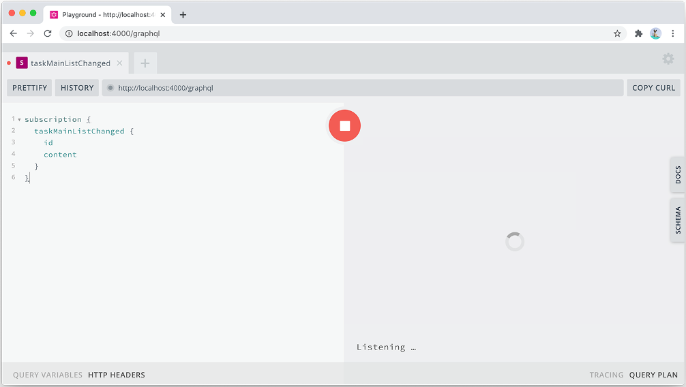
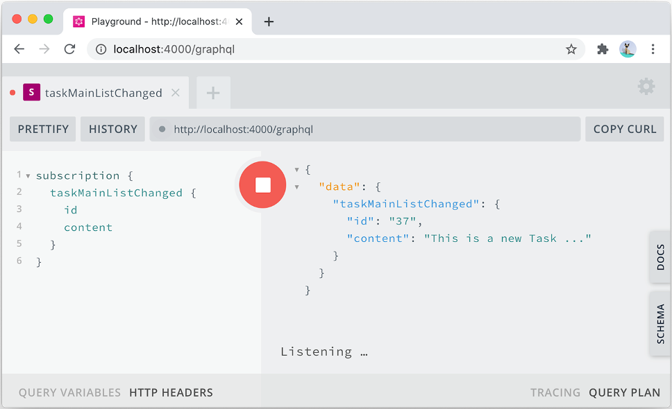

# 将 GraphQL API 与 Apollo 客户端一起使用
本章涵盖

- 在纯 JavaScript 和 React 中使用 Apollo Client
- 了解 Apollo 的链接和缓存
- 使用 Apollo 的钩子函数进行查询和修改
- 使用 Apollo 管理本地应用状态
- 通过 WebSockets 实现和使用 GraphQL 订阅

在 GraphQL 实现开始在 GitHub 上受到关注后不久，另一类 GraphQL 库也开始引起注意：客户端库。

GraphQL 客户端库旨在管理前端应用程序和后端 GraphQL 服务之间的通信。 客户端库抽象了向 GraphQL 服务请求数据、指示它进行更改以及使其数据响应可用于前端应用程序的视图层的任务。

正如 GraphQL 服务可以被认为是与数据库进行所有通信的代理一样，GraphQL 客户端可以被认为是与 GraphQL 服务进行所有通信的代理。

许多 GraphQL 客户端库还具有服务器组件，以丰富服务器体验并支持常见的前端应用程序需求，例如缓存、通过列表分页和使用实时数据。

一些 GraphQL 客户端专为与 React 配合使用而设计。 该类别中最受欢迎的是 Relay (relay.dev)，它主要是一个受 Facebook 使用 GraphQL 方式影响的 Facebook 项目。 Relay 是 GraphQL 的第一个客户端框架，它塑造了 Facebook GraphQL 语言的发展。

其他 GraphQL 客户端专为多个视图库而设计，主要关注 React。 该类别中最受欢迎的是 Apollo Client (apollographql.com)，它是 Meteor Development Group 管理的一系列 GraphQL 工具的一部分。

还有亚马逊的 AWS Amplify (aws.amazon.com/amplify)。 它是一个完整的开发平台，涵盖了前端应用程序的整个开发工作流程。

这些只是一些包含 GraphQL 客户端的顶级 JavaScript 项目，但还有更多使用 JavaScript 和许多其他语言的客户端。 查看 az.dev/graphql-clients 以获得所有 GraphQL 客户端库的完整列表。

GraphQL 客户端提供类似的功能，但复杂程度和定制程度各不相同。 为了探索如何将 GraphQL 客户端库与 GraphQL API 一起使用的示例，我们将使用 Apollo Client，因为它是支持多个视图库的最受欢迎的客户端。

提示如果你有兴趣学习如何使用 Relay.js，请查看 jscomplete.com/relay 上的资料。

> 当前代码
>
> 使用 git checkout 10.0 将你的本地存储库重置为代码中的当前进度。 如果你需要存储任何本地更改，请使用 git add 。 && git 存储。 请记住运行 npm install 以安装任何缺少的依赖项。

## 10.1 通过 JavaScript 使用 Apollo 客户端

Apollo Client 可以与 React、Vue、Angular 和许多其他软件一起使用。 它也可以与纯 JavaScript 一起使用。 让我们先从一个如何做到这一点的例子开始； 然后我们将看到如何在 AZdev React 项目中使用它。

使用 Apollo Client 的第一步是将其添加到项目依赖项中。 它托管在 npm 包@apollo/client 下。

清单 10.1 命令：安装 Apollo 客户端包

```sh
$ npm install @apollo/client
```

提示 本章中的所有代码示例都设计为与 Apollo Client 版本 3 一起使用，这是撰写本文时的最新版本。 如果在你阅读本书时，更新版本的 Apollo Client 已经发布，它的 API 很可能会有所不同。 查看 az.dev/gia-updates 以查看本章可能需要的任何 API 更新。

### 10.1.1 发起查询请求

让我们首先看看如何使用 Apollo Client 查询方法（不是特定于 React 的）发出简单的 GraphQL 查询请求。

注意 清单 10.2-10.5 是用于测试的临时示例。 我们将在清单 10.6 中还原。

删除 web/src/index.js 中的所有内容，并替换为以下内容。

清单 10.2 示例：初始化和使用 Apollo 客户端（在 web/src/index.js 中）

```js
import {
  ApolloClient,
  HttpLink,
  InMemoryCache,
  gql,
} from '@apollo/client';
 
import * as config from './config';
 
const cache = new InMemoryCache();
const httpLink = new HttpLink({ uri: config.GRAPHQL_SERVER_URL });
const client = new ApolloClient({ cache, link: httpLink });
 
async function main() {
  const { data, errors } = await client.query({
    query: gql`
      query {
        numbersInRange(begin: 1, end: 100) {
          sum
        }
      }
    `,
  });
 
  console.log({ data, errors });
}
 
main();
```

这是在纯 JavaScript 中使用 Apollo Client 的最简单示例，但它引入了许多新概念。 让我们来看看它们：

像 Apollo 这样的客户端库会替换你应用程序中的任何其他 Ajax 库。 你不需要"获取"来直接发出 Ajax 请求，因为客户端在内部发出所有请求。 这是每个 GraphQL 客户端的主要任务：它们为你发出所有 Ajax 请求并抽象处理 HTTP 请求和响应的复杂性。
ApolloClient 对象是一个构造函数，可用于为每个 GraphQL 服务初始化一个客户端对象。 一个应用程序可能会使用多个客户端实例来处理多个 GraphQL 服务。 在此示例中，我们有一个 httpLink 对象，我使用我们迄今为止一直使用的相同 config.GRAPHQL_SERVER_ URL 对其进行了初始化。
除了 link 属性，Apollo Client 还需要 cache 属性。 此属性用于指定 Apollo 将用于其商店的缓存对象。 默认缓存是 InMemoryCache 对象的实例，这使得 Apollo Client 使用浏览器的内存进行缓存。 这是大多数 Web 应用程序需要做的。 这种缓存灵活性允许 Apollo Client 实例与其他类型的缓存一起使用。 例如，如果你需要应用程序的缓存数据在会话之间持久保存，你可以使用在 window.localStorage 之上工作的缓存对象。
一旦使用有效的 GraphQL 服务链接属性和缓存策略初始化并配置了客户端对象，就可以使用其 API 方法。 清单 10.2 中的代码使用 query 方法发送 GraphQL 查询操作并为其检索服务器响应。 查询方法采用一个对象，其查询属性是表示要发送的 GraphQL 操作文本的对象。
我们没有使用带有 Apollo Client 查询方法的字符串，而是使用 gql 标记函数包装该字符串。 你可以将 gql 用作模板字符串标记（如我们在清单 10.2 中所做的那样）或用作以字符串作为参数的普通函数调用。 gql 函数将 GraphQL 字符串解析为抽象语法树 (AST)。 它基本上将字符串转换为结构化对象。 字符串是有限的。 结构化对象使 GraphQL 客户端能够更好地控制 GraphQL 操作，并使它们更容易提供高级功能。
如果一切正常，你应该会在浏览器的控制台中看到 console.log 消息，显示对 1-100 范围内的数字求和的结果（图 10.1）。



图 10.1 查询请求的输出

乍一看，清单 10.2 包含大量代码，用于发出可以通过简单、直接的 Ajax 调用完成的小请求。 然而，这段代码带来了巨大的胜利，我们可以立即看到。 重复相同的查询操作，并在刷新会话时查看浏览器中的"网络"选项卡。 这是一个演示的例子。

清单 10.3 示例：使用 Apollo Client 重复查询

```js
async function main() {
  const resp1 = await client.query({
    query: gql`
      {
        numbersInRange(begin: 1, end: 100) {
          sum
        }
      }
    `,
  });
  console.log(resp1.data);
 
  const resp2 = await client.query({
    query: gql`
      {
        numbersInRange(begin: 1, end: 100) {
          sum
        }
      }
    `,
  });
  console.log(resp2.data);
}
```

图 10.2 显示了你应该在浏览器的网络选项卡中看到的内容，已过滤以仅显示 XHR 请求 (XMLHttpRequest)。 Apollo Client 只为两个查询操作发出一个 Ajax 请求，因为第一个请求的响应被自动缓存（在内存中），并且 Apollo Client 发现不需要再次向服务器请求我们已经拥有的数据。



图 10.2 重复查询请求的输出

这是一个简单的示例，但 Apollo Client 在幕后做了很多繁重的工作以使缓存尽可能有用。 例如，它将每个数据响应缓存在一个扁平化的数据结构中，这样它就可以使用单个对象的缓存来确定未来需要哪些网络请求，即使对于不同的查询也是如此。 例如，在 web/src/index.js 中进行以下更改。

清单 10.4 示例：重复部分查询

```js
async function main() {
  const resp1 = await client.query({
    query: gql`
      {
        taskMainList {
          id
          content
          tags
          createdAt
        }
      }
    `,
  });
  console.log(resp1.data);
 
  const resp2 = await client.query({
    query: gql`
      {
        taskMainList {
          content
        }
      }
    `,
  });
  console.log(resp2.data);
}
```

此代码要求向服务器发送两个不同的查询操作。 但是，因为第二个是第一个的子集，所以Apollo Client不会第二次去服务器（如图10.3所示）。



图 10.3 部分查询代码的输出

虽然这令人印象深刻，但请等到你看到 Apollo Client 提供的其他功能（缓存等）。 让我再举一个例子，但这次是变异操作。

### 10.1.2 发起变更请求

要使用 Apollo Client 发出变更请求，你可以使用 .mutate 方法（而不是 .query）并提供一个具有变更属性的对象。 如果要发送的操作使用变量，你可以提供变量属性来指定它们的值。

以下是发送变异操作以对方法 2 进行投票的示例。我还包括一个查询，用于在变异前后获取方法 2（在任务 2 下）的 voteCount 字段，以验证它是否有效。

清单 10.5 示例：发送变更请求

```js
async function main() {
  const resp1 = await client.query({
    query: gql`
      query taskInfo {
        taskInfo(id: "2") {
          approachList {
            id
            voteCount
          }
        }
      }
    `,
  });
  console.log(resp1.data);
 
  const resp2 = await client.mutate({
    mutation: gql`
      mutation approachVote($approachId: ID!) {
        approachVote(approachId: $approachId, input: { up: true }) {
          approach {
            id
            voteCount
          }
        }
      }
    `,
    variables: { approachId: '2' },
  });
  console.log(resp2.data);
 
  const resp3 = await client.query({
    query: gql`
      query taskInfo {
        taskInfo(id: "2") {
          approachList {
            id
            voteCount
          }
        }
      }
    `,
  });
  console.log(resp3.data);
}
```

第一个查询请求应该显示方法 2 有 0 票。 第二个请求将投票计数更新为 1，第三个请求验证方法 2 现在有 1 票。

请注意，Apollo Client 在所有三个操作中都包含了自省的 __typename 字段，尽管我们没有指定它（见图 10.4）。 它是怎么做到的？ 而且，更重要的是，它为什么要这样做？

这是我们用 gql 包装所有操作的另一个原因。 由于请求被表示为对象，Apollo Client 可以检查这些对象并轻松修改它们，例如，包括 __typename 字段。

要了解 Apollo Client 为何这样做，请仔细查看你的 Network 选项卡（或我的，在图 10.4 中），并注意 Apollo Client 仅发出了两个网络请求。 它没有为第三个查询操作发出网络请求，因为该操作没有请求任何新内容。 变异操作已经通知 Apollo Client 新的 voteCount 为 1，所以它缓存了那个数字。 由于它也要求提供 \_\_typename，因此它可以使用 \_\_typename 和 id 的组合来唯一标识它在全局级别上看到的每个对象。 对于方法 2，它正是这样做的。它使用方法的全局唯一 ID (Approach:2) 来确定我们已经知道对象的 ID 和 voteCount。



图 10.4 突变请求代码的输出

这很让人佩服。 我们没有做任何特别的事情来使这个强大的功能发挥作用。 我们只是发出相同的简单查询和变更，Apollo Client 智能地让缓存为它们无缝工作。

本章的其余部分将演示 Apollo Client 如何与 React 一起使用，并展示它为 React 应用程序提供的强大功能。 首先，我们将使用 Apollo 的 query 和 mutate 方法，而不是我们迄今为止在没有客户端的情况下执行的手动 Ajax 请求。 然后我们将探讨如何使用 Apollo 的特定于 React 的方法调用这些突变。

你现在可以恢复到目前为止在 web/src/index.js 中所做的所有测试更改并放回原始代码。

清单 10.6 web/src/index.js 中的代码

```js
import 'regenerator-runtime/runtime';
import React from 'react';
import ReactDOM from 'react-dom';
 
import { useStoreObject, Provider } from './store';
import Root from './components/Root';
 
export default function App() {
  const store = useStoreObject();
  return (
    <Provider value={store}>
      <Root />
    </Provider>
  );
}
 
ReactDOM.render(<App />, document.getElementById('root'));
```

> 当前代码
>
> 使用 git checkout 10.1 将你的本地存储库重置为代码中的当前进度。

## 10.2 将 Apollo 客户端与 React 结合使用

要将 Apollo Client 与 React 一起使用，我们首先需要对其进行初始化（就像我们在清单 10.2 中所做的那样）。 web/src/store.js 是此应用程序执行此操作的好地方，到目前为止我们一直在其中管理本地应用程序状态。

清单 10.7 web/src/store.js 中的变化

```js
import React, { useState } from 'react';
import fetch from 'cross-fetch';
 
import * as config from './config';
import {
  ApolloClient,
  HttpLink,
  InMemoryCache,
} from '@apollo/client';
 
const httpLink = new HttpLink({ uri: config.GRAPHQL_SERVER_URL });
const cache = new InMemoryCache();
const client = new ApolloClient({ link: httpLink, cache });
// ·-·-·
```

### 10.2.1 直接使用query和mutate方法

现在，我们需要引入两种新方法，而不是在商店的上下文对象中导出的基于获取的请求方法：一种用于查询，一种用于突变。 为了将应用程序中的更改保持在最低限度，我们将首先使用与旧请求函数完全相同的函数签名。 新方法将只是 Apollo Client 方法的包装器。

清单 10.8 web/src/store.js 中的变化

```js
// ·-·-·
 
export const useStoreObject = () => {
  // ·-·-·
 
  const query = async (query, { variables } = {}) => {
    const resp = await client.query({ query, variables });
    return resp;
  };
 
  const mutate = async (mutation, { variables } = {}) => {
    const resp = await client.mutate({ mutation, variables });
    return resp;
  };
 
  return {
    useLocalAppState,
    setLocalAppState,
    AppLink,
    query,
    mutate,
  };
};
```

提示你可以删除请求方法。 我们不再需要这种依赖。

请注意，我将这些新方法保留在 useStoreObject 函数中，因为我们仍然需要包含 authToken 标头，它是用户状态对象（由商店管理）的一部分。 在本章后面，我们将看到 Apollo Client 如何取代整个本地应用程序状态存储。

现在，对于所有组件中对旧请求函数的每次调用，我们必须执行以下操作：

- 添加 import { gql } from '@apollo/client' 语句。
- 用 gql 包装查询或变异文本。
- 不是请求，而是从 useStore 中解构查询或变异。
- 如果操作是查询，则将请求方法替换为查询；如果操作是变异，则将请求方法替换为变异。

例如，在 web/src/components/Home.js 中，这是我们必须进行的更改。

清单 10.9 web/src/components/Home.js 中的变化

```js
// ·-·-·
import { gql } from '@apollo/client';
 
const TASK_MAIN_LIST = gql`
  query taskList {
    taskList {
      id
      ...TaskSummary
    }
  }
 
  ${TASK_SUMMARY_FRAGMENT}
`;
 
export default function Home() {
  const { query } = useStore();
  const [ taskList, setTaskList ] = useState(null);
 
  useEffect(() => {
    query(TASK_MAIN_LIST).then(({ data }) => {
      setTaskList(data.taskList);
    });
  }, [query]);
 
  if (!taskList) {
    return <div className="loading">Loading...</div>;
  }
 
  // ·-·-·
 }
```

下面是一个示例，说明如何替换变异操作的请求调用。 在 web/src/components/Login.js 中，要进行的更改如下。

清单 10.10 web/src/components/Login.js 中的变化

```js
// ·-·-·
import { gql } from '@apollo/client';
 
const USER_LOGIN = gql`
  mutation userLogin($input: AuthInput!) {
    userLogin(input: $input) {
      errors {
        message
        field
      }
      user {
        id
        name
      }
      authToken
    }
  }
`;
 
export default function Login() {
  const { mutate, setLocalAppState } = useStore();
  const [ uiErrors, setUIErrors ] = useState();
  const handleLogin = async (event) => {
    event.preventDefault();
    const input = event.target.elements;
    const { data, errors: rootErrors } = await mutate(USER_LOGIN, {
      variables: {
        input: {
          username: input.username.value,
          password: input.password.value,
        },
      },
    });
    // ·-·-·
  };
 
  // ·-·-·
}
```

这就是最简单的层面。 你现在可以测试主页和登录表单。 GraphQL 操作将通过 Apollo Client 完成，而不是以前基于 fetch 的请求方法。

注意如果你删除旧的请求方法，其他所有内容都会出错。

继续并更改所有其他组件以使用查询/变异而不是请求。 在你的代码编辑器中查找 request( 以查找所有需要更改的组件。某些操作将无法正常工作，因为新的 query/mutate 方法尚未包含当前用户的 authToken。我们接下来将修复该问题。

Git 分支 10.2 具有所有这些更改。 所有 GraphQL 操作都是使用新的查询/变异方法完成的。

> 当前代码
>
> 使用 git checkout 10.2 将你的本地存储库重置为代码中的当前进度。

你是否注意到我们对组件所做的更改很小？ 我们只是用 gql 包装了操作文本，并用另一个方法替换了一个方法。 这就是拥有良好抽象的力量。

到目前为止，我们所做的是在 React 应用程序中基本使用 Apollo Client，但它已经取得了回报。 主页数据现在在第一次点击后缓存。 如果你导航到任务页面然后返回主页，Apollo Client 将不会为任务列表发出另一个网络请求。

### 10.2.2 包括身份验证标头

虽然缓存很棒，但它带来了一些我们需要了解的挑战。 立即测试搜索表单。 由于我们不再在所有请求中包含 authToken，因此搜索操作将无法针对私有任务条目正常工作。 例如，在使用 test/123456 登录后测试搜索"babel"。 该用户拥有关于 Babel 的示例数据任务记录，但搜索字段当前未返回它。 我们需要在 GraphQL 请求的标头中包含当前的 authToken 值来解决这个问题。

但是，既然我们通过 Apollo Client 发出 Ajax 请求，我们就无法直接控制要发送的标头。 我们需要通过 Apollo Client 方法和流程来完成请求。 我们可以通过@apollo/link-context 包进行Ajax 请求，它可以用来改变Apollo Client 发出的GraphQL 操作的上下文。 我们只是创建一个新的链接对象，并使其成为 Apollo Client 链接链的一部分。

提示 Apollo 有几个不同的链接对象，你可以将它们作为链接链的一部分。 例如，@apollo/link-schema 可用于直接在提供的模式对象上执行 GraphQL 操作。 这通常用于服务器端渲染。 还有@apollo/link-ws，我们稍后将使用它来使 Apollo Client 与 WebSockets 一起工作。 甚至还有 @apollo/link-rest，它可用于将来自 REST API 的数据集成到 Apollo Client 的缓存中。 在 az.dev/apollo-links 查看 Apollo 链接的完整列表。

要使当前用户的 authToken 值成为链接链上下文的一部分，请从安装新包开始。

清单 10.11 命令：安装 Apollo 链接上下文包

```sh
$ npm install @apollo/link-context
```

然后如下更改 web/src/store.js 以使新链接成为 Apollo Client 链的一部分。

清单 10.12 web/src/store.js 中的变化

```js
// ·-·-·
import { setContext } from '@apollo/link-context';
// ·-·-·
 
export const useStoreObject = () => {
  // ·-·-·
 
  const AppLink = ({ children, to, ...props }) => {
    // ·-·-·
  };
 
  const authLink = setContext((_, { headers }) => {
    return {
      headers: {
        ...headers,
        authorization: state.user
          ? `Bearer ${state.user.authToken}`
          : '',
      },
    };
  });
 
  client.setLink(authLink.concat(httpLink));
 
  // ·-·-·
};
```

请注意，我将新的 authLink 放置在 useStoreObject 应用程序中，以便它可以使用 JavaScript 闭包来访问 state.user 对象（存储在 React 上下文对象中）。 现在，如果你以"test"用户身份登录时搜索"babel"，它应该可以工作。

提示如果搜索"babel"不起作用，请尝试重新启动你的 Web 服务器以清除所有以前的缓存。

但是，有一个问题。 要查看实际效果，请在不刷新浏览器的情况下测试此流程：

- 使用 test/123456 登录。
- 搜索"babel"（应该可以）。
- 登出。
- 再次搜索"babel"（这应该不起作用）。

你会注意到第二个公共搜索返回私有 Babel 任务条目（图 10.5）。 为什么？



图 10.5 缓存用户会话问题

发生这种情况是因为 Apollo Client 缓存。 当所有者登录时，对"babel"的搜索被缓存，当所有者注销时它仍然被缓存。

这是处理缓存时的常见挑战。 应用程序逻辑经常需要手动重置缓存。

提示 你应该安装 Apollo Client devtools 扩展 (az.dev/ac-devtools)。 它将在浏览器的开发工具中添加一个 Apollo 选项卡，你可以在其中检查和调试与 Apollo 相关的问题。 此扩展还使你能够使用我们在 web/src/store.js 中配置的 Apollo Client 对象使用的相同网络接口来可视化你的 Apollo 缓存存储、查看活动查询和变量以及测试 GraphQL 突变。

Apollo Client 提供了许多使用缓存的方法。 你可以部分或全部重置缓存，你可以在操作后直接执行此操作（例如，在 USER_LOGIN 更改后立即执行）或在应用程序状态更改时全局执行此操作。 让我们做后者。 让我们在用户登录或注销时重置整个存储的缓存。 我们可以在 setLocalAppState 上下文方法（此代码用于更新本地应用程序状态的方法）中执行此操作。

清单 10.13 web/src/store.js 中的变化

```js
const setLocalAppState = (newState) => {
  if (newState.component) {
    newState.component.props = newState.component.props ?? {};
  }
  setState((currentState) => {
    return { ...currentState, ...newState };
  });
  // Reset cache when users login/logout 
  if (newState.user || newState.user === null) {
    client.resetStore();
  }
};
```

现在，如果你再次测试双重搜索流程，它应该可以正常工作。

提示你不必重置整个商店。 你可以部分重置它。 例如，你可以使用 cache.writeQuery 方法清除单个查询的缓存数据。 我们将在本章后面看到一个如何使用它的例子。

> 当前代码
>
> 使用 git checkout 10.3 将你的本地存储库重置为代码中的当前进度。

### 10.2.3 使用 Apollo 钩子函数
虽然我们有一个可行的解决方案可以通过 Apollo Client 进行所有 GraphQL 通信，但这并不是使用它的理想方式。 我们根本没有利用 Apollo Client 提供的大部分功能。

Apollo Client 提供了 React hook 函数来简化视图组件的逻辑。 两个最常见的 Apollo 钩子函数是 useQuery 和 useMutation，它们是将 Apollo Client 与 React 结合使用的主要方式。 事实上，如果我们更改代码以使用它们，我们将不需要我们目前拥有的查询/变异方法。

为了能够在组件中使用这些钩子函数，我们必须用提供者组件包装组件树。 提供者组件的概念很简单：你为提供者组件提供一个对象，它使该对象可用于它包装的组件树中的所有子组件。

检查 web/src/index.js 中的代码，看看它如何使用 Provider 组件使全局存储在子组件中可用。 组件通常不直接使用存储对象，而是使用可以访问它的方法（通过 React 的上下文）。 当前商店中此类方法的示例有 useLocalAppState、setLocalAppState 和 AppLink。

Apollo Client 的 provider 组件以类似的方式工作。 你使客户端实例（它正在成为我们新的应用程序状态存储）提供的上下文值。 然后，子组件可以使用挂钩函数（如 useQuery）来访问和修改 Apollo Client 的状态（缓存）。

React 支持拥有多个提供者包装器（提供不同的上下文）。 为了使使用 Apollo 挂钩的第一步的更改最小，让我们像使用 Apollo 提供程序组件一样包装组件树。

首先，让我们从存储中删除查询和变异方法，并公开客户端实例对象。

清单 10.14 web/src/store.js 中的变化

```js
// ·-·-·
export const useStoreObject = () => {
  // ·-·-·
 
  const authLink = setContext((_, { headers }) => {
    // ·-·-·
  });
 
  client.setLink(authLink.concat(httpLink));
 
  // Remove query/mutate methods
 
  return {
    useLocalAppState,
    setLocalAppState,
    AppLink,
    client,
  };
};
```

注意 请记住，Apollo Client 对象仍然必须绑定到当前本地应用程序状态存储（以访问用户状态并包含当前的 authToken 值）。 在本章的后面，我们将看到如何通过 Apollo Client 本身来管理应用程序状态以简化代码并仅使用一个全局上下文对象。

Apollo 导出 ApolloProvider 组件，该组件可用于使客户端实例对所有子组件可用。 以下是 web/src/index.js 中定义和使用 ApolloProvider 的更改。

清单 10.15 web/src/index.js 中的变化

```js
// ·-·-·
import { ApolloProvider } from '@apollo/client';
 
import { useStoreObject, Provider as StoreProvider } from './store';
import Root from './components/Root';
 
export default function App() {
  const store = useStoreObject();
  return (
    <ApolloProvider client={store.client}>
      <StoreProvider value={store}>
        <Root />
      </StoreProvider>
    </ApolloProvider>
  );
}
 
ReactDOM.render(<App />, document.getElementById('root'));
```

请注意，我将之前的 Provider 组件重命名为 StoreProvider，因为它不再是"the"provider。 更具体的名称更好。

有了对所有组件可用的客户端实例对象，我们现在可以在组件树的任何地方使用 Apollo 挂钩。 让我们从 Home 组件开始。

以下是我对该组件所做的更改，以使其使用 useQuery 挂钩函数。

清单 10.16 web/src/components/Home.js 中的变化

```js
import React from 'react';
import { gql, useQuery } from '@apollo/client';
 
import Search from './Search';
import TaskSummary, { TASK_SUMMARY_FRAGMENT } from './TaskSummary';
// ·-·-·
 
export default function Home() {
  const { loading, data } = useQuery(TASK_MAIN_LIST);     ❶
 
  if (loading) {                                          ❷
    return <div className="loading">Loading...</div>;
  }
 
  return (
    <div>
      <Search />
      <div>
        <h1>Latest</h1>
        {data.taskMainList.map((task) => (
          <TaskSummary key={task.id} task={task} link={true} />
        ))}
      </div>
    </div>
  );
}
```

❶ 调用查询操作，返回GraphQL响应对象和加载状态
❷ 当查询挂起时，UI 可以显示一个指示器。 查询操作完成后，React 重新渲染组件，Apollo 将 loading 设置为 false。

那是多么简单和美好？ 查看此更改的 git diff 输出，看看我们能够替换什么（图 10.6）。



图 10.6 src/components/Home.js 的 git diff 输出

简单的 useQuery 钩子函数使我们能够取代 useState 和 useEffect React 钩子函数，这些函数以前用于手动执行数据获取和管理请求状态。 这一切现在都在 Apollo Client 内部完成。

loading 变量是一个布尔值，当网络数据请求挂起时，Apollo 将其设置为 true。 useQuery 还返回一个错误变量，它包含任何 GraphQL 根错误或网络错误。 你的 UI 应始终处理加载和错误状态。 例如，我们可以添加另一个 if 语句并在错误变量有值时呈现错误消息。

清单 10.17 web/src/components/Home.js 中的变化

```js
export default function Home() {
  const { error, loading, data } = useQuery(TASK_MAIN_LIST);
 
  if (error) {
    return <div className="error">{error.message}</div>     ❶
  }
 
  if (loading) {
    return <div className="loading">Loading...</div>;
  }
 
  // ·-·-·
}
```

❶ 如果 useQuery 返回错误值，则该值是一个对象，该对象具有描述错误的消息属性。

提示 在 UI 中处理错误时，你应该尝试使错误分支尽可能靠近与其关联的数据。 例如，我在清单 10.17 中添加的 if 语句会阻塞整个主页，包括搜索框。 搜索框与 TASK_MAIN_LIST 查询中的任何可能错误无关。 尝试将其修复为练习。

Home 组件中的这一更改非常简单，因为替换的代码是组件执行的一项常见任务。 我们很快就会看到与 Apollo 相关的不太常见的例子； 但首先，让我们看看如何使用 useMutation 挂钩函数进行突变。

useMutation 钩子函数类似于 useQuery，但它不会立即发送操作。 它返回一个包含两项的元组，其中第一项是一个在调用时发送变异操作的函数。 第二项是变异结果（调用函数后）。

这是我们如何在返回的元组中使用这两个项目的示例。

清单 10.18 示例：一个 useMutation 调用

```js
const [ loginUser, { error, loading, data } ] = useMutation(USER_LOGIN);
```

loginUser 函数在被调用时发出网络请求，并返回 GraphQL 响应对象。 例如，我们可以执行以下操作来调用 loginUser 并读取其 GraphQL 响应对象的数据/错误属性。

清单 10.19 示例：调用变异函数

```js
const { data, errors } = await loginUser({
  variables: ·-·-·
});
```

以下是我对 web/src/components/Login.js 所做的更改，以使其使用 useMutation 挂钩函数发送其变异操作。

清单 10.20 web/src/components/Login.js 的变化

```js
import React, { useState } from 'react';
import { gql, useMutation } from '@apollo/client';
// ·-·-·
 
export default function Login() {
  const { setLocalAppState } = useStore();
  const [ uiErrors, setUIErrors ] = useState();
 
  const [ loginUser, { error, loading } ] = useMutation(USER_LOGIN);    ❶
 
  if (error) {
    return <div className="error">{error.message}</div>;
  }
 
  const handleLogin = async (event) => {
    event.preventDefault();
    const input = event.target.elements;
    const { data, errors: rootErrors } = await loginUser({              ❷
      variables: {
        input: {
          username: input.username.value,
          password: input.password.value,
        },
      },
    });
    if (rootErrors) {
      return setUIErrors(rootErrors);
    }
    const { errors, user, authToken } = data.userLogin;
    if (errors.length > 0) {
      return setUIErrors(errors);
    }
    // ·-·-·
   };
  // ·-·-·
}
```

❶ 定义变异操作但不调用它
❷ 调用变异操作并返回其 GraphQL 响应对象

请注意，此处的更改很小，因为登录组件在变更成功后没有 UI 状态（它只是被卸载）。

> 如何处理加载状态
>
> 你应该更改你的 UI 以指示请求处于待处理状态。 对于查询操作，这可以像在数据将出现的位置显示加载指示器一样简单。 对于突变，你至少应该禁用提交按钮（以防止通过多次单击进行多次操作）。 我通常还会让按钮在其标签中显示加载指示器。
> 例如，在 React 中，你可以通过以下方式禁用按钮并根据加载布尔变量更改其标签：
>
> ```js
> <button
>   type="submit"
>   disabled={loading}
> >
>   Save {loading && <i className="spinner">...</i>}
> </button>
> ```
>
> 我将更改此项目中的所有按钮以反映加载状态。 你可以在本书的 GitHub 存储库中查看最终版本中的这些更改。
> 现在是时候熟悉 useQuery 和 useMutation 了。 接下来转换 TaskPage 组件。 该组件目前有 3 个 useState 调用和 1 个 useEffect。 引入 useQuery 方法可以摆脱 useEffect 调用和三个 useState 调用之一。 试试看。 这就是我最终要做的。

清单 10.21 web/src/components/TaskPage.js 中的变化

```js
import React, { useState } from 'react';
import { gql, useQuery } from '@apollo/client';
// ·-·-·
 
export default function TaskPage({ taskId }) {
  const { AppLink } = useStore();
  // const [ taskInfo, setTaskInfo ] = useState(null);
  const [ showAddApproach, setShowAddApproach ] = useState(false);
  const [ highlightedApproachId, setHighlightedApproachId ] = useState();
 
  const { error, loading, data } = useQuery(TASK_INFO, {
    variables: { taskId },
  });
 
  if (error) {
    return <div className="error">{error.message}</div>;
  }
 
  if (loading) {
    return <div className="loading">Loading...</div>;
  }
 
  const { taskInfo } = data;
 
   const handleAddNewApproach = (newApproach) => {
    // setTaskInfo((pTask) => ({
    // ...pTask,
    // approachList: [newApproach, ...pTask.approachList],
    // }));
     setHighlightedApproachId(newApproach.id);
     setShowAddApproach(false);
   };
 
  return (
    // ·-·-·
  );
}
```

其余的 useState 对象（showAddApproach 和 highlightedApproachId）管理该组件本地的状态元素。 Apollo 通常不用于这种类型的本地组件状态。 然而，我们很快就会看到 Apollo 如何帮助我们摆脱 useStore 调用。

注意我注释掉了处理将新方法记录附加到任务对象下的方法列表的部分。 现在 Task 对象在 Apollo 缓存中被管理，我们将不得不弄清楚如何向它附加一条 Approach 记录。 我们将在 10.2.5 节中讨论。

> 当前代码
>
> 使用 git checkout 10.4 将你的本地存储库重置为代码中的当前进度。

提示另一个名为 react-query (dev/react-query) 的流行项目也提供了 useQuery/useMutation 方法。 它提供了在 React 中获取和更新异步数据的相同概念。 该项目可用于任何基于承诺的数据请求。 例如，你可以将它与 REST API 一起使用。

### 10.2.4 使用自动缓存
现在让我们重做 Approach 组件并将 mutate 方法替换为 useMutation。 该组件有一个突变来更新 Approach 对象的 voteCount。 这次重做带来了一个小小的惊喜； 但在我告诉你之前，请继续尝试自己做。

这就是我所做的。 试着弄清楚我在说什么惊喜。

清单 10.22 web/src/components/Approach.js 中的变化

```js
import React, { useState } from 'react';
import { gql, useMutation } from '@apollo/client';
 
import Errors from './Errors';
// ·-·-·
 
export default function Approach({ approach, isHighlighted }) {
  const [ uiErrors, setUIErrors ] = useState([]);
  const [ submitVote, { error, loading } ] = useMutation(APPROACH_VOTE);
 
  if (error) {
    return <div className="error">{error.message}</div>;
  }
 
  const handleVote = (direction) => async (event) => {
    event.preventDefault();
    const { data, errors: rootErrors } = await submitVote({
      variables: {
        approachId: approach.id,
        up: direction === 'UP',
      },
    });
    if (rootErrors) {
      return setUIErrors(rootErrors);
    }
    // Remove the setVoteCount call
  };
 
  const renderVoteButton = (direction) => (
    <button
      className="border-none"
      onClick={handleVote(direction)}
      disabled={loading}
    >
      {/* ·-·-· */}
    </button>
  );
 
  return (
    <div className={`box highlighted-${isHighlighted}`}>
      <div className="approach">
        <div className="vote">
          {renderVoteButton('UP')}
          {approach.voteCount}
          {renderVoteButton('DOWN')}
        </div>
 
        {/* ·-·-· */}
    </div>
  );
}
```

我现在总是处理错误/加载状态，因为 Apollo 使这变得如此简单。 请注意，我之前甚至跳过了该部分，因为它意味着添加一个新的 useState 调用。 除了使错误、加载和数据状态易于使用外，Apollo 还使使用它们所需的代码相似且通常可重用。

投票 UI 现在将通过 Apollo Client 挂钩函数工作。 验证。

你发现惊喜了吗？ 我能够摆脱用于在 UI 中反映投票结果的 voteCount 本地状态。 然而，使用此新代码仍会在 UI 中更新投票计数。 没有本地状态它是如何工作的？ 答案还是缓存！

我让 UI 直接使用 approach.voteCount，而不是 voteCount 本地状态。 由于 id 和 voteCount 字段包含在突变数据中（请记住，Apollo 也会自动添加 \_\_typename 字段），当收到此突变数据时，Apollo 使用唯一的 approach:id 标识符来更新已识别的 Approach 对象。 我没有在组件的代码中使用这个突变的数据部分，但在幕后，Apollo Client 做到了！

提示你可以通过从变异结果中删除 id 或 voteCount 字段（或两者）来测试此缓存更新。 如果你这样做，投票计数 UI 将不会更新。

自动更新缓存很棒，但我们经常需要在变异操作后手动更新缓存。 接下来让我们看一下。

### 10.2.5 手动更新缓存

当突变修改多个对象或创建或删除对象时，Apollo 缓存不会自动更新。 它仅在突变更新单个对象时才会更新。

在此应用程序中，我们有一个创建新 Approach 对象的变异操作（在 NewApproach 组件中）。 Apollo 不会为此操作自动更新其缓存。

我在 TaskPage 组件（清单 10.22）中注释掉的代码手动将新创建的 Approach 对象附加到它为此目的管理的本地状态元素。

由于 Task 对象下的所有 Approach 对象现在都在 Apollo 的缓存中进行管理，我们必须更新 Apollo 的缓存以在内存中附加一个新的 Approach 对象，而不是使用状态元素来附加一个新的 Approach 对象。

我们可以更新 NewApproach 或 TaskPage 组件中的缓存。 useMutation 挂钩函数接受更新函数（作为其第二个对象参数的属性），并在变异操作成功后调用该函数。 该更新函数接收缓存对象和变异操作的结果对象。 例如，下面是更新函数如何与 APPROACH_CREATE 突变一起使用。

清单 10.23 示例：在突变后使用更新回调

```js
// ·-·-·
export default function NewApproach({ taskId, onSuccess }) {
  // ·-·-·
 
  const [ createApproach, { error, loading } ] = useMutation(
    APPROACH_CREATE,
    {
      update(cache, { data: { approachCreate } }) {
        if (approachCreate.approach) {
          // Modify the cache for Task (ID: taskId)
          // and append the new approachCreate.approach record }
        },
      },
    );
 
  useEffect(() => {
    // ·-·-·
  }, [detailCategories, query]);
 
  // ·-·-·
}
```

Apollo 的缓存对象使用解析该数据的查询操作来管理数据。 它提供了 readQuery、writeQuery 和 modify 等方法来与缓存数据进行交互。 对于这个例子，我们需要使用 cache.modify 方法。 这是其基本用法的示例。

清单 10.24 示例：cache.modify 方法

```js
cache.modify({
  id: cache.identify(object),    ❶
  fields: {                      ❷
    fieldName(fieldValue) {
      return newFieldValue
    },
  },
});
```

❶ 需要修改缓存数据的对象。 在当前示例中，它是 Task 组件中的 taskInfo 对象。 cache.identify 方法返回对象的 Apollo 全局 ID（例如，"Task:2"）。
❷ 函数列表，每个需要修改的字段一个。 每个字段函数都将当前字段值作为参数并返回该字段的新值。 在当前示例中，这是 approachList 字段。

由于 cache.modify 函数需要使用 TaskPage 组件中的 taskInfo 对象，让我们重新设计 handleAddNewApproach 函数以接收回调函数（而不是新的 Approach 记录）并调用该回调函数，传入 taskInfo 对象。 让我们也从同一个回调函数返回新创建的方法 ID 值，以便我们可以使用它来突出显示该方法。

清单 10.25 web/src/components/TaskPage.js 中的变化

```js
export default function TaskPage({ taskId }) {
  const { AppLink } = useStore();
  const [ showAddApproach, setShowAddApproach ] = useState(false);
  const [
    highlightedApproachId,
    setHighlightedApproachId,
  ] = useState();
 
  // ·-·-·
 
  const { taskInfo } = data;
 
  const handleAddNewApproach = (addNewApproach) => {
    const newApproachId = addNewApproach(taskInfo);      ❶
    setHighlightedApproachId(newApproachId);
    setShowAddApproach(false);
  };
 
  // ·-·-·
}
```

❶ 使用已定义的 taskInfo 对象更新缓存的回调方法

handleAddNewApproach 函数作为 onSuccess 传递给 NewApproach 组件。 这是一个高阶函数，它接收一个函数作为它唯一的参数。 以下是需要调用新的 onSuccess 函数的方式。

清单 10.26 示例：如何调用新的 onSuccess 函数

```js
onSuccess((taskInfo) => {
  // Do something with taskInfo
  // return the new Approach ID value
});
```

此外，NewApproach 组件有两个 GraphQL 操作：加载详细类别的查询（类似于前面的查询示例）和创建 Approach 对象的突变（这是我们需要更新缓存的地方）。 以下是我对 NewApproach 组件所做的所有更改，使其发出两个操作，然后使用更新功能选项（在 useMutation 中）修改缓存并说明新创建的 Approach 记录。

清单 10.27 web/src/components/NewApproach.js 中的变化

```js
import React, { useState } from 'react';
import { gql, useQuery, useMutation } from '@apollo/client';
// ·-·-·
 
export default function NewApproach({ taskId, onSuccess }) {
  const { useLocalAppState } = useStore();
  const [ detailRows, setDetailRows ] = useState([0]);
  const [ uiErrors, setUIErrors ] = useState([]);
  const user = useLocalAppState('user');
 
  const { error: dcError, loading: dcLoading, data } = useQuery(
    DETAIL_CATEGORIES,
  );
 
  const [ createApproach, { error, loading } ] = useMutation(
    APPROACH_CREATE,
    {
      update(cache, { data: { approachCreate } }) {
        if (approachCreate.approach) {
          onSuccess((taskInfo) => {
            cache.modify({
              id: cache.identify(taskInfo),                          ❶
              fields: {
                approachList(currentList) {
                  return [approachCreate.approach, ...currentList];  ❷
                },
              },
            });
            return approachCreate.approach.id;
          });
        }
      },
    },
  );
 
  if (dcLoading) {
    return <div className="loading">Loading...</div>;
  }
  if (dcError || error) {
    return <div className="error">{(dcError || error).message}</div>;
  }
  const detailCategories = data.detailCategories.enumValues;
 
  // ·-·-·
 
  const handleNewApproachSubmit = async (event) => {
    // ·-·-·
    const { data, errors: rootErrors } = await createApproach({
      variables: {
        // ·-·-·
      },
    });
    if (rootErrors) {
      return setUIErrors(rootErrors);
    }
    const { errors } = data.approachCreate;
    if (errors.length > 0) {
      return setUIErrors(errors);
    }
    // No data handling here. It's all done in the update function
  };
 
  // ·-·-·
}
```

❶ 获取缓存中需要更新的taskInfo对象的Apollo ID
❷ 修改 approachList 字段并前置新的 Approach 对象

提示 该组件需要处理两个 GraphQL 操作的加载/错误状态。 这并不理想。 你真的应该尝试让每个 UI 组件都有一个主要操作。 尝试将 NewApproach 组件分成两部分：一个用于获取 DETAIL_CATEGORIES 查询，一个用于调用 APPROACH_CREATE 变更。

> 其他缓存函数
>
> readQuery 和 writeQuery 函数与与特定查询（和变量值，如果有）关联的缓存数据交互。 你向他们传递查询（例如，TASK_INFO）及其变量（如果有）（例如，taskId）。 你可以读取该查询的当前缓存数据并对其进行修改。 这些功能也可用于客户端实例对象（在 web/src/store.js 中定义）。
> Apollo Client 还具有 readFragment 和 writeFragment 函数，它们的工作方式类似，但使用的是片段。 根据必须更新的缓存对象的类型，使用片段通常更简单。

TIP 如果你需要在组件中使用客户端实例对象，你可以从@apollo/client 导入useApolloClient 钩子函数。

> 当前代码
>
> 使用 git checkout 10.5 将你的本地存储库重置为代码中的当前进度。

提示小心使用 cache.modify 方法，因为 Apollo 中的缓存数据可能与浏览器中显示的内容不同步。 你可能正在尝试修改缓存中不再存在的数据！ 该方法返回一个布尔值以指示修改是否成功。

### 10.2.6 有条件地执行操作
让我们将搜索组件代码转换为使用 Apollo 挂钩。 有一个新的挑战：只有当组件在 searchTerm 属性中有值时，才必须有条件地发送查询。 我们如何使它与 useQuery 一起工作？

如果我们只是用 useQuery 挂钩替换查询函数并摆脱 useEffect 挂钩，代码将如下所示。

清单 10.28 web/src/components/Search.js 中的变化

```js
import React from 'react';
import { gql, useQuery } from '@apollo/client';
// ·-·-·
 
export default function Search({ searchTerm = null }) {
  const { setLocalAppState, AppLink } = useStore();
  const { error, loading, data } = useQuery(SEARCH_RESULTS, {
    variables: { searchTerm },
  });
 
  if (error) {
    return <div className="error">{error.message}</div>;
  }
 
  const handleSearchSubmit = async (event) => {
    // ·-·-·
  };
 
  return (
    <div>
      {/* ·-·-· */}
      {data && data.searchResults && (
        <div>
          <h2>Search Results</h2>
          <div className="y-spaced">
            {data.searchResults.length === 0 && (
              <div className="box box-primary">No results</div>
            )}
            {data.searchResults.map((item, index) => (
              <div key={index} className="box box-primary">
                {/* ·-·-· */}
              </div>
            ))}
          </div>
          <AppLink to="Home">{'<'} Home</AppLink>
        </div>
      )}
    </div>
  );
}
```

但是，每次该组件呈现时，都会发送查询操作请求，其中 searchTerm 的值为空（图 10.7）。 该组件呈现为主页的一部分（以显示搜索表单）。 所以是的，那是行不通的。



图 10.7 空 searchTerm 问题

不幸的是，我们不能将 useQuery 调用放在 if 语句中。 这是使用挂钩的 React 要求（请参阅 az.dev/rules-of-hooks）。

我们可以通过几种不同的方式解决这个问题，我们将在接下来探讨。

#### 使用跳过选项

Apollo 的 useQuery 方法支持 skip 布尔选项。 真正的 skip 值使 Apollo 不发送查询操作。 这正是我们所需要的。

清单 10.29 示例：跳过 useQuery 操作

```js
import React from 'react';
import { gql, useQuery } from '@apollo/client';
// ·-·-·
 
export default function Search({ searchTerm = null }) {
  const { setLocalAppState, AppLink } = useStore();
  const { error, loading, data } = useQuery(SEARCH_RESULTS, {
    variables: { searchTerm },
    skip: !searchTerm,             ❶
  });
 
  // ·-·-·
 }
```

❶ 有searchTerm才执行查询
使用惰性查询
Apollo Client 有一个 useLazyQuery 方法，它不会立即执行查询，而是为你提供一个函数来执行查询（类似于 useMutation 的工作方式）。 这意味着我们可以保留 useEffect 钩子函数并在其中调用惰性查询函数。

清单 10.30 示例：使用惰性查询

```js
import React from 'react';
import { gql, useLazyQuery } from '@apollo/client';
// ·-·-·
 
export default function Search({ searchTerm = null }) {
  const { setLocalAppState, AppLink } = useStore();
  const [
    performSearch,
     { error, loading, data },
  ] = useLazyQuery(SEARCH_RESULTS, { variables: { searchTerm } });
 
  useEffect(() => {
    if (searchTerm) {
      performSearch();
    }
  }, [searchTerm, performSearch]);
 
  if (error) {
    return <div className="error">{error.message}</div>;
  }
 
  // ·-·-·
}
```


我喜欢这个解决方案比第一个好一点。 我认为它更灵活，更容易使用。 然而，这些解决方案（以及原始代码）并不理想。 我这样设计它们是为了向你展示 Apollo Client 的强大功能； 但是如果你发现自己需要使用惰性查询或跳过查询，我希望你首先问问自己是否可以通过使用单一职责原则（或其他干净代码原则）重组你的组件来解决问题。

#### 使用单一职责原则

搜索组件的问题在于它有两个职责。 它呈现搜索表单和搜索结果。 这违反了单一职责原则。 一个组件应该只做一件事。

通过简单地将搜索结果部分提取到一个新的条件渲染组件中，空搜索问题就消失了。

清单 10.31 web/src/components/Search.js 中的变化

```js
function SearchResults({ searchTerm }) {
  const { AppLink } = useStore();
  const { error, loading, data } = useQuery(SEARCH_RESULTS, {
    variables: { searchTerm },
  });
 
  if (error) {
    return <div className="error">{error.message}</div>;
  }
 
  if (loading) {
    return <div className="loading">Loading...</div>;
  }
 
  return (
    <div>
      {data.searchResults && (
        {/* ·-·-· */} )}
    </div>
  );
}
 
export default function Search({ searchTerm = null }) {
  const { setLocalAppState } = useStore();
 
  const handleSearchSubmit = async (event) => {
    event.preventDefault();
    const term = event.target.search.value;
    setLocalAppState({
      component: { name: 'Search', props: { searchTerm: term } },
    });
  };
 
  return (
    <div>
      <div className="main-container">
        <form method="post" onSubmit={handleSearchSubmit}>
          {/* ·-·-· */}
        </form>
      </div>
      {searchTerm && <SearchResults searchTerm={searchTerm} />}
    </div>
  );
}
```

因为新的 SearchResults 组件只有在有 searchTerm 时才会渲染，所以我们可以使用 useQuery 函数来获取它的数据。 这个解决方案换句话说，我们只是简单地提出了是否渲染组件的条件，而不是是否发出查询请求。

提示 在这个例子中我保持简单的拆分，但我会在这里使用三个组件：一个用于搜索表单，一个用于搜索结果，一个用于搜索页面（呈现其他两个）。

作为练习，将其余组件转换为在任何地方使用 Apollo 挂钩函数，并测试所有更改。 你需要更改 Signup、MyTasks 和 NewTask 组件。 将你的更改与存储库中的 Git 分支 10.6 进行比较，其中包含我进行所有转换后的代码。

> 当前代码
>
> 使用 git checkout 10.6 将你的本地存储库重置为代码中的当前进度。

> 挑战
>
> 再次测试重复用户名地址的注册表单。 Apollo Client 的默认错误策略将 GraphQL 根错误数组视为网络错误（并忽略任何部分数据）。 它只是抛出错误。 你可以通过在操作选项对象（挂钩函数的第二个参数）中指定一个 errorPolicy 字符串值来更改该行为。 如果你将 errorPolicy 指定为"all"，Apollo Client 将保留 GraphQL 根错误数组，供你的 UI 处理。 你可以使用 error.graphQLErrors 访问它。
>
> 你还必须删除通用错误对象 if 语句并将其处理移至 Errors 组件。

## 10.3 管理本地应用状态
我最喜欢的 Apollo Client 功能之一是如何使用它来管理应用程序的本地应用程序状态。 这里的本地一词并不意味着单个组件的本地。 它是与远程数据无关的状态数据的标签。

我们已经使用 Apollo 来管理应用程序状态。 我们将在本节中实现的本地应用程序状态的不同之处在于，它不会与服务器（远程）查询相关联。 相反，它将与本地查询相关联，我们很快就会看到。

在 AZdev 应用程序中，我们有两个本地应用程序状态元素：当前用户和组件对象。 web/src/store.js 中的整个上下文对象用于管理这两个元素。 让我们看看 Apollo Client 如何帮助我们摆脱那个上下文对象。

提示应用程序中的当前本地应用程序状态通过 web/src/store.js 中的 useState 调用进行管理。 新状态将在 React 应用程序的外部进行管理。 当状态由外部管理时，需要使用该状态的 React 组件必须订阅它（以便在外部状态更改时得到通知）。 useQuery 方法是一种订阅形式，因为当 Apollo 缓存存储有该查询的任何新数据时，它会导致 React 组件函数呈现。

Apollo 中的本地应用状态管理使用 writeQuery 方法将本地应用状态元素值放入缓存中。 但是writeQuery需要一个query，而本地app state没有这个query。 在 Apollo 中，我们只是为它构造了一个假查询。

你可以提出任何 GraphQL 查询（不管服务器架构如何）并告诉 Apollo 你只想在客户端使用该查询。 你可以对整个查询或现有查询的一部分执行此操作。 你将 @client 指令放在查询中的任何字段上，以告诉 Apollo 这是一个客户端专用字段，不需要从服务器获取。

因此，让我们为用户和组件本地状态元素执行此操作。 这是我为他们提出的查询。 把它放在 web/src/store.js 中。

清单 10.32 web/src/store.js 中的变化

```js
import {
  ApolloClient,
  HttpLink,
  InMemoryCache,
  gql,
} from '@apollo/client';
// ·-·-·
export const LOCAL_APP_STATE = gql`
  query localAppState {
    component @client {     ❶
      name
      props
    }
    user @client {          ❶
      username
      authToken
    }
  }
`;
```

❶ 注意 @client 指令，它告诉 Apollo 此查询仅供客户端使用，不应发送到服务器。

因为这个查询中的所有字段都有@client 指令，所以 Apollo 不会将整个查询发送到服务器。 当我们在应用程序中使用查询时，Apollo 会直接从缓存中读取它。

请注意，我匹配了应用程序在其构建的本地应用程序状态查询中用于这些元素的结构。 这将使应用程序中的更改保持在最低限度。

提示 我喜欢将本地查询与普通的远程查询分开。 但是，你可以混合仅客户端字段和普通字段，Apollo 将拆分你的混合查询，在本地管理本地部分，并将远程部分发送到服务器。

现在我们可以使用 Apollo 来读取和更新查询。 比如我们之前在store中使用state.user的地方，现在我们可以从缓存中读取。

清单 10.33 示例：readQuery 替换状态对象

```js
const { user } = cache.readQuery({ query: LOCAL_APP_STATE });
```

要更新用户/组件对象，而不是商店中的当前 setState 调用，我们可以执行以下操作。

清单 10.34 示例：writeQuery 替换 setState 调用

```js
cache.writeQuery({
  query: LOCAL_APP_STATE,
  data: { ...currentState, ...newState },
})
```

由于本地应用程序状态将完全由客户端实例对象管理，该对象现在是应用程序的新存储。 我们不需要 useStoreObject 函数（或其 useStore 挂钩）。 我们可以将所有功能定义为顶级导出并直接在组件中导入它们。 这包括 authLink 函数，我们之前将其放在 useStoreObject 中，以便它可以访问当前用户的 authToken。

为了让事情变得更有趣，让我们保持所有 React 组件中的代码不变，并尝试用 Apollo Client 本地应用程序状态管理替换 React 基于上下文的本地应用程序状态管理。 这意味着我们只能更改起点文件 (web/src/index.js) 和存储文件 (web/src/store.js)。

让我们从 Provider 组件开始。 我们可以去掉 StoreProvider 上下文； 我们不再需要它了。 我们也将客户端初始化代码移至项目起始文件，并在 web/src/store.js 中仅保留本地应用程序状态管理。 这样，可以提取本地应用程序状态方法并将其用于不同的项目和不同的客户端实例（而不是依赖于相同范围的客户端实例）。

这是转换 web/src/index.js 中代码的第一步。

清单 10.35 web/src/index.js 中的新代码

```js
import 'regenerator-runtime/runtime';
import React from 'react';
import ReactDOM from 'react-dom';
import {
  ApolloProvider,
  ApolloClient,
  HttpLink,
  InMemoryCache,
} from '@apollo/client';
import { setContext } from '@apollo/link-context';
 
import * as config from './config';
import Root from './components/Root';
 
const httpLink = new HttpLink({ uri: config.GRAPHQL_SERVER_URL });  ❶
const cache = new InMemoryCache();                                  ❶
const client = new ApolloClient({ link: httpLink, cache });         ❶
 
export default function App() {
  return (
    <ApolloProvider client={client}>
      <Root />                                                      ❷
    </ApolloProvider>
  );
}
 
ReactDOM.render(<App />, document.getElementById('root'));
```

❶ 将这些行移出 web/src/store.js（按原样）。
❷ 不再有嵌套的提供者！
我还没有在这里做任何新的事情。 我只是移动了一些东西并摆脱了 StoreProvider 和 useStore 调用。 有趣的部分是如何定义使标头包含已登录用户的 authToken 的 authLink 函数。

authLink 函数以前直接访问 state.user 对象。 现在它可以从 Apollo 缓存中读取该状态。

清单 10.36 web/src/index.js 中的变化

```js
// ·-·-·
const authLink = setContext((_, { headers }) => {                  ❶
  const { user } = client.readQuery({ query: LOCAL_APP_STATE });
  return {
    headers: {
      ...headers,
      authorization: user ? `Bearer ${user.authToken}` : '',
    },
  };
});
 
const client = new ApolloClient({
  link: authLink.concat(httpLink),
  cache,
});
// ·-·-·
```

❶ 将 authLink 移出 web/src/store.js。

请注意，我们不再需要使用 setLink 方法，因为 authLink 函数不再依赖于另一个函数范围。 我们可以直接用链接链定义Apollo客户端对象。

我们需要在此文件中进行的最后更改是初始化本地应用程序状态。 之前是在 useStoreObject 中完成的，但现在我们可以使用 writeQuery 调用。

清单 10.37 web/src/index.js 中的变化

```js
// ·-·-·
import { LOCAL_APP_STATE } from './store';      ❶
// ·-·-·
 
const client = new ApolloClient({
  link: authLink.concat(httpLink),
  cache,
});
const initialLocalAppState = {                  ❷
  component: { name: 'Home', props: {} },
  user: JSON.parse(window.localStorage.getItem('azdev:user')),
};
client.writeQuery({                             ❸
  query: LOCAL_APP_STATE,                       ❸
  data: initialLocalAppState,                   ❸
});                                             ❸
 
export default function App() {
  // ·-·-·
}
```

❶ 清单 10.32 中定义的新的仅客户端查询
❷ 将 initialLocalAppState 移出 web/src/store.js（按原样）。
❸ 更新本地应用状态的新方式

现在，web/src/store.js 中需要更改的是与本地应用程序状态一起使用的三个函数：useLocalAppState、setLocalAppState 和 AppLink 组件。 我们将把这三个函数保存在一个 useStore 函数中，这样我们就不需要对 React 组件进行任何更改。

让我们从 useLocalAppState 开始，一次一个地了解这三个函数。 这是它的新实现。

清单 10.38 web/src/store.js 中的变化

```js
// ·-·-·
import { useQuery, gql } from '@apollo/client';
// ·-·-·
export const useStore = () => {
  // ·-·-·
 
  const useLocalAppState = (...stateMapper) => {
    const { data } = useQuery(LOCAL_APP_STATE);       ❶
    if (stateMapper.length === 1) {
      return data[stateMapper[0]];
    }
    return stateMapper.map((element) => data[element]);
  };
 
  // ·-·-·
};
```

❶ 这一行是这个函数的根本改变。

我们刚刚使用 useQuery 挂钩函数读取了 LOCAL_APP_STATE 数据。 该查询的数据成为本地应用程序状态。

setLocalAppState 方法有点复杂。 它需要读取和写入缓存并在用户登录或注销时重置它，但不会丢失新的本地应用程序状态（现在需要在该缓存中继续）。

这是实现它的一种方法。

清单 10.39 web/src/store.js 中的变化

```js
// ·-·-·
import { useApolloClient, useQuery, gql } from '@apollo/client';
// ·-·-·
export const useStore = () => {
  // Delete the useState line
  const client = useApolloClient();
 
  // ·-·-·
 
  const setLocalAppState = (newState) => {
    if (newState.component) {
      newState.component.props = newState.component.props ?? {};
    }
    const currentState = client.readQuery({         ❶
      query: LOCAL_APP_STATE,
    });
    const updateState = () => {
      client.writeQuery({                           ❷
        query: LOCAL_APP_STATE,
        data: { ...currentState, ...newState },
      });
    };
    if (newState.user || newState.user === null) {
      client.onResetStore(updateState);             ❸
      client.resetStore();
    } else {
      updateState();
    }
  };
 
  const AppLink = ({ children, to, ...props }) => {
    // ·-·-·                                        ❹
  };
 
  return {
    useLocalAppState,
    setLocalAppState,
    AppLink,
  };
};
// Delete the React Context lines
```

❶ 使用 readQuery 直接从 Apollo 缓存中读取本地应用状态
❷ 直接使用 writeQuery 更新 Apollo 缓存中的本地应用状态
❸ resetStore 调用会删除所有本地应用程序状态数据。 发生这种情况时，我们需要更新本地应用程序状态查询。 onResetStore 使我们能够定义在商店重置后调用的回调函数。
❹ AppLink 实现是相同的。

就这样。 所有 UI 的工作方式与这些更改完全相同，但现在我们通过 Apollo Client 进行所有本地应用程序状态管理。 这比我们之前的要简单。 我们不再管理上下文对象或任何自定义挂钩来访问它。

提示 我使用 readQuery 方法只需要读取一次数据（而不是订阅它）。 但是，在 React 组件中，应该使用 useQuery 钩子函数来读取本地应用程序状态。 使用 useQuery，组件将在本地应用程序状态更改时重新呈现。 这就是为什么我让 useLocalAppState 函数使用 useQuery 钩子函数； 因此，当本地应用程序状态发生变化时，使用此功能的组件将被重新渲染。

我希望这个小例子展示了 Apollo 本地应用程序状态管理的强大功能，但我们只是触及了皮毛。 还有更多。

对于更大的本地状态树，你可以为本地应用程序状态元素编写自定义解析器。 你还可以定义本地突变并将它们与 useMutation 方法一起使用，而不是直接写入。 使用自定义解析器获得的另一件事是数据类型验证（因为你定义了参数和输入的类型）。 查看 jscomplete.com/apollo 以获取有关 Apollo Client 强大功能的更多示例。

> 当前代码
>
> 使用 git checkout 10.7 将你的本地存储库重置为代码中的当前进度。

## 10.4 实现和使用 GraphQL 订阅
我把最好的留到最后！ 让我们来看看如何定义和使用 GraphQL 订阅。

当你需要 UI 自动更新时，订阅非常有用。 例如，在查看主页上的任务列表时，我们计划在有新任务记录可用时通知用户——就像 Twitter 在你的时间线上有新推文时通知你的方式一样。

### 10.4.1 轮询和重新获取

要实现这样的功能，你有两种选择：

- 让你的应用不断向服务器询问任务列表。
- 让你的应用程序告诉服务器它对新任务感兴趣，并希望在创建任务时收到通知。

第二个选项是 GraphQL 订阅可以帮助你做什么。 第一个选项被称为连续轮询，有时它就足够了：如果你要自动更新的对象很小并且你不需要实时更新，轮询是一个可以考虑的选项。

Apollo 使连续轮询变得容易。 你只需向 useQuery 第二个参数添加一个选项，使其重复轮询数据。 例如，我们可以使用以下简单更改每五秒更新一次主页上的任务记录列表。

清单 10.40 示例：使用 pollInterval

```js
export default function Home() {
  const { error, loading, data } = useQuery(TASK_MAIN_LIST, {
    pollInterval: 5000,
  });
 
  // ·-·-·
}
```

就这样！ 现在列表将每五秒自动更新一次。

提示 通过打开两个浏览器并在一个浏览器中创建任务记录，同时在另一个浏览器中查看主页来测试这一点。

在某些情况下，你可以手动执行重新获取，而不是在轮询循环中自动执行。 如果你希望 Apollo 按需再次获取查询（例如，当用户单击 Refresh 按钮时），你可以使用 refetch 函数，Apollo 使所有 useQuery 结果都可以使用该函数。 这是一个例子。

清单 10.41 示例：按需重新获取查询

```js
export default function Home() {
  const { error, loading, refetch, data } = useQuery(TASK_MAIN_LIST);
 
  // ·-·-·
 
  return (
    <div>
      <Search />
      <div>
        <h1>Latest</h1>
        <button onClick={() => refetch()}>Refresh</button>
        {/* ·-·-· */}
      </div>
    </div>
  );
}
```

当用户单击刷新按钮时，此代码使 Apollo 再次获取相同的查询。

这些选项无法有效地获取最新任务记录的整个列表。 GraphQL 订阅是从 API 服务器获取新数据的更有效的选择。 撤消所有轮询/重新获取更改，让我们使用订阅操作自动更新此列表。

> fetchPolicy 选项
>
> 如果你希望 Apollo 忽略缓存并在组件重新呈现时始终获取查询，你可以像这样更改 fetchPolicy 选项：
>
> ```js
> export default function Home() {
>   const { error, loading, data } = useQuery(TASK_MAIN_LIST, {
>     fetchPolicy: 'network-only',
>   });
>  
>   // ·-·-·
> ```

### 10.4.2 实现订阅
在第 4 章中，我们为 AZdev API 计划了两个订阅操作：通知用户新任务记录可用的 taskMainListChanged 订阅和任务页面上自动更新投票计数的 voteChanged 订阅。 然而，在我们开始实现它们之前，我们需要修改 API 服务器并使其支持 WebSockets。

Web 应用程序的 GraphQL 订阅通常通过 WebSockets 通信协议完成。 WebSocket 提供全双工通信通道（通过单个 TCP 连接）。 服务器打开套接字，浏览器连接到它并保持连接活动。 然后，服务器可以使用该活动连接按需将新数据推送到浏览器。

到目前为止，我们使用的基于 Express 的 GraphQL 服务器不支持 WebSockets。 我们需要为所有订阅操作运行一个新服务器（在不同的端口上）。 支持为 GraphQL 订阅设计的 WebSocket 传输层的 Web 服务器有很多选项，但最受欢迎的是 Apollo Server (az.dev/apollo-server)。

TIP Apollo Server 有很多很酷的特性，它可以完全替代我们目前基于 Express 的服务器。 让我们首先看看如何使用它的 WebSocket 支持。 当我们完成订阅示例时，我们将摆脱基于 Express 的服务器并使用 Apollo Server 作为我们的主要 GraphQL API 服务器。

首先安装 apollo-server 包。

清单 10.42 命令：安装 Apollo Server 包

```sh
$ npm install apollo-server
```

然后对 api/src/server.js 进行以下更改以创建一个适用于我们的模式的 Apollo 服务器实例。

清单 10.43 api/src/server.js 中的更改

```js
import { ApolloServer } from 'apollo-server';
// ·-·-·
 
async function main() {
  // ·-·-·
 
  server.listen(config.port, () => {
    console.log(`API server is running on port ${config.port}`);
  });
 
  const serverWS = new ApolloServer({ schema });
 
  serverWS.listen({ port: 4000 }).then(({ subscriptionsUrl }) => {
    console.log(`Subscriptions URL: ${subscriptionsUrl}`);
  });
};
 
main();
```

这将在端口 4000 上运行一个网络套接字服务器。

注意 现在让基于 Express 的服务器在端口 4321 上运行。 它仍然是 API 服务的主要 Web 服务器。

订阅操作的实现依赖于 Pub/Sub 模式（Publish/Subscribe 的缩写）。 Pub/Sub 是一种简单的消息传递模式，旨在将数据事件与对其感兴趣的服务分离。 你可以使用事件标签标记代码中对数据的任何更改。 例如，当一个新的任务记录被创建时，我们可以让代码发布一个事件； 当任何 Approach 记录的投票数发生变化时，我们可以让代码发布另一个事件。

Apollo 服务器有一个内置的 PubSub 实现，我们可以使用它来做到这一点。 由于 Pub/Sub 操作会在多个地方发生，让我们在 api/src/pubsub.js 下创建一个新文件来准备一个 PubSub 实例，供 API 服务器代码的任何部分使用。

清单 10.44 新文件：api/src/pubsub.js

```js
import { PubSub } from 'apollo-server';
 
const pubsub = new PubSub();
 
export { pubsub };
```

现在，让我们在与我们正在实施的订阅相关的突变中发布事件。 我们可以使用 pubsub.publish 调用来做到这一点。 我们可以将数据作为任何已发布事件的一部分包含在内，并且该数据可用于使订阅解析器了解新的突变数据。

我们需要发布两个事件：一个在 taskCreate 突变字段中，供 taskMainListChanged 订阅使用，另一个在 approachVote 突变字段中，供 voteChanged 订阅使用。 以下是 api/src/schema/mutations.js 中用于发布这些事件的更改。

清单 10.45 api/src/schema/mutations.js 中的变化

```js
import { pubsub } from '../pubsub';
// ·-·-·
 
const MutationType = new GraphQLObjectType({
  name: 'Mutation',
  fields: () => ({
    // ·-·-·
    taskCreate: {
      type: TaskPayload,
      args: {
        input: { type: new GraphQLNonNull(TaskInput) },
      },
      resolve: async (
        source,
        { input },
        { mutators, currentUser },
      ) => {
        const { errors, task } = await mutators.taskCreate({
          input,
          currentUser,
        });
        if (errors.length === 0 && !task.isPrivate) {
          pubsub.publish(`TASK_MAIN_LIST_CHANGED`, {          ❶
            newTask: task,                                    ❷
          });
        }
        return { err服务器网址：http://localhost:4321/
订阅 URL：ws://localhost:4321/graphqlors, task };
       },
    },
 
    // ·-·-·
 
    approachVote: {
      // ·-·-·
      resolve: async (
        source,
        { approachId, input },
        { mutators },
      ) => {
        const { errors, approach } = await mutators.approachVote({
          approachId,
          input,
        });
        if (errors.length === 0) {
          pubsub.publish(`VOTE_CHANGED_${approach.taskId}`, {  ❸
            updatedApproach: approach,                         ❷
          });
        }
        return { errors, approach };
      },
    },
  }),
});
```

❶ 这是一个通用事件，但只有当 Task 对象不是"私有"时才会发布。
❷ 事件负载。 你可以在此处放置任何类型的数据。
❸ 动态事件标签示例。 它可以与依赖于变量的订阅操作一起使用。 voteChanged 订阅取决于 taskId 变量。 它不是像 taskMainListChanged 这样的一般订阅。

你可以给你的事件标签起任何你想要的名字。 我喜欢让它们与它们所服务的订阅操作相匹配。

提示 你应该将事件标签放在变量中并在代码中使用变量而不是直接使用字符串。 当你使用该方法时，代码编辑器会更有帮助。 例如，如果你使用了错误的变量名，他们会提醒你，但如果你使用了错误的字符串值，他们将无法提醒你。 有关此实践的示例，请参阅 AZdev 的官方存储库 (az.dev/contribute)。

API 服务器代码的任何部分都可以订阅正在发布的事件，例如，通过 WebSocket 发送它们的有效负载数据。 这正是订阅类型下的字段现在可以做的。

我们先看看 taskMainListChanged 订阅。 这是定义它的一种方法。

清单 10.46 新文件：api/src/schema/subscriptions.js

```js
import { GraphQLNonNull, GraphQLObjectType } from 'graphql';
 
import { pubsub } from '../pubsub';
import Task from './types/task';
 
const SubscriptionType = new GraphQLObjectType({
  name: 'Subscription',
  fields: () => ({
    taskMainListChanged: {
      type: new GraphQLNonNull(Task),
      resolve: async (source) => {
        return source.newTask;                                     ❶
      },
      subscribe: async () => {
        return pubsub.asyncIterator(['TASK_MAIN_LIST_CHANGED']);   ❷
      },
    },
  }),
});
 
export default SubscriptionType;
```

❶ 订阅事件
❷ 这里的 source 参数将包含事件的有效负载数据。

为了使这个新的订阅字段在模式中可用，我们必须使它成为我们在 api/src/schema/index.js 中定义的 GraphQLSchema 对象的一部分。

清单 10.47 api/src/schema/index.js 中的变化

```js
// ·-·-·
import SubscriptionType from './subscriptions';
 
export const schema = new GraphQLSchema({
  query: QueryType,
  mutation: MutationType,
  subscription: SubscriptionType,
});
 
console.log(printSchema(schema));
```

我们现在可以测试 taskMainListChanged 订阅字段。 然而，要做到这一点，我们需要一个也支持 WebSockets 的消费者。 你发送订阅操作以建立连接，然后发送变异操作以触发事件并查看 WebSocket 报告回来的数据。

默认情况下（在开发环境中），Apollo 服务器实例将使 GraphQL Playground 编辑器在 /graphql 可用。 GraphQL Playground 是一个基于 GraphiQL 的编辑器，它支持 WebSockets 并且有很多很酷的特性。

要测试 taskMainListChanged 突变，请在 http://localhost:4000/graphql 打开 GraphQL Playground 编辑器并运行以下操作。

清单 10.48 taskMainListChanged 订阅

```js
subscription {
  taskMainListChanged {
    id
    content
  }
}
```

你会注意到最初没有返回任何数据。 相反，GraphQL Playground 会显示一条"正在侦听"消息，反映此订阅字段解析器函数的状态，该函数正在侦听任何 Pub/Sub 事件（图 10.8）。



图 10.8 等待来自订阅的新数据

提示 GraphQL playground 有一个默认的深色主题。 我将其更改为屏幕截图的灯光。

要触发 Pub/Sub 事件发布操作，请在不同的浏览器会话中打开 UI 应用程序，登录并创建测试公共任务记录。 GraphQL Playground 应该立即显示你在订阅的数据响应中创建的新任务对象（之后它将继续侦听）。 每次创建新的公共任务记录时，它都会出现在响应数据中（图 10.9）。



图 10.9 订阅的新数据实时出现

你先尝试自己实现 voteChanged 订阅字段怎么样？ 我们已经为它添加了发布事件。 你只需要在 api/src/schema/subscriptions.js 中进行更改。 此订阅字段的唯一区别是它接收一个 taskId 参数，因此它只订阅为一个 Task 对象发布的事件。 这是我的实现方式。

清单 10.49 api/src/schema/subscriptions.js 中的变化

```js
import {
  GraphQLNonNull,
  GraphQLObjectType,
  GraphQLID,
} from 'graphql';
 
import { pubsub } from '../pubsub';
import Task from './types/task';
import Approach from './types/approach';
 
const SubscriptionType = new GraphQLObjectType({
  name: 'Subscription',
  fields: () => ({
    taskMainListChanged: {
      // ·-·-·
    },
    voteChanged: {
      type: new GraphQLNonNull(Approach),
      args: {
        taskId: { type: new GraphQLNonNull(GraphQLID) },            ❶
      },
      resolve: async (source) => {
        return source.updatedApproach;                              ❷
      },
      subscribe: async (source, { taskId }) => {
        return pubsub.asyncIterator([`VOTE_CHANGED_${taskId}`]);    ❸
      },
    },
  }),
});
```

❶ 这个订阅有一个 taskId 参数。
❷ 从事件的负载数据中读取 updatedApproach 对象
❸ 只订阅与taskId参数值相关的VOTE_CHANGED事件

确保此订阅在 GraphQL Playground 中也能正常工作（同时对任务下的方法进行投票）。

> 当前代码
>
> 使用 git checkout 10.8 将你的本地存储库重置为代码中的当前进度。

### 10.4.3 阿波罗服务器
WebSocket 支持只是 apollo-server 包必须提供的众多功能之一。 Apollo Server 实际上可以替代我们在服务器端使用的许多包。 它可以替代 GraphQL.js 本身，并且它支持仅使用 SDL 文本（而不是使用对象）来实现你的 GraphQL 模式。 如前所述，它可以取代我们整个基于 Express 的服务器设置（与 Express 相关的一切）。

提示如果你有兴趣了解如何使用字符串而不是对象来实现 GraphQL 服务，你可以在 az.dev/schema-first 找到我写的关于该主题的文章。

要用 Apollo 替换 Express，我们必须稍微改变一下。 我们必须将上下文属性定义为一个函数。 Apollo 使 req 对象在该函数的参数中可用。 这意味着我们可以在那个上下文函数中定义我们的加载器和修改器（它们依赖于 req 对象）。

这是我删除与 Express.js（和 express-graphql）相关的所有内容并修改 ApolloServer 以使用我们的上下文对象后的新 web/src/server.js 文件。

清单 10.50 web/src/server.js 中的新代码

```js
import DataLoader from 'dataloader';
import { ApolloServer } from 'apollo-server';
 
import { schema } from './schema';
import pgApiWrapper from './db/pg-api';
import mongoApiWrapper from './db/mongo-api';
 
import * as config from './config';
 
async function main() {
  const pgApi = await pgApiWrapper();
  const mongoApi = await mongoApiWrapper();
 
  const server = new ApolloServer({
    schema,
    formatError: (err) => {
      const errorReport = {
        message: err.message,
        locations: err.locations,
        stack: err.stack ? err.stack.split('\n') : [],
        path: err.path,
      };
      console.error('GraphQL Error', errorReport);
      return config.isDev
        ? errorReport
        : { message: 'Oops! Something went wrong! :(' };
    },
    context: async ({ req }) => {
      const authToken =
        req && req.headers && req.headers.authorization
          ? req.headers.authorization.slice(7) // "Bearer "
          : null;
      const currentUser = await pgApi.userFromAuthToken(authToken);
      if (authToken && !currentUser) {
        throw Error('Invalid access token');
      }
      const loaders = {
        // ·-·-·             ❶
      };
      const mutators = {
        ...pgApi.mutators,
        ...mongoApi.mutators,
      };
 
      return { loaders, mutators, currentUser };
    },
  });
 
  server
    .listen({ port: config.port })
    .then(({ url, subscriptionsUrl }) => {
      console.log(`Server URL: ${url}`);
      console.log(`Subscriptions URL: ${subscriptionsUrl}`);
    });
}
 
main();
```

❶ 加载器的实现是一样的。

这要简单得多。 所有与接受请求中的数据、解析数据以及针对该请求执行 GraphQL 模式相关的代码都已删除。 该功能现在在 Apollo Server 内部完成。

请注意，我去掉了 4000 端口并使用默认配置端口（即 4321）。 新网址如下：

```
Server URL: http://localhost:4321/
Subscriptions URL: ws://localhost:4321/graphql
```

> 当前代码
>
> 使用 git checkout 10.9 将你的本地存储库重置为代码中的当前进度。

### 10.4.4 在 UI 中使用订阅

在服务器端准备好所有订阅操作后，现在让我们谈谈如何在带有 Apollo Client 的 React 应用程序中使用它们。

Apollo Client 有一个 WebSocketLink 对象，可用于在浏览器中进行 WebSocket 通信。 它旨在与 GraphQL 订阅一起使用。 要对其进行初始化，你只需为其提供 GraphQL 订阅 uri 和一个选项对象。

清单 10.51 示例：使用 @apollo/link-ws 包

```js
import { WebSocketLink } from "@apollo/client/link/ws";
 
const wsLink = new WebSocketLink({
  uri: GRAPHQL_SUBSCRIPTIONS_URL,     ❶
  options: { reconnect: true },       ❷
});
```

❶ 用于订阅的 URL
❷ 重新连接选项使链接在连接错误的情况下重新连接。

让我们为该项目定义新的 GRAPHQL_SUBSCRIPTIONS_URL 配置值。

清单 10.52 web/src/config.js 中的更改

```js
export const GRAPHQL_SERVER_URL =
  process.env.GRAPHQL_SERVER_URL || 'http://localhost:4321';
export const GRAPHQL_SUBSCRIPTIONS_URL =
  process.env.GRAPHQL_SUBSCRIPTIONS_URL || `ws://localhost:4321/graphql`;
```

对于 WebSocketLink 实例，我们有两个主要链接供 Apollo Client 使用：一个用于常规 HTTP 请求 (httpLink)，另一个用于 WebSocket 请求 (wsLink)。 但是，Apollo 没有为它们创建两个不同的客户端对象，而是支持一个拆分函数，该函数可以根据调用的 GraphQL 操作来确定使用哪个链接对象。

清单 10.53 web/src/index.js 中的变化

```js
// ·-·-·
import {
  ApolloProvider,
  ApolloClient,
  HttpLink,
  InMemoryCache,
  split,
} from '@apollo/client';
import { getMainDefinition } from '@apollo/client/utilities';
import { WebSocketLink } from "@apollo/client/link/ws";
// ·-·-·
const wsLink = new WebSocketLink({
  uri: config.GRAPHQL_SUBSCRIPTIONS_URL,
  options: { reconnect: true },
});
const splitLink = split(
  ({ query }) => {                                    ❶
    const definition = getMainDefinition(query);      ❷
    return (
      definition.kind === 'OperationDefinition' &&    ❸
      definition.operation === 'subscription'
    );
  },
  wsLink,                                             ❹
  authLink.concat(httpLink),                          ❺
);
 
const client = new ApolloClient({
  link: splitLink,                                    ❻
  cache,
});
```

❶ split 的第一个参数是一个函数，它接收要调用的操作。 它应该返回 true 或 false。
❷ getMainDefinition 返回第一个主要操作（查询、变异或订阅）的 AST。
❸ 如果主要操作是订阅，则此条件为真。
❹ 如果 split 的第一个参数返回 true，则使用第二个参数中的链接。
❺ 如果 split 的第一个参数返回 false，则将使用第三个参数中的链接。 这是当前用于所有常规 HTTP 请求的链接。
❻ split 的第一个参数是一个函数，它接收要调用的操作。 它应该返回 true 或 false。

Apollo Client 将为它需要通过网络发送的每个 GraphQL 操作调用这个新的拆分函数。 如果操作是订阅，split 函数会告诉 Apollo Client 使用 wsLink。 否则，它会告诉 Apollo Client 使用 httpLink。 这使我们能够在应用程序的任何地方只使用一个客户端实例。

这就是让 Apollo Client 准备好订阅所需的所有设置工作。 要使 React 组件使用订阅操作，我们只需调用 useSubscription 挂钩函数。 例如，下面是使 Approach 对象的投票计数实时更新的代码。

清单 10.54 web/src/components/TaskPage.js 的变化

```js
import { gql, useQuery, useSubscription, } from '@apollo/client';
const VOTE_CHANGED = gql`
  subscription voteChanged($taskId: ID!) {
    voteChanged(taskId: $taskId) {
      id
      voteCount
    }
  }
`;
// ·-·-·
 
export default function TaskPage({ taskId }) {
  // ·-·-·
 
  const { error, loading, data } = useQuery(TASK_INFO, {
    variables: { taskId },
  });
 
  useSubscription(VOTE_CHANGED, {
    variables: { taskId },
  });
 
  // ·-·-·
}
```

就是这样。 你可以使用在同一任务页面上打开的两个浏览器进行测试，并在一个浏览器中对任何方法进行投票。 其他浏览器会实时更新！

在后台，Apollo 负责确定此订阅正在带来与此页面上的 Approach 记录相关的更新。 useQuery 结果会自动刷新，导致 TaskPage 组件重新呈现新的投票。

尝试自己使用 taskMainListChanged 订阅。 更改发生在 Home 组件 (web/src/components/Home.js) 中。 为简单起见，当通过订阅获取新任务时，将其插入列表顶部并以不同方式突出显示。 我已将我的解决方案放在下一个（也是最后一个！）Git 分支中。

> 当前代码
>
> 使用 git checkout 10.8 将你的本地存储库重置为代码中的当前进度。

## 概括

- 像 Apollo 这样的 GraphQL 客户端库管理前端应用程序与其 GraphQL API 服务之间的所有通信。 它发出数据请求并在需要时提供数据响应。
- 你可以将 Apollo Client 与纯 JavaScript 或 React、Vue 和 Angular 等视图库一起使用。 对于 React，Apollo Client 提供了自定义的钩子函数，大大简化了函数组件中的代码。
- Apollo 有一个强大的缓存存储，旨在与 GraphQL 的类图结构一起使用。 缓存在一般情况下会自动工作，但你也可以手动读取和修改它。 这种缓存与 Apollo 中的其他功能相结合，可以取代本地应用程序状态管理工具（如 React 的上下文或 Redux）。
- Apollo 客户端非常灵活。 它提供了许多方法来在渲染时、按需或有条件地调用查询。 你可以使用不同类型的缓存存储。 你可以全局或按操作修改请求标头。 如果需要，你可以跳过查询并指示 Apollo 不要缓存它们。 你可以让它与多个 GraphQL 服务通信并为它们使用相同的存储。 你甚至可以使用它与基于 REST 的 API 服务进行通信。
- GraphQL 订阅非常适合增量实时数据。 要在 Web 应用程序中使用订阅操作，GraphQL 服务器必须支持 WebSockets 和 Pub/Sub 消息传递模式。 Apollo Server 是具有该支持的 GraphQL 实现的示例。 在前端，客户端必须根据操作确定要使用的通信通道，并使用基于 WebSocket 的链接进行订阅。

## 包起来
我们做到了！ 我们有一个功能齐全的工作产品。 它可以按原样使用（但肯定远非完美）。 我希望你现在意识到使用 GraphQL API 服务是多么容易（无论有没有特色客户端）。

这是对 AZdev 应用程序功能的总结，但它并不是对你将要使用 GraphQL 制作很棒的东西的所有乐趣的总结。 你有技能。 现在是时候将它们付诸行动了。 不要坐在这些知识实践上失败并一次又一次地练习，直到构建 GraphQL 应用程序成为你可以吹嘘的东西并且你有奖杯可以展示（在 GitHub 上）。

我很想看到你的 GraphQL 作品。 如果你使用 Twitter，请使用#GraphQLInAction 标签（我将监控）分享它们。 写这本书是我做过的最艰难的项目之一。 请告诉我它使你能够构建什么。 请告诉我，我的努力是值得的！

也欢迎你来到 jscomplete.com/help 上的 jsComplete slack 频道吹嘘你的工作。 我们有数以千计的程序员，很多人会喜欢看到你的作品，使用它（如果你想分享它），给你反馈，甚至可能帮助你改进它。

让我给你留下一些挑战，你可以自己解决这些挑战来改进 AZdev 应用程序。 这些挑战需要改变 AZdev 堆栈的两端。 不要作弊，但其中一些挑战已在 az.dev/contribute 的官方 AZdev 存储库中实现：

1. 在 UI 中显示 Tasks 和 Approaches 的 createdAt 字段，并实现一种方法，除了当前的投票计数顺序之外，还可以按日期（最新的优先）对 Approaches 列表进行排序。
2. 支持搜索表单上的布尔标志，使结果仅包含正在搜索的用户拥有的任务记录。
3. 对主页上最新任务记录的列表进行分页。 你需要修改 taskMainList 字段以接受指向最后看到的任务记录的指针，并使其解析器获取该指针之前/之后的任务记录集。 该指针通常命名为之前或之后，具体取决于你在分页之前排序的方向。 你还可以使该字段接受第一个/最后一个参数，以将响应限制为你选择的大小。 你可以在 az.dev/gia-pagination 上阅读有关这种基于中继的光标分页样式的更多信息。
4. 当查看该页面的用户是其所有者时，在任务页面上提供"设为私有"或"设为公开"功能。
5. 在搜索页面上，如果一个 Task 及其某些 Approaches 匹配相同的搜索词，则将它们分组在搜索结果中的相同条目下。 这可以仅通过前端更改来完成，但如果在服务器端完成，效率会高得多。 搜索结果页面是另一个你可以实现和使用分页的地方，所以一定要以可重用的方式实现你的分页逻辑！
6. 为登录用户提供更改密码功能。 他们必须提供当前密码。
7. 将每个方法的每个用户的投票限制为一票。 用户只能对一种方法投票一次。 你将需要为此功能创建一个新的数据库表。
8. 为 taskCreate 突变实施乐观更新。 模拟慢速网络以查看应用程序的行为方式。 当慢速网络上的用户创建任务记录时，让 UI 立即显示新创建的记录（使用服务器响应之前的输入值）。 如果服务器无法执行更改，你将不得不考虑要对 UI 进行哪些更改。
9. 允许任务记录的所有者编辑和删除它。
10. 实现登录用户删除其 AZdev 帐户的方法。 我们为此准备了 API userDelete 突变字段。 你需要创建将调用该变更的 UI。 当突变调用成功时，你还需要注销该用户。

非常感谢你选择并坚持使用这本书。 这对我来说意味着世界。 我希望你能从中得到你期望的价值； 如果你还没有，请不要犹豫告诉我。 发推特给我 @samerbuna (twitter.com/samerbuna) 或在亚马逊 (az.dev/gia-amazon) 上给我留下评论。