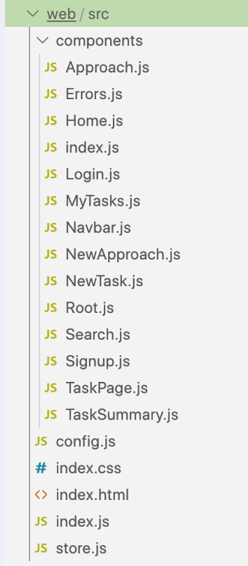

# 在没有客户端库的情况下使用 GraphQL API
本章涵盖

- 分析 UI 组件以确定其 ```GraphQL``` 数据要求
- 为 ```GraphQL``` 操作执行 Ajax POST 请求
- 在请求标头中使用令牌来识别 API 使用者
- 使用片段让每个 UI 组件负责自己的数据需求
- 使用 ```GraphQL``` 功能简化和通用化 UI 代码

在上一章中，我们完成了 ```AZdev GraphQL API``` 服务的实现。 现在是探索如何在前端 Web 应用程序中实际使用该 API 的时候了。

在 Web 应用程序中使用 GraphQL 时，您可以直接将其与简单的 Ajax 库（如 axios 或 fetch）一起使用，也可以与功能齐全的 ```GraphQL``` 客户端（如 Relay 或 Apollo）一起使用，以管理所有 ```GraphQL``` 通信。 我们将在下一章探讨如何使用带有客户端库的 ```GraphQL API```。 在本章中，我们将首先探索如何在没有客户端库的情况下使用 ```AZdev GraphQL API```。 但是，为了使这个示例尽可能接近真实项目，我们将使用 UI 库来管理浏览器中发生的事情。

提示 请记住查看 ```az.dev/gia-updates``` 以查看本章可能需要的任何 API 更新。

## 9.1 使用网页界面

我打算演示如何在不使用 UI 库（如 React 或 Angular）的情况下使用 ```GraphQL```。 虽然这将是学习 DOM API 的一个很好的练习，但它确实不实用。 由于多种原因（超出本书的范围），如今没有人在没有 UI 库的情况下构建前端应用程序。 这简直是一团糟。 UI 库降低了处理 DOM API 的复杂性，并提供了一个声明性的替代方案。 如果 Web UI 频繁更新，这一点尤为重要。

当今最流行的 UI 库是 Vue 和 React。 我将在本书中使用 React，因为它更接近 ```GraphQL``` 的生态系统和设计原则。 除了 React 和 ```GraphQL``` 都起源于 Facebook 这一事实之外，React 还提供了一种语言来声明性地描述用户界面（Web 或其他），而 GraphQL 提供了一种语言来声明性地描述数据需求。 React 为其组件提供可组合性，而 ```GraphQL``` 为其片段提供可组合性。 这些相似之处使得 React 和 GraphQL 之间可以很好地匹配。

此外，最流行的 ```GraphQL``` 客户端首先是为 React 设计的。 您当然可以将某些客户端与其他 UI 库一起使用，但它们对 React 的内置支持是一流的。 您还可以在带有 React Native 的 iOS 和 Android 移动应用程序中使用 ```GraphQL```。

如果你完全不了解 React，学习本章也不是问题。 我将为该项目提供所有与 React 相关的代码。 我还故意让一切尽可能简单，而不是让这个例子太琐碎。 我希望您关注 ```GraphQL``` 如何适应前端应用程序。 在其他 UI 库中使用没有客户端的 ```GraphQL API``` 非常相似。 您只需要找到挂钩 ```GraphQL``` 相关操作的点即可。

如果你想在继续本章之前复习一下 React，我将所有基础知识放在一篇文章中，并不假设你对 React 有任何了解。 它可以在 ```jscomplete.com/learn-react``` 上找到。

注意我选择 React 也仅仅是因为我比其他选项更喜欢它（而且我已经尝试了其中的大部分）。 如果您对我偏爱 React 的原因感兴趣，可以阅读我在 ```jscomplete.com/why-react``` 上的文章“Why React”。

## 9.2 运行网络服务器

如果您一直遵循我们在本书第 2 部分中编写的代码，您应该有一个在端口 4321（默认情况下）上运行的 Node Web 服务器，并在其根端点上提供 ```GraphQL API``` 服务。

到目前为止，我们一直在修改本书 Git 存储库（位于 ```az.dev/gia-repo```）中 api 目录下的文件。 我们现在开始修改 web 目录结构下的文件（图 9.1）。

注意您需要启动 PostgreSQL 和 MongoDB 并准备好使用 AZdev 模式，同时运行 API 服务器。 如果您跳过本书的第 2 部分，请参阅 repo 的 README 文件中的说明。


图 9.1 api 和 web 顶级目录

> 当前代码
>
> 使用 git checkout 9.0 将您的本地存储库重置为代码中的当前进度。 如果您需要存储任何本地更改，请使用 git add 。 && git 存储。 请记住运行 npm install 以安装任何缺少的依赖项。

在数据库和 API 服务器运行的情况下，使用以下命令运行 Web 服务器。

清单 9.1 命令：启动 web-server 进程

```sh
$ npm run web-server
```

此命令将运行一个进程，该进程捆绑所有代码并在 http://localhost:1234 上提供它。 如果一切正常，您应该能够访问开发 Web 服务器主页。 它应该如图 9.2 所示。


图 9.2 带有模拟数据的项目主页面

浏览一下 web 目录并熟悉它的结构（图 9.3）。 这是一个纯 React 项目，它安装了一个简单的单页应用程序。 没有像 Redux 或 React Router 这样的辅助库。 所有 React 组件都在 web/src/components 中。 顶层组件是 Root，定义在 web/src/components/Root.js 中。 本例中可以单独显示的组件导出到 web/src/components/index.js 中。 您可以将这些组件视为应用程序的虚拟页面。



图 9.3 web/src 目录

> 警告 本章代码的起点会有很多 ESLint 错误，因为我在模板中留下了许多未使用的变量，而 ESLint 配置为对此进行抱怨。 我们将在需要时使用这些变量。 当我们完成本章时，应该没有 ESLint 错误。

React 组件是一个基本的 JavaScript 函数，可以选择接受参数（在 React 中称为 props）。 它可以有自定义逻辑（比如从 API 获取数据），并且它总是返回一个虚拟 DOM 节点。 React 负责将虚拟节点安装在正确的位置，并在需要更新时（有效地）更新它。 您可以假设该组件的声明状态将始终反映在浏览器中。 您只需调用 JavaScript 函数（我已在代码中为您记录）来更新 DOM。

该项目的 UI 状态由一个简单的全局上下文对象管理。 在 React 中，上下文对象对于定义它的应用程序是全局的，树中的每个组件都可以读取和修改它。 上下文对象在 web/src/store.js 中定义。 在全局上下文中管理的两个主要内容是当前组件信息（要渲染的组件以及要传递给它的道具）和登录用户的当前信息（如果有）。 在上下文对象上定义了一些函数，并导入到需要它们的组件中。 例如，useLocalAppState 函数可用于从应用程序状态中读取值，setLocalAppState 函数可用于更新应用程序状态。 这些函数是在上下文对象上定义的，因为它们需要访问和修改全局应用程序状态。

> 模块打包器
>
> 该项目中的所有 JavaScript 代码都使用 Parcel 进行捆绑。 Parcel 是一个简单的模块打包器，它还可以编译特殊的东西，比如 React 的 JSX 扩展、现代 JavaScript 特性，甚至 TypeScript。 我们正在使用 Parcel 的默认配置，它具有开箱即用的热模块重新加载配置。 当您更改代码（并保存它们）时，这将自动刷新您的浏览器会话。 通过更改 web/src/components/Home.js 中 mockTasks 数组的内容来尝试，并注意浏览器自动刷新。
> 其他几个流行的模块打包器是 Webpack 和 Rollup。 Webpack 是第一个，使用更广泛。 我为这个项目选择了 Parcel，因为它的简单性和出色的默认配置。 官方 AZdev 开源存储库 (az.dev/contribute) 使用 Webpack。

我们将修改几乎每个组件文件（在 web/src/components 下）和上下文对象（在 web/src/store.js 中），但是您不需要在项目中创建任何新文件来学习本章。 所有组件都准备就绪，除了需要读写数据的地方。 您也不需要修改任何组件的输出（它们返回的 JSX 节点）。 所有 HTML 工作都已完成，但它是用空数据或模拟数据呈现的。 我们将修改代码中定义这些数据变量的地方。 在我们需要修改的地方，我在代码注释中添加了注释（标记为“GIA NOTES”；见图9.4）。


图 9.4 代码中的 GIA 书注

您也不需要修改任何样式代码或将任何 CSS 类添加到 React 管理的 HTML 中。 CSS 已经全部准备就绪（在 web/src/index.css 中），但它肯定不是最好的。 我只做了一些一般的风格调整，使事情看起来不错。 这些样式基于 Tailwind CSS 框架，但为了简单起见，我将它们提取出来并让项目直接使用它们。

提示如果您对现在的代码或我们将要编写的新代码有任何疑问，请随时在本书的存储库中创建 GitHub 问题。 您也可以在 jscomplete.com/help 的官方 jsComplete 帮助频道中提问。

## 9.3 发出 Ajax 请求

要从 Web 应用程序发出 GraphQL 请求，我们需要调用 Ajax HTTP 调用。 请记住，我们通过 HTTP POST 请求使我们的 GraphQL 服务可用。

到目前为止，我们一直在通过 GraphiQL 编辑器发送这些 POST 请求。 在后台，当您在那里执行任何文档时，GraphiQL 编辑器会在后台发出 Ajax 调用。

现代浏览器具有本地 API 来发出 Ajax 请求。 例如，如今的浏览器带有内置的获取方法，可用于调用任何类型的 HTTP Ajax 请求。 然而，如果你需要支持旧的浏览器，你不能直接使用 fetch，但你可以使用一个包装了原生 API 的库，或者如果它不存在则对其进行 polyfill。 一种常见的选择是交叉获取，因为它还允许您从 Node.js 获取数据； 如果您计划对 Web 应用程序进行任何服务器端呈现，那么这就是您需要的东西。 我们会使用它； 它已经是该项目依赖项的一部分。

让我们做一个测试 ```GraphQL``` 请求。 还记得我们在第 5 章开始使用的 currentTime 字段吗？ 让我们让应用程序在加载时暂时使用 console.log。

对 Home 组件（在 web/src/components/Home.js 中）进行以下临时代码更改。

清单 9.2 web/src/components/Home.js 中的临时更改

```js
export default function Home() {
  // ·-·-·
 
  useEffect(() => {
    request('{ currentTime }').then(({ data }) => {
      console.log(`Server time is: ${data.currentTime}`);
    });
 
    // ·-·-·
  }, [request]);
 
  return (
    // ·-·-·
  );
}
```

此代码假定已定义的请求函数接收 GraphQL 请求文本（如查询或突变）并返回 GraphQL 响应对象（具有数据和错误属性）。

提示 useEffect 函数称为钩子函数，它会在每次渲染宿主组件时运行。 当浏览器呈现 Home 组件的输出时，这使得 console.log 行出现在浏览器的控制台中。 有关 React hooks 如何工作的更多详细信息，请查看 jscomplete .com/react-hooks。

请求函数的框架已经在 web/src/store.js 中定义。 该函数必须向 GraphQL 服务端点提交 Ajax POST 请求并返回响应对象。 它需要包括 requestText（它的第一个参数）和任何变量（第二个参数）。 这是一个基本的实现。

清单 9.3 web/src/store.js 中的变化

```js
export const useStoreObject = () => {
  // ·-·-·
 
  const request = async (requestText, { variables } = {}) => {
    const gsResp = await fetch(config.GRAPHQL_SERVER_URL, {
      method: 'post',
      headers: { 'Content-Type': 'application/json' },
      body: JSON.stringify({ query: requestText, variables }),
    }).then((response) => response.json());
 
    return gsResp;
  };
 
  // ·-·-·
};
```

如果您使用 GraphQL API 服务的默认端口，则无需执行任何操作。 如果您使用不同的端口，则必须在 web/src/config.js 文件中指定新的 GRAPHQL_SERVER_URL。

清单 9.3 中的代码向 GraphQL 服务端点发送 Ajax POST 请求。 从 Home 组件（清单 9.2）作为 { currentTime } 传递的 requestText 参数作为查询变量发送，它是表示服务器 HTTP 处理程序（graphqlHTTP）中的 GraphQL 请求文本的默认变量，我们在 第 5 章。

提示 这个请求函数的实现是一个简单的快乐路径，它期望一个成功的响应。 更实际的实现将包括错误处理。 我会在这里留下简单的调用，因为我们将在下一章中替换这个函数。

您现在应该在浏览器控制台中看到服务器时间日志消息（图 9.5）。


图 9.5 服务器时间日志消息

处理所有 GraphQL 请求与这个简单的请求非常相似。 您进行 Ajax 请求调用，提供查询或变更操作文本（并且包括该操作使用的变量）。 然后你对解析的数据响应做一些事情。

在没有客户端的情况下直接使用 GraphQL 确实没有什么特别的技巧。 您只需要进行 Ajax 调用并处理他们的响应！ 但是，有一些特殊的技巧可以以可读和可维护的方式组织您的 GraphQL 客户端代码。 我们将在本章中介绍其中的一些。

现在我们知道一切正常，删除我们在 Home 组件中添加的测试请求代码（在 useEffect 函数中）。 相反，让我们弄清楚我们必须在 useEffect 函数中执行的官方数据请求（以获取最新任务记录的列表）。

## 9.4 执行 GraphQL 查询请求

Home 组件已连接以在 UI 中显示模拟任务记录列表。 我们现在需要发出一个 GraphQL 查询，该查询将从 GraphQL 服务获取有关实际任务记录的信息，并使用响应数据替换模拟对象。

我们为此页面设计的 GraphQL 根字段是 taskMainList。 您可以查看 web/src/components/Home.js 中的代码，了解哪些子字段必须包含在此 taskMainList 查询中。 此视图所需的数据结构与 mockTasks 对象的相同。

清单 9.4 mockTasks 对象

```js
{
  id: 1,
  content: 'Mock content #1',
  author: { username: 'mock-author' },
  tags: ['tag1', 'tag2'],
}
```

根据该对象的结构，这是 HOME 组件所需的 GraphQL 查询。

清单 9.5 匹配 mockTasks 对象结构的查询

```js
query taskMainList {
  taskMainList {
    id
    content
    author {
      username
    }
    tags
  }
}
```

此 taskMainList 查询不需要 GraphQL 变量。 我们可以直接在请求函数中使用它的文本。 但是，最好将 GraphQL 操作的文本放在使用它们的 UI 组件旁边。 让我们这样做吧。

清单 9.6 web/src/components/Home.js 中的变化

```js
const TASK_MAIN_LIST = `
  query taskMainList {
    taskMainList {
      id
      content
      author {
        username
      }
      tags
    }
  }
`;
// delete the mockTasks object...
 
export default function Home() {
  const { request } = useStore();
  const [ taskList, setTaskList ] = useState(null);
 
  useEffect(() => {
    request(TASK_MAIN_LIST).then(({ data }) => {
      setTaskList(data.taskMainList);
    });
  }, [request]);
 
  // ·-·-·
}
```

我们首先定义查询操作文本（我将其命名为 TASK_MAIN_LIST 以匹配它返回的内容）。 全大写的命名约定很常见，但不是必需的。

然后我们将该文本发送到 GraphQL 服务（在该组件的生命周期中的某个时间）。 当返回成功的响应时，它将具有一个数据属性，该属性是一个对象，该对象具有查询中每个根字段的属性。 我们在此查询中只有一个根字段 (taskMainList)。 当我们有响应时（在 .then promise 方法中），我们让 React 知道它（通过 noted 方法）。 React 将使用新数据自动更新浏览器的 DOM 树。

在您的浏览器中，您应该看到示例数据任务条目列出了它们的作者和标签信息（图 9.6）。


图 9.6 首页最新任务记录列表

> 当前代码
>
> 使用 git checkout 9.1 将您的本地存储库重置为代码中的当前进度。

### 9.4.1 在 UI 组件中使用 GraphQL 片段

Home 组件中的 mockTasks 对象可以帮助我们轻松找出该组件需要哪些 GraphQL 字段。 但是如果我们没有那个对象呢？ 另外，如果我们没有 UI 组件怎么办？ 从 UI 组件开始还是从 GraphQL 查询文本开始更好？

帮助我围绕这些问题思考的概念是我们在前几章中简要提到的概念，但现在是时候把它带到最前沿了。 我说的是每个 UI 组件（视图）如何具有特定的数据要求并且应该负责声明这些要求。 要弄清由多个 UI 组件组成的视图树的数据需求，您可以将各个数据需求放在一起。

例如，来自 taskMainList 操作的数据实际上由两个 UI 组件使用：Home 和 TaskSummary。 视图树只有这两个组件，每个组件都有自己的数据需求。 Home 组件需要 Task 对象的 ID。 Home 组件中没有提及内容、author.username 或标签。 这些其他的字段来自TaskSummary组件的数据需求，因为那个组件就是用到它们的地方。

查看 TaskSummary 组件（在 web/src/components/TaskSummary.js 下），并注意以下内容（粗体）。

清单 9.7 TaskSummary 组件中的 task.* 变量

```js
export default function TaskSummary({ task, link = false }) {
  const { AppLink } = useStore();
 
  return (
    <div className="box box-primary">
      {link ? (
        <AppLink to="TaskPage" taskId={task.id}>
          {task.content}
        </AppLink>
      ) : (
        task.content
      )}
      <div className="box-footer">
        <div className="text-secondary">{task.author.username}</div>
        <div className="flex-end">
          {task.tags.map((tag) => (
            <span key={tag} className="box-label">
              {tag}
            </span>
          ))}
        </div>
      </div>
    </div>
  );
}
```

您是否看到该组件中使用的变量（粗体部分）与清单 9.6 中的 TASK_MAIN_LIST 查询中包含的 GraphQL 字段之间的直接映射？ 我们不必依赖模拟对象。 我们可以使用组件的代码直接得出其 GraphQL 数据需求。 事实上，与其将整个 taskMainList 查询文本放在 Home 组件中，不如让我们正式让每个组件声明自己的数据需求。 在大多数情况下，一个 UI 组件不关心其子项、父项或兄弟项的数据要求。

这就是 GraphQL 片段可以发挥作用的地方。 我们可以让 TaskSummary 组件定义一个 GraphQL 片段来声明该组件的确切数据要求，然后让 Home 组件使用该片段来组成呈现该组件（及其子组件）所需的主要 GraphQL 查询。

例如，我们可以在 TaskSummary 组件中定义以下 GraphQL 片段。

清单 9.8 web/src/components/TaskSummary.js 中的变化

```js
// ·-·-·
export const TASK_SUMMARY_FRAGMENT = `
  fragment TaskSummary on Task {
    content
    author {
      username
    }
    tags
  }
`;
 
export default function TaskSummary({ task, link = false }) {
  // ·-·-·
}
```

此片段仅表示显示 TaskSummary 组件实例所需的数据。

请注意，我们导出了这个新常量，以便其他组件可以导入和使用它，这就是我们现在必须在 Home 组件中做的事情。

清单 9.9 web/src/components/Home.js 中的变化

```js
// ·-·-·
 
import TaskSummary, { TASK_SUMMARY_FRAGMENT } from './TaskSummary';
 
const TASK_MAIN_LIST = `
  query taskMainList {
    taskMainList {
      id
      ...TaskSummary
    }
  }
  ${TASK_SUMMARY_FRAGMENT}
`;
// ·-·-·
```

这不是一个美丽的抽象吗？

每个组件都负责更大数据需求中自己的部分。 通过此更改，Home 组件基本上会联系其子组件（TaskSummary 组件）并询问它：“您希望我为您获取哪些字段？”

此外，使用这种结构，如果 TaskSummary 组件被修改为需要来自 API 服务的更多（或更少）字段，则 Home 组件将不需要任何修改。

这个概念通常被称为共定位片段（或字段）。 通常，并置片段中的字段与并置组件的属性相匹配。 我认为这是一个值得遵循的好习惯，无论你是直接使用 GraphQL（如本例）还是 GraphQL 客户端，我们将在下一章中看到。

识别哪些 UI 组件是定义自己的数据片段的候选者的一个技巧是查看未在顶层呈现的组件（直接由 Root 组件）。 例如，我们无法在其自己的页面上呈现 TaskSummary 组件。 它总是由其他页面（如主页、搜索等）呈现。 这类似于我们无法自行调用 GraphQL 片段的方式。

在这个例子中还有哪些其他组件没有单独渲染？ 如果这些组件依赖于它们的 props 来呈现它们的内容，那么它们很可能应该有自己的数据片段。

提示一个子组件可以定义多个片段，也可以使用它自己的子组件的子片段来组合片段。

> 当前代码
>
> 使用 git checkout 9.2 将您的本地存储库重置为代码中的当前进度。

### 9.4.2 在请求中包含变量

主页有一个最新的任务记录列表。 用户可以单击任务记录以查看其详细信息页面。 导航已实现，但页面的数据要求尚未实现。 目前，当您导航到任务记录页面时，您会看到模拟数据。

我们可以使用我们已经通过 taskMainList 请求为任务记录获取的部分数据显示此页面（然后获取所需数据的其余部分，如方法列表）。 GraphQL 的特色客户端将自动执行此操作。 它将缓存从服务器获取的任何数据，并使部分数据可用。 但是，对于我们的简化示例，我们只对该页面发出完整请求。 此页面的组件是 TaskPage（在 ```web/src/components/TaskPage.js``` 下）。

要确定这个新视图树需要哪些 GraphQL 字段，我们需要查看 TaskPage 组件及其所有子组件。 它有两个子组件：TaskSummary 和 Approach。

我们已经实现了 TaskSummary 的片段，我们可以按原样使用它。 子组件的数据要求不会根据呈现它的父组件而改变。

要完成 TaskPage 组件的数据需求，我们首先必须提出 Approach 组件的数据需求，该组件呈现单个 Approach 记录（及其所有详细记录）。

查看 ```web/src/components/Approach.js```，找到它使用的所有变量来生成与这些使用的变量匹配的 ```GraphQL``` 片段。

清单 9.10 Approach 组件中的 approach.voteCount 变量

```js
export default function Approach({ approach, isHighlighted }) {
  // ·-·-·
 
  const [ voteCount, setVoteCount ] = useState(approach.voteCount);
 
  // ·-·-·
 
  return (
    <div className={`box highlighted-${isHighlighted}`}>
      <div className="approach">
        <div className="vote">
          {renderVoteButton('UP')}
          {voteCount}
          {renderVoteButton('DOWN')}
        </div>
        <div className="main">
          <pre className="code">{approach.content}</pre>
          <div className="author">{approach.author.username}</div>
        </div>
      </div>
      <Errors errors={uiErrors} />
      {approach.detailList.map((detail, index) => (
        <div key={index} className="approach-detail">
          <div className="header">{detail.category}</div>
          <div>{detail.content}</div>
        </div>
      ))}
    </div>
  );
}
```

这是我为 Approach 组件想出的片段。

清单 9.11 web/src/components/Approach.js 中的变化

```js
// ·-·-·
 
export const APPROACH_FRAGMENT = `
  fragment ApproachFragment on Approach {
    content
    voteCount
    author {
      username
    }
    detailList {
      content
      category
    }
  }
`;
// ·-·-·
```

准备好两个子组件的片段后，我们现在可以编写 TaskPage 组件的完整数据需求。 我们可以使用 taskInfo 根查询字段并在其子选择中包含 approachList 字段。 此查询将必须导入并使用组件子项声明的两个片段。

清单 9.12 web/src/components/TaskPage.js 中的变化

```js
// ·-·-·
 
import Approach, { APPROACH_FRAGMENT } from './Approach';
import TaskSummary, { TASK_SUMMARY_FRAGMENT } from './TaskSummary';
 
const TASK_INFO = `
  query taskInfo($taskId: ID!) {
    taskInfo(id: $taskId) {
      id
      ...TaskSummary
      approachList {
        id
        ...ApproachFragment
      }
    }
  }
  ${TASK_SUMMARY_FRAGMENT}
  ${APPROACH_FRAGMENT}
`;
// ·-·-·
```

此查询需要使用 GraphQL 变量（$taskId）。 我们可以在组件代码中注明的地方发出数据请求，并将 taskId 变量作为第二个参数的一部分传递给请求函数。

清单 9.13 web/src/components/TaskPage.js 中的变化

```js
// delete the mockTaskInfo object...
 
export default function TaskPage({ taskId }) {
  // ·-·-·
 
  useEffect(() => {
    if (!taskInfo) {
      request(TASK_INFO, { variables: { taskId } }).then(
        ({ data }) => {
          setTaskInfo(data.taskInfo);
        },
      );
    }
  }, [taskId, taskInfo, request]);
 
  // ·-·-·
}
```

而已。 当你现在导航到一个任务页面时，任务记录的所有数据、它的方法记录列表以及每个方法的详细信息列表都应该被获取（使用一个 GraphQL 请求）并在 UI 中正确显示（图 9.7）。


图 9.7 完整任务记录页面

> 当前代码
>
> 使用 git checkout 9.3 将您的本地存储库重置为代码中的当前进度。

到目前为止，我们已经实现了只读查询操作。 现在让我们看一下如何调用变更请求。 剧透警报：没什么不同。

## 9.5 执行 GraphQL 变更请求

GraphQL 突变通常作为 HTML 表单中 onSubmit 事件的一部分被调用。 突变输入通常从 HTML 表单元素（文本输入、选择值、复选框等）中读取。

我们在这个项目中有五个基本表单：登录、注册、创建任务、向任务添加方法以及搜索所有任务和方法。 这些形式中的每一种都将调用一个单一的突变。

有时，在表单中没有任何输入元素的情况下，通过简单的 onClick 事件调用突变。 一个例子是 vote-on-Approach 功能。

一些突变可以在没有登录用户帐户范围的情况下公开调用。 示例包括创建新用户帐户和登录现有用户帐户的更改。 我们还公开了 vote-on-Approach 突变。

一些突变需要登录用户帐户的范围。 例如，只有登录用户才能创建任务/方法记录。

一些变更可以公开调用，但如果在登录用户的范围内调用，它们的行为会有所不同。 一个例子是搜索突变，它包括属于进行搜索的用户的私人任务记录。 在没有经过身份验证的用户范围的情况下调用时，它将仅包含公共记录。

让我们从 userLogin 和 userCreate 突变开始。 它们可以在不包含任何身份验证标头的情况下被调用，并且它们都返回一个可以与其他突变一起使用的活动 authToken 值。

### 9.5.1 登录/注册表单

您可以使用主页右上角的链接访问登录/注册表单。 这些页面使用的组件如下：

- 登录组件位于 ```web/src/components/Login.js``` 下。
- Signup 组件位于 ```web/src/components/Signup.js``` 下。

这些组件显示带有提交按钮的简单 HTML 表单。 我们的任务是实现他们的 onSubmit 事件处理程序。 这些处理程序在两个组件中几乎相同。 他们必须从表单元素中读取突变的输入对象，提交突变请求，然后将用户记录存储在应用程序的全局状态中，以便他们可以导航到其他页面并提交其他突变。

这是可用于使用用户名/密码登录用户的变异操作。 将它放在登录组件中。

清单 9.14 web/src/components/Login.js 中的变化

```js
// ·-·-·
const USER_LOGIN = `
  mutation userLogin($input: AuthInput!) {
    userLogin(input: $input) {
      errors {
        message
      }
      user {
        id
        username
      }
      authToken
    }
  }
`;
// ·-·-·
```

这是可用于创建新用户帐户的变异操作。 将它放在注册组件中。

清单 9.15 web/src/components/Signup.js 中的变化

```js
// ·-·-·
const USER_CREATE = `
  mutation userCreate($input: UserInput!) {
    userCreate(input: $input) {
      errors {
        message
      }
      user {
        id
        username
      }
      authToken
    }
  }
`;
// ·-·-·
```

我们之前已经在 GraphiQL 中直接看到并测试了这些突变，但现在我们将在组件内的提交处理程序中调用它们。 在登录组件中，我们在从表单元素捕获输入后使用 USER_LOGIN 突变调用请求函数。 这是一种方法。

清单 9.16 web/src/components/Login.js 中的变化

```js
// ·-·-·
 
export default function Login() {
  // ·-·-·
 
  const handleLogin = async (event) => {
    event.preventDefault();
    const input = event.target.elements;
    const { data } = await request(USER_LOGIN, {
      variables: {
        input: {
          username: input.username.value,                   ❶
          password: input.password.value,
        },
      },
    });
    const { errors, user, authToken } = data.userLogin;
    if (errors.length > 0) {                                ❷
      return setUIErrors(errors);
    }
    user.authToken = authToken;
    window.localStorage.setItem('azdev:user', JSON.stringify(user));
    setLocalAppState({ user, component: { name: 'Home' } });
  };
 
  // ·-·-·
}
```

❶ 通过 DOM API 调用读取输入数据。 此表单的状态不受 React 控制。
❷ 检查突变后是否存在任何用户错误，并将这些错误设置为 UI 显示在某处。 当您使用无效凭据测试表单时，这部分代码将显示“无效的用户名或密码”错误消息。

使用无效凭据测试登录表单。 您应该会看到“无效的用户名或密码”消息（图 9.8）。


图 9.8 此突变的 UserError 示例

要使用有效凭据测试登录表单，请使用示例数据脚本 (test/123456) 中的测试帐户。 你应该被重定向到主页，导航栏现在应该显示用户的用户名（图 9.9）。


图 9.9 登录用户的导航栏链接

要调用 userCreate 突变，我们必须读取 firstName、lastName、username 和 password 的值。 表单也有一个 confirmPassword 字段，但我们为这个 mutation 实现的 GraphQL API 不支持它。 这是我们在允许 GraphQL 变更操作通过之前可以执行的验证检查示例。

> 持久化用户会话
>
> 目前的代码将保留与 localStorage 的用户会话。 这是一个从本地应用程序状态持久缓存元素的简单示例。 这不同于缓存 API 数据（我们在此示例中尚未执行）。 API 数据缓存的一个示例是当您离开主页然后导航回主页时不再获取 taskMainList 数组。 在下一章中，我们将看到 GraphQL 客户端库如何尽可能无缝地执行 API 数据缓存。
>
> 持久化用户会话比使用简单的 localStorage 记录要多得多，但这超出了本书的范围。 您可以查看官方 AZdev 项目（位于 az.dev/contribute），了解我们如何为该项目进行会话持久化。

> 挑战
>
> 首先尝试自己在 Signup 组件中实现 userCreate 变更。 该代码与我们在登录组件中所做的非常相似。

下面是我如何实现突变调用。

清单 9.17 web/src/components/Signup.js 的变化

```js
// ·-·-·
 
export default function Signup() {
  // ·-·-·
 
  const handleSignup = async (event) => {
    event.preventDefault();
    const input = event.target.elements;
    if (input.password.value !== input.confirmPassword.value) {
      return setUIErrors([{ message: 'Password mismatch' }]);
    }
    const { data } =
      await request(USER_CREATE, {
        variables: {
          input: {
            firstName: input.firstName.value,
            lastName: input.lastName.value,
            username: input.username.value,
            password: input.password.value,
          },
        },
      });
    const { errors, user, authToken } = data.userCreate;
    if (errors.length > 0) {
      return setUIErrors(errors);
    }
    user.authToken = authToken;
    window.localStorage.setItem('azdev:user', JSON.stringify(user));
    setLocalAppState({ user, component: { name: 'Home' } });
  };
  // ·-·-·
}
```

您现在可以测试注册表单。 您应该能够创建一个新的用户帐户，并且您应该在创建后登录。

### 9.5.2 处理一般服务器错误

登录/注册的快乐路径正在运行，但我们还应该测试边缘情况。 这里有一个边缘案例供您考虑。 现在，如果您尝试使用 azdev.users 表中已存在的用户名创建用户记录，UI 将无法显示错误消息，而是在控制台中记录 500 Internal Server Error（图 9.10）。 为什么会发生这种情况，如何解决？


图 9.10 服务器响应中未处理的错误

数据库对用户名列的唯一约束阻止了此操作。 它使 pg 驱动程序在代码中抛出错误。 我们实际上可以在服务器日志中看到错误（多亏了我们之前添加的 customFormatErrorFn 函数；见图 9.11）。 如果您检查该网络请求的服务器响应，您还可以在开发工具的“网络”选项卡中看到错误（图 9.12）。


图 9.11 服务器日志


图 9.12 在浏览器的网络选项卡中检查响应

这不是一个好的用户体验。 当 UI 无法执行用户期望的操作时，它应该显示某种错误。 让我们解决这个问题。

这个响应有一个根错误数组，我们为 Signup 组件编写的代码没有读取它。 它只读取数据部分，它本身可以有另一个用户错误数组，因为我们设计了所有的突变。 但是，此错误不会作为用户错误返回； 它作为根错误返回。

我们可以修复 API 的 mutators 方法以将错误作为用户错误返回，这将解决问题（因为我们已经在代码中考虑了用户错误数组）。 但是，这只是可能发生的许多根错误之一。 让我们确保此表单在所有情况下都会显示错误。

由于我们在代码中已经有了一个错误变量，让我们重命名根错误数组 rootErrors。 我们需要做的就是检查它是否存在并更新 UI（如果存在）。

清单 9.18 web/src/components/Signup.js 中的变化

```js
// ·-·-·
 
export default function Signup() {
  // ·-·-·
 
  const handleSignup = async (event) => {
    // ·-·-·
    const { data, errors: rootErrors } =
      await request(USER_CREATE, {
        variables: {
          input: {
            firstName: input.firstName.value,
            lastName: input.lastName.value,
            username: input.username.value,
            password: input.password.value,
          },
        },
      });
    if (rootErrors) {
      return setUIErrors(rootErrors);
    }
    const { errors, user, authToken } = data.userCreate;
    if (errors.length > 0) {
      return setUIErrors(errors);
    }
    // ·-·-·
  };
```

注意 在登录组件中进行相同的更改。

有了这个更改，如果您尝试为这个突变提交相同的数据，您应该会在 UI 中看到错误（图 9.13）。 这样更好。 请记住，错误将被生产中的一般错误替换，因此我们不会泄露实现细节（图 9.14）。


图 9.13 在 UI 中显示开发根错误


图 9.14 在 UI 中显示一般根错误

请注意，我将错误保留在该组件的本地，而不是在全局级别（例如，在请求函数中）处理它，因为这样可以提供更好的用户体验。 每次发送任何 GraphQL 请求时，我们都必须处理服务器根错误！ 我们将在下一章中这样做，因为我们正在学习 GraphQL 客户端如何简化这些挑战。

现在我们可以处理意外的根错误，我们可以改进这种特殊情况，并在用户尝试使用已使用的用户名时向用户提供更好的错误消息。 查看此操作的增变器函数。 它是 api/src/db/pg-api.js 中的 userCreate 函数。 当 pgQuery promise 失败时，该方法没有错误处理，这就是本例中发生的情况。

我们可以将这个方法修改为不抛出错误，要么先做一个SQL读取来验证，要么捕获SQL插入的错误（在try/catch语句中），如果抛出错误则返回一个普通的用户错误 受数据库users_username_key唯一约束。 也许做类似下面的事情。

清单 9.19 示例：在修改器中处理数据库错误

```js
userCreate: async ({ input }) => {
  // ·-·-·
 
  if (payload.errors.length === 0) {
    const authToken = randomString();
    try {
      const pgResp = await pgQuery(sqls.userInsert, {
        $1: input.username.toLowerCase(),
        $2: input.password,
        $3: input.firstName,
        $4: input.lastName,
        $5: authToken,
      });
      if (pgResp.rows[0]) {
        payload.user = pgResp.rows[0];
        payload.authToken = authToken;
      }
    } catch (err) {
      console.error(err);
      // Check the err object and either:
      // - Push a custom error message to payload
      // - Throw the err object again }
  }
 
  return payload;
},
```

我会把这部分留给你去试验。 想想所有其他突变中可能发生的其他数据库级错误！

> 当前代码
>
> 使用 git checkout 9.4 将您的本地存储库重置为代码中的当前进度。

### 9.5.3 验证 GraphQL 请求

在登录和注册表单的处理程序逻辑中，返回的 authToken 值成为当前用户状态对象的一部分（清单 9.17 和 9.18）。 这就是我们现在需要包含在其他变更请求（以及一些查询请求）中的值。

我们可以简单地将 authToken 值（如果存在）作为我们发送给 API 服务的任何 GraphQL 请求的一部分，并让 API 服务决定是使用它还是忽略它。 为此，我们必须修改请求函数并包含 AuthorizationBearer 令牌。 对于 fetch 函数，这是通过作为第三个参数一部分的 headers 属性完成的。

清单 9.20 web/src/store.js 中的变化

```js
const request = async (requestText, { variables } = {}) => {
  const headers = state.user
    ? { Authorization: 'Bearer ' + state.user.authToken }
    : {};
  const gsResp = await fetch(config.GRAPHQL_SERVER_URL, {
    method: 'post',
    headers: { ...headers, 'Content-Type': 'application/json' },
    body: JSON.stringify({ query: requestText, variables }),
  }).then((response) => response.json());
 
  return gsResp;
};
```

现在，当用户登录时，所有 GraphQL 请求都将包含他们当前的 authToken 值，并且他们可以调用依赖于它的突变。 您可以通过在开发工具的“网络”选项卡中检查任何 XHR 请求的标头来验证这一点（图 9.15）。


图 9.15 authToken 随每个网络请求发送到 API。

### 9.5.4 创建任务表单

现在用户可以登录并且他们的 authToken 值包含在所有 GraphQL 操作的标头中，我们可以让用户创建一个新的任务记录。 单击右上角的“创建任务”链接可以访问用于执行此操作的 HTML 表单（图 9.16）。


图 9.16 创建任务表单

呈现此 HTML 表单的组件位于 web/src/components/NewTask.js 下。 该表单具有三个元素：内容框、标签文本框和公共/私人复选框。

这三个输入元素与可与 taskCreate 突变字段一起使用的 TaskInput 类型结构相匹配。 但是，我们必须将标签输入值作为字符串数组而不是一个字符串发送。 我们可以对输入文本值使用 .split(',') 调用来执行此操作。

成功创建 Task 对象后，我们可以使用注释掉的 setLocalAppState 调用将用户导航到新创建的 Task 对象的页面。

这是我为这个组件想出的实现。

清单 9.21 web/src/components/NewTask.js 中的变化

```js
// ·-·-·
const TASK_CREATE = `
  mutation taskCreate($input: TaskInput!) {
    taskCreate(input: $input) {
      errors {
        message
      }
      task {
        id
      }
    }
  }
`;
 
export default function NewTask() {
  // ·-·-·
 
  const handleNewTaskSubmit = async (event) => {
    event.preventDefault();
    const input = event.target.elements;
    const { data, errors: rootErrors } = await request(TASK_CREATE, {
      variables: {
        input: {
          content: input.content.value,
          tags: input.tags.value.split(','),
          isPrivate: input.private.checked,
        },
      },
    });
    if (rootErrors) {
      return setUIErrors(rootErrors);
    }
    const { errors, task } = data.taskCreate;
    if (errors.length > 0) {
      return setUIErrors(errors);
    }
    setLocalAppState({
      component: { name: 'TaskPage', props: { taskId: task.id } },
    });
  };
 
  // ·-·-·
}
```

作为登录用户，您现在应该能够创建自己的任务记录。

在我们实施下一个突变之前，让我告诉您一个优化处理此突变的 UI 的好机会。 现在，代码发出一个 ```GraphQL``` 变更请求来创建一个 Task 对象。 然后它将用户导航到任务页面并发出另一个 GraphQL 查询请求以读取该新任务对象的数据。 您可以在浏览器开发工具的“网络”选项卡中验证这一点。

然而，我们可以跳过第二个请求（获取任务页面中的数据），因为相同的数据可以作为突变请求的一部分被完整读取。 为此，我们必须让 ```taskCreate``` 突变请求呈现 ```TaskPage``` 视图所需的所有数据。

这意味着 ```TaskPage``` 组件应将其完整数据要求声明为片段（即使它是顶级组件）。

在 TaskPage 组件中，重构 ```TASK_INFO``` 查询以使用片段并导出该片段以供其他人使用。 让我们将片段命名为 ```FullTaskData```。

清单 9.22 web/src/components/TaskPage.js 中的变化

```js
// ·-·-·
export const FULL_TASK_FRAGMENT = `
  fragment FullTaskData on Task {
    id
    ...TaskSummary
    approachList {
      id
      ...ApproachFragment
    }
  }
  ${TASK_SUMMARY_FRAGMENT}
  ${APPROACH_FRAGMENT}
`;
 
const TASK_INFO = `
  query taskInfo($taskId: ID!) {
    taskInfo(id: $taskId) {
      ...FullTaskData
    }
  }
  ${FULL_TASK_FRAGMENT}
`;
// ·-·-·
```

然后修改 ```taskCreate``` 突变以请求 ```TaskPage``` 所需的所有数据。

清单 9.23 web/src/components/NewTask.js 中的变化

```js
// ·-·-·
import { FULL_TASK_FRAGMENT } from './TaskPage';
 
const TASK_CREATE = `
  mutation taskCreate($input: TaskInput!) {
    taskCreate(input: $input) {
      errors {
        message
      }
      task {
        id
        ...FullTaskData
      }
    }
  }
  ${FULL_TASK_FRAGMENT}
`;
// ·-·-·
```

为了优化 TaskPage 组件的 UI 以不进行额外的提取，我们必须更改该组件以接受一个可选的数据对象（而不仅仅是一个 ID），在 TASK_INFO 查询之前检查它，并且只有在 对象不存在。 这是一个仅限 React 的更改，所以我将在这里跳过它。 始终获取 UI 处理任何对象的创建所需的所有数据是一个好习惯，即使 UI 一开始丢弃它（并再次获取它）也是如此。 当我们过渡到功能更强大的 ```GraphQL``` 请求客户端时，缓存和优化请求将由该客户端为我们管理。

> 当前代码
>
> 使用 git checkout 9.5 将您的本地存储库重置为代码中的当前进度。

### 9.5.5 创建方法表单

接下来，让我们实施突变以将方法记录添加到现有任务记录。 您需要先登录才能访问此功能的 UI 表单。 查看任务页面时，单击添加新方法按钮。 您应该会看到“创建方法”表单（图 9.17）。


图 9.17 创建方法表单

我为此表单准备的一项挑战是详细信息类别选择器。 请记住，方法细节可以是注释、解释或警告； 但我没有在 HTML 表单中对这些值进行硬编码（图 9.17 中的 HTML 选择元素为空）。

如果 GraphQL 服务在未来添加一个新类别（或删除一个类别）怎么办？ 有没有办法让这种 HTML 表单永不过时？

是的！ 这是您要欣赏 ```GraphQL``` 的内省查询的地方。 我们可以使用 \_\_type 自省字段询问 GraphQL 服务它在 ```ApproachDetailCategory``` 类型中支持哪些值。

清单 9.24 web/src/components/NewApproach.js 中的变化

```js
// ·-·-·
const DETAIL_CATEGORIES = `
  query getDetailCategories {
    detailCategories: __type(name: "ApproachDetailCategory") {
      enumValues {
        name
      }
    }
  }
`;
// ·-·-·
```

然后，我们可以使用响应来构建 HTML 表单。 用于执行此操作的 React UI 代码已经实现，但我们必须在某处发出对此自省查询的请求。 比如我们可以在每次渲染这个表单的时候做。 这就是我在代码中准备的。 这是如何做到的。

清单 9.25 web/src/components/NewApproach.js 中的变化

```js
// ·-·-·
 
export default function NewApproach({ taskId, onSuccess }) {
  // ·-·-·
 
  useEffect(() => {
    if (detailCategories.length === 0) {
      request(DETAIL_CATEGORIES).then(({ data }) => {
        setDetailCategories(data.detailCategories.enumValues);
      });
    }
  }, [detailCategories, request]);
 
  // ·-·-·
}
```

这应该使服务器支持的值出现在 HTML 表单中（图 9.18）。


图 9.18 来自 API 响应的详细类别

> 提示 这种类型的请求应该被缓存，而不是在用户每次呈现 HTML 表单时调用。 这些类别不会经常更改。 我什至会在服务器端缓存这个特定的请求。

现在 HTML 表单已准备就绪，让我们弄清楚如何使 approachCreate 突变与其一起工作。 该突变采用一个 taskId 变量和一个 ApproachInput 对象。 在其返回的数据中，我们可以查询新创建的 Approach 记录的详细信息。 我们必须包含在此突变输出中的确切字段是 UI 呈现方法记录所需的字段。 我们已经在 Approach 组件中创建了一个片段来表示这些字段。 我们可以在这里重用它。

清单 9.26 web/src/components/NewApproach.js 的变化

```js
// ·-·-·
import { APPROACH_FRAGMENT } from './Approach';
// ·-·-·
const APPROACH_CREATE = `
  mutation approachCreate($taskId: ID!, $input: ApproachInput!) {
    approachCreate(taskId: $taskId, input: $input) {
      errors {
        message
      }
      approach {
        id
        ...ApproachFragment
      }
    }
  }
  ${APPROACH_FRAGMENT}
`;
// ·-·-·
```

这个突变的输入有点特殊，因为 detailList 部分必须是一个对象数组（其中每个对象代表一个详细记录）。

一旦突变成功，我们就可以调用上面提到的 onSuccess 方法，将突变返回的数据传递给新的 Approach 记录。 这里 onSuccess 函数的逻辑都是 React 的，但它基本上是用新创建的 Approach 记录更新 UI（并突出显示它）。

这是我为这个处理程序想出的实现。

清单 9.27 web/src/components/NewApproach.js 的变化

```js
// ·-·-·
import { APPROACH_FRAGMENT } from './Approach';
// ·-·-·
const APPROACH_CREATE = `
  mutation approachCreate($taskId: ID!, $input: ApproachInput!) {
    approachCreate(taskId: $taskId, input: $input) {
      errors {
        message
      }
      approach {
        id
        ...ApproachFragment
      }
    }
  }
  ${APPROACH_FRAGMENT}
`;
// ·-·-·
```

您可以测试将新的方法条目添加到任务条目。 新方法应出现在顶部，并带有轻微的背景突出显示（图 9.19）。


图 9.19 新创建的 Approach 的 UI

> 当前代码
>
> 使用 git checkout 9.6 将您的本地存储库重置为代码中的当前进度。

### 9.5.6 对方法进行投票
每个方法的投票计数显示在两个箭头之间。 用户应该能够单击这些箭头来对 Approach 记录投赞成票或投反对票。

API 服务架构为此功能提供了 approachVote 变更。 它需要一个 approachId 字段和一个具有 up 布尔属性的输入对象。

此功能的代码位于 web/src/components/Approach.js 下的 Approach 组件中。 有一个 handleVote 函数用于处理这种突变。 它接收一个值为 UP 或 DOWN 的方向参数。

突变应该返回更新后的 Approach 记录。我们可以从该记录中读取新的 voteCount，这样我们就可以更新该组件的状态，使其显示新的投票计数。

到目前为止，您有许多类似的示例，说明如何为组件定义 GraphQL 操作以及如何调用它、处理它的错误（如果有）以及处理它的成功响应以更新 UI。 先自己试一试。

这是我为这个组件想出的实现。

清单 9.28 web/src/components/Approach.js 中的变化

```js
// ·-·-·
const APPROACH_VOTE = `
  mutation approachVote($approachId: ID!, $up: Boolean!) {
    approachVote(approachId: $approachId, input: { up: $up }) {
      errors {
        message
      }
      updatedApproach: approach {
        id
        voteCount
      }
    }
  }
`;
 
export default function Approach({ approach, isHighlighted }) {
  // ·-·-·
 
  const handleVote = (direction) => async (event) => {
    event.preventDefault();
    const { data, errors: rootErrors } = await request(
      APPROACH_VOTE,
      {
        variables: {
          approachId: approach.id,
          up: direction === 'UP',
        },
      },
    );
    if (rootErrors) {
      return setUIErrors(rootErrors);
    }
    const { errors, updatedApproach } = data.approachVote;
    if (errors.length > 0) {
      return setUIErrors(errors);
    }
    setVoteCount(updatedApproach.voteCount);
  };
 
  // ·-·-·
}
```

通过此更改，您可以测试投票箭头。 请注意，API 服务中的投票不受限制。 用户可以对任何方法进行任意多次投票。 实际上，像这样的投票操作应该受到限制。 这对你来说是一个有趣的练习，可以从头到尾完成。 它需要更改 API 代码和 UI 代码。

我认为这是一组很好的示例来演示如何调用 GraphQL 变更请求。 您可以自己尝试更多。 但在结束之前，我们还有两个查询请求需要实现：用户的任务列表功能和搜索功能。

> 当前代码
>
> 使用 git checkout 9.7 将您的本地存储库重置为代码中的当前进度。

## 9.6 执行用户范围内的查询请求

作为登录用户，您可以单击右上角的用户名链接导航到一个页面，该页面应列出您创建的所有任务记录（包括私人记录）。 该页面与主页类似，但它需要的 GraphQL 查询不同。 这个必须使用 me 根字段并请求它下面的 taskList 字段。 它可以像主页一样重用 TaskSummary 片段。

尝试自己也这样做。 您必须更改的组件是 web/src/components/MyTasks.js 下的 MyTasks。 这是我的实现方式。

清单 9.29 web/src/components/MyTasks.js 中的变化

```js
// ·-·-·
 
import TaskSummary, { TASK_SUMMARY_FRAGMENT } from './TaskSummary';
 
const MY_TASK_LIST = `
  query myTaskList {
    me {
      taskList {
        id
        ...TaskSummary
      }
    }
  }
  ${TASK_SUMMARY_FRAGMENT}
`;
 
export default function MyTasks() {
  // ·-·-·
 
  useEffect(() => {
    request(MY_TASK_LIST).then(({ data }) => {
      setMyTaskList(data.me.taskList);
    });
  }, [request]);
 
  // ·-·-·
}
```

我们不需要为此查询做任何特殊的事情，因为我们已经在每个 GraphQL 请求中发送了当前用户的 authToken 值。 服务器使用该值来验证请求并为发出请求的用户返回数据。 使用 test/123456 登录，然后单击导航栏中的用户名链接以测试用户的任务列表功能（图 9.20）。


图 9.20 用户自己的任务记录页面

> 当前代码
>
> 使用 git checkout 9.8 将您的本地存储库重置为代码中的当前进度。

#### 搜索表单

搜索功能可能是 AZdev 应用程序中最重要的功能。 它将被大量使用，因为它是所有任务记录的入口点。

它也很特别，因为它可以在有或没有用户会话的情况下工作。 如果没有用户会话，我们实现的 API 将排除所有私有任务记录。 通过包含 authToken，API 将包含经过身份验证的用户拥有的私有任务记录。 这就是为什么我将此功能保留在最后，以便我们可以从 UI 测试这两个分支。

我们可以使用的根 GraphQL 字段是搜索。 我们将其别名为 searchResults。 它期望一个术语字符串作为它唯一的参数。 该字符串是我们需要从搜索输入文本框中读取的内容。 但是，UI 的设计使得当用户单击“搜索”按钮时组件的状态会发生变化，并且可以从本地应用程序状态中读取搜索词值。 该部分已在代码中实现。

搜索查询的另一个特殊之处在于它如何表示两种 API 对象类型。 搜索结果可以包括任务和方法记录。 UI 被实现为以不同方式显示这些类型（基于 .type 属性）。 查看 web/src/components/Search.js 中的 JSX 以分析此搜索查询需要哪些字段（通过查看使用的变量）：

```html
<h2>Search Results</h2>
<div className="y-spaced">
  {searchResults.length === 0 && (
    <div className="box box-primary">No results</div>
  )}
  {searchResults.map((item, index) => (
    <div key={index} className="box box-primary">
      <AppLink
        to="TaskPage"
        taskId={
          item.type === 'Approach' ? item.task.id : item.id
        }
      >
        <span className="search-label">{item.type}</span>{' '}
        {item.content.substr(0, 250)}
      </AppLink>
      <div className="search-sub-line">
        {item.type === 'Task'
          ? `Approaches: ${item.approachCount}`
          : `Task: ${item.task.content.substr(0, 250)}`}
      </div>
    </div>
  ))}
</div>
```

每个搜索项上的粗体部分告诉我们需要以下字段：type、id、content、approachCount（如果它是一个 Task）以及 task.content 和 task.id（如果它是一个 Approach）。 我们使搜索根字段成为由任务和方法模型实现的接口。 这意味着 __typename 内省字段将保存 Task 或 Approach 的值。 我们必须将其作为类型的别名，因为这是 UI 使用的类型。

内容字段可以直接在搜索字段下方阅读，因为它在两种类型中都很常见。 但是，必须使用内联片段有条件地包含 approachCount 和 task 字段。 这是我在分析后提出的查询。

清单 9.30 web/src/components/Search.js 中的变化

```js
// ·-·-·
const SEARCH_RESULTS = `
  query searchResults($searchTerm: String!) {
    searchResults: search(term: $searchTerm) {
      type: __typename
      id
      content
      ... on Task {
        approachCount
      }
      ... on Approach {
        task {
          id
          content
        }
      }
    }
  }
`;
// ·-·-·
```

以下是我如何调用 searchResults 查询。

清单 9.31 web/src/components/Search.js 中的变化

```js
// ·-·-·
 
export default function Search({ searchTerm = null }) {
  // ·-·-·
 
  useEffect(() => {
    if (searchTerm) {
      request(SEARCH_RESULTS, { variables: { searchTerm } }).then(
        ({ data }) => {
          setSearchResults(data.searchResults);
        },
      );
    }
  }, [searchTerm, request]);
 
  // ·-·-·
}
```

您现在可以测试搜索表单。 确保它适用于任务和方法内容。 还要测试公共/私人功能。 如果您创建一个私人任务条目，它应该只在您登录时包含在搜索结果中。示例数据有一个私人条目由“测试”用户拥有。 作为访客和“测试”样本数据用户测试搜索“babel”（图 9.21 和 9.22）。


图 9.21 访客搜索私有任务


图 9.22 所有者搜索私有任务

> 当前代码
>
> 使用 git checkout 9.9 将您的本地存储库重置为代码中的当前进度。

## 9.7 下一步

我们在本章中跳过了许多复杂的内容。 虽然一些简单的应用程序不需要担心这种复杂性，但大多数都需要。 在所有情况下，您都应该了解它们。 例如，如果 API 服务回复时间过长怎么办？ 如果挂了怎么办？ 如果它返回有错误的部分数据怎么办？

在每一种情况下，UI 都应该以用户友好的方式运行。 它可能需要重试请求、显示全局错误消息或显示警告以告知用户请求花费的时间比平时长。

这个堆栈的两端都有复杂性。 浏览器有很多限制。 如果它不能分配更多内存怎么办？ 如果它的网络或 CPU 能力有限怎么办？ 我们可以做很多事情来使这个应用程序在慢速和受限的设备上更有用。 正如我们使用 DataLoader 来缓存和批处理 SQL 操作一样，我们可以使用专门的 GraphQL 客户端库来缓存和批处理 GraphQL 操作。

在决定是使用像 Apollo 还是 Relay 这样的客户端库时，这里有一些一般性的考虑因素。 这些库极大地简化了如下内容：

- 性能——例如，缓存响应和将多个网络请求批处理为一个。 此外，使用分页显示大量记录，以避免占用应用程序内存。
- 效率——例如，只向服务器请求视图所需的新数据，然后将新数据与旧数据合并； 或者仅向服务器请求可见窗口中使用的数据，并在用户向上或向下滚动时请求其余数据。
- 处理失败——例如，对失败请求采用标准错误处理和标准重试策略。
- 响应性——例如，在等待服务器确认时乐观地显示预期的数据变化。 然后，如果服务器无法保留数据，则可能对这些乐观更改执行回滚。
- 缓存管理——例如，决定缓存什么、在哪里缓存以及什么时候缓存中的内容过期。

这些因素是专门的前端 GraphQL 客户端库存在的原因。 在下一章中，我们将探索当今最流行的 GraphQL 客户端之一：Apollo 客户端。

## 概括

- 要在前端 Web 应用程序中使用 ```GraphQL``` 操作，您需要进行 Ajax 调用。 这些调用通常会导致 UI 状态发生变化。 您必须将它们放在可以读取和更新 UI 状态的地方。
- 组件可以定义操作和片段。 操作可以是查询、变更或订阅。 组件查询操作通常用于显示该组件。 突变操作通常在 DOM 事件处理程序（如 onSubmit 或 onClick）中使用。 订阅操作通常用于自动更新频繁更改的视图。
- 片段允许组件负责它们自己的数据需求。 父组件可以使用这些片段来包含其子组件所需的数据。
- 变异操作通常需要读取输入元素值。 UI 表单的结构应该与突变输入类型的结构相匹配。
- ```GraphQL``` 内省查询可用于 UI 中依赖于动态值的面向未来的部分。